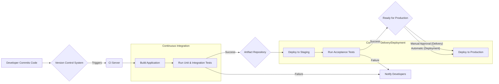
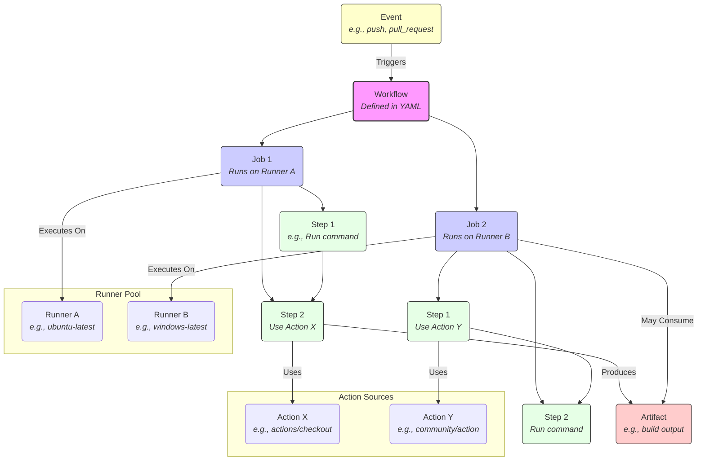

# Chapter 1: Introduction to Workflow Automation and GitHub Actions

Welcome to the world of workflow automation with GitHub Actions! In modern software development, speed, reliability, and consistency are paramount. Manual processes for building, testing, and deploying software are often slow, error-prone, and difficult to scale. This is where automation steps in, transforming how development teams operate. GitHub Actions emerges as a powerful, integrated platform within the GitHub ecosystem, designed to automate nearly any aspect of your software development lifecycle and beyond.

This chapter lays the groundwork for your journey with GitHub Actions. We'll start by exploring the evolution of Continuous Integration (CI) and Continuous Delivery/Deployment (CD), understanding why automation is crucial. Then, we'll dive into what GitHub Actions is, its core concepts, and how it compares to other tools. We'll guide you through setting up your very first workflow and highlight the diverse benefits and use cases of this versatile platform. By the end of this chapter, you'll have a solid understanding of the "why" and "what" of GitHub Actions, preparing you for the deeper dives in subsequent chapters.

## A. The Evolution of CI/CD and Automation

Before we delve into GitHub Actions specifically, it's essential to understand the broader context of CI/CD and the fundamental role automation plays in contemporary software engineering practices. These concepts didn't appear overnight; they evolved in response to the increasing complexity and pace of software development.

### 1. Understanding Continuous Integration (CI)

**Continuous Integration (CI)** is a development practice where developers frequently merge their code changes into a central repository, after which automated builds and tests are run. The primary goals of CI are:

- **Early Bug Detection:** Find and fix integration issues and bugs sooner rather than later in the development cycle. Frequent integration means smaller changes, making bugs easier to locate and resolve.
- **Improved Collaboration:** Ensure that code changes from different developers integrate smoothly.
- **Automated Testing:** Guarantee that new changes don't break existing functionality by automatically running a suite of tests (unit, integration, etc.).
- **Faster Feedback Loops:** Provide developers with rapid feedback on the quality and correctness of their code.

A typical CI process involves:

1.  Developer commits code to a version control system (like Git).
2.  A CI server/service detects the change (e.g., via a push event).
3.  The CI server checks out the latest code.
4.  It builds the software.
5.  It runs automated tests.
6.  It reports the results back to the development team.

### 2. Understanding Continuous Delivery/Deployment (CD)

**Continuous Delivery (CD)** extends Continuous Integration by automatically deploying all code changes to a testing and/or production environment after the build and test stages have successfully completed. Key characteristics include:

- **Release Readiness:** Every code change that passes the automated tests is potentially shippable. The software is always in a deployable state.
- **Manual Trigger for Production:** While deployments to testing environments might be fully automated, deployment to production typically requires a manual approval step (e.g., a button click). This allows businesses to control the timing of releases.

**Continuous Deployment (also CD)** goes one step further than Continuous Delivery. Every change that passes all stages of the automated pipeline is automatically released to production customers. There is no manual intervention in the deployment process.

- **Fully Automated Pipeline:** From commit to production, the entire process is automated.
- **Rapid Releases:** Enables very frequent releases, potentially multiple times per day.
- **Requires High Confidence:** Demands robust automated testing and monitoring to ensure stability.

The choice between Continuous Delivery and Continuous Deployment depends on business needs, risk tolerance, and the maturity of the team's automation and testing practices.



> **Diagram Explanation:** This diagram illustrates a typical CI/CD pipeline. Code commits trigger the CI process (Build, Test). Successful builds produce artifacts. The CD process then takes over, deploying to staging, running further tests, and finally deploying to production (either manually triggered for Continuous Delivery or automatically for Continuous Deployment). Failures at any stage typically result in notifications back to the development team.

### 3. The Role of Automation in Modern Software Development

Automation is the linchpin of CI/CD and modern software development. Its importance stems from several key benefits:

- **Speed and Efficiency:** Automated processes execute tasks much faster than humans, significantly reducing lead times for features and fixes.
- **Consistency and Reliability:** Automation eliminates the variability and potential for human error inherent in manual processes. Every build, test, and deployment follows the exact same steps.
- **Reduced Risk:** Automated testing catches regressions and integration issues early, reducing the risk of deploying faulty code.
- **Faster Feedback:** Developers receive immediate feedback on their changes, enabling quicker iteration and improvement.
- **Focus on Value:** By automating repetitive tasks, developers can focus their time and expertise on designing features, solving complex problems, and delivering business value.
- **Scalability:** Automated pipelines can handle increasing code volume, team size, and deployment frequency without proportional increases in manual effort.

In essence, automation empowers teams to deliver higher-quality software faster and more reliably.

### 4. Historical Context: From Cron Jobs to Dedicated CI/CD Platforms

The journey towards sophisticated workflow automation platforms like GitHub Actions has been evolutionary:

1.  **Manual Builds & Shell Scripts:** In the early days, building and deploying software often involved manual steps documented in text files or executed via simple shell scripts. This was error-prone and time-consuming.
2.  **Cron Jobs:** The `cron` utility on Unix-like systems provided a basic way to schedule tasks, including nightly builds or simple deployment scripts. However, `cron` lacked sophisticated triggering, dependency management, state tracking, and reporting capabilities needed for complex workflows.
3.  **Early CI Servers (e.g., CruiseControl, Hudson/Jenkins):** The rise of dedicated CI servers marked a significant leap. Tools like CruiseControl (one of the earliest) and later the highly influential Jenkins (originally Hudson) provided centralized platforms to:
    - Monitor version control systems for changes.
    - Trigger builds automatically.
    - Run tests and report results.
    - Offer extensibility through plugins.
      Jenkins, in particular, became immensely popular due to its open-source nature and vast plugin ecosystem, allowing integration with countless tools. However, managing Jenkins infrastructure (servers, plugins, configurations) could become complex.
4.  **Cloud-Based CI/CD Services (e.g., Travis CI, CircleCI):** As cloud computing gained traction, hosted CI/CD services emerged. These platforms offered CI/CD as a service, eliminating the need for teams to manage their own CI infrastructure. They often featured configuration-as-code (using YAML files), tighter integration with platforms like GitHub, and scalable, on-demand build environments.
5.  **Integrated Platform Solutions (e.g., GitLab CI, GitHub Actions):** The latest trend involves integrating CI/CD capabilities directly into the software development platform itself. GitLab was an early pioneer with GitLab CI, tightly coupling CI/CD pipelines with merge requests and repositories. GitHub Actions followed, leveraging GitHub's massive user base and ecosystem to provide a deeply integrated, event-driven automation platform. These integrated solutions simplify setup, reduce toolchain complexity, and offer seamless workflows tied directly to repository events.

GitHub Actions represents the culmination of these trends, offering a flexible, powerful, and deeply integrated automation solution built directly into the GitHub platform where many developers already host their code.

## B. What is GitHub Actions?

GitHub Actions is an **automation platform** built directly into GitHub. It allows you to automate, customize, and execute your software development workflows right in your repository. You can use it to build, test, and deploy your code, but its capabilities extend far beyond typical CI/CD tasks, enabling automation of nearly any process triggered by events within the GitHub ecosystem.

### 1. Core Philosophy and Design Goals

GitHub Actions is designed around several core principles:

- **Event-Driven:** Workflows are triggered by specific events occurring within your GitHub repository or externally (e.g., repository creation, pushes, pull request openings, issue comments, scheduled times, manual triggers, webhook events).
- **Code-Driven Configuration:** Workflows are defined as code (using YAML files) stored directly within your repository (`.github/workflows/`), enabling version control, collaboration, and reproducibility.
- **Reusability and Composability:** Encourages the creation and sharing of reusable automation units called "actions." These actions can be combined like building blocks to create complex workflows.
- **Ecosystem Integration:** Deeply integrated with the GitHub platform (repositories, issues, pull requests, releases, etc.) and provides easy access to a vast marketplace of community and official actions.
- **Flexibility:** Supports various operating systems (Linux, macOS, Windows), programming languages, and execution environments (GitHub-hosted runners, self-hosted runners).
- **Beyond CI/CD:** While excellent for CI/CD, it's designed as a general-purpose automation platform suitable for tasks like repository management, notifications, security scanning, and more.

### 2. Key Terminology: Workflows, Jobs, Steps, Actions, Runners, Events, Artifacts

Understanding the core components of GitHub Actions is crucial:

- **Event:** Anything that can trigger a workflow. Examples include pushing code (`push`), opening a pull request (`pull_request`), creating an issue (`issues`), scheduling a time (`schedule`), or manual triggers (`workflow_dispatch`). Events define _when_ a workflow runs.
- **Workflow:** An automated process defined by a YAML file in the `.github/workflows` directory of your repository. A workflow is triggered by one or more events and contains one or more jobs. It defines the overall automation sequence.
- **Job:** A set of steps that execute on the same runner. Jobs within a workflow run in parallel by default, but can be configured to run sequentially if they depend on each other. Each job runs in a fresh virtual environment.
- **Runner:** A server (virtual machine) that executes the jobs in your workflow. GitHub provides hosted runners (Ubuntu Linux, Windows, macOS) that are automatically provisioned and managed. You can also host your own runners (self-hosted runners) on your own infrastructure for more control or specific hardware/software requirements.
- **Step:** An individual task within a job. A step can either run shell commands directly or execute an **Action**. Steps within a job execute sequentially.
- **Action:** A reusable unit of code that performs a specific task. Actions are the building blocks of workflows. They can be:
  - **Official GitHub Actions:** Maintained by GitHub (e.g., `actions/checkout`, `actions/setup-node`).
  - **Community Actions:** Created and shared by the community via the GitHub Marketplace.
  - **Local Actions:** Defined directly within your repository for project-specific tasks.
    Actions abstract away complex or repetitive tasks into simple, reusable components. We'll explore different types of actions (JavaScript, Docker, Composite) in Part III.
- **Artifact:** Files or collections of files produced during a workflow run (e.g., build outputs, test reports, logs, binaries). Artifacts can be saved and shared between jobs in the same workflow or downloaded after the workflow completes.



> **Diagram Explanation:** This diagram shows the relationship between the core GitHub Actions components. An Event triggers a Workflow. The Workflow consists of one or more Jobs, each running on a Runner. Each Job contains sequential Steps. Steps can run commands directly or utilize reusable Actions. Jobs can produce Artifacts, which might be used by subsequent jobs or downloaded later.

### 3. GitHub Actions vs. Other CI/CD Tools (Jenkins, GitLab CI, CircleCI, etc.) - A Comparative Overview

GitHub Actions enters a mature market with established players. Here's a high-level comparison:

| Feature/Aspect       | GitHub Actions                                  | Jenkins                                         | GitLab CI/CD                                    | CircleCI                                        |
| :------------------- | :---------------------------------------------- | :---------------------------------------------- | :---------------------------------------------- | :---------------------------------------------- |
| **Hosting**          | GitHub-hosted, Self-hosted                      | Self-hosted (primarily), Cloud provider options | GitLab.com (hosted), Self-managed               | Cloud-hosted, Self-hosted (Server plan)         |
| **Configuration**    | YAML files in `.github/workflows`               | Groovy (Pipeline-as-code), UI configuration     | YAML file (`.gitlab-ci.yml`)                    | YAML file (`.circleci/config.yml`)              |
| **Integration**      | Deeply integrated with GitHub ecosystem         | Extensive plugins for various integrations      | Deeply integrated with GitLab ecosystem         | Strong GitHub/Bitbucket integration             |
| **Execution Units**  | Actions (Marketplace, custom)                   | Plugins, Shared Libraries, Shell steps          | Docker images, Shell scripts                    | Orbs (reusable configs), Docker images, Shell   |
| **Runners**          | GitHub-managed (Linux, Win, macOS), Self-hosted | Agents/Nodes (Self-managed)                     | Runners (Shared, Group, Specific, Self-hosted)  | Various executors (Docker, Machine, macOS, Win) |
| **Pricing (Hosted)** | Generous free tier for public/private repos     | N/A (Self-hosted costs apply)                   | Free tier, Paid tiers for more minutes/features | Free tier, Performance plans based on usage     |
| **Community**        | Rapidly growing, large Marketplace              | Very large, mature, extensive plugin ecosystem  | Strong, integrated within GitLab community      | Active community, growing Orb registry          |

#### a. Feature Comparison

- **GitHub Actions:** Strong on event-driven triggers beyond code commits (issues, projects, etc.). Seamless integration with GitHub features (Checks API, environments, secrets). Matrix builds are a first-class feature.
- **Jenkins:** Highly extensible via plugins for almost any tool or task. Mature feature set, but can require more setup and management. Pipeline-as-code (Groovy) offers powerful scripting capabilities.
- **GitLab CI/CD:** Tightly integrated with the GitLab platform (source code, issues, registry, review apps). Features like Auto DevOps aim to simplify the entire lifecycle. Strong Docker integration.
- **CircleCI:** Known for performance, caching capabilities, and developer experience. Orbs provide powerful reusable configuration packages. Good support for complex workflows and test splitting.

#### b. Architectural Differences

- **GitHub Actions:** Event-driven architecture. Relies heavily on containerization (for many actions) and virtual machines for runners. Focus on composability via Actions.
- **Jenkins:** Controller/Agent architecture. The controller manages jobs, agents execute them. Highly customizable infrastructure setup.
- **GitLab CI/CD:** Integrated within the GitLab application. Runners poll the GitLab instance for jobs. Uses Docker extensively for job execution environments.
- **CircleCI:** Cloud-native architecture. Emphasis on container-based execution and performance optimization features.

#### c. Community and Ecosystem

- **GitHub Actions:** Benefits from the massive GitHub community. The Marketplace is growing rapidly with actions for diverse tasks.
- **Jenkins:** Has the longest history and arguably the largest plugin ecosystem, covering a vast range of tools and integrations. Strong community support forums.
- **GitLab CI/CD:** Strong community centered around the GitLab platform. Integration is a key strength.
- **CircleCI:** Active community, particularly strong in specific tech stacks (e.g., web development). Orb registry facilitates sharing.

> **Production Note: Choosing the Right Tool**
>
> There is no single "best" CI/CD tool; the ideal choice depends heavily on your specific context, requirements, and existing ecosystem.
>
> - **If you're heavily invested in the GitHub ecosystem:** GitHub Actions offers unparalleled integration and convenience. Its event-driven nature is powerful for automating tasks beyond traditional CI/CD.
> - **If you need maximum flexibility and control over your infrastructure or have complex, bespoke requirements:** Jenkins' maturity and extensive plugin system might be advantageous, provided you're prepared for the management overhead.
> - **If you use GitLab for source control:** GitLab CI/CD provides a seamless, integrated experience within that platform.
> - **If performance, advanced caching, and a polished cloud-native experience are top priorities:** CircleCI is a strong contender.
>
> Consider factors like team expertise, required integrations, budget, hosting preferences (cloud vs. self-hosted), and the specific automation tasks you need to perform. Often, teams might even use multiple tools for different purposes. This book focuses on GitHub Actions, exploring its capabilities in depth, but understanding the landscape helps appreciate its strengths and positioning.

## C. The GitHub Actions Ecosystem

One of the key strengths of GitHub Actions is its rich ecosystem, primarily centered around reusable components called "actions." These actions allow you to easily incorporate functionality developed by others into your workflows without reinventing the wheel.

### 1. GitHub Marketplace for Actions

The [GitHub Marketplace](https://github.com/marketplace?type=actions) is the central hub for discovering and sharing actions. It hosts thousands of actions built by the community and by GitHub itself.

- **Discovery:** You can search for actions based on keywords, categories (e.g., Deployment, Utilities, Testing), or publishers.
- **Verification:** Some publishers are verified by GitHub, adding a layer of trust.
- **Usage Examples:** Most Marketplace actions include documentation and examples showing how to integrate them into your workflows.
- **Versioning:** Actions are versioned (typically using Git tags or branches), allowing you to pin your workflows to specific versions for stability.

Using a Marketplace action is as simple as referencing its identifier (e.g., `actions/checkout@v4`) in your workflow file.

### 2. Community-Developed Actions

The vast majority of actions available on the Marketplace are developed and maintained by the broader GitHub community – individuals, open-source projects, and companies.

- **Diversity:** Covers a huge range of integrations, tools, and utilities, from cloud provider CLIs and testing frameworks to notification services and code linters.
- **Innovation:** The community often creates actions for new tools and services rapidly.
- **Caveats:** Quality, maintenance, and security practices can vary. It's crucial to review community actions before use, check their source code repository, look at open issues, and consider the maintainer's reputation. Pinning to specific commit SHAs or tags is highly recommended for stability and security.

### 3. Official GitHub-Maintained Actions

GitHub maintains a set of essential, foundational actions under the `actions` organization (e.g., `actions/checkout`, `actions/setup-node`, `actions/upload-artifact`, `actions/download-artifact`).

- **Core Functionality:** Provide fundamental capabilities needed in most workflows, like checking out code, setting up language runtimes, and managing artifacts.
- **Reliability and Support:** Generally well-maintained, documented, and supported by GitHub.
- **Best Practices:** Often serve as examples of how to build high-quality actions.

Using these official actions is highly recommended for common tasks, as they provide a stable and trusted base for your workflows.

## D. Setting Up Your First Workflow

Let's get hands-on and create a simple "Hello World" workflow, then enhance it slightly to perform a basic task like linting.

### 1. Prerequisites: GitHub Account, Repository

To use GitHub Actions, you need:

1.  A **GitHub Account:** If you don't have one, sign up at [github.com](https://github.com/).
2.  A **GitHub Repository:** You can create a new repository or use an existing one. This is where your code and your workflow files will live.

### 2. Creating the `.github/workflows` Directory

GitHub Actions looks for workflow files within a specific directory in your repository: `.github/workflows`.

1.  Navigate to your repository on GitHub or clone it locally.
2.  Create a directory named `.github`. Note the leading dot (`.`).
3.  Inside `.github`, create another directory named `workflows`.

Your workflow files (with `.yml` or `.yaml` extensions) will reside inside `.github/workflows/`.

### 3. Anatomy of a Basic Workflow File (YAML Syntax Primer)

Workflow files use YAML (YAML Ain't Markup Language) syntax. YAML is a human-readable data serialization standard often used for configuration files. Key aspects include:

- **Indentation:** Uses spaces (not tabs!) for structure. Indentation defines nesting. Two spaces are common.
- **Key-Value Pairs:** `key: value`
- **Lists/Sequences:** Items start with a hyphen (`- `).
- **Comments:** Start with `#`.

Let's create our first workflow file. Inside `.github/workflows/`, create a file named `hello-world.yml`.

**Example: Basic 'Hello World' Workflow**

```yaml
# .github/workflows/hello-world.yml

# 1. Workflow Name: Displayed on GitHub Actions UI
name: Hello World Workflow

# 2. Trigger: When does this workflow run?
on: [push] # Run on every push event to any branch

# 3. Jobs: Container for steps, runs on a runner
jobs:
  # 4. Job ID: Unique identifier for the job (e.g., 'say-hello')
  say-hello:
    # 5. Runner: Specify the type of machine to run the job on
    runs-on: ubuntu-latest # Use the latest Ubuntu Linux runner provided by GitHub

    # 6. Steps: Sequence of tasks executed within the job
    steps:
      # 7. Step Name: Optional, descriptive name for the step
      - name: Print Greeting
        # 8. Run Command: Execute shell commands
        run: echo "Hello, GitHub Actions!"

      - name: Print Goodbye
        run: echo "Workflow finished. Goodbye!"
```

**Explanation:**

1.  `name`: The name of the workflow as shown on GitHub.
2.  `on`: Defines the event(s) that trigger the workflow. `[push]` means it runs whenever code is pushed to the repository.
3.  `jobs`: Defines one or more jobs to execute.
4.  `say-hello`: The unique ID for this job.
5.  `runs-on`: Specifies the runner environment. `ubuntu-latest` is a common choice.
6.  `steps`: A sequence of tasks executed within the `say-hello` job.
7.  `name`: An optional name for a step, making logs easier to read.
8.  `run`: Executes command-line programs using the runner's shell.

### 4. Triggering the Workflow (e.g., on `push`)

To trigger this workflow:

1.  Commit the `hello-world.yml` file to your repository.
    ```bash
    git add .github/workflows/hello-world.yml
    git commit -m "Add basic Hello World workflow"
    ```
2.  Push the commit to GitHub.
    ```bash
    git push origin <your-branch-name>
    ```

Since the workflow is configured with `on: [push]`, this push event will automatically trigger the workflow to run.

### 5. Viewing Workflow Runs and Logs in the GitHub UI

1.  Go to your repository page on GitHub.
2.  Click on the **Actions** tab near the top.
3.  You should see your "Hello World Workflow" listed in the left sidebar. Click on it.
4.  You'll see a list of workflow runs. Click on the most recent run (triggered by your push).
5.  You'll see the `say-hello` job. Click on it to expand its details.
6.  You can see the steps (`Print Greeting`, `Print Goodbye`). Click on each step to view its log output, including the `echo` commands.

You've successfully created and run your first GitHub Actions workflow!

**Practical Example: Setting up a simple linting check on push**

Let's create a slightly more practical workflow that uses an existing Action to lint code. We'll use `super-linter` from GitHub, which bundles many linters.

Create a new file: `.github/workflows/linter.yml`

```yaml
# .github/workflows/linter.yml

name: Code Linter

# Run on pushes to the main branch and on pull requests targeting main
on:
  push:
    branches: [main] # Adjust 'main' if your default branch is different
  pull_request:
    branches: [main] # Adjust 'main' if your default branch is different

jobs:
  lint-code:
    name: Run Super-Linter
    runs-on: ubuntu-latest

    steps:
      # Step 1: Check out repository code so the linter can access it
      - name: Checkout Code
        uses: actions/checkout@v4 # Use the official checkout action (v4)
        with:
          # Fetch all history for all branches and tags.
          # Required for accurate linting based on changed files.
          fetch-depth: 0

      # Step 2: Run the Super-Linter action
      - name: Run Super-Linter
        uses: github/super-linter@v6 # Use the Super-Linter action
        env:
          # Set environment variables for Super-Linter
          VALIDATE_ALL_CODEBASE: false # Only lint changed files
          DEFAULT_BRANCH: main # Specify the default branch
          GITHUB_TOKEN: ${{ secrets.GITHUB_TOKEN }} # Provide token for API access
```

**Explanation:**

1.  `on`: Triggers on pushes _and_ pull requests to the `main` branch.
2.  `jobs.lint-code`: Defines a job named `lint-code`.
3.  `steps`:
    - **Checkout Code:** Uses the official `actions/checkout@v4` action to download your repository's code onto the runner. `fetch-depth: 0` ensures it gets the full history needed for comparing changes.
    - **Run Super-Linter:** Uses the `github/super-linter@v6` action.
      - `env`: Sets environment variables required by Super-Linter.
      - `VALIDATE_ALL_CODEBASE: false`: Tells the linter to only check files modified in the push or pull request (more efficient).
      - `DEFAULT_BRANCH: main`: Informs the linter about your main branch name.
      - `GITHUB_TOKEN: ${{ secrets.GITHUB_TOKEN }}`: Provides a temporary GitHub token automatically generated for each workflow run. Super-Linter uses this to interact with the GitHub API (e.g., post status checks). `secrets.GITHUB_TOKEN` is a special secret available to workflows.

Commit and push this file. Now, whenever you push code or open a PR against `main`, Super-Linter will automatically run, checking your code quality and reporting results directly in the Actions tab and on pull requests.

## E. Core Benefits and Use Cases

While CI/CD is a primary driver, GitHub Actions offers much broader applicability. Here are some key benefits and common use cases:

### 1. Automating Builds, Tests, and Deployments

This is the classic CI/CD scenario. GitHub Actions excels at:

- Compiling code (e.g., Java, C++, Go).
- Building container images (Docker).
- Running unit, integration, and end-to-end tests using various frameworks.
- Deploying applications to cloud providers (AWS, Azure, GCP), PaaS (Heroku), servers, or container orchestrators (Kubernetes).

### 2. Infrastructure Provisioning (IaC Integration)

Integrate with Infrastructure as Code (IaC) tools like Terraform or Pulumi:

- Automatically plan and apply infrastructure changes on pushes to specific branches.
- Validate infrastructure code syntax and configuration.
- Manage environments dynamically based on pull requests or releases.

### 3. Security Scanning and Analysis

Enhance security posture by automating checks:

- Run static application security testing (SAST) tools (e.g., CodeQL, SonarQube).
- Perform dependency vulnerability scanning (e.g., Dependabot integration, `npm audit`).
- Scan container images for known vulnerabilities.
- Enforce security policies.

### 4. Issue/PR Management and Automation

Automate repository maintenance and contribution workflows:

- Automatically label issues or pull requests based on content or author.
- Assign reviewers to pull requests.
- Check for contributor license agreement (CLA) signatures.
- Close stale issues or PRs.
- Request changes or provide feedback automatically based on checks.

### 5. Notifications and Reporting

Keep stakeholders informed:

- Send notifications to Slack, Microsoft Teams, or email on workflow success or failure.
- Generate and publish test reports or build summaries.
- Create GitHub Releases automatically, including changelogs.

### 6. Beyond CI/CD: General Purpose Automation

The event-driven nature allows for diverse automation tasks:

- Syncing documentation to a website on changes.
- Running data processing pipelines on a schedule.
- Updating dependencies automatically.
- Mirroring repositories.
- Generating code or documentation based on templates or data.

Essentially, if a task can be scripted and triggered by an event within or related to GitHub, it's likely a candidate for automation with GitHub Actions.

---

This chapter provided a foundational overview of workflow automation, CI/CD principles, and the core concepts of GitHub Actions. You learned about its key components, saw how it compares to other tools, set up your first basic workflows, and explored the wide range of potential use cases. With this understanding, you are now ready to delve deeper into the specifics of workflow syntax, structure, and advanced features in the upcoming chapters. Chapter 2 will focus on the detailed anatomy of a workflow file, exploring its syntax and structure comprehensively.
