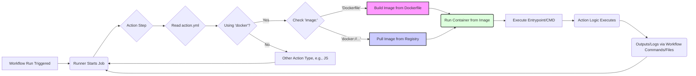

# Chapter 10: Developing Docker Container Actions

Welcome to Chapter 10! In the previous chapters, particularly Chapter 9 on JavaScript actions, we explored one way to extend GitHub Actions with custom logic. Now, we delve into another powerful method: **Docker container actions**.

Docker actions encapsulate their environment and dependencies within a Docker image, offering unparalleled consistency and flexibility. They allow you to write your action logic in virtually any programming language or use specific tools that might be difficult to set up directly on the runner environment. This chapter provides a comprehensive guide to creating, configuring, using, and managing Docker container actions.

We'll cover everything from the fundamental prerequisites and defining your action's metadata to writing the Dockerfile, handling inputs/outputs, leveraging workflow commands, and best practices for building robust and efficient Docker actions.

## A. Prerequisites: Docker Fundamentals

Before diving into creating Docker container actions for GitHub Actions, a foundational understanding of Docker itself is essential. While this chapter isn't a comprehensive Docker tutorial, we assume you are familiar with the following core concepts:

- **Docker Images:** Read-only templates containing the application code, libraries, dependencies, tools, and other files needed for an application to run. Images are built from instructions defined in a `Dockerfile`.
- **Docker Containers:** Runnable instances of a Docker image. Containers package up the application and its dependencies, isolating them from the host system and other containers.
- **Dockerfile:** A text file containing a series of commands that Docker uses to assemble an image. Common instructions include `FROM` (specifying the base image), `RUN` (executing commands during the build), `COPY` (copying files into the image), and `ENTRYPOINT`/`CMD` (defining the command to run when a container starts).
- **Docker Hub / Container Registries:** Cloud-based or self-hosted services for storing and distributing Docker images (e.g., Docker Hub, GitHub Container Registry (GHCR), AWS ECR, Google Artifact Registry).

Essentially, a Docker container action works by having the GitHub Actions runner pull or build a specified Docker image and then run a container based on that image. The action's logic is executed _inside_ this container. This ensures that the action runs in a predictable environment, regardless of the underlying runner operating system or pre-installed software (beyond the Docker daemon itself).

If you're new to Docker, we highly recommend exploring Docker's official documentation and tutorials before proceeding, as we will build directly upon these concepts.

## B. Defining the Action (`action.yml`)

Just like JavaScript actions, Docker container actions require a metadata file named `action.yml` at the root of the action's repository. This file defines crucial information about the action, including its inputs, outputs, and how it should be executed. The key difference lies in the `runs` section.

### B.1. Specifying `using: 'docker'`

The most fundamental difference in the `action.yml` for a Docker action is the `using` key within the `runs` section. To indicate that this action runs inside a Docker container, you must set this value to `'docker'`.

```yaml
# action.yml (partial)
name: "My Docker Action"
description: "Performs a task using Docker."
inputs:
  # ... inputs defined here ...
outputs:
  # ... outputs defined here ...
runs:
  using: "docker" # <--- Key differentiator
  image: "Dockerfile" # Or docker://my-registry/my-image:tag
  # ... other Docker-specific keys ...
```

### B.2. Providing the `Dockerfile` or Public Image (`image:`)

The `image` key under `runs` tells GitHub Actions _which_ Docker image to use for the container. You have two primary options:

1.  **`image: 'Dockerfile'`**: If you specify `'Dockerfile'`, GitHub Actions will look for a file named `Dockerfile` in the root directory of your action's repository. It will then build a Docker image from this Dockerfile _at runtime_ before starting the container. This is convenient during development but can add build time to your workflows.

    ```yaml
    # action.yml (using local Dockerfile)
    name: "Build From Dockerfile Action"
    description: "Builds and runs from a local Dockerfile."
    runs:
      using: "docker"
      image: "Dockerfile"
    ```

2.  **`image: 'docker://<registry>/<image>:<tag>'`**: You can specify a pre-built image hosted on a public or private container registry (like Docker Hub or GHCR). Use the `docker://` prefix followed by the standard Docker image name. This is generally preferred for published actions as it avoids the build step during workflow execution, leading to faster startup times.

    ```yaml
    # action.yml (using pre-built image from Docker Hub)
    name: "Pre-built Docker Hub Action"
    description: "Uses an image from Docker Hub."
    runs:
      using: "docker"
      image: "docker://alpine:latest"
    ```

    ```yaml
    # action.yml (using pre-built image from GHCR)
    name: "Pre-built GHCR Action"
    description: "Uses an image from GitHub Container Registry."
    runs:
      using: "docker"
      image: "docker://ghcr.io/my-org/my-action-image:v1.2"
    ```

    > **Note:** Accessing private images might require additional authentication steps within the workflow using actions like `docker/login-action`.

Let's visualize how the runner interacts with these components:



**Diagram Explanation:** This diagram shows the flow when a GitHub Actions runner encounters a Docker action step. It reads `action.yml`, determines it's a Docker action, and then either builds the image locally from a `Dockerfile` or pulls a pre-built image from a registry before running the container and executing the action's logic.

### B.3. Passing Inputs via `args` or Environment Variables

Inputs defined in the `inputs:` section of `action.yml` need to be made available _inside_ the running Docker container. GitHub Actions provides two mechanisms for this:

1.  **Environment Variables (Default):** By default, each input defined in `action.yml` is passed to the container as an environment variable. The variable name follows the pattern `INPUT_<INPUT_NAME_UPPERCASE>`. For example, an input named `fileName` would be available inside the container as the environment variable `INPUT_FILENAME`. This is often the simplest method for accessing inputs within scripts.

    ```yaml
    # action.yml
    inputs:
      target-file:
        description: "The file to process"
        required: true
      log-level:
        description: "Verbosity level"
        required: false
        default: "info"
    runs:
      using: "docker"
      image: "Dockerfile"
      # No 'args' needed if using environment variables
    ```

    Inside the container's entrypoint script (e.g., a shell script), you would access these like:

    ```bash
    #!/bin/sh
    echo "Processing file: $INPUT_TARGET_FILE"
    echo "Log level set to: $INPUT_LOG_LEVEL"
    # ... rest of the script
    ```

2.  **Command-line Arguments (`args:`):** Alternatively, you can use the `args:` key under `runs:` to pass inputs as command-line arguments to the container's `ENTRYPOINT`. The `args` key takes a list of strings. You can embed input values using the standard `${{ inputs.<input_name> }}` expression syntax.

    ```yaml
    # action.yml
    inputs:
      target-file:
        description: "The file to process"
        required: true
      log-level:
        description: "Verbosity level"
        required: false
        default: "info"
    runs:
      using: "docker"
      image: "Dockerfile"
      args:
        - "--file"
        - "${{ inputs.target-file }}"
        - "--level=${{ inputs.log-level }}"
        - "some-static-argument"
    ```

    Your container's entrypoint script would then need to parse these command-line arguments (e.g., using `getopt` in shell, `argparse` in Python, etc.).

    ```bash
    #!/bin/sh
    # Simple argument parsing (use getopt for robustness)
    while [ $# -gt 0 ]; do
      case "$1" in
        --file)
          TARGET_FILE="$2"
          shift 2
          ;;
        --level=*)
          LOG_LEVEL="${1#*=}"
          shift 1
          ;;
        *)
          echo "Ignoring unknown argument: $1"
          shift 1
          ;;
      esac
    done

    echo "Processing file: $TARGET_FILE"
    echo "Log level set to: $LOG_LEVEL"
    # ... rest of the script
    ```

**Choosing Between `args` and Environment Variables:**

- **Environment Variables:** Simpler to access in scripts, less prone to ordering issues, good for configuration-like settings. Can clutter the environment if there are many inputs.
- **`args`:** More explicit, follows standard command-line tool conventions, better suited if your underlying tool primarily accepts command-line flags. Requires argument parsing logic in your entrypoint.

You can technically use both methods simultaneously, but it's generally clearer to stick to one primary method for consistency.

### B.4. Defining the `entrypoint`

The `runs.entrypoint` key in `action.yml` allows you to override the `ENTRYPOINT` defined in the `Dockerfile` (or the image's default entrypoint if none is specified in the Dockerfile).

- If `runs.entrypoint` is **not** specified in `action.yml`, the container runs using the `ENTRYPOINT` (and `CMD`) defined in the `Dockerfile` or the base image. Any `runs.args` provided in `action.yml` are passed as arguments to this default `ENTRYPOINT`.
- If `runs.entrypoint` **is** specified in `action.yml`, it becomes the command executed when the container starts. Any `CMD` instruction in the `Dockerfile` is ignored. Any `runs.args` provided in `action.yml` are passed as arguments to this specified `runs.entrypoint`.

```yaml
# action.yml (overriding entrypoint)
runs:
  using: "docker"
  image: "docker://node:18-alpine"
  entrypoint: "/usr/local/bin/node" # Specify the executable
  args:
    - "/path/to/my/script.js" # Pass script path as argument
    - "--config"
    - "${{ inputs.config-file }}"
```

This is useful if the base image has a default entrypoint you don't want (e.g., an interactive shell) or if you want to directly execute a specific binary within the image with arguments derived from inputs.

## C. Writing the Dockerfile

When you choose `image: 'Dockerfile'` in your `action.yml`, the `Dockerfile` in your action's repository defines the environment where your action logic will execute. Crafting an efficient and correct Dockerfile is crucial for a well-behaved Docker action.

### C.1. Choosing a Base Image

The `FROM` instruction in your `Dockerfile` specifies the starting point for your image build. The choice of base image significantly impacts:

- **Size:** Smaller base images (like `alpine`, `debian-slim`, `ubuntu-minimal`, or distroless images) lead to faster downloads/builds and reduced storage.
- **Security:** Minimal images often have a smaller attack surface. Regularly updated official images are generally preferred.
- **Included Tools:** Some base images come with common tools (shell, package managers like `apt` or `apk`, `curl`, `git`), while others are extremely bare-bones. Choose one that balances size with the tools you need, or be prepared to install them.
- **Language Runtimes:** If your action is written in a specific language (Python, Node.js, Go, Ruby), using an official base image for that language (e.g., `python:3.10-slim`, `node:18-alpine`) is often the easiest way to get the runtime environment set up.

```dockerfile
# Dockerfile Example: Using a specific Python version on Alpine
FROM python:3.10-alpine

# ... rest of the Dockerfile
```

### C.2. Installing Dependencies

Use the `RUN` instruction to execute commands within the image during the build process. This is primarily used to:

- Update the package manager cache (`apt-get update`, `apk update`).
- Install system packages (`apt-get install -y --no-install-recommends`, `apk add --no-cache`).
- Install language-specific dependencies (e.g., `pip install -r requirements.txt`, `npm install`).

**Best Practice:** Combine related `RUN` commands using `&&` to reduce the number of layers in your image, and clean up package manager caches in the same layer to minimize size.

```dockerfile
# Dockerfile Example: Installing dependencies
FROM ubuntu:22.04

# Install system dependencies (curl, jq) and clean up cache
RUN apt-get update && \
    apt-get install -y --no-install-recommends curl jq && \
    rm -rf /var/lib/apt/lists/*

# Install Python dependencies (assuming requirements.txt is copied later)
# RUN pip install --no-cache-dir -r requirements.txt

# ... rest of the Dockerfile
```

### C.3. Copying Action Code/Scripts

The `COPY` instruction transfers files and directories from your action's repository (the build context) into the Docker image filesystem. You'll typically use this to copy:

- The main script(s) that implement your action's logic.
- Any helper scripts or configuration files needed by your action.
- Language-specific dependency manifests (like `requirements.txt`, `package.json`).

```dockerfile
# Dockerfile Example: Copying files
FROM python:3.10-alpine

# Create a working directory
WORKDIR /app

# Copy dependency file first (leverages Docker cache if it doesn't change)
COPY requirements.txt .
RUN pip install --no-cache-dir -r requirements.txt

# Copy the rest of the application code
COPY entrypoint.sh .
COPY main.py .
COPY utils/ /app/utils/

# Make entrypoint script executable
RUN chmod +x entrypoint.sh

# ... rest of the Dockerfile (e.g., ENTRYPOINT)
```

**Best Practice:** Copy dependency manifests and install dependencies _before_ copying your application code. This leverages Docker's layer caching – if your code changes but dependencies don't, Docker can reuse the dependency layer, speeding up rebuilds.

### C.4. Setting the Entrypoint Script

The `ENTRYPOINT` instruction configures the container to run a specific executable when it starts. The `CMD` instruction provides default arguments to the `ENTRYPOINT`.

For Docker actions, you typically set an `ENTRYPOINT` that points to the main script responsible for executing your action's logic. This script will receive inputs (via environment variables or arguments) and perform the action's tasks.

- **Shell Form:** `ENTRYPOINT command param1 param2` (Runs directly, no shell processing)
- **Exec Form (Recommended):** `ENTRYPOINT ["executable", "param1", "param2"]` (Preferred form, avoids shell string munging, allows proper signal handling)

```dockerfile
# Dockerfile Example: Setting the entrypoint
FROM python:3.10-alpine

WORKDIR /app

COPY requirements.txt .
RUN pip install --no-cache-dir -r requirements.txt

COPY entrypoint.sh .
COPY main.py .
RUN chmod +x entrypoint.sh

# Set the entrypoint script to be executed when the container starts
ENTRYPOINT ["/app/entrypoint.sh"]

# Optional: Provide default arguments via CMD if needed,
# but often inputs are handled via environment variables or action.yml args
# CMD ["--default-arg"]
```

Your `entrypoint.sh` (or equivalent script/binary) is the heart of your Docker action. It needs to:

1.  Read inputs (from `INPUT_*` environment variables or command-line arguments).
2.  Perform the core logic of the action.
3.  Communicate results back to the runner (set outputs, log messages, set failure status).

---

#### [Code Snippet: Sample Dockerfile for a simple action]

Let's combine these concepts into a simple example. Imagine an action that takes a name as input and prints a greeting.

**`action.yml`:**

```yaml
name: "Docker Greeter Action"
description: "Greets someone using Docker."
inputs:
  who-to-greet:
    description: "The name of the person to greet."
    required: true
    default: "World"
outputs:
  greeting-message:
    description: "The full greeting message."
runs:
  using: "docker"
  image: "Dockerfile"
```

**`Dockerfile`:**

```dockerfile
# Use a minimal base image
FROM alpine:latest

# Add bash for easier scripting (optional, could use /bin/sh)
RUN apk add --no-cache bash

# Copy the entrypoint script into the image
COPY entrypoint.sh /entrypoint.sh

# Make the script executable
RUN chmod +x /entrypoint.sh

# Set the entrypoint script
ENTRYPOINT ["/entrypoint.sh"]
```

**`entrypoint.sh`:**

```bash
#!/bin/bash

# Access the input via the environment variable
# Remember: Input 'who-to-greet' becomes 'INPUT_WHO_TO_GREET'
NAME_TO_GREET="$INPUT_WHO_TO_GREET"

# Construct the greeting message
MESSAGE="Hello, $NAME_TO_GREET! This greeting comes from a Docker container."

# Print the message to the logs
echo "$MESSAGE"

# Set the output variable using a workflow command (more on this next)
# Note the ::set-output syntax (older style shown for illustration, see Section E for modern approach)
echo "::set-output name=greeting-message::$MESSAGE"

# Exit successfully
exit 0
```

This simple example demonstrates the core components: `action.yml` defining the interface, `Dockerfile` building the environment, and `entrypoint.sh` executing the logic using inputs and setting outputs.

---

## D. Handling Inputs and Outputs

Effective communication between your Docker container action and the GitHub Actions runner is key. This involves accessing the inputs provided by the workflow and setting outputs that subsequent steps might consume.

### D.1. Accessing Inputs (Environment Variables `INPUT_*` or Arguments)

As discussed in Section B.3, inputs defined in `action.yml` are made available inside the container either as environment variables or command-line arguments.

- **Environment Variables:** Access them like any other environment variable within your script or application code. Remember the `INPUT_<INPUT_NAME_UPPERCASE>` naming convention. This is generally the most straightforward method for scripts.

  ```bash
  # entrypoint.sh accessing INPUT_FILENAME and INPUT_VERBOSE
  #!/bin/bash
  echo "Processing file: $INPUT_FILENAME"
  if [ "$INPUT_VERBOSE" = "true" ]; then
    echo "Verbose mode enabled."
    set -x # Enable debug tracing in shell
  fi
  # ... process $INPUT_FILENAME ...
  ```

- **Arguments:** If you used `runs.args` in `action.yml`, your `ENTRYPOINT` script/program needs to parse the command-line arguments passed to it. The specific method depends on the language used (e.g., `$1`, `$2`... or `getopt` in shell; `sys.argv` or `argparse` in Python; `os.Args` in Go).

  ```python
  # main.py (assuming action.yml passes args like --file <name> --verbose)
  import argparse
  import os

  if __name__ == "__main__":
      parser = argparse.ArgumentParser(description='Process some file.')
      parser.add_argument('--file', required=True, help='File to process')
      parser.add_argument('--verbose', action='store_true', help='Enable verbose output')

      args = parser.parse_args()

      print(f"Processing file: {args.file}")
      if args.verbose:
          print("Verbose mode enabled.")

      # Access other standard GitHub Actions environment variables
      print(f"Running in workspace: {os.getenv('GITHUB_WORKSPACE')}")

      # ... process args.file ...
  ```

Remember that standard GitHub Actions environment variables (like `GITHUB_WORKSPACE`, `GITHUB_REPOSITORY`, `GITHUB_SHA`, etc.) are also available inside the Docker container. The runner automatically mounts the workspace directory (`GITHUB_WORKSPACE`) into the container, usually at `/github/workspace`, allowing your action to access repository files.

### D.2. Setting Outputs (Using `::set-output name=<name>::<value>` workflow command)

To pass data generated by your action back to the workflow for use in subsequent steps, you need to set _outputs_. Outputs are defined in the `outputs:` section of your `action.yml`.

Inside the container, you set an output value by printing a specially formatted string to standard output, known as a **workflow command**. The command for setting outputs is:

`::set-output name=<output_name>::<value>`

- `<output_name>`: Must match an output name defined in the `outputs:` section of `action.yml`.
- `<value>`: The string value you want to assign to the output. Multi-line values are supported.

**Important Update:** While the `::set-output` command still works, the recommended modern approach (introduced to avoid potential injection vulnerabilities with the stdout parsing mechanism) is to write outputs to a file specified by the `$GITHUB_OUTPUT` environment variable. See Section E.5 for details. However, understanding `::set-output` is useful as you may encounter it in older actions.

Let's illustrate setting outputs with a practical example.

---

#### [Practical Example: Docker action that performs image processing using an input file path]

Imagine an action that takes the path to an image file, uses a command-line tool (like ImageMagick's `identify`) inside the container to get its dimensions, and outputs the width and height.

**`action.yml`:**

```yaml
name: "Get Image Dimensions"
description: "Uses ImageMagick in Docker to find image width and height."
inputs:
  image-path:
    description: "Path to the image file within the workspace."
    required: true
outputs:
  width:
    description: "The width of the image in pixels."
  height:
    description: "The height of the image in pixels."
runs:
  using: "docker"
  image: "Dockerfile"
```

**`Dockerfile`:**

```dockerfile
# Use a base image with ImageMagick or install it
FROM ubuntu:22.04

# Install ImageMagick and bash
RUN apt-get update && \
    apt-get install -y --no-install-recommends imagemagick bash && \
    rm -rf /var/lib/apt/lists/*

# Copy the entrypoint script
COPY entrypoint.sh /entrypoint.sh
RUN chmod +x /entrypoint.sh

# Set the entrypoint
ENTRYPOINT ["/entrypoint.sh"]
```

**`entrypoint.sh`:**

```bash
#!/bin/bash

# Input validation
if [ -z "$INPUT_IMAGE_PATH" ]; then
  echo "Error: Input 'image-path' is required." >&2 # Write errors to stderr
  exit 1
fi

# Construct the full path within the container's workspace
# GITHUB_WORKSPACE is automatically mounted, usually to /github/workspace
FULL_IMAGE_PATH="$GITHUB_WORKSPACE/$INPUT_IMAGE_PATH"

if [ ! -f "$FULL_IMAGE_PATH" ]; then
  echo "Error: Image file not found at '$FULL_IMAGE_PATH'." >&2
  exit 1
fi

echo "Processing image: $FULL_IMAGE_PATH"

# Use ImageMagick's identify command to get dimensions (format: widthxheight)
# Example output: 1920x1080
DIMENSIONS=$(identify -format "%wx%h" "$FULL_IMAGE_PATH")

# Check if identify command succeeded
if [ $? -ne 0 ]; then
  echo "Error: Failed to get image dimensions using identify." >&2
  exit 1
fi

# Parse the dimensions string
IMAGE_WIDTH=$(echo "$DIMENSIONS" | cut -d'x' -f1)
IMAGE_HEIGHT=$(echo "$DIMENSIONS" | cut -d'x' -f2)

echo "Detected dimensions: Width=$IMAGE_WIDTH, Height=$IMAGE_HEIGHT"

# Set the outputs using workflow commands (older ::set-output syntax)
echo "::set-output name=width::$IMAGE_WIDTH"
echo "::set-output name=height::$IMAGE_HEIGHT"

# Alternatively, using the modern $GITHUB_OUTPUT file method (See Section E.5)
# echo "width=$IMAGE_WIDTH" >> "$GITHUB_OUTPUT"
# echo "height=$IMAGE_HEIGHT" >> "$GITHUB_OUTPUT"

echo "Image dimensions extracted successfully."
exit 0
```

**Workflow using the action:**

```yaml
name: Analyze Image

on: [push]

jobs:
  get_dimensions:
    runs-on: ubuntu-latest
    steps:
      - name: Checkout code
        uses: actions/checkout@v4

      - name: Get image dimensions
        id: image_analyzer # Give the step an ID to access its outputs
        uses: ./path/to/your/action/directory # Reference the local action
        with:
          image-path: "images/logo.png" # Assuming this file exists

      - name: Use the outputs
        run: |
          echo "The image width is: ${{ steps.image_analyzer.outputs.width }}"
          echo "The image height is: ${{ steps.image_analyzer.outputs.height }}"
```

This example shows how the Docker action encapsulates a specific tool (ImageMagick), takes a file path as input, accesses the file via the mounted `GITHUB_WORKSPACE`, performs its logic, and communicates the results (width, height) back to the workflow using output commands.

---

## E. Workflow Commands in Docker Actions

Workflow commands are the primary mechanism for a running action (whether JavaScript or Docker) to communicate with the GitHub Actions runner. They allow the action to set outputs, create log messages, group log lines, modify the environment for subsequent steps, and more.

These commands are processed when written to standard output (`stdout`) in a specific format: `::<command> <parameters>::<message>`.

**Important Note on Modern Usage:** As mentioned, direct parsing of stdout for commands like `set-env` and `add-path` presented security risks (an action could potentially print a crafted log message that gets misinterpreted as a command). GitHub Actions introduced environment files (`$GITHUB_ENV`, `$GITHUB_PATH`, `$GITHUB_OUTPUT`) as a more secure alternative for these specific functions. While the `::` syntax still works for logging, grouping, and `set-output`, **using the environment files is the strongly recommended approach for setting environment variables, modifying the path, and setting outputs.**

### E.1. Logging (`::debug::`, `::warning::`, `::error::`)

These commands print messages to the workflow log with specific severity levels.

- `::debug::<message>`: Prints a debug message. Only visible if runner diagnostic logging is enabled (by setting the secret `ACTIONS_RUNNER_DEBUG` to `true`).
- `::warning file=<filename>,line=<ln>,endLine=<eln>,title=<title>::<message>`: Prints a warning message, optionally associating it with a file and line number, which can create annotations in the UI.
- `::error file=<filename>,line=<ln>,endLine=<eln>,title=<title>::<message>`: Prints an error message, optionally creating annotations. An error message will cause the action step to fail by default (unless `continue-on-error: true` is set for the step).

```bash
# entrypoint.sh example
echo "::debug::Starting the process..."
echo "Processing item $ITEM"
if [ "$ITEM" = "problem" ]; then
  echo "::warning file=entrypoint.sh,line=5::Potential issue detected with item: $ITEM"
fi
if [ ! -f "$REQUIRED_FILE" ]; then
  echo "::error file=entrypoint.sh,line=8,title=Missing File::Required file '$REQUIRED_FILE' not found."
  exit 1 # Crucial to exit non-zero on error
fi
echo "::debug::Process finished."
```

### E.2. Grouping Logs (`::group::`, `::endgroup::`)

These commands allow you to create collapsible sections in the workflow log, making lengthy logs easier to navigate.

- `::group::<title>`: Starts a collapsible group with the given title.
- `::endgroup::`: Ends the current log group.

```bash
# entrypoint.sh example
echo "::group::Installing Dependencies"
apt-get update > /dev/null
apt-get install -y my-package > /dev/null
echo "Dependencies installed."
echo "::endgroup::"

echo "::group::Running Main Task"
echo "Performing step 1..."
# ... long output ...
echo "Performing step 2..."
# ... more output ...
echo "::endgroup::"
```

### E.3. Setting Environment Variables (`::set-env name=<name>::<value>`) - Deprecated, use `$GITHUB_ENV`

This command _was_ used to set an environment variable for subsequent steps in the _same job_.

**Deprecated Syntax:** `::set-env name=<variable_name>::<value>`

**Modern, Secure Syntax:** Append to the file specified by `$GITHUB_ENV`.

```bash
# entrypoint.sh example (Modern Syntax)

# Calculate or determine a value
API_ENDPOINT="https://api.example.com/v2"
DEPLOY_TARGET="production"

# Write to the GITHUB_ENV file
echo "API_URL=$API_ENDPOINT" >> "$GITHUB_ENV"
echo "TARGET_ENV=$DEPLOY_TARGET" >> "$GITHUB_ENV"

# Example of multi-line variable
echo "MY_MULTILINE_VAR<<EOF" >> "$GITHUB_ENV"
echo "This is line one." >> "$GITHUB_ENV"
echo "This is line two." >> "$GITHUB_ENV"
echo "EOF" >> "$GITHUB_ENV"
```

The runner reads this file after the step completes and makes these environment variables available to the next steps in the job.

### E.4. Adding to Path (`::add-path::`) - Deprecated, use `$GITHUB_PATH`

This command _was_ used to prepend a directory to the system `PATH` environment variable for subsequent steps in the _same job_.

**Deprecated Syntax:** `::add-path::<directory_path>`

**Modern, Secure Syntax:** Append the directory path to the file specified by `$GITHUB_PATH`.

```bash
# entrypoint.sh example (Modern Syntax)

# Assume we installed a tool to /opt/my-tool/bin inside the container
TOOL_BIN_DIR="/opt/my-tool/bin"

# Add this directory to the path for subsequent steps
echo "$TOOL_BIN_DIR" >> "$GITHUB_PATH"
```

The runner reads this file after the step completes and prepends the specified directory to the `PATH` for subsequent steps, allowing them to execute binaries from that directory without specifying the full path.

### E.5. Using `$GITHUB_OUTPUT`, `$GITHUB_ENV`, `$GITHUB_PATH` files

As highlighted above, using the environment files is the current best practice for setting outputs, environment variables, and modifying the path.

- **`$GITHUB_OUTPUT`**: Set step outputs. Append lines in the format `name=value`. Multi-line values use a delimiter:
  ```bash
  echo "output_name<<DELIMITER" >> "$GITHUB_OUTPUT"
  echo "multi-line" >> "$GITHUB_OUTPUT"
  echo "value" >> "$GITHUB_OUTPUT"
  echo "DELIMITER" >> "$GITHUB_OUTPUT"
  ```
- **`$GITHUB_ENV`**: Set environment variables for subsequent steps. Append lines in the format `NAME=value`. Multi-line values use a similar delimiter format as `$GITHUB_OUTPUT`.
- **`$GITHUB_PATH`**: Prepend directories to the `PATH` for subsequent steps. Append directory paths, one per line.

These environment variables (`GITHUB_OUTPUT`, `GITHUB_ENV`, `GITHUB_PATH`) contain the _path_ to the temporary files that the runner creates for this purpose. Your action script simply needs to append the correctly formatted strings to these files.

---

#### [Deep Dive: Understanding the mechanism of workflow commands]

How does the runner actually process these commands?

1.  **Stdout Parsing (`::` commands):** When an action step runs, the runner actively monitors the standard output stream of the process (e.g., your `entrypoint.sh` running inside the Docker container). It scans the output line by line for the `::` pattern. When it finds a matching command signature (like `::set-output name=...::...` or `::warning ...::...`), it intercepts that line, parses the command and its parameters/message, and takes the appropriate action (e.g., registers an output value, logs a warning, starts a log group). The command line itself is typically _not_ printed to the main log output (though debug logs might show it). This mechanism requires careful parsing and escaping, and as noted, led to the deprecation of `set-env` and `add-path` via stdout due to potential security issues if log output could be crafted to mimic a command.

2.  **Environment Files (`$GITHUB_...` files):** Before the action step starts, the runner creates temporary files on the host filesystem. It then exposes the paths to these files to the action's environment via the `GITHUB_OUTPUT`, `GITHUB_ENV`, and `GITHUB_PATH` variables. When running a Docker action, the runner typically _mounts_ these files (or the directory containing them) into the container, making them accessible to the action's script. The action script then appends data to these files in the specified format. _After_ the action step finishes executing, the runner reads the contents of these files and processes the directives within them (setting outputs for the step, updating the environment map for subsequent steps, modifying the path for subsequent steps). This file-based approach is generally considered more robust and secure, as it separates the action's standard log output from its control directives to the runner.

Understanding both mechanisms is helpful, but for setting outputs, environment variables, and path modifications, **always prefer the environment file method (`$GITHUB_OUTPUT`, `$GITHUB_ENV`, `$GITHUB_PATH`) in new actions.**

---

## F. Building and Publishing Docker Actions (Optional)

While you can run Docker actions directly from a `Dockerfile` within the action's repository (`image: 'Dockerfile'`), this requires GitHub Actions to build the image every time the action runs (unless a suitable cache is hit). For actions intended for wider use or for optimizing workflow speed, it's often better to pre-build the Docker image and publish it to a container registry.

### F.1. Publishing the Image to a Registry (Docker Hub, GHCR)

You can publish your action's Docker image to any registry accessible by the runners that will use the action. Two popular choices are Docker Hub and GitHub Container Registry (GHCR).

**Steps:**

1.  **Build the Image:** Use `docker build` locally or in a CI/CD workflow. Tag the image appropriately, usually including a version number.

    ```bash
    # Example: Build and tag for GHCR
    docker build -t ghcr.io/YOUR_USERNAME/YOUR_ACTION_REPO:v1.0.0 .
    docker build -t ghcr.io/YOUR_USERNAME/YOUR_ACTION_REPO:latest . # Optional: tag latest

    # Example: Build and tag for Docker Hub
    # docker build -t YOUR_DOCKERHUB_USERNAME/YOUR_ACTION_IMAGE:v1.0.0 .
    # docker build -t YOUR_DOCKERHUB_USERNAME/YOUR_ACTION_IMAGE:latest .
    ```

2.  **Log in to the Registry:** Use `docker login`. For GHCR, you'll typically use a Personal Access Token (PAT) with `write:packages` scope.

    ```bash
    # Example: Login to GHCR (use a PAT as the password)
    echo $CR_PAT | docker login ghcr.io -u YOUR_USERNAME --password-stdin

    # Example: Login to Docker Hub
    # docker login -u YOUR_DOCKERHUB_USERNAME --password YOUR_PASSWORD_OR_TOKEN
    ```

    > **Security Note:** Avoid hardcoding credentials. Use secrets (like `CR_PAT` above stored as a GitHub Secret) in CI/CD workflows.

3.  **Push the Image:** Use `docker push` to upload your tagged image(s) to the registry.

    ```bash
    # Example: Push to GHCR
    docker push ghcr.io/YOUR_USERNAME/YOUR_ACTION_REPO:v1.0.0
    docker push ghcr.io/YOUR_USERNAME/YOUR_ACTION_REPO:latest # Optional

    # Example: Push to Docker Hub
    # docker push YOUR_DOCKERHUB_USERNAME/YOUR_ACTION_IMAGE:v1.0.0
    # docker push YOUR_DOCKERHUB_USERNAME/YOUR_ACTION_IMAGE:latest
    ```

You can automate this build and publish process using a GitHub Actions workflow in your action's repository, triggered on pushes to specific branches or tags.

### F.2. Referencing the Published Image in `action.yml`

Once your image is published, update the `action.yml` file to reference it using the `docker://` prefix.

```yaml
# action.yml (updated to use pre-built GHCR image)
name: "My Pre-built Docker Action"
description: "Uses a pre-built image from GHCR."
inputs:
  # ... inputs ...
outputs:
  # ... outputs ...
runs:
  using: "docker"
  image: "docker://ghcr.io/your_username/your_action_repo:v1.0.0" # Reference specific version
  # entrypoint and args might still be needed depending on the image design
```

Now, when a workflow uses this version of your action, the runner will pull the specified image version directly from the registry instead of building it, resulting in faster execution times. Remember to update the version tag in `action.yml` when you publish new versions of your image.

## G. Testing Docker Actions

Thorough testing is crucial to ensure your Docker action works correctly, handles inputs as expected, produces the right outputs, and behaves well in different scenarios. Testing typically involves two phases: local testing and integration testing within a workflow.

### G.1. Local Docker Builds and Runs

Before even pushing your action code, you can test the core Docker functionality locally.

1.  **Build the Image:** Navigate to your action's directory (containing the `Dockerfile` and `action.yml`) and run:

    ```bash
    docker build -t my-test-action .
    ```

2.  **Run the Container:** Execute `docker run`, simulating the environment and inputs provided by the GitHub Actions runner.

    - **Mount Workspace:** Use `-v "$(pwd):/github/workspace"` (or your OS equivalent) to mount your current directory (representing the checkout) into the expected workspace location inside the container.
    - **Set Inputs:** Use the `-e` flag to pass inputs as environment variables (`INPUT_<NAME_UPPERCASE>`).
    - **Provide Env Files (Optional but Recommended):** To test the modern output/env/path mechanisms, create temporary files locally, pass their container paths via `-e GITHUB_OUTPUT=... -e GITHUB_ENV=... -e GITHUB_PATH=...`, and mount them using `-v`.
    - **Execute:** Run the container using the test image name.

    ```bash
    # Example: Testing the 'Get Image Dimensions' action locally
    # Assuming 'test-image.png' exists in the current directory

    # Create dummy env/output files (Linux/macOS)
    touch ./temp_output ./temp_env ./temp_path

    docker run --rm \
      -v "$(pwd):/github/workspace" \
      -e INPUT_IMAGE_PATH="test-image.png" \
      -e GITHUB_WORKSPACE="/github/workspace" \
      -e GITHUB_OUTPUT="/github/workspace/temp_output" \
      -e GITHUB_ENV="/github/workspace/temp_env" \
      -e GITHUB_PATH="/github/workspace/temp_path" \
      -v "$(pwd)/temp_output:/github/workspace/temp_output" \
      -v "$(pwd)/temp_env:/github/workspace/temp_env" \
      -v "$(pwd)/temp_path:/github/workspace/temp_path" \
      my-test-action

    # Check the contents of temp_output after the run
    echo "--- Outputs ---"
    cat ./temp_output

    # Clean up dummy files
    rm ./temp_output ./temp_env ./temp_path
    ```

This local loop allows for rapid iteration on your `Dockerfile` and entrypoint script without needing to commit/push for every change.

### G.2. Integration Testing in Workflows

Once local testing looks good, you need to test the action within an actual GitHub Actions workflow. This verifies its interaction with the runner and other workflow features.

Create a separate test workflow file (e.g., `.github/workflows/test.yml`) in your action's repository:

```yaml
name: Test Docker Action

on:
  push:
    branches: [main]
  pull_request:
    branches: [main]
  workflow_dispatch: # Allow manual triggering

jobs:
  test_action:
    runs-on: ubuntu-latest
    steps:
      - name: Checkout Action Repo
        uses: actions/checkout@v4

      # If testing image processing, maybe create a dummy file
      - name: Create Dummy Test File
        run: convert -size 100x50 xc:blue test.png

      - name: Run the Docker Action (using local path)
        id: test_step
        # Use './' to reference the action in the current repo
        uses: ./
        with:
          # Provide test inputs
          image-path: "test.png"

      # Assert expected outputs or behavior
      - name: Verify Outputs
        run: |
          echo "Width Output: ${{ steps.test_step.outputs.width }}"
          echo "Height Output: ${{ steps.test_step.outputs.height }}"
          if [ "${{ steps.test_step.outputs.width }}" != "100" ]; then
            echo "Error: Unexpected width!"
            exit 1
          fi
          if [ "${{ steps.test_step.outputs.height }}" != "50" ]; then
            echo "Error: Unexpected height!"
            exit 1
          fi
          echo "Outputs verified successfully!"

      # Add more test cases with different inputs if needed
      # - name: Test with invalid input
      #   uses: ./
      #   with:
      #     image-path: 'nonexistent.jpg'
      #   continue-on-error: true # Expect this to fail
      #   id: invalid_test
      # - name: Check failure
      #   if: steps.invalid_test.outcome == 'failure'
      #   run: echo "Action correctly failed on invalid input."
      # - name: Check unexpected success
      #   if: steps.invalid_test.outcome == 'success'
      #   run: |
      #     echo "Error: Action should have failed but succeeded!"
      #     exit 1
```

This workflow:

1.  Checks out the action's code.
2.  Runs the action using `uses: ./`.
3.  Provides test inputs via `with:`.
4.  Gives the step an `id` (`test_step`).
5.  Includes subsequent steps to verify the `outputs` of the action step using the `${{ steps.test_step.outputs.<output_name> }}` syntax.
6.  (Optionally) Includes tests for failure conditions.

Run this workflow by pushing changes or manually triggering it to ensure your action integrates correctly within the GitHub Actions environment.

## H. Best Practices for Docker Actions

Building functional Docker actions is one thing; building _efficient_, _secure_, and _maintainable_ ones requires adhering to best practices.

### H.1. Minimizing Image Size

Large Docker images lead to longer pull/build times, increased storage costs (in registries), and slower action startup. Strive to keep your images small:

- **Choose Minimal Base Images:** Start with small base images like `alpine`, `debian-slim`, or distroless images whenever possible. Avoid full OS installs if you only need specific tools.
- **Multi-Stage Builds:** Use multi-stage builds in your `Dockerfile`. Have a larger "build stage" with build tools (compilers, SDKs) to compile your code or install dependencies, then copy _only_ the necessary artifacts (binaries, final scripts, runtime dependencies) into a smaller final "runtime stage" based on a minimal image.

  ```dockerfile
  # Stage 1: Build stage (e.g., using full SDK)
  FROM golang:1.19 as builder
  WORKDIR /src
  COPY . .
  RUN CGO_ENABLED=0 go build -o /app/myaction main.go

  # Stage 2: Final stage (using minimal base)
  FROM alpine:latest
  # Or even FROM scratch for static binaries
  WORKDIR /app
  COPY --from=builder /app/myaction .
  # Copy only necessary runtime files, if any
  # COPY --from=builder /etc/ssl/certs/ca-certificates.crt /etc/ssl/certs/

  ENTRYPOINT ["/app/myaction"]
  ```

- **Combine `RUN` Commands:** Chain related `RUN` commands using `&&` to reduce layer count.
- **Clean Up Caches:** In the _same_ `RUN` command where you install packages, clean up package manager caches (e.g., `rm -rf /var/lib/apt/lists/*` for `apt`, `rm -rf /var/cache/apk/*` for `apk`).
- **Minimize `COPY` Operations:** Be specific about what you `COPY`. Avoid copying unnecessary files (use `.dockerignore`). Copy dependencies before application code to leverage caching.

### H.2. Security Scanning Docker Images

Docker images can contain vulnerabilities in their base image OS packages or in the dependencies you install. Regularly scan your images for known security issues:

- **Local Scanning:** Use tools like `docker scan` (which often integrates Snyk), Trivy (`trivy image my-action-image:tag`), or other container scanning tools locally during development.
- **Registry Scanning:** Many container registries (including GHCR and Docker Hub) offer automatic vulnerability scanning upon pushing an image. Enable and monitor these features.
- **CI/CD Integration:** Integrate scanning tools directly into your CI/CD pipeline that builds and publishes your action's image. Fail the build if high-severity vulnerabilities are found.
- **Keep Base Images Updated:** Regularly update your `FROM` instruction to use recent, patched versions of your base image. Use tools like Dependabot to automate updates for Dockerfiles.

### H.3. Handling Different Architectures

GitHub Actions runners can operate on different CPU architectures, primarily `amd64` (also known as `x86_64`) and increasingly `arm64` (common on macOS runners and emerging Linux runners). If your Docker action contains architecture-specific binaries or dependencies, it might fail when run on an incompatible runner.

- **Use Official Multi-Arch Images:** Whenever possible, use base images that provide official support for multiple architectures (e.g., many official images on Docker Hub like `ubuntu`, `alpine`, `python`, `node` are multi-arch). Docker will automatically pull the correct variant for the runner's architecture.
- **Build Multi-Arch Images:** If you compile code or have specific dependencies, use `docker buildx build` to create multi-architecture manifests for your action image. This allows you to build and push images for `linux/amd64`, `linux/arm64`, etc., under a single tag.
  ```bash
  # Example using buildx (ensure buildx is set up)
  docker buildx build --platform linux/amd64,linux/arm64 \
    -t ghcr.io/your_username/your_action_repo:v1.1.0 \
    --push . # Build and push multi-arch image
  ```
- **Provide Architecture-Specific Tags (Less Ideal):** If multi-arch builds aren't feasible, you might publish separate tags (e.g., `my-action:v1-amd64`, `my-action:v1-arm64`) and require users to select the correct one based on their `runs-on` target. This adds complexity for users.
- **Check `runner.arch`:** Your action's logic (or the workflow calling it) can potentially use the `runner.arch` context variable to adapt behavior if necessary, although relying on multi-arch images is generally preferred.

By considering these best practices, you can create Docker container actions that are not only functional but also efficient, secure, and compatible across different runner environments.

This concludes our exploration of Docker container actions. You now have the knowledge to define, build, test, and publish actions that leverage the power and isolation of Docker containers, significantly expanding the possibilities for automating your workflows on GitHub Actions. The next chapter shifts focus to another powerful way of creating reusable logic: Composite Actions.
