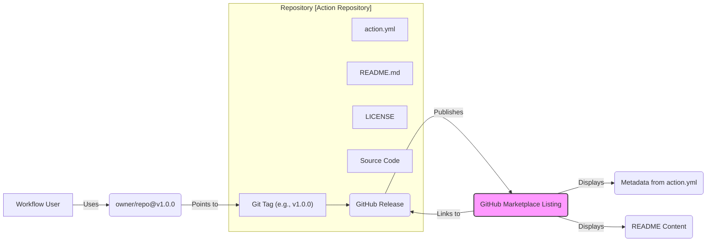

# Chapter 12: Publishing, Versioning, and Maintaining Actions

Having journeyed through the development of JavaScript, Docker, and Composite actions in the preceding chapters, you've gained the skills to build powerful, reusable automation components. However, creating an action is only part of the story. To maximize its impact and ensure its reliability for others (and your future self), you need to understand how to properly publish, version, and maintain it.

This chapter focuses on the crucial lifecycle stages _after_ development. We'll cover preparing your action for public consumption with clear documentation and licensing, the process of publishing it to the GitHub Marketplace for broader visibility, establishing robust versioning strategies using Semantic Versioning and Git tags, and the ongoing responsibilities of maintenance, including handling contributions, updating dependencies, and communicating changes. Finally, we'll delve into critical security considerations specifically for action authors to ensure your creations are not only functional but also secure.

Mastering these practices transforms your custom action from a personal tool into a trusted, shareable building block for the wider GitHub Actions community.

## A. Preparing Your Action for Publication

Before sharing your action with the world (or even just your team), investing time in preparation is essential. Clear documentation, practical examples, and an appropriate license build trust and encourage adoption. Think of your action's repository as its product page – it needs to be informative and welcoming.

### 1. Writing Clear Documentation (`README.md`)

The `README.md` file is the single most important piece of documentation for your action. It's the first thing potential users will see, and it should provide all the necessary information to understand and use your action effectively. A well-structured README typically includes:

- **Action Name & Badges:** Clearly state the action's name. Consider adding badges for things like Marketplace version, build status, license, etc.
- **Purpose/Description:** A concise explanation of what the action does and the problem it solves.
- **Inputs:** A detailed list of all inputs defined in your `action.yml`. For each input:
  - Name (`id`)
  - Description (what it's for)
  - Required (`true`/`false`)
  - Default value (if any)
- **Outputs:** A list of all outputs defined in your `action.yml`. For each output:
  - Name (`id`)
  - Description (what value it provides)
- **Usage Examples:** Concrete examples demonstrating how to use the action in a workflow (see next section).
- **Prerequisites:** Any setup required before using the action (e.g., specific tools that need to be installed, secrets that must be configured).
- **Permissions:** If the action requires specific `permissions` settings in the consuming workflow, document them clearly.
- **Contributing Guidelines:** Instructions for others who want to contribute to the action's development (e.g., how to report bugs, submit pull requests, coding standards). Link to a `CONTRIBUTING.md` file for more detail if necessary.
- **License:** State the license under which the action is distributed.

**Example `README.md` Structure Snippet:**

````markdown
# My Awesome Action

[](https://github.com/marketplace/actions/my-awesome-action)
[](https://github.com/<your-org>/<your-repo>/actions/workflows/ci.yml)
[](https://opensource.org/licenses/MIT)

This action does something truly awesome by automating [specific task].

## Inputs

| Input         | Description                            | Required | Default  |
| ------------- | -------------------------------------- | -------- | -------- |
| `target-file` | The file to process.                   | `true`   | `N/A`    |
| `api-token`   | Token for authenticating with the API. | `true`   | `N/A`    |
| `mode`        | Processing mode ('fast' or 'full').    | `false`  | `'fast'` |

## Outputs

| Output        | Description                        |
| ------------- | ---------------------------------- |
| `result-path` | Path to the generated result file. |
| `items-count` | Number of items processed.         |

## Usage Example

```yaml
name: Process Data

on: [push]

jobs:
  build:
    runs-on: ubuntu-latest
    steps:
      - name: Checkout code
        uses: actions/checkout@v4

      - name: Run My Awesome Action
        id: awesome
        uses: <your-org>/<your-repo>@v1.0.0
        with:
          target-file: "data.json"
          api-token: ${{ secrets.MY_API_TOKEN }}
          mode: "full"

      - name: Use the output
        run: |
          echo "Results are in: ${{ steps.awesome.outputs.result-path }}"
          echo "Processed ${{ steps.awesome.outputs.items-count }} items."
```
````

## Contributing

Contributions are welcome! Please see [CONTRIBUTING.md](CONTRIBUTING.md) for details.

## License

This project is licensed under the terms of the [MIT License](LICENSE).

````

### 2. Providing Usage Examples

While the `Usage Example` section in the README is crucial, consider providing multiple examples covering different use cases or input combinations if your action is complex.

*   **Basic Usage:** The simplest way to get the action working.
*   **Advanced Usage:** Showcasing optional inputs or more complex scenarios.
*   **Integration:** Demonstrating how the action might fit into a larger workflow with other steps.

Ensure your examples are:

*   **Correct:** They should actually work when copied into a workflow file.
*   **Clear:** Easy to understand, with comments if necessary.
*   **Complete:** Include necessary setup steps like `actions/checkout` if required.
*   **Versioned:** Use a specific, stable tag (e.g., `@v1.0.0`) in your examples, not a branch like `@main`.

### 3. Licensing Your Action (`LICENSE`)

Choosing a license is critical for defining how others can use, modify, and distribute your action. Without a license, default copyright laws apply, which generally means others *cannot* legally use, copy, distribute, or modify your work.

*   **Importance:** A license grants permissions to users. It protects both you (by limiting liability, defining terms of use) and your users (by giving them clear rights).
*   **Open Source Licenses:** For actions intended for public use, an open-source license is standard. Popular choices include:
    *   **MIT License:** Permissive, allowing broad use with minimal restrictions (requires attribution and inclusion of the license). Generally a good default choice for GitHub Actions.
    *   **Apache License 2.0:** Another permissive license, similar to MIT but includes an express grant of patent rights.
    *   **GNU General Public License (GPL):** A "copyleft" license. If someone distributes modified versions or software that incorporates GPL-licensed code, they must typically make their source code available under the same GPL terms. This is less common for standalone GitHub Actions but might be relevant depending on dependencies or intent.
*   **Adding a License:**
    1.  Choose a license (resources like [choosealicense.com](https://choosealicense.com/) can help).
    2.  Create a file named `LICENSE` or `LICENSE.md` in the root of your action's repository.
    3.  Copy the full text of your chosen license into this file.
    4.  Reference the license in your `README.md`.

> **Note:** If your action is intended only for private use within your organization, a license might seem less critical, but it's still good practice to include one (even a custom one or simply stating restrictions) to avoid ambiguity. For Marketplace publication, an OSI-approved license is generally expected.

## B. Publishing to the GitHub Marketplace

The GitHub Marketplace is a central hub where users can discover and share GitHub Actions (and Apps). Publishing your action here significantly increases its visibility and makes it easier for others to find and use.

### 1. Requirements for Marketplace Listing

To list your action on the GitHub Marketplace, your repository and action must meet specific criteria:

*   **Public Repository:** The repository containing the action *must* be public.
*   **`action.yml` Metadata:** Your action must have a well-formed `action.yml` file in the root directory. This file *must* include specific metadata for the Marketplace:
    *   `name`: The display name of your action on the Marketplace.
    *   `description`: A short description displayed on the Marketplace listing.
    *   `branding`: Defines an icon and color for your action's visual representation in the workflow editor and Marketplace.
        *   `icon`: Choose from the Feather Icons set (e.g., `activity`, `anchor`, `code`).
        *   `color`: Choose from predefined colors (e.g., `white`, `yellow`, `red`, `green`, `blue`, `purple`, `gray-dark`).
*   **README.md:** A comprehensive README file as described in Section A.
*   **LICENSE:** An OSI-approved license file (e.g., MIT, Apache 2.0) in the repository root.
*   **Release Tag:** You must publish the action from a specific Git tag (a release), not directly from a branch. This ensures users reference a stable version.

**Example `action.yml` with Marketplace Metadata:**

```yaml
name: 'My Awesome Action' # Marketplace display name
description: 'Automates an awesome task using an external API.' # Marketplace description
author: 'Your Name or Org'

# Branding for Marketplace and UI
branding:
  icon: 'zap' # Feather icon name
  color: 'purple'

inputs:
  target-file:
    description: 'The file to process.'
    required: true
  # ... other inputs

outputs:
  result-path:
    description: 'Path to the generated result file.'
  # ... other outputs

runs:
  using: 'node20' # Or 'docker', 'composite'
  main: 'dist/index.js' # Or Dockerfile, action.yml path
````

### 2. Creating a Release

Publishing to the Marketplace is tied to GitHub Releases. A release marks a specific point in your repository's history (associated with a Git tag) and typically represents a stable version of your action.

**Steps to Create a Release:**

1.  **Ensure Code Stability:** Make sure the commit you want to release is stable, tested, and contains the code for the version you intend to publish (e.g., `v1.0.0`). For JavaScript actions, ensure your compiled code (e.g., the `dist` directory) is included in the commit.
2.  **Create a Git Tag:** Create a tag that follows your versioning strategy (preferably SemVer, e.g., `v1.0.0`).

    ```bash
    # Ensure your main branch is up-to-date and clean
    git checkout main
    git pull origin main

    # Tag the current commit
    git tag v1.0.0

    # Push the tag to GitHub
    git push origin v1.0.0
    ```

3.  **Navigate to Releases:** Go to your repository on GitHub.com, click on the "Releases" link on the right-hand side (or under the "Code" tab).
4.  **Draft a New Release:** Click "Draft a new release".
5.  **Choose the Tag:** Select the tag you just pushed (e.g., `v1.0.0`) from the "Choose a tag" dropdown.
6.  **Release Title:** Give the release a meaningful title (e.g., `v1.0.0 - Initial Release`).
7.  **Describe the Release:** Write clear release notes detailing the changes, new features, bug fixes, and any breaking changes in this version. You can use `@mention` to credit contributors.
8.  **(Optional) Attach Binaries:** If your release includes pre-compiled binaries or other assets, you can attach them here (less common for standard Actions, but possible).
9.  **Publish Release:** Click "Publish release".

This creates a permanent, versioned snapshot of your action's code.



**Diagram Explanation:** This diagram shows the relationship between the action's repository components (`action.yml`, `README.md`, `LICENSE`, source code), the Git tag which forms the basis of a GitHub Release, and how the Release is published to the GitHub Marketplace. Users consume the action by referencing the specific tag associated with the release.

### 3. The Publishing Process

Once you have created a release that meets the Marketplace requirements, publishing is straightforward:

##### [Configuration Guide: Step-by-step Marketplace publishing]

1.  **Navigate to Your Repository:** Go to the main page of your action's public repository on GitHub.com.
2.  **Check for Marketplace Banner:** If your repository contains an `action.yml` file, you should see a yellow banner near the top suggesting "Publish this Action to the GitHub Marketplace". Click the "Publish" or "Draft a release" button within this banner.
    - _Alternatively:_ If you just created a release, navigate to that release page. If it meets the criteria, you might see a "Publish to Marketplace" option there.
    - _Final Alternative:_ Go to the main repository page, click the "Settings" tab, then navigate to "Marketplace" in the left sidebar (this option might appear after a valid `action.yml` is detected).
3.  **Select "Action":** Ensure "Action" is selected as the type of listing you want to create.
4.  **Review Requirements:** GitHub will check if your repository meets the requirements (public, `action.yml`, `README`, `LICENSE`, a published release). Address any issues highlighted.
5.  **Choose Release Tag:** Select the specific release tag (e.g., `v1.0.0`) you want to publish to the Marketplace. _Crucially, you are publishing a specific version._
6.  **Select Categories:** Choose up to two categories that best describe your action (e.g., "Deployment", "Utilities", "Testing").
7.  **Review and Publish:** Review the information presented (name, description, branding are pulled from `action.yml`). Read and agree to the GitHub Marketplace Developer Agreement.
8.  **Click "Publish action":** Confirm the publication.

Your action should now be live on the GitHub Marketplace, linked to the specific release you selected! Subsequent updates require creating _new_ releases and optionally updating the Marketplace listing to point to the latest recommended version.

## C. Versioning Strategies

Versioning is crucial for managing changes and providing stability for users of your action. When users reference your action in their workflows, they need a reliable way to specify which version they want to use, ensuring their workflows don't break unexpectedly when you release updates.

### 1. Semantic Versioning (SemVer)

The most widely adopted and recommended versioning scheme is **Semantic Versioning (SemVer)**. It provides a clear framework for communicating the nature of changes between releases. SemVer uses a three-part version number: `MAJOR.MINOR.PATCH`.

- **MAJOR (e.g., `1.0.0` -> `2.0.0`):** Incremented when you make **incompatible API changes** (breaking changes). Users updating to a new major version may need to modify their workflows.
- **MINOR (e.g., `1.0.0` -> `1.1.0`):** Incremented when you add **functionality in a backward-compatible manner**. Users can typically update without changing their workflows.
- **PATCH (e.g., `1.1.0` -> `1.1.1`):** Incremented when you make **backward-compatible bug fixes**. Users should ideally update to get the fixes.

Using SemVer provides clear expectations for your action's consumers.

### 2. Using Tags for Releases (e.g., `v1`, `v1.2`, `v1.2.3`)

In GitHub Actions, users specify the version of an action they want to use via the `@` symbol followed by a Git reference (a tag or branch). The best practice is to use **Git tags** that correspond directly to your SemVer releases.

- **Full SemVer Tag (`@v1.2.3`):** This pins the workflow to an exact, immutable version. It's the safest option for consumers, guaranteeing reproducibility.
  ```yaml
  uses: my-org/my-action@v1.2.3
  ```
- **Major Version Tag (`@v1`):** This is a common convention where you maintain a "floating" tag (like `v1`) that points to the _latest_ release within the `1.x.x` series (e.g., it might point to `v1.2.3` today, and you update it to point to `v1.3.0` tomorrow). This allows users to automatically receive non-breaking updates (minor and patch releases) within that major version.
  - **To implement:** When you release `v1.2.3`, also update the `v1` tag to point to the same commit.
    ```bash
    # After tagging v1.2.3
    git tag -f v1 v1.2.3 # Force update the v1 tag
    git push origin -f v1 # Force push the updated tag
    ```
  - **Benefit:** Users get bug fixes and new features without changing their workflow files.
  - **Risk:** While intended for non-breaking changes, bugs can still be introduced in minor/patch releases, potentially impacting users relying on the major version tag.
  ```yaml
  # Gets the latest v1.x.x release
  uses: my-org/my-action@v1
  ```
- **Minor Version Tag (`@v1.2`):** Less common, but similar to the major version tag, this would point to the latest patch release within the `1.2.x` series (e.g., `v1.2.3`).
  ```yaml
  # Gets the latest v1.2.x release
  uses: my-org/my-action@v1.2
  ```

### 3. Branch-Based References (`main`, `develop`) - Use with Caution

It's technically possible for users to reference a branch name instead of a tag:

```yaml
# WARNING: Not recommended for production workflows!
uses: my-org/my-action@main
# or
uses: my-org/my-action@develop
```

**Why this is dangerous:**

- **Instability:** Branches represent ongoing development. Commits pushed to `main` (or especially `develop`) might contain bugs, unfinished features, or breaking changes _at any time_.
- **Non-Reproducibility:** A workflow run today using `@main` might execute different code than the same workflow run tomorrow if new commits have been pushed. This makes debugging extremely difficult.
- **Breaking Changes:** Pushing a breaking change to a branch referenced by users will immediately break their workflows without warning or version control.

**Use Cases (Limited):**

- **Testing:** You might use a branch reference temporarily _while developing_ the action or testing integration in a _non-production_ workflow.
- **Internal/Controlled Use:** If the action is strictly for internal use within a team that closely coordinates changes, referencing `main` _might_ be acceptable, but tagged releases are still generally better.

##### [Production Note: Importance of stable tags for consumers]

> **For Action Consumers:** Always prefer using specific, immutable tags (e.g., `owner/repo@v1.2.3`) for critical workflows to ensure stability and reproducibility. If you need to automatically receive non-breaking updates, use a major version tag (`owner/repo@v1`) provided and maintained by the action author, understanding the small inherent risk. **Avoid using branch references like `@main` in production workflows.**
>
> **For Action Authors:** Strongly encourage users (via your README) to use specific version tags or, if you provide it, the major version tag. Clearly document your versioning strategy and how you maintain major version tags if applicable.

## D. Maintaining Your Action

Publishing an action is not the end of the journey. Like any software, actions require ongoing maintenance to remain useful, secure, and reliable.

### 1. Handling Issues and Pull Requests

If your action is public, expect users to report bugs, request features (via GitHub Issues), and potentially contribute improvements (via Pull Requests).

- **Issue Templates:** Configure issue templates (`.github/ISSUE_TEMPLATE/`) in your repository to guide users in providing necessary information (e.g., bug report template, feature request template).
- **Pull Request Templates:** Similarly, use a pull request template (`.github/PULL_REQUEST_TEMPLATE.md`) to define expectations for contributions (e.g., tests required, documentation updated, linked issue).
- **Responsiveness:** Try to acknowledge new issues and PRs in a timely manner, even if you can't address them immediately.
- **Labeling:** Use labels effectively to categorize issues and PRs (e.g., `bug`, `enhancement`, `documentation`, `help wanted`, `good first issue`).
- **Code Review:** Carefully review contributions for correctness, security, performance, and adherence to coding standards before merging. Ensure tests pass.
- **Contributor Recognition:** Acknowledge contributors in release notes or your README.

### 2. Keeping Dependencies Updated

Your action likely relies on external dependencies:

- **JavaScript Actions:** npm packages listed in `package.json`.
- **Docker Actions:** The base image specified in `Dockerfile` and any packages installed within it (e.g., via `apt-get`, `apk add`).
- **Composite Actions:** The versions of other actions they might call internally.

These dependencies can have security vulnerabilities or bugs. Regularly updating them is crucial:

- **Security:** Outdated dependencies are a primary vector for security exploits (see Section E).
- **Bug Fixes:** Updates often include important bug fixes.
- **Performance:** Newer versions might offer performance improvements.
- **Tools:** Use tools like **GitHub Dependabot** to automate dependency updates. Configure Dependabot (`.github/dependabot.yml`) for your action's repository:
  - It automatically scans your `package.json`, `Dockerfile`, etc.
  - It opens Pull Requests to update dependencies to newer versions.
  - Configure it to target your development branch and run your CI tests against the update PRs.

**Example `.github/dependabot.yml` for a Node.js action:**

```yaml
version: 2
updates:
  # Enable version updates for npm
  - package-ecosystem: "npm"
    # Look for `package.json` and `lock` files in the `root` directory
    directory: "/"
    # Check for updates weekly
    schedule:
      interval: "weekly"
    # Assign reviews to specific users/teams (optional)
    # reviewers:
    #   - "octocat"
    #   - "my-org/my-team"
    # Target the main branch for PRs
    target-branch: "main"
    # Add labels to Dependabot PRs (optional)
    # labels:
    #   - "dependencies"

  # Enable version updates for Docker (if applicable)
  - package-ecosystem: "docker"
    directory: "/" # Location of the Dockerfile
    schedule:
      interval: "weekly"
    target-branch: "main"

  # Enable version updates for GitHub Actions used in workflows *within this repo* (e.g., CI workflow)
  - package-ecosystem: "github-actions"
    directory: "/" # Check workflows in the root and .github/workflows
    schedule:
      interval: "weekly"
    target-branch: "main"
```

### 3. Communicating Breaking Changes

When you need to introduce a change that is _not_ backward-compatible (a breaking change), clear communication is vital to minimize disruption for your users.

- **SemVer:** Increment the **MAJOR** version number (e.g., `v1.2.3` -> `v2.0.0`). This is the primary signal of a breaking change.
- **Release Notes:** Clearly document the breaking changes in the release notes for the new major version. Explain _what_ changed, _why_ it changed, and _how users can adapt_ their workflows. Provide specific examples if possible.
- **README Updates:** Update the action's README (inputs, outputs, usage examples) to reflect the changes in the new major version.
- **Advance Notice (Optional but Recommended):** For significant breaking changes, consider announcing them in advance via a GitHub Issue or Discussion in your repository, explaining the rationale and timeline. This gives users time to prepare.
- **Deprecation Warnings (If Possible):** If feasible, release a final minor version in the _old_ major series that includes runtime warnings (logged to the workflow console) about the upcoming breaking change and directs users to the new version.

### 4. Deprecation Strategy

Eventually, you might decide to stop maintaining an action altogether. Perhaps it's been superseded by a newer action (yours or someone else's), the underlying technology is obsolete, or you no longer have the resources to maintain it.

A graceful deprecation process includes:

1.  **Announce Deprecation:** Clearly state in the README (prominently at the top) that the action is deprecated and no longer maintained.
2.  **Suggest Alternatives:** If possible, recommend alternative actions or approaches users can migrate to.
3.  **Marketplace Status:** If listed on the Marketplace, investigate if there's an option to mark the listing as deprecated (Marketplace features evolve, so check current capabilities).
4.  **Final Release (Optional):** Consider making one last release that includes only the deprecation notice in the README.
5.  **Stop Updates:** Cease active development and merging pull requests (except perhaps critical security fixes if you choose to offer a limited support window).
6.  **Archive Repository:** After a suitable period, archive the GitHub repository. This makes it read-only, signaling clearly that it's no longer active, but keeps the code available for reference or forks. Users referencing specific tags will still be able to use the action (as the code remains accessible), but no further updates will occur.

## E. Security Considerations for Action Authors

As an action author, you have a responsibility to ensure your action doesn't introduce security vulnerabilities into the workflows that use it. Actions often run with access to sensitive information (`GITHUB_TOKEN`, secrets) and operate within the runner environment.

### 1. Input Sanitization

Action inputs often control command-line arguments, file paths, or script execution. Failing to properly validate or sanitize these inputs can lead to vulnerabilities.

- **Risk:** **Command Injection:** If an input is directly used to construct a shell command, a malicious input could execute arbitrary commands on the runner.
  - **Example (Bad):** A JavaScript action running `execSync(`grep ${process.env.INPUT_PATTERN} file.txt`);`. If `INPUT_PATTERN` is `'; rm -rf /'`, disaster ensues.
- **Risk:** **Path Traversal:** If an input defines a file path that the action reads or writes, a malicious input like `../../../etc/passwd` could allow access to unintended files.
- **Mitigation:**
  - **Treat all inputs as untrusted.**
  - **Validate:** Check inputs against expected formats (e.g., regex for allowed characters, specific value lists).
  - **Sanitize/Escape:** If an input _must_ be used in a shell command, use utilities designed for safe argument passing (e.g., specific functions in Node.js's `child_process` that handle argument arrays, avoiding direct string interpolation into shell commands). Avoid constructing commands by concatenating strings with raw input.
  - **Least Privilege:** Ensure the action only requests the permissions it absolutely needs.

**Conceptual Example (JavaScript):**

```javascript
// BAD: Vulnerable to command injection
const pattern = core.getInput("pattern"); // e.g., user provides "bad; ls /"
cp.execSync(`grep ${pattern} data.txt`);

// BETTER: Use functions that handle arguments safely
const pattern = core.getInput("pattern");
// execFileSync avoids shell interpretation if possible, treats args separately
cp.execFileSync("grep", [pattern, "data.txt"], { stdio: "inherit" });

// EVEN BETTER (if applicable): Avoid shell commands altogether
// Use Node.js libraries for file system or network operations directly.
```

### 2. Secure Handling of Secrets (Avoid logging)

Actions often require secrets (like API keys, tokens) passed as inputs.

- **Rule #1: NEVER log secrets.** GitHub Actions automatically attempts to mask registered secrets in logs, but this masking is best-effort and can be bypassed (e.g., if the secret is transformed or embedded in a URL).
- **Code Review:** Be extra vigilant in code reviews for any `console.log`, `core.info`, `core.debug`, or shell `echo` statements that might inadvertently print a variable containing a secret.
- **Error Handling:** Ensure error messages don't accidentally leak secrets.
- **Use `core.setSecret`:** In JavaScript actions, if you register a value that _should_ be masked (even if it wasn't passed in as a registered secret), use `core.setSecret(mySensitiveValue)` to ask the runner log processor to mask it.

```javascript
import * as core from "@actions/core";

try {
  const apiToken = core.getInput("api-token", { required: true });
  // Register the token value to be masked in logs, just in case
  core.setSecret(apiToken);

  core.info("Starting API call..."); // Safe
  // core.info(`Using token: ${apiToken}`); // DANGEROUS - Never log secrets!

  // ... perform operations using apiToken ...

  core.info("API call finished."); // Safe
} catch (error) {
  // Ensure error messages don't leak secrets either
  core.error(`Action failed: ${error.message}`); // Generally safe if error messages are clean
  // core.error(`Action failed with token ${apiToken}: ${error.message}`); // DANGEROUS
  core.setFailed(error.message);
}
```

### 3. Dependencies Vulnerability Scanning (Dependabot/Snyk for Action Repo)

Your action's own dependencies are a potential source of vulnerabilities.

- **Risk:** A vulnerability in an npm package used by your JavaScript action, or in the base OS packages of your Docker action's image, could be exploited when your action runs.
- **Mitigation:** Regularly scan your action's repository for known vulnerabilities in its dependencies.
  - **Dependabot:** Enable Dependabot security updates for your action's repository (in Repository Settings -> Code security and analysis). It will automatically detect vulnerabilities in dependencies (npm, Docker base images, etc.) and can often open PRs with fixes.
  - **Snyk:** Tools like Snyk can also be integrated into your repository or CI process to scan dependencies and provide detailed vulnerability reports and remediation advice.
- **Keep Updated:** Regularly merge Dependabot PRs or manually update dependencies after reviewing them. Prioritize updates for high-severity vulnerabilities.

##### [Deep Dive: OWASP Top 10 relevant risks for custom actions]

> The OWASP Top 10 highlights critical web application security risks, several of which have direct parallels in custom GitHub Action development:
>
> - **A01: Broken Access Control:** While primarily about user permissions in web apps, for actions, this relates to ensuring the action doesn't misuse the `GITHUB_TOKEN` or other secrets it receives to access resources it shouldn't, and requesting minimal permissions via the `permissions` key in consuming workflows.
> - **A02: Cryptographic Failures:** Relevant if your action handles sensitive data directly (less common, but possible). Ensure proper cryptographic practices if encrypting/decrypting data. Avoid rolling your own crypto.
> - **A03: Injection:** Highly relevant. This includes Command Injection (passing unsanitized input to shell commands) and potentially other injection types if interacting with databases or other systems based on input. Input sanitization is key.
> - **A05: Security Misconfiguration:** For actions, this could mean using insecure defaults, having overly permissive file permissions within a Docker container, or exposing sensitive endpoints if the action runs a service. Ensure base Docker images are configured securely.
> - **A06: Vulnerable and Outdated Components:** Directly maps to using dependencies (npm packages, Docker base images, OS packages) with known vulnerabilities. Using Dependabot/Snyk is the primary mitigation.
> - **A07: Identification and Authentication Failures:** Less directly applicable unless your action implements custom authentication mechanisms, which is rare. Primarily relies on GitHub's authentication.
> - **A08: Software and Data Integrity Failures:** Relates to ensuring the action's code and dependencies haven't been tampered with. Using specific version tags (`@v1.2.3`) rather than mutable references helps consumers ensure they run verified code. For authors, securing the development and release process is important.
> - **A09: Security Logging and Monitoring Failures:** Ensure your action provides adequate (but safe) logging for debugging without logging secrets. Consumers rely on workflow logs for monitoring.
> - **A10: Server-Side Request Forgery (SSRF):** Relevant if your action takes a URL as input and makes requests to it. An attacker could provide URLs pointing to internal network resources or cloud provider metadata endpoints. Validate URLs carefully, restricting them to expected domains or protocols if possible.

By diligently preparing, publishing, versioning, maintaining, and securing your custom actions, you contribute valuable and trustworthy components to the GitHub Actions ecosystem, empowering developers to build more robust and efficient automation pipelines. The next part of this book shifts focus to the crucial aspects of securing the workflows that _consume_ these actions.
