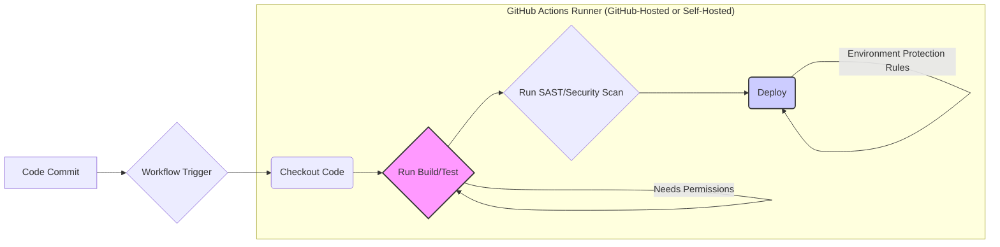
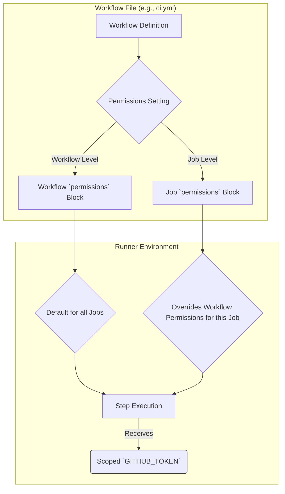

# Chapter 13: Securing Your Workflows: Principles and Practices

Workflow automation brings immense power and efficiency, but with great power comes great responsibility. As GitHub Actions workflows often interact with sensitive code, credentials, and infrastructure, securing them is paramount. Running arbitrary code based on repository events introduces potential attack vectors that must be understood and mitigated.

This chapter delves into the core principles and practical techniques for securing your GitHub Actions workflows. We'll explore the inherent risks, GitHub's security model, and best practices for managing permissions, secrets, third-party dependencies, and cloud authentication. Implementing these practices is crucial for protecting your code, infrastructure, and organization from potential threats.

## A. The GitHub Actions Security Model Overview

Understanding the security landscape of GitHub Actions requires recognizing the various components involved and the potential risks associated with each. Workflows execute code, interact with APIs, handle secrets, and often rely on external tools, creating multiple points where security must be considered.

### 1. Runner Security (GitHub-Hosted vs. Self-Hosted)

The environment where your workflow jobs execute plays a significant role in security:

- **GitHub-Hosted Runners:** These are virtual machines managed by GitHub, spun up on demand, and destroyed after the job completes.
  - **Pros:** Isolated environments for each job, regularly updated OS and tools, managed by GitHub (reducing operational burden).
  - **Cons:** Limited control over the environment, potential exposure if interacting with internal networks (requires careful configuration), shared infrastructure (though isolated). Generally considered secure for public repositories and many private repository use cases.
- **Self-Hosted Runners:** These are machines (physical, virtual, containerized) that you manage and register with GitHub Actions.
  - **Pros:** Full control over the hardware, operating system, installed software, and network access. Ideal for workflows needing access to private network resources, specialized hardware, or specific OS configurations.
  - **Cons:** **You are responsible for securing the runner environment.** This includes OS patching, software updates, network security, access control, monitoring, and preventing workflow jobs from interfering with each other or compromising the host machine. Improperly secured self-hosted runners can become a significant liability, potentially exposing internal systems or sensitive data.

The choice between runner types depends on your specific needs, but the security implications are distinct and must be carefully weighed. Self-hosted runners demand a higher level of security diligence.

### 2. Code Execution Risks

At its core, GitHub Actions executes code defined in your workflow files or within the actions referenced by your workflow. This introduces several risks:

- **Untrusted Code Execution:** Workflows triggered by events like `pull_request` from forks can potentially execute code submitted by external contributors. Malicious code could attempt to steal secrets, tamper with the repository, or attack other systems.
- **Command Injection:** If workflow steps construct scripts or commands using untrusted input (e.g., pull request titles, issue comments, commit messages) without proper sanitization, an attacker could inject malicious commands.
- **Script Vulnerabilities:** The scripts you write within `run` steps might contain vulnerabilities (e.g., insecure handling of temporary files, improper error handling exposing sensitive information).

### 3. Secrets Management Risks

Workflows often require access to sensitive credentials (API keys, passwords, certificates) stored as GitHub Secrets. Risks include:

- **Accidental Exposure:** Secrets might be inadvertently printed to logs if not handled carefully. While GitHub Actions attempts to mask secrets in logs, this mechanism isn't foolproof.
- **Excessive Scope:** Granting workflows access to secrets they don't strictly need increases the potential impact if a workflow is compromised.
- **Insecure Handling in Forks:** Workflows triggered by `pull_request` events from forks have restricted secret access by default, but certain triggers like `pull_request_target` require extreme caution as they run in the context of the base repository and _can_ access secrets.

### 4. Third-Party Action Risks

Using actions created by others (from the Marketplace or other repositories) is a cornerstone of GitHub Actions' power, but it also introduces risks:

- **Malicious Actions:** An action could be intentionally designed to steal secrets, exfiltrate code, or perform other harmful operations.
- **Vulnerable Actions:** An action might contain security vulnerabilities (e.g., command injection flaws, insecure dependencies) that could be exploited.
- **Action Hijacking:** If you reference an action using a mutable tag (like `v1` or `main`), the underlying code could be changed without your knowledge to include malicious code (this is why pinning to commit SHAs is crucial).

### 5. Supply Chain Security Concerns

Modern software development relies heavily on dependencies. This extends to your workflows and the actions they use:

- **Action Dependencies:** Actions themselves often have dependencies (npm packages, Docker base images, etc.). A vulnerability in an action's dependency can make the action itself vulnerable.
- **Build Dependencies:** Your workflow builds and tests code that likely pulls in numerous dependencies. The CI/CD process itself can be a target for supply chain attacks aiming to inject malicious code into your build artifacts.

Understanding these interconnected risks is the first step toward building a robust security posture for your GitHub Actions workflows.



- **Diagram Explanation:** This diagram illustrates a typical CI/CD pipeline run within GitHub Actions. It highlights key stages where security considerations, such as secret usage, third-party action execution, permission requirements, security scanning, and deployment credential management (ideally via OIDC) with environment protection rules, are critical. The runner environment itself is also a key security consideration.

## B. Controlling Workflow Permissions (`permissions`)

One of the most fundamental security controls in GitHub Actions is managing the permissions granted to the `GITHUB_TOKEN`. This token is automatically generated for each workflow run and allows the workflow to authenticate and interact with the GitHub API.

### 1. The `GITHUB_TOKEN`

The `GITHUB_TOKEN` is a short-lived installation access token scoped to the repository where the workflow runs. Its permissions determine what actions the workflow can perform on behalf of the user or application that triggered the workflow (usually `github-actions[bot]`).

#### a. Default Permissions

Historically, the `GITHUB_TOKEN` had broad write permissions by default for many scopes (like `contents`, `pull-requests`, `issues`). This permissive default was convenient but posed a security risk: a compromised workflow could potentially modify repository contents, merge pull requests, or create issues.

**Important:** GitHub has been moving towards more secure defaults. For repositories created after certain dates, or if organization/repository settings are configured for stricter defaults, the default permission might be read-only (`contents: read`). However, you should **never rely on the default** and always define permissions explicitly.

#### b. Scopes and Capabilities

Permissions are controlled via scopes. Each scope grants access to a specific set of API endpoints or capabilities. Common scopes include:

- `actions`: Read/write access to workflow artifacts and management.
- `checks`: Read/write access to check runs and statuses.
- `contents`: Read/write access to repository code, releases, etc.
- `deployments`: Read/write access to deployments.
- `id-token`: Permission to request an OpenID Connect (OIDC) token (write-only).
- `issues`: Read/write access to issues.
- `metadata`: Read access to repository metadata (read-only).
- `packages`: Read/write access to GitHub Packages.
- `pages`: Read/write access to GitHub Pages.
- `pull-requests`: Read/write access to pull requests.
- `repository-projects`: Read/write access to repository projects.
- `security-events`: Read/write access to security events (e.g., Code Scanning alerts).
- `statuses`: Read/write access to commit statuses.

Each scope can typically be set to `read`, `write`, or `none`.

### 2. Setting Permissions at Workflow or Job Level

You can explicitly control the permissions granted to the `GITHUB_TOKEN` using the `permissions` key in your workflow file. This key can be defined at the top level (applying to all jobs) or within a specific job (overriding the top-level settings for that job only).



- **Diagram Explanation:** This diagram shows how permissions for the `GITHUB_TOKEN` can be defined within a workflow file. Permissions can be set globally at the workflow level or overridden specifically for individual jobs. This setting determines the scope of the `GITHUB_TOKEN` available to steps within those jobs, enforcing the principle of least privilege.

#### a. Read-Only Permissions (`contents: read`)

Setting default permissions to read-only significantly reduces the potential impact of a compromised workflow. If a job only needs to read code (e.g., for linting or testing), it shouldn't have write access.

```yaml
# .github/workflows/read-only-example.yml
name: Read-Only Example

on: [push]

# Set default permissions for all jobs to read-only
permissions:
  contents: read

jobs:
  lint:
    runs-on: ubuntu-latest
    steps:
      - name: Checkout code
        uses: actions/checkout@v4 # Needs contents: read

      - name: Run linter
        run: echo "Linting code..." # Does not need token permissions
```

#### b. Granular Scope Control (e.g., `pull-requests: write`)

If a specific job needs more than read access, you can grant specific write permissions only for that job.

> **[Production Note: Principle of Least Privilege - Always define explicit, minimal permissions]**
>
> The principle of least privilege dictates that any component (user, process, workflow) should only have the absolute minimum permissions required to perform its intended function. Applying this to GitHub Actions means:
>
> 1.  Set restrictive default permissions at the workflow level (e.g., `contents: read` or even `permissions: {}`).
> 2.  Grant specific `read` or `write` permissions only to the jobs that absolutely require them.
> 3.  Avoid granting broad `write` access unless strictly necessary.

#### [Code Snippet: Setting minimal permissions for a linting job]

This example demonstrates setting minimal permissions for a job that only needs to check out code.

```yaml
# .github/workflows/secure-lint.yml
name: Secure Linting

on: [pull_request]

# Set global read-only permissions as a safe default
permissions:
  contents: read

jobs:
  linter:
    name: Run Linter
    runs-on: ubuntu-latest
    # No specific job permissions needed, inherits 'contents: read'
    steps:
      - name: Check out code
        uses: actions/checkout@v4
        # This action requires 'contents: read' permission, which is granted.

      - name: Setup Node.js
        uses: actions/setup-node@v4
        with:
          node-version: "20"

      - name: Install dependencies
        run: npm ci

      - name: Run ESLint
        run: npx eslint .
        # This step does not interact with the GitHub API via the token.
```

### 3. Disabling `GITHUB_TOKEN` Permissions Entirely (`permissions: {}`)

If a workflow or job doesn't need to interact with the GitHub API at all (e.g., a simple build process that only uploads artifacts to external storage using OIDC), you can disable all permissions for the `GITHUB_TOKEN`.

```yaml
# .github/workflows/no-token-perms.yml
name: No Token Permissions

on: [push]

# Disable all permissions for the GITHUB_TOKEN globally
permissions: {}

jobs:
  build:
    runs-on: ubuntu-latest
    steps:
      # This checkout step will FAIL because it requires contents: read
      # - name: Checkout code (This would fail)
      #   uses: actions/checkout@v4

      - name: Perform build steps
        run: |
          echo "Building application..."
          # Assume build steps don't need GitHub API access
          mkdir dist
          echo "Build artifact" > dist/app.txt

      # Uploading artifacts requires actions: write permission
      # - name: Upload artifact (This would fail)
      #   uses: actions/upload-artifact@v4
      #   with:
      #     name: my-app
      #     path: dist/
```

Explicitly managing `permissions` is a critical first step in securing your workflows. Always apply the principle of least privilege.

## C. Secure Use of Secrets

Secrets are essential for many workflows, enabling authentication with external services, cloud providers, and internal tools. Handling them securely is vital.

### 1. Limiting Secret Exposure Scope (Environments)

GitHub Environments allow you to group secrets and protection rules for specific deployment targets (e.g., `staging`, `production`).

- **Environment-Specific Secrets:** Instead of making all secrets available to all jobs, store secrets within specific environments. Only jobs explicitly configured to target that environment can access its secrets.
- **Protection Rules:** Environments can enforce rules like required reviewers or wait timers before a job targeting the environment can proceed, adding a layer of manual approval before potentially sensitive deployment jobs run and access production secrets.

Using environments significantly reduces the blast radius if a non-deployment job is compromised, as it won't have access to production credentials.

### 2. Avoiding Secrets in Logs (Masking Limitations Recap)

GitHub Actions automatically attempts to mask any registered secret value if it appears in workflow logs. However:

- **Masking is Best-Effort:** It relies on matching the exact secret string. Transformed versions of the secret (e.g., Base64 encoded, URL encoded, part of a larger string) might not be masked.
- **Don't Rely Solely on Masking:** The primary defense is to **never intentionally print secrets**. Avoid commands like `echo $MY_SECRET` or debugging steps that might expose sensitive values. Use actions designed for secure credential handling (like official cloud login actions) where possible.
- **Structured Data:** Secrets embedded within structured data (JSON, XML) are less likely to be masked correctly.

Treat log masking as a safety net, not a primary security control.

### 3. Handling Secrets in Forks (`pull_request_target` considerations)

By default, workflows triggered by the `pull_request` event from forks run in the context of the fork and **do not** have access to secrets defined in the base repository. This is a crucial security boundary.

The `pull_request_target` event is different. It runs in the context of the **base repository** (where the code will eventually be merged) _even though the trigger is a PR from a fork_. This means:

- It **can** access secrets defined in the base repository.
- It checks out the **base** branch code by default, not the PR code.

#### [Deep Dive: Risks associated with `pull_request_target` and mitigation]

Using `pull_request_target` is inherently risky because it allows potentially untrusted code from a fork to influence a workflow that has access to secrets and operates with elevated permissions (relative to a standard `pull_request` trigger).

**Risks:**

1.  **Code Injection:** If the workflow checks out and executes code from the pull request head (using `actions/checkout` with `ref: ${{ github.event.pull_request.head.sha }}`) within a `pull_request_target` context, that untrusted code runs with access to base repository secrets. **This is extremely dangerous.**
2.  **Indirect Manipulation:** Even without checking out the PR code directly, the PR's metadata (title, body, labels) could potentially be used in scripts within the `pull_request_target` workflow. If not properly sanitized, this could lead to injection attacks.

**Mitigation Strategies:**

1.  **Avoid `pull_request_target` if possible:** Use `pull_request` for standard CI checks on fork PRs. Use `workflow_run` to trigger actions _after_ a PR workflow completes successfully. Use `pull_request_review_comment` or similar triggers that require interaction from a maintainer.
2.  **NEVER Checkout Untrusted Code:** If you _must_ use `pull_request_target`, **do not** check out the PR's head commit (`github.event.pull_request.head.sha`) within that workflow. Only operate on the base commit or trusted metadata.
3.  **Use Intermediate Workflows:** Have `pull_request` build/test the PR code (no secrets). If it passes, have a separate `workflow_run` or manually triggered workflow perform actions requiring secrets.
4.  **Strict Permission Scoping:** If using `pull_request_target`, ensure the `permissions` are minimal, and secrets are scoped tightly using environments if applicable.
5.  **Sanitize Inputs:** Treat all data from the pull request event (`github.event.pull_request.*`) as untrusted input if used in scripts.

`pull_request_target` should only be used with extreme caution and a deep understanding of the security implications.

### 4. Secret Scanning in Repositories

Preventing secrets from ever being committed to your repository is a crucial preventative measure. GitHub Advanced Security (available on GitHub Enterprise and public repositories) includes secret scanning.

- **Functionality:** It automatically scans your repository history and current commits for patterns matching known secret formats (API keys, tokens, private keys) from various service providers.
- **Alerts:** If a potential secret is found, GitHub notifies administrators or users with access, allowing them to revoke the leaked credential and remove it from history.
- **Push Protection:** Secret scanning can also be configured as a push protection mechanism, blocking pushes that contain detectable secrets.

#### [Configuration Guide: Enabling GitHub Advanced Security secret scanning]

1.  **Navigate:** Go to your repository (or organization settings).
2.  **Settings:** Click on "Settings".
3.  **Security:** Select "Code security and analysis".
4.  **GitHub Advanced Security:** Enable "GitHub Advanced Security" (requires appropriate license for private repositories).
5.  **Secret Scanning:** Enable "Secret scanning". Optionally enable "Push protection".
6.  **Partners:** Configure alerts for secrets from specific partners if needed.

Enabling secret scanning provides an automated safety net against accidental secret commits.

## D. Securing Third-Party Action Usage

Leveraging actions from the community accelerates development but requires diligence to avoid introducing security risks.

### 1. Pinning Actions to Full-Length Commit SHAs

Actions are typically referenced using versions or branches (e.g., `actions/checkout@v4`, `actions/setup-node@main`). However, these references are mutable:

- **Tags (like `v4`)** can be moved by the action maintainer to point to a different commit.
- **Branches (like `main`)** point to the latest commit on that branch.

If an attacker gains control of the action's repository or the maintainer inadvertently pushes malicious code, your workflow could automatically pull and execute it on the next run.

**Solution:** Pin actions to the full-length commit SHA (Secure Hash Algorithm) of a specific, audited version of the action. A commit SHA is immutable and guarantees you are always running the exact code you vetted.

#### [Practical Example: Finding and using commit SHAs for actions]

1.  **Go to the Action Repository:** Navigate to the repository of the action you want to use (e.g., `github.com/actions/checkout`).
2.  **Find the Release/Tag:** Go to the "Releases" or "Tags" section and find the specific version you intend to use (e.g., `v4.1.1`).
3.  **Get the Commit SHA:** Click on the tag. This will usually take you to the code state for that tag. Look for the commit hash associated with that tag. It's a long alphanumeric string (e.g., `b4ffde65f46336ab88eb53be808477a3936bae11`). You can often find this by clicking the "commits" link near the top of the file view or directly on the tag page.
4.  **Use the SHA in Workflow:** Replace the tag/branch reference in your workflow file with the full SHA, preceded by the `@` symbol.

```yaml
# .github/workflows/pinning-example.yml
name: Action Pinning Example

on: [push]

permissions:
  contents: read

jobs:
  build:
    runs-on: ubuntu-latest
    steps:
      # Instead of: uses: actions/checkout@v4
      # Use the full commit SHA for a specific version (e.g., v4.1.1)
      - name: Checkout code securely
        uses: actions/checkout@b4ffde65f46336ab88eb53be808477a3936bae11 # Pinned to SHA for v4.1.1

      # Instead of: uses: actions/setup-node@v4
      # Use the full commit SHA for a specific version (e.g., v4.0.2)
      - name: Setup Node.js securely
        uses: actions/setup-node@60edb5dd545a775178f52524783378180af0d1f8 # Pinned to SHA for v4.0.2
        with:
          node-version: "20"

      - name: Run command
        run: echo "Using pinned actions."
```

Pinning adds verbosity but significantly enhances security by preventing unexpected code changes in your dependencies. Tools like Dependabot can help automate the process of updating pinned SHAs.

### 2. Vetting Action Source Code

Before pinning to a specific SHA, ideally, you should perform some level of vetting on the action's source code:

- **Reputation:** Is the action maintained by a reputable organization (e.g., GitHub, major vendors) or individual? Is it widely used and well-regarded?
- **Code Review:** Examine the action's code (`action.yml`, scripts, source files) for suspicious behavior. Look for obfuscated code, unexpected network calls, or misuse of credentials/context variables.
- **Permissions:** Check the `action.yml` to understand what permissions the action _might_ require, although your workflow's `permissions` block ultimately controls the `GITHUB_TOKEN`.
- **Dependencies:** Investigate the action's own dependencies (e.g., `package.json`, `Dockerfile`).

While a deep code audit might be infeasible for every action, a basic review and check of reputation can help identify obvious risks.

### 3. Using Organization-Level Controls for Allowed Actions

GitHub Enterprise Cloud and Server administrators can configure policies at the organization level to restrict which actions are allowed to run.

#### [Configuration Guide: Setting Action policies at the org level]

1.  **Navigate:** Go to your organization's settings.
2.  **Actions:** Under the "Code, planning, and automation" section, click "Actions" > "General".
3.  **Policies:** Under "Policies", you can configure:
    - **Allow all actions:** Least restrictive.
    - **Allow local actions only:** Only actions defined within repositories in your organization.
    - **Allow select actions:** Specify allowed actions explicitly or allow all actions created by GitHub, verified creators, and specific organizations/repositories. You can list allowed actions individually or by organization.

This provides a powerful mechanism to enforce the use of only vetted or internally developed actions across your organization.

### 4. Dependency Review for Actions

Just like your application code, the dependencies _within_ third-party actions can contain vulnerabilities. While direct control is limited, consider:

- **GitHub Dependency Graph/Dependabot:** If the action's repository has dependency scanning enabled, check its dependency graph for known vulnerabilities.
- **Action Choice:** Favor actions with minimal or well-maintained dependencies.
- **Supply Chain Security Tools:** Advanced tools might offer capabilities to scan the dependencies of Docker container actions or analyze JavaScript action dependencies.

Securing third-party action usage involves trust, verification (pinning, vetting), and policy enforcement.

## E. OpenID Connect (OIDC) for Cloud Authentication

A major security challenge in CI/CD is securely authenticating workflows with external services, particularly cloud providers (AWS, Azure, GCP) or secret managers like HashiCorp Vault. Traditionally, this involved storing long-lived static credentials (API keys, service principal secrets) as GitHub Secrets. These static secrets are high-value targets.

OpenID Connect (OIDC) provides a more secure, standard mechanism for passwordless authentication. GitHub Actions can act as an OIDC identity provider, allowing workflows to obtain short-lived, automatically expiring credentials from cloud providers without needing to store static secrets.

### 1. Understanding OIDC Concepts (Tokens, Claims, Trust Relationships)

- **OIDC Provider (IdP):** An entity that authenticates users/identities and issues security tokens (e.g., GitHub Actions).
- **Relying Party (RP):** An entity that trusts the OIDC provider and consumes its tokens to grant access (e.g., AWS, Azure, GCP, Vault).
- **JWT (JSON Web Token):** An open standard (RFC 7519) for securely transmitting information between parties as a JSON object. GitHub Actions issues OIDC JWTs.
- **Claims:** Pieces of information asserted about the subject (the workflow run) contained within the JWT. Examples include the repository name (`repository`), commit SHA (`ref`), workflow name (`workflow`), environment name (`environment`), etc. These claims allow the cloud provider to enforce fine-grained access policies.
- **Trust Relationship:** The core of OIDC. The cloud provider (RP) is configured to trust tokens issued by GitHub Actions (IdP) _for specific workflows/repositories/branches_ based on the claims within the token.

The flow typically works like this:

1.  Workflow requests an OIDC token from GitHub Actions (requires `id-token: write` permission).
2.  GitHub issues a JWT containing claims about the workflow run.
3.  Workflow sends this JWT to the cloud provider's OIDC endpoint.
4.  Cloud provider verifies the JWT's signature and checks if the issuer (GitHub) is trusted.
5.  Cloud provider validates the claims in the JWT against configured policies (e.g., "Allow access only if the token is from `my-org/my-repo` and the `ref` is `refs/heads/main`").
6.  If valid, the cloud provider exchanges the JWT for short-lived cloud credentials.
7.  Workflow uses these temporary credentials to interact with cloud services.

### 2. Configuring OIDC between GitHub Actions and Cloud Providers

Setting up OIDC involves configuration on both GitHub (in the workflow) and the cloud provider.

#### a. AWS (IAM Roles for Service Accounts - IRSA)

- **Concept:** Configure an IAM OIDC Identity Provider in AWS, trusting `token.actions.githubusercontent.com`. Create an IAM Role with the necessary AWS permissions. Establish a trust policy on the Role that allows principals federated by the GitHub OIDC provider to assume the role, conditioned on specific claims (like `repo`, `ref`, `environment`).
- **Workflow:** Use the official `aws-actions/configure-aws-credentials` action with the Role ARN and desired region. It handles fetching the OIDC token and exchanging it for temporary AWS credentials.

#### [Configuration Guide: Setting up OIDC for passwordless AWS access]

1.  **AWS IAM:** Create an OIDC Identity Provider for `token.actions.githubusercontent.com` with audience `sts.amazonaws.com`.
2.  **AWS IAM:** Create an IAM Role for your workflow.
3.  **AWS IAM:** Edit the Role's Trust Relationship to allow `sts:AssumeRoleWithWebIdentity`. Add conditions based on GitHub claims (e.g., `token.actions.githubusercontent.com:sub` matching `repo:your-org/your-repo:ref:refs/heads/main`).
4.  **GitHub Workflow:** Add `id-token: write` to workflow/job permissions. Use `aws-actions/configure-aws-credentials` specifying the Role ARN.

```yaml
# .github/workflows/aws-oidc.yml
name: AWS OIDC Example
on:
  push:
    branches: [main]
permissions:
  id-token: write # Required for OIDC
  contents: read # Example: if checkout is needed
jobs:
  deploy-to-aws:
    runs-on: ubuntu-latest
    steps:
      - name: Checkout
        uses: actions/checkout@v4

      - name: Configure AWS Credentials via OIDC
        uses: aws-actions/configure-aws-credentials@v4
        with:
          role-to-assume: arn:aws:iam::123456789012:role/GitHubAction-AssumeRole-From-MyRepo # Replace with your Role ARN
          aws-region: us-east-1

      - name: Use AWS CLI
        run: |
          aws s3 ls # Example AWS command using the assumed role credentials
          echo "Successfully authenticated with AWS using OIDC!"
```

#### b. Azure (Workload Identity Federation)

- **Concept:** Create an Azure AD Application Registration and a Service Principal. Configure Federated Credentials on the Application Registration, trusting GitHub Actions based on claims (issuer, subject identifier - repo, environment, etc.). Grant the Service Principal the necessary Azure RBAC roles.
- **Workflow:** Use the official `azure/login` action with details like client ID, tenant ID, and subscription ID. It handles the OIDC token exchange.

#### [Configuration Guide: Setting up OIDC for passwordless Azure access]

1.  **Azure AD:** Create an App Registration and note the Application (client) ID and Directory (tenant) ID.
2.  **Azure AD:** In the App Registration, go to "Certificates & secrets" > "Federated credentials". Add a credential for GitHub Actions, providing your organization/repository, and specifying the entity type (e.g., environment, branch, tag) and corresponding name. The Subject Identifier will be auto-generated (e.g., `repo:your-org/your-repo:ref:refs/heads/main`).
3.  **Azure RBAC:** Assign the required roles (e.g., Contributor on a resource group) to the Service Principal associated with the App Registration.
4.  **GitHub Workflow:** Add `id-token: write` permissions. Use `azure/login@v1` providing the `client-id`, `tenant-id`, and `subscription-id`.

```yaml
# .github/workflows/azure-oidc.yml
name: Azure OIDC Example
on:
  push:
    branches: [main]
permissions:
  id-token: write # Required for OIDC
  contents: read
jobs:
  deploy-to-azure:
    runs-on: ubuntu-latest
    steps:
      - name: Checkout
        uses: actions/checkout@v4

      - name: Log in to Azure via OIDC
        uses: azure/login@v1
        with:
          client-id: ${{ secrets.AZURE_CLIENT_ID }} # Store in GitHub Secrets (non-sensitive ID)
          tenant-id: ${{ secrets.AZURE_TENANT_ID }} # Store in GitHub Secrets (non-sensitive ID)
          subscription-id: ${{ secrets.AZURE_SUBSCRIPTION_ID }} # Store in GitHub Secrets (non-sensitive ID)

      - name: Use Azure CLI
        run: |
          az account show
          az group list --output table # Example Azure command
          echo "Successfully authenticated with Azure using OIDC!"
```

#### c. Google Cloud (Workload Identity Federation)

- **Concept:** Configure a Workload Identity Pool and Provider in GCP IAM. The provider trusts GitHub Actions (`https://token.actions.githubusercontent.com`). Configure attribute mapping to extract GitHub claims (like `repository`, `ref`) into GCP attributes. Grant service account impersonation rights to identities matching specific attributes via the pool.
- **Workflow:** Use the official `google-github-actions/auth` action, providing the Workload Identity Provider resource name and the Service Account email to impersonate.

#### [Configuration Guide: Setting up OIDC for passwordless GCP access]

1.  **GCP IAM:** Create a Workload Identity Pool.
2.  **GCP IAM:** Add a Workload Identity Provider to the pool, configured for OIDC. Set Issuer URI to `https://token.actions.githubusercontent.com` and configure Attribute Mapping (e.g., map `google.subject` to `assertion.sub`, `attribute.repository` to `assertion.repository`).
3.  **GCP IAM:** Create or select a Service Account for your workflow.
4.  **GCP IAM:** Grant the Service Account the necessary GCP roles.
5.  **GCP IAM:** Grant the Workload Identity Pool's identities (matching specific attributes, e.g., `attribute.repository = 'your-org/your-repo'`) the `roles/iam.workloadIdentityUser` role on the Service Account, allowing them to impersonate it.
6.  **GitHub Workflow:** Add `id-token: write` permissions. Use `google-github-actions/auth@v2` providing the `workload_identity_provider` and `service_account`.

```yaml
# .github/workflows/gcp-oidc.yml
name: GCP OIDC Example
on:
  push:
    branches: [main]
permissions:
  id-token: write # Required for OIDC
  contents: read
jobs:
  deploy-to-gcp:
    runs-on: ubuntu-latest
    steps:
      - name: Checkout
        uses: actions/checkout@v4

      - name: Authenticate to Google Cloud via OIDC
        uses: google-github-actions/auth@v2
        with:
          workload_identity_provider: "projects/YOUR_PROJECT_NUMBER/locations/global/workloadIdentityPools/YOUR_POOL_ID/providers/YOUR_PROVIDER_ID" # Replace
          service_account: "your-service-account-email@your-project-id.iam.gserviceaccount.com" # Replace

      - name: Use gcloud CLI
        run: |
          gcloud auth list
          gcloud projects list # Example gcloud command
          echo "Successfully authenticated with GCP using OIDC!"
```

#### d. HashiCorp Vault

- **Concept:** Enable and configure the JWT/OIDC auth method in Vault. Set the `oidc_discovery_url` to `https://token.actions.githubusercontent.com` and configure bound claims (like `repository`, `ref`, `aud`) that must match the incoming GitHub OIDC token. Create Vault policies granting access to secrets and associate them with roles under the JWT auth method.
- **Workflow:** Use the official `hashicorp/vault-action` action. It fetches the OIDC token and uses it to authenticate against the Vault JWT auth method based on a specified role.

#### [Configuration Guide: Setting up OIDC for Vault authentication]

1.  **Vault CLI/UI:** Enable the JWT auth method (`vault auth enable jwt`).
2.  **Vault CLI/UI:** Configure the JWT auth method, setting `oidc_discovery_url`, `bound_issuer`, and potentially default `role`.
3.  **Vault CLI/UI:** Create a Vault policy defining desired secret access.
4.  **Vault CLI/UI:** Create a role under the JWT auth method, binding it to the policy and setting `bound_claims` (e.g., `repository`, `ref`, `aud` must match `sts.amazonaws.com` if using AWS auth later) and `user_claim` (e.g., `repository`).
5.  **GitHub Workflow:** Add `id-token: write` permissions. Use `hashicorp/vault-action` specifying the Vault URL, the JWT role, and the desired secrets. Optionally configure audience (`aud`) claim if needed by Vault role bindings.

```yaml
# .github/workflows/vault-oidc.yml
name: Vault OIDC Example
on:
  push:
    branches: [main]
permissions:
  id-token: write # Required for OIDC
  contents: read
jobs:
  get-secrets-from-vault:
    runs-on: ubuntu-latest
    steps:
      - name: Checkout
        uses: actions/checkout@v4

      - name: Import Secrets from Vault via OIDC
        uses: hashicorp/vault-action@v2
        with:
          url: ${{ secrets.VAULT_ADDR }} # e.g., https://vault.example.com
          role: "my-repo-main-branch-role" # Vault role configured for OIDC
          method: jwt # Use JWT/OIDC auth method
          # aud: 'sts.amazonaws.com' # Optional: If Vault role requires specific audience
          secrets: |
            secret/data/database username | DB_USERNAME ;
            secret/data/database password | DB_PASSWORD ;

      - name: Use Secrets
        run: |
          echo "Retrieved database username: $DB_USERNAME" # Secret is masked in logs
          # Use the retrieved secrets securely
          echo "Successfully authenticated with Vault using OIDC!"
```

### 3. Benefits: Avoiding Long-Lived Cloud Credentials

Using OIDC offers significant security advantages over static, long-lived credentials stored as secrets:

- **No Static Secrets:** Eliminates the risk of long-lived cloud keys/passwords being leaked or compromised.
- **Short-Lived Credentials:** Tokens obtained via OIDC are typically valid for a short duration (e.g., minutes to hours), drastically reducing the window of opportunity for misuse if intercepted.
- **Fine-Grained Control:** Cloud provider trust policies can be tightly scoped based on JWT claims (repository, branch, environment, tag, etc.), enforcing least privilege.
- **Automatic Rotation:** Credentials are generated on-demand for each workflow run and expire automatically.

> **[Production Note: OIDC as the standard for secure cloud access from Actions]**
>
> Whenever possible, OIDC should be considered the **standard and preferred method** for authenticating GitHub Actions workflows with cloud providers and other supporting services like Vault. It represents a major step forward in CI/CD security compared to managing static secrets.

## F. Environment Protection Rules Revisited

As mentioned in the context of secrets, GitHub Environments are not just for scoping secrets but also act as crucial security gates, especially for deployment workflows.

### 1. Security Gates for Deployments (Required Reviewers, Wait Timers)

When configuring an environment (Repository Settings > Environments), you can enable protection rules:

- **Required Reviewers:** Specify individuals or teams who must approve a workflow run before it can access the environment and proceed with deployment. This adds a human verification step, preventing unauthorized or accidental deployments.
- **Wait Timer:** Introduce a delay (minutes) before a job targeting the environment can start. This provides a window to cancel an unintended deployment run.
- **Deployment Branches:** Restrict which branches (or tags) are allowed to deploy to the environment (e.g., only allow the `main` branch to deploy to `production`).

These rules transform environments into controlled stages within your CI/CD process, enhancing security and stability for sensitive operations like production deployments.

### 2. Secure Branch Deployment Strategies

Combining environment protection rules with branch protection rules (Repository Settings > Branches) enables robust deployment strategies:

- **Protect `main` Branch:** Require status checks to pass, enforce linear history, require PRs before merging, etc.
- **Restrict `production` Environment:** Allow only the `main` branch to deploy to the `production` environment.
- **Require Reviewers for `production`:** Mandate approval from specific teams before a deployment job targeting `production` can run.

This ensures that only code that has passed reviews, automated checks, and potentially manual approval can be deployed to critical environments.

## G. Code Scanning and Static Analysis Security Testing (SAST)

Integrating security scanning directly into your CI/CD pipeline helps identify vulnerabilities _before_ they reach production. GitHub Actions provides excellent integration points for Static Analysis Security Testing (SAST) tools.

### 1. Integrating CodeQL

CodeQL is GitHub's powerful semantic code analysis engine, designed to find security vulnerabilities, bugs, and other errors in code. GitHub provides official actions to easily integrate CodeQL scanning into your workflows.

#### [Configuration Guide: Setting up basic CodeQL analysis workflow]

GitHub often provides a "Security" tab in your repository with a button to set up Code Scanning using CodeQL with a pre-configured workflow. Alternatively, you can create it manually:

```yaml
# .github/workflows/codeql-analysis.yml
name: "CodeQL Security Analysis"

on:
  push:
    branches: [main, develop]
  pull_request:
    # The branches below must be a subset of the branches above
    branches: [main]
  schedule:
    - cron: "30 1 * * 1" # Example: Run weekly

permissions:
  contents: read # To checkout code
  security-events: write # To upload CodeQL results

jobs:
  analyze:
    name: Analyze Code
    runs-on: ubuntu-latest

    strategy:
      fail-fast: false
      matrix:
        language: ["javascript", "python"] # Add languages relevant to your repo
        # Learn more about CodeQL language support: https://aka.ms/codeql-docs/language-support

    steps:
      - name: Checkout repository
        uses: actions/checkout@v4

      # Initializes the CodeQL tools for scanning.
      - name: Initialize CodeQL
        uses: github/codeql-action/init@v3
        with:
          languages: ${{ matrix.language }}
          # If you wish to specify custom queries, you can do so here
          # queries: +security-extended, +security-and-quality

      # Autobuild attempts to build any compiled languages (C/C++, C#, Go, Java).
      # If this step fails, review the build logs for guidance.
      # For more control, you can replace this step with your own custom build steps.
      - name: Autobuild
        uses: github/codeql-action/autobuild@v3

      # Runs CodeQL analysis. Corresponding init and upload steps are required.
      - name: Perform CodeQL Analysis
        uses: github/codeql-action/analyze@v3
        with:
          category: "/language:${{matrix.language}}"
```

This workflow initializes CodeQL for specified languages, attempts to build the code (if necessary), performs the analysis, and uploads the results to the repository's "Security" tab under "Code scanning alerts".

#### [Deep Dive: Customizing CodeQL queries and configurations]

CodeQL is highly customizable:

- **Query Suites:** Instead of the default suite, you can specify different built-in suites (`security-extended`, `security-and-quality`) or custom query files (`.ql`) using the `queries` input in the `init` step.
- **Configuration File:** A `codeql-config.yml` file in your repository (`.github/codeql/codeql-config.yml`) allows you to disable default queries, specify custom query packs, define paths to ignore, and more.
- **Custom Builds:** For compiled languages, you might need to replace the `autobuild` step with your specific build commands wrapped between the `init` and `analyze` steps.

Integrating CodeQL provides automated, deep security analysis within your development lifecycle.

### 2. Integrating Third-Party SAST Tools

Beyond CodeQL, many commercial and open-source SAST tools can be integrated into GitHub Actions:

- **Marketplace Actions:** Check the GitHub Marketplace for actions provided by SAST vendors (e.g., Snyk, SonarCloud, Checkmarx). These actions often simplify the integration process.
- **CLI Execution:** Most SAST tools offer a command-line interface (CLI). You can install and run the CLI directly within a `run` step in your workflow, configuring it to scan your code and potentially upload results (e.g., in SARIF format) to GitHub's code scanning API or the tool's own platform.

**Example (Conceptual):**

```yaml
# .github/workflows/third-party-sast.yml
name: Third-Party SAST Scan

on: [push]

permissions:
  contents: read
  # Potentially security-events: write if uploading SARIF to GitHub

jobs:
  sast-scan:
    runs-on: ubuntu-latest
    steps:
      - name: Checkout code
        uses: actions/checkout@v4

      - name: Setup Tool Environment
        # e.g., uses: snyk/actions/setup@v1 or run: npm install -g my-sast-cli
        run: echo "Setting up SAST tool..." # Replace with actual setup

      - name: Run SAST Scan
        run: my-sast-cli scan --fail-on-high --output results.sarif || true
        # Replace with actual scan command. Handle exit codes appropriately.

      - name: Upload SARIF results to GitHub Security Tab (Optional)
        if: always() # Run even if previous step failed based on exit code handling
        uses: github/codeql-action/upload-sarif@v3
        with:
          sarif_file: results.sarif
```

Integrating SAST tools directly into your workflows enables early detection of vulnerabilities, shifting security left in the development process.

By implementing the principles and practices outlined in this chapter—controlling permissions, securing secrets, vetting dependencies, using OIDC, leveraging environments, and integrating security scanning—you can significantly harden your GitHub Actions workflows against potential threats, building a more secure and reliable automation foundation.
