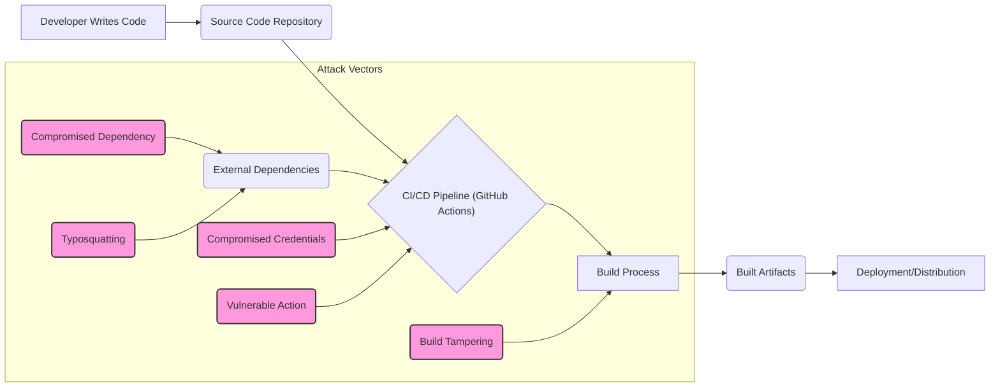
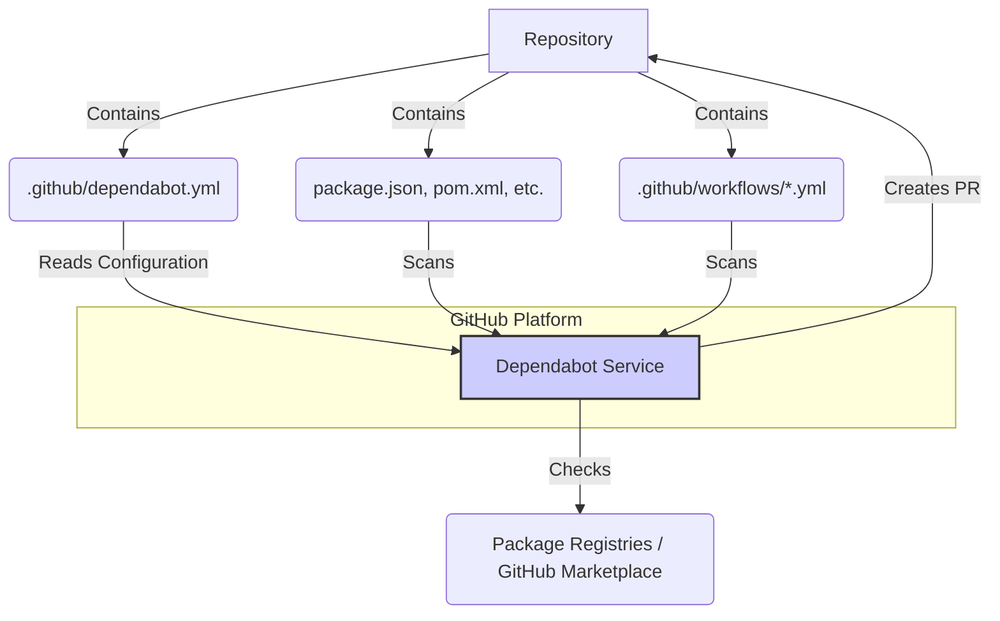

# Chapter 14: Dependency Management and Software Supply Chain Security

Modern software development relies heavily on reusing code through external libraries, packages, and frameworks – collectively known as dependencies. While this accelerates development, it also introduces significant security risks through the software supply chain. An attack targeting a dependency or the build process can compromise countless downstream applications.

This chapter delves into the critical aspects of managing dependencies and securing your software supply chain within the context of GitHub Actions. We will explore common risks, introduce GitHub's tools like Dependabot for automated updates and vulnerability scanning, discuss methods for verifying dependency integrity, outline secure build practices, and introduce the SLSA framework for achieving higher levels of supply chain security assurance. Understanding and mitigating these risks is paramount for building and delivering secure software.

## A. Understanding Software Supply Chain Risks

The software supply chain encompasses everything and everyone involved in the development, build, and distribution of your software. This includes source code repositories, developers, third-party dependencies, build tools, CI/CD pipelines, artifact repositories, and distribution mechanisms. A vulnerability or compromise at any point in this chain can have cascading effects.



**Diagram Explanation:** This diagram illustrates a simplified software supply chain, highlighting potential attack vectors such as compromised dependencies, typosquatting, build process tampering, compromised credentials used in the CI/CD pipeline, and vulnerable third-party Actions.

### 1. Compromised Dependencies

This is perhaps the most well-known supply chain risk. Attackers may intentionally inject malicious code into popular open-source libraries or exploit existing vulnerabilities. When your application includes such a compromised dependency, it becomes vulnerable itself.

- **Direct Injection:** An attacker gains commit access (or is a malicious maintainer) to a popular library and adds malicious code.
- **Exploiting Vulnerabilities:** Dependencies, like any software, can have bugs. Some of these bugs are security vulnerabilities (e.g., Remote Code Execution (RCE), Cross-Site Scripting (XSS), SQL Injection). If your application uses a dependency with an unpatched vulnerability, attackers can exploit it. The Log4Shell vulnerability (CVE-2021-44228) in the popular Java logging library Log4j is a prime example of the widespread impact a single compromised dependency can have.

### 2. Typosquatting and Malicious Packages

Attackers publish packages to public registries (like npm, PyPI, RubyGems) with names very similar to popular, legitimate packages. They rely on developers making typos when installing dependencies (e.g., `requesrs` instead of `requests`). These malicious packages often mimic the functionality of the original but include hidden backdoors, credential stealers, or cryptocurrency miners. Other variations include:

- **Dependency Confusion:** Exploiting the behavior of package managers that might prioritize private registry packages over public ones if names collide, potentially allowing an attacker to publish a malicious package with the same name as an internal private package.
- **Account Takeover:** Gaining control of a legitimate maintainer's account to publish malicious versions of their packages.

### 3. Build Process Tampering

The CI/CD pipeline itself is a critical part of the supply chain and a prime target for attackers. If an attacker can modify the build process, they can inject malicious code, steal secrets, or tamper with the final artifacts. Within GitHub Actions, this can manifest as:

- **Compromised Actions:** Using a third-party GitHub Action that contains malicious code or is later compromised.
- **Insecure Workflow Logic:** Workflows that fetch resources insecurely, execute untrusted code, or have overly broad permissions.
- **Runner Compromise:** Although GitHub-hosted runners provide ephemeral and isolated environments, self-hosted runners require careful management. A compromised self-hosted runner could tamper with builds or exfiltrate data.
- **Source Code Manipulation:** If the pipeline fetches source code insecurely or if the source repository itself is compromised before the build starts.

Mitigating these risks requires a multi-layered approach involving automated tooling, secure configurations, developer awareness, and adherence to best practices, as we will explore in the following sections.

## B. Dependabot for Dependency Updates

Keeping dependencies up-to-date is crucial for patching known vulnerabilities and benefiting from the latest features and performance improvements. However, manually tracking and updating dependencies across multiple projects can be tedious and error-prone. GitHub Dependabot automates this process.

Dependabot scans your repositories for outdated dependencies and security vulnerabilities, automatically creating pull requests to update them to the latest secure versions. It supports a wide range of package managers and ecosystems.

### 1. Configuring `dependabot.yml` for Application Dependencies

To enable Dependabot updates for your application's dependencies (e.g., npm packages, Python libraries, Go modules), you need to create a configuration file named `.github/dependabot.yml` in your repository.

This file specifies which package ecosystems to monitor, how often to check for updates, and other configuration options.

**Example: `dependabot.yml` for npm and Docker**

```yaml
# .github/dependabot.yml
version: 2
updates:
  # Enable version updates for npm
  - package-ecosystem: "npm"
    # Look for `package.json` and `lock` files in the `root` directory
    directory: "/"
    # Check for updates every day (weekdays)
    schedule:
      interval: "daily"
    # Specify reviewers and assignees for Dependabot PRs
    reviewers:
      - "octocat"
      - "my-org/my-npm-team"
    assignees:
      - "octocat"
    # Add labels to Dependabot PRs
    labels:
      - "npm"
      - "dependencies"
    # Limit the number of open PRs for npm dependencies
    open-pull-requests-limit: 10
    # Specify a target branch if not the default branch
    target-branch: "main"
    # Define versioning strategy (e.g., increase patch and minor versions)
    versioning-strategy: "increase" # Options: lockfile-only, auto, increase, increase-if-necessary

  # Enable version updates for Docker
  - package-ecosystem: "docker"
    # Look for Dockerfiles in the `root` directory
    directory: "/"
    schedule:
      interval: "weekly"
      day: "monday"
    labels:
      - "docker"
      - "dependencies"
    reviewers:
      - "docker-maintainers"
```

**Key Configuration Options:**

- `version`: Must be `2`.
- `updates`: An array of configuration blocks, one for each package ecosystem/directory you want to manage.
- `package-ecosystem`: The package manager to use (e.g., `npm`, `pip`, `maven`, `gomod`, `composer`, `nuget`, `docker`, `github-actions`).
- `directory`: The location of the package manifest files (relative to the repository root).
- `schedule.interval`: How often to check for updates (`daily`, `weekly`, `monthly`).
- `reviewers`/`assignees`: Teams or users to notify on pull requests.
- `labels`: Labels to apply to pull requests.
- `open-pull-requests-limit`: A mechanism to prevent being overwhelmed by too many update PRs at once.
- `versioning-strategy`: Controls how Dependabot updates versions in the manifest versus the lockfile.
- `commit-message`: Customize commit messages.
- `pull-request-branch-name.separator`: Customize the separator used in branch names (`"-"` or `_`).

### 2. Configuring Dependabot for GitHub Actions Updates

Dependabot can also keep the GitHub Actions used in your workflows up-to-date. This is crucial because Actions, like other software, can have vulnerabilities or introduce breaking changes. Pinning Actions to specific versions (ideally commit SHAs) is a best practice, and Dependabot helps manage updates to these pinned versions.

You configure this within the same `.github/dependabot.yml` file by specifying the `github-actions` package ecosystem.

**Example: Adding `github-actions` to `dependabot.yml`**

```yaml
# .github/dependabot.yml
version: 2
updates:
  # Previous configurations (npm, docker, etc.)

  # Enable version updates for GitHub Actions
  - package-ecosystem: "github-actions"
    # Look for workflow files in the `.github/workflows` directory
    directory: "/" # Checks the root for .github/workflows
    schedule:
      interval: "weekly"
      day: "sunday"
    labels:
      - "github_actions"
      - "ci"
    reviewers:
      - "actions-maintainers"
```

Dependabot will scan your workflow files (`.github/workflows/*.yml`) for `uses:` clauses and create pull requests to update the referenced Action versions (tags or SHAs).



**Diagram Explanation:** This diagram shows how Dependabot interacts with a repository. It reads the `dependabot.yml` configuration, scans manifest files (for application dependencies) and workflow files (for Actions dependencies), checks external registries or the Marketplace for updates, and then creates pull requests back to the repository with the proposed updates.

### 3. Dependabot Security Alerts

Separate from version updates, Dependabot also provides security alerts. GitHub automatically scans the dependencies stored in your repository's dependency graph (see Section C) against the GitHub Advisory Database, which contains known vulnerabilities from various sources.

- **Automatic Detection:** When a new vulnerability is disclosed that affects a package version listed in your dependency graph, GitHub automatically generates a Dependabot alert.
- **Alert Details:** These alerts provide information about the vulnerability (severity, CVE identifier, description), the affected dependency, the vulnerable version range, and often a recommended patched version.
- **Notifications:** Repository administrators and users with specific permissions receive notifications about these alerts via the GitHub UI, email, or other configured channels.
- **Automated Security Updates:** You can configure Dependabot to automatically create pull requests specifically to fix these security vulnerabilities. This is often enabled by default for repositories where Dependabot version updates are configured but can be managed separately.

#### [Configuration Guide: Setting up comprehensive Dependabot monitoring]

Ensuring comprehensive monitoring involves enabling both version updates and security features:

1.  **Enable Dependency Graph:**

    - Go to your repository's **Settings** tab.
    - Navigate to **Code security and analysis**.
    - Under "Dependency graph", ensure it is **Enabled**. This is usually enabled by default for public repositories and can be enabled for private ones (requires GitHub Advanced Security for some features like scanning contents of dependencies). The dependency graph is essential for security alerts.

2.  **Configure Dependabot Alerts:**

    - In **Code security and analysis**, find the "Dependabot alerts" section.
    - Click **Enable** if it's not already active. GitHub will start scanning your dependency graph for vulnerabilities.

3.  **Configure Dependabot Security Updates:**

    - In the same section, find "Dependabot security updates".
    - Click **Enable** to allow Dependabot to automatically create pull requests to upgrade vulnerable dependencies to the minimum patched version. This is highly recommended.

4.  **Create `dependabot.yml` for Version Updates:**

    - As described in sections B.1 and B.2, create a `.github/dependabot.yml` file.
    - Configure `updates` blocks for all relevant `package-ecosystem`s (`npm`, `pip`, `maven`, `github-actions`, etc.) used in your project.
    - Set appropriate `schedule.interval` values (e.g., `daily` or `weekly`).
    - Consider using `reviewers`, `assignees`, and `labels` to integrate Dependabot PRs into your team's workflow.
    - Use `open-pull-requests-limit` to avoid being flooded.

5.  **Configure Notification Settings:**
    - Individual users can configure their notification preferences for Dependabot alerts under their personal **Settings > Notifications**.
    - Repository administrators can configure repository-level notifications under **Settings > Notifications**.

By enabling the dependency graph, Dependabot alerts, security updates, and configuring version updates via `dependabot.yml`, you establish a robust automated system for managing dependency health and security.

## C. Dependency Submission API

While Dependabot relies on manifest files (`package.json`, `pom.xml`, etc.) found in the repository, these files sometimes don't capture the _exact_ set of dependencies used during a build, especially for compiled languages or complex build processes. The Dependency Submission API allows you to explicitly tell GitHub about the dependencies resolved and used during your build process within a GitHub Actions workflow.

### 1. Understanding the Dependency Graph

The Dependency Graph is a feature within GitHub that visualizes the dependencies of a repository. It's automatically populated for supported ecosystems by analyzing manifest files. However, its accuracy can be significantly improved by submitting precise dependency information gathered _during_ the build.

Benefits of an accurate Dependency Graph:

- **Accurate Security Alerts:** Dependabot alerts rely on the graph; a more accurate graph means more accurate and timely vulnerability notifications.
- **Supply Chain Visibility:** Provides a clear overview of direct and transitive dependencies.
- **License Compliance:** Helps in tracking the licenses of dependencies.

### 2. Submitting Dependency Information from Builds

The Dependency Submission API accepts a Software Bill of Materials (SBOM) in the SPDX or CycloneDX format. An SBOM is a formal record containing the details and supply chain relationships of various components used in building software.

You typically don't interact with the API directly. Instead, you use dedicated GitHub Actions or build tool integrations that generate an SBOM during the build and then submit it using the API.

#### [Practical Example: Using an action to submit dependency graph data]

Several Actions can help generate and submit dependency information. The specific Action depends on your language and build system. Here's a conceptual example using a hypothetical Action (similar to official or community actions available) for a Node.js project:

```yaml
name: Build and Submit Dependencies

on:
  push:
    branches: [main]

permissions:
  contents: write # Needed to submit dependency graph

jobs:
  build:
    runs-on: ubuntu-latest
    steps:
      - name: Checkout code
        uses: actions/checkout@v4

      - name: Set up Node.js
        uses: actions/setup-node@v4
        with:
          node-version: "20"
          cache: "npm"

      - name: Install dependencies
        run: npm ci # Use 'ci' for reproducible installs based on lock file

      - name: Build project
        run: npm run build --if-present

      # Example using a hypothetical action (check marketplace for real ones)
      # Real actions might integrate SBOM generation and submission
      - name: Generate and Submit Dependency Graph
        uses: actions/dependency-submission-action@v1 # Replace with actual action if available
        with:
          # Action might automatically detect package manager or require configuration
          build-root-directory: "." # Path containing package.json/package-lock.json
          manifest-path: "./package-lock.json" # Specify the lock file
          # Some actions might generate SBOM first using tools like @cyclonedx/bom
          # command: 'generate-sbom' # Hypothetical command within the action

      # Alternative: Manually generate SBOM and submit via API (more complex)
      # - name: Generate SBOM (e.g., using CycloneDX CLI)
      #   run: |
      #     npm install -g @cyclonedx/cyclonedx-npm
      #     cyclonedx-npm --output-file bom.json
      #
      # - name: Submit Dependency Snapshot
      #   uses: actions/submit-dependency-submission@v1
      #   with:
      #     # Specify the path to the generated SBOM file
      #     dependency-snapshot-json-path: './bom.json'
```

**Explanation:**

1.  The workflow checks out the code, sets up Node.js, and installs dependencies using `npm ci` (which respects the `package-lock.json`).
2.  It then includes a step using a conceptual `actions/dependency-submission-action`. Real-world actions (search the GitHub Marketplace for "dependency submission", "sbom generator") often integrate SBOM generation (using tools like CycloneDX or SPDX libraries specific to the ecosystem) and submission into a single step.
3.  The `permissions` block grants `contents: write` permission, which is required for the action to submit data to the Dependency Submission API.
4.  An alternative (commented out) shows manually generating an SBOM (using a tool like `cyclonedx-npm`) and then using a generic submission action (`actions/submit-dependency-submission`) that takes the SBOM file path as input.

Using the Dependency Submission API provides GitHub with the most accurate view of your project's dependencies as they were resolved _at build time_, leading to more reliable security scanning and supply chain analysis.

## D. Verifying Dependencies (Signatures, Checksums)

Downloading dependencies, even from trusted registries, carries a risk of interception or tampering. Verifying the integrity and authenticity of downloaded packages is another layer of defense.

### 1. Techniques for Verifying Package Integrity

Several techniques help ensure that the dependency you downloaded is the one the author intended and hasn't been altered.

- **Checksum Verification:**

  - **How it works:** Package registries often store cryptographic hashes (like SHA-256 or SHA-512) of the package files. When a package manager downloads a dependency, it calculates the hash of the downloaded file and compares it to the expected hash provided by the registry. If they don't match, it indicates potential corruption or tampering.
  - **Implementation:** Most modern package managers (npm, yarn, pip, Maven, Gradle, Cargo) perform checksum verification automatically based on information stored in lock files or fetched from the registry. Ensuring you use a lock file (`package-lock.json`, `yarn.lock`, `Pipfile.lock`, `Gemfile.lock`, etc.) is crucial, as it records the expected versions _and_ integrity hashes. Using commands like `npm ci` instead of `npm install` enforces installation based strictly on the lock file.

- **Cryptographic Signatures (GPG/PGP):**

  - **How it works:** Some package ecosystems allow maintainers to sign their packages using private keys (e.g., GPG/PGP). The corresponding public key is made available. Package managers can download the package, its signature, and the maintainer's public key. They then verify that the signature is valid for the package using the public key. This confirms _authenticity_ (who signed it) and _integrity_ (it hasn't changed since signing).
  - **Implementation:** Support varies by ecosystem. For example, Maven Central supports GPG signatures for artifacts, and tools like `gpg` or specific build plugin integrations can be used for verification. Java JAR files can also be signed using `jarsigner`. While powerful, widespread adoption and consistent verification by end-users/tools can be challenging.

- **Lock Files:**
  - **How it works:** As mentioned, lock files (e.g., `package-lock.json`, `yarn.lock`, `Gemfile.lock`, `Pipfile.lock`, `composer.lock`, `cargo.lock`) record the exact versions _and_ integrity information (checksums) of all direct and transitive dependencies resolved during a previous installation.
  - **Implementation:** **Always commit your lock file to version control.** Use package manager commands that strictly adhere to the lock file during installation in your CI/CD workflows (e.g., `npm ci`, `yarn install --frozen-lockfile`, `pip install -r requirements.txt --require-hashes`, `bundle install --frozen`, `composer install`). This ensures that your builds use the exact same dependency versions with verified integrity hashes every time.

> **Note:** While GitHub Actions doesn't directly perform dependency verification itself (this is typically the job of the package manager running within the Action), ensuring your workflow uses package managers correctly (especially enforcing lock files) is the primary way to leverage these verification techniques within your CI/CD process. For Actions themselves, pinning to commit SHAs (`uses: actions/checkout@<commit_sha>`) provides a strong integrity guarantee for the Action's code, as the SHA is a content-addressable hash of the repository state.

## E. Secure Build Practices

Securing the dependencies is only part of the picture. The build process itself, orchestrated by GitHub Actions, must also be secured to prevent tampering and ensure the integrity of the final artifacts.

### 1. Ensuring Build Environment Integrity

The environment where your code is built and tested must be trustworthy.

- **Use Trusted Actions:** Prefer official Actions (e.g., `actions/checkout`, `actions/setup-node`) or Actions from verified creators whenever possible. Carefully vet third-party Actions before use, checking their source code, permissions requested, and community reputation.
- **Pin Action Versions:** Avoid using floating tags like `@main` or `@v1` for Actions in `uses:`. Instead, pin to a specific, immutable commit SHA (e.g., `uses: actions/checkout@a5ac7e51b41094c92402da3b24376905380afc29`). This prevents malicious code from being injected into the Action later without you explicitly updating the SHA in your workflow. Dependabot (Section B.2) can help manage updates to these pinned SHAs.
- **Minimize Workflow Permissions:** Use the top-level `permissions` key in your workflow file to grant only the minimum necessary permissions for the entire workflow or specific jobs. Avoid granting broad `write` access unless absolutely required. For example, if a job only needs to read code and submit status checks, configure it accordingly:
  ```yaml
  permissions:
    contents: read
    checks: write
  ```
- **Control Secret Exposure:** Limit the exposure of secrets. Use environment-specific secrets and avoid printing secrets to logs. Use OpenID Connect (OIDC) to authenticate with cloud providers instead of storing long-lived cloud credentials as secrets (see Chapter 19).
- **Review Workflow Code:** Treat your workflow YAML files as code. Review changes carefully, especially those involving permissions, secrets, or adding new Actions.

### 2. Reproducible Builds

A reproducible (or deterministic) build is one that produces byte-for-byte identical artifacts when given the same source code and build environment, regardless of when or where the build is performed.

- **Why it matters:** Reproducibility allows anyone to verify that a distributed binary artifact corresponds exactly to the claimed source code, increasing trust and making it harder for attackers to inject malicious code during the build process without detection.
- **Achieving Reproducibility in Actions:**
  - **Lock Files:** Strictly use lock files for dependencies (as discussed in D.1).
  - **Pinning Versions:** Pin Action versions (commit SHAs) and versions of build tools (e.g., Node.js, Go, JDK) used in `setup-*` actions.
  - **Consistent Environment:** GitHub-hosted runners provide a relatively consistent environment, but factors like timestamps embedded in artifacts or non-deterministic build tool behavior can still cause variations.
  - **Build Tool Configuration:** Configure build tools to minimize sources of non-determinism (e.g., disable timestamp embedding, ensure consistent file ordering).
- **Challenges:** Achieving perfect reproducibility can be challenging, especially with complex toolchains. However, striving for it significantly improves build integrity. Tools and standards like `Reproducible Builds` (reproducible-builds.org) offer guidance.

### 3. Signing Build Artifacts (e.g., Sigstore, Cosign)

After building your software artifact (e.g., container image, binary, package), how can consumers verify its authenticity (it came from you) and integrity (it hasn't been tampered with since you built it)? Cryptographic signing provides this assurance.

- **Traditional Signing:** Methods like GPG or platform-specific signing (e.g., Authenticode for Windows, `codesign` for macOS) have existed for years but often involve complex key management.
- **Modern Approaches: Sigstore:** Sigstore is an open-source project aimed at making software signing easier and more transparent. It combines several technologies:
  - **Cosign:** A tool for signing and verifying container images (and other artifacts) stored in OCI registries.
  - **Fulcio:** A free code-signing Certificate Authority that issues short-lived certificates based on OIDC identities (like the token provided by GitHub Actions). This enables "keyless" signing – you don't need to manage long-lived signing keys.
  - **Rekor:** A public, immutable transparency log. Signatures and metadata are recorded here, allowing anyone to verify when an artifact was signed and by whom.

#### [Deep Dive: Implementing artifact signing and verification using Sigstore]

Sigstore simplifies the signing process significantly, especially within CI/CD environments like GitHub Actions that support OIDC.

**Key Concepts:**

1.  **Keyless Signing:** Instead of pre-configuring a private signing key, Cosign (when used with Fulcio) leverages the OIDC token provided by GitHub Actions to the workflow run.
2.  **OIDC Identity:** The workflow requests a short-lived OIDC token from GitHub, which attests to its identity (e.g., repository name, workflow name, commit SHA).
3.  **Certificate Issuance:** Cosign presents this OIDC token to Fulcio. Fulcio validates the token and issues a short-lived code-signing certificate bound to the OIDC identity.
4.  **Signing:** Cosign uses the temporary key associated with the certificate to sign the artifact (e.g., the digest of a container image).
5.  **Transparency Log:** Cosign uploads the signature, the public key (from the certificate), and artifact details to the Rekor transparency log. Rekor provides a signed entry timestamp (SET) as proof of inclusion.
6.  **Verification:** A user wanting to verify the artifact uses Cosign. Cosign fetches the signature from the registry, retrieves the corresponding entry from Rekor, validates the signature against the artifact digest, checks the certificate validity (including the OIDC identity embedded within it), and confirms the inclusion proof from Rekor.

This process provides strong guarantees about the artifact's origin and integrity without requiring developers to manage persistent private keys.

#### [Practical Example: Workflow integrating Cosign for container image signing]

This example shows how to build a Docker image and sign it using Cosign's keyless signing feature within a GitHub Actions workflow.

```yaml
name: Build and Sign Container Image

on:
  push:
    branches: [main]
    tags: ["v*.*.*"] # Trigger on version tags

permissions:
  contents: read
  packages: write # Needed to push image to GHCR
  id-token: write # Needed for OIDC token -> keyless signing

env:
  REGISTRY: ghcr.io
  IMAGE_NAME: ${{ github.repository }} # e.g., my-org/my-repo

jobs:
  build-and-sign:
    runs-on: ubuntu-latest
    steps:
      - name: Checkout repository
        uses: actions/checkout@v4

      - name: Set up Docker Buildx
        uses: docker/setup-buildx-action@v3

      - name: Log in to GitHub Container Registry
        uses: docker/login-action@v3
        with:
          registry: ${{ env.REGISTRY }}
          username: ${{ github.actor }}
          password: ${{ secrets.GITHUB_TOKEN }}

      - name: Extract metadata (tags, labels) for Docker
        id: meta
        uses: docker/metadata-action@v5
        with:
          images: ${{ env.REGISTRY }}/${{ env.IMAGE_NAME }}
          # Creates tags like 'latest', git sha, git tag (if present)
          tags: |
            type=schedule
            type=ref,event=branch
            type=ref,event=pr
            type=semver,pattern={{version}}
            type=semver,pattern={{major}}.{{minor}}
            type=sha

      - name: Build and push Docker image
        id: build_push
        uses: docker/build-push-action@v5
        with:
          context: .
          push: true
          tags: ${{ steps.meta.outputs.tags }}
          labels: ${{ steps.meta.outputs.labels }}
          cache-from: type=gha
          cache-to: type=gha,mode=max

      - name: Install Cosign
        uses: sigstore/cosign-installer@v3.5.0

      - name: Sign the container image with Cosign (Keyless)
        # This step requests an OIDC token from GitHub, exchanges it for a
        # certificate via Fulcio, signs the image, and uploads to Rekor.
        # The image digest is automatically determined by cosign for the pushed image.
        run: |
          IMAGE_DIGEST=$(jq -r '.["image.digest"]' <<< '${{ steps.build_push.outputs.metadata }}')
          cosign sign --yes "${{ env.REGISTRY }}/${{ env.IMAGE_NAME }}@${IMAGE_DIGEST}"
        env:
          # COSIGN_EXPERIMENTAL=1 # Might be needed depending on cosign version for keyless
          COSIGN_REPOSITORY: ${{ env.REGISTRY }}/${{ env.IMAGE_NAME }}/cosign-signatures # Optional: specify repo for signatures

      # Optional: Verify the signature (demonstration)
      - name: Verify container image signature
        run: |
          IMAGE_DIGEST=$(jq -r '.["image.digest"]' <<< '${{ steps.build_push.outputs.metadata }}')
          cosign verify --certificate-identity-regexp "https://github.com/${{ github.repository_owner }}/.*" --certificate-oidc-issuer-regexp "https://token.actions.githubusercontent.com" "${{ env.REGISTRY }}/${{ env.IMAGE_NAME }}@${IMAGE_DIGEST}"
```

**Explanation:**

1.  **Permissions:** Crucially, `id-token: write` is required to allow the workflow to request an OIDC token from GitHub for keyless signing. `packages: write` is needed to push the image to GitHub Container Registry (GHCR).
2.  **Build and Push:** Standard steps checkout code, log in to the registry, extract metadata (tags), and build/push the image using `docker/build-push-action`. The `build_push` step outputs the image digest.
3.  **Install Cosign:** The `sigstore/cosign-installer` action installs the `cosign` CLI.
4.  **Sign Image:** The `cosign sign` command is executed. Because the environment provides OIDC (`actions/login` sets this up implicitly, and `id-token: write` allows it), Cosign enters keyless mode automatically (`--yes` skips confirmation prompts). It signs the specific image digest pushed in the previous step. The signature is typically pushed to the container registry alongside the image (in a separate manifest).
5.  **Verify Image (Optional):** The `cosign verify` command demonstrates how a consumer would verify the image. It checks the signature against the Rekor log and verifies the identity embedded in the signing certificate (obtained via Fulcio) matches the expected GitHub repository and OIDC issuer.

Implementing artifact signing provides a strong guarantee that the artifacts produced by your workflow are authentic and have not been tampered with.

## F. SLSA (Supply-chain Levels for Software Artifacts) Framework

SLSA (pronounced "salsa") is a security framework, a check-list of standards and controls to prevent tampering, improve integrity, and secure packages and infrastructure in your projects, businesses, and enterprises. It provides a common language and increasing levels of assurance for software supply chain security.

### 1. Understanding SLSA Levels

SLSA defines several levels of increasing rigor (currently Levels 1 through 4), focusing primarily on the build process:

- **SLSA Level 1 (Provenance):** Requires that the build process produces **provenance**, which is metadata describing how the artifact was built (e.g., build script, source commit, dependencies). The provenance itself doesn't need to be trustworthy at this level, just present.
- **SLSA Level 2 (Hosted Build, Signed Provenance):** Requires using a hosted build service (like GitHub Actions) that generates **signed provenance**. The provenance is generated by the build service itself, making it more trustworthy than if generated by user-controlled build steps. The build service must prevent user influence over the provenance generation.
- **SLSA Level 3 (Hardened Builds):** Builds upon Level 2 by adding requirements for **build environment security**. This includes preventing unauthorized modifications to the build process, ensuring build steps run in ephemeral and isolated environments, and stronger guarantees about the provenance's authenticity and integrity (e.g., preventing parameter injection). Specific source repositories and build entry points must be identified.
- **SLSA Level 4 (Highest Assurance - Currently under development/refinement):** Aims for the highest level of confidence and resilience. Requires a two-person review of all changes and a hermetic, reproducible build process. This level is very difficult to achieve currently.

### 2. Achieving Higher SLSA Levels with GitHub Actions

GitHub Actions provides features that directly help meet requirements for various SLSA levels, particularly up to Level 3.

#### [Production Note: Mapping Actions features (permissions, OIDC, protected environments) to SLSA requirements]

Here's how specific GitHub Actions features map to SLSA requirements:

- **Provenance Generation (SLSA 1+):**

  - Actions like `actions/attest-build-provenance` or integrations within builder tools can generate SLSA-compliant provenance metadata during the build.
  - The GitHub Actions runner context (`github.*` contexts) provides much of the necessary information (repo, commit SHA, workflow path).

- **Hosted Build Service & Signed Provenance (SLSA 2+):**

  - **GitHub Actions Platform:** Using GitHub-hosted runners satisfies the requirement for a hosted build service.
  - **Provenance Generation by Service:** Official provenance generation tools/actions are designed to run within the trusted build platform environment, generating signed attestations about the build. GitHub is actively working on native provenance generation capabilities.

- **Hardened Builds (SLSA 3+):**
  - **Ephemeral & Isolated Environments:** GitHub-hosted runners provide ephemeral environments, satisfying isolation requirements. Each job runs in a fresh virtual machine or container.
  - **Non-Forgeable Provenance:** Using OIDC tokens and platform-level signing mechanisms for provenance ensures it cannot be easily forged by the workflow itself.
  - **Least Privilege (`permissions` key):** Applying minimal permissions (`permissions: read` for contents by default, explicitly granting write only where needed) helps prevent build steps from tampering with source code or the build process itself.
  - **Reusable Workflows:** Calling trusted, reusable workflows for build steps enforces consistency and centralizes control over the build logic, preventing ad-hoc changes within calling workflows. Reusable workflows can enforce stricter permissions.
  - **Environment Protection Rules:** Using protected environments with required reviewers for deployments ensures that changes to the deployment process (which often includes the final build steps) are reviewed and authorized.
  - **OIDC for Authentication:** Using OIDC instead of static credentials prevents credential leakage, a common vector for compromising the build process.
  - **Pinning Dependencies (Actions & Software):** Pinning Action versions to commit SHAs and using lock files for software dependencies hardens the build against unexpected or malicious changes in dependencies.
  - **Branch Protection Rules:** Protecting the branches that contain workflow files (`main`, release branches) prevents unauthorized modification of the build logic itself.

By strategically combining these GitHub Actions features – secure configurations, provenance generation tools, OIDC, protected environments, and careful permission management – organizations can significantly improve their software supply chain security posture and work towards achieving higher SLSA levels for their build processes.

---

Securing the software supply chain is an ongoing effort, not a one-time task. Regularly updating dependencies using tools like Dependabot, verifying dependency integrity, implementing secure build practices like artifact signing, and understanding frameworks like SLSA are essential components of a modern, secure development lifecycle built on GitHub Actions. The next chapter will delve into compliance and auditing aspects related to your workflows.
