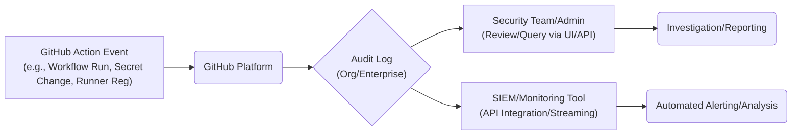
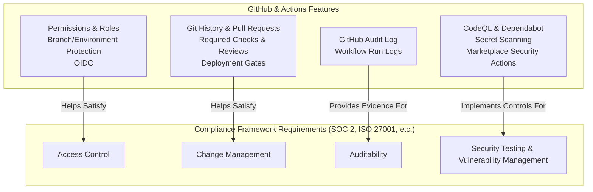

# Chapter 15: Compliance and Auditing

As organizations increasingly rely on automated workflows for building, testing, and deploying software, ensuring these processes meet internal governance policies and external regulatory requirements becomes paramount. GitHub Actions, being central to the development lifecycle, is a critical area for compliance scrutiny and auditing. Neglecting this aspect can lead to security vulnerabilities, operational disruptions, and significant penalties for non-compliance.

This chapter delves into the essential aspects of compliance and auditing within the GitHub Actions ecosystem. We will explore how to leverage GitHub's built-in audit logging capabilities to monitor critical activities, understand how Actions features align with common compliance frameworks, and discuss crucial considerations for data handling and residency. By understanding these elements, you can configure and operate your workflows in a way that is both efficient and demonstrably compliant.

## A. Audit Logs for GitHub Actions

GitHub provides comprehensive audit logs at the Organization and Enterprise levels, offering administrators visibility into actions performed across their repositories and settings. These logs are an indispensable tool for security monitoring, incident investigation, and compliance reporting related to GitHub Actions usage.

### 1. Accessing Audit Logs (Organization/Enterprise Level)

Audit logs capture a chronological record of events triggered by activities within your GitHub organization or enterprise. Accessing these logs requires appropriate permissions (typically organization owner or a custom role with audit log permissions).

- **Organization Level:** Navigate to your organization's main page, click `Settings`, then `Audit log` in the left-hand sidebar under the "Archives" section.
- **Enterprise Level (GitHub Enterprise Cloud):** If you manage an enterprise account, navigate to the enterprise settings, and you will find a similar `Audit log` section that aggregates logs from all organizations within the enterprise.
- **API Access:** For more advanced use cases, such as integration with Security Information and Event Management (SIEM) systems or custom reporting tools, the audit log can be accessed programmatically via the GitHub REST API (`/orgs/{org}/audit-log` or `/enterprises/{enterprise}/audit-log` endpoints) or streamed in near real-time (Enterprise feature).

The web interface allows filtering by date range, user, repository, and specific action types. Logs can also be exported in CSV or JSON format for offline analysis or archival.

### 2. Key Events to Monitor (Workflow Runs, Secret Changes, Runner Registration)

While the audit log captures a wide array of events, certain actions related to GitHub Actions warrant particular attention from a security and compliance perspective:

- **Workflow Runs:**
  - `workflow_dispatch`: Manual triggering of a workflow. Monitor for unexpected triggers.
  - `workflow_run`: Records the start and completion of workflow runs, including success/failure status. Useful for tracking deployment activities and identifying failed jobs.
  - `check_run`: Events related to individual jobs within a workflow.
- **Secret Management:**
  - `org.secret_scanning_alert_.*`: Events related to detected secrets exposed in repositories.
  - `repo.add_secret`, `repo.update_secret`, `repo.remove_secret`: Creation, modification, or deletion of repository-level secrets. Critical for tracking access to sensitive credentials.
  - `org.add_secret`, `org.update_secret`, `org.remove_secret`: Similar events for organization-level secrets.
  - `environment.add_secret`, `environment.update_secret`, `environment.remove_secret`: Changes to environment-specific secrets.
- **Runner Management:**
  - `runner_group.create`, `runner_group.update`, `runner_group.delete`: Changes to self-hosted runner groups.
  - `self_hosted_runner.register`, `self_hosted_runner.remove`: Addition or removal of self-hosted runners to/from the organization or repositories. Unauthorized runner registration is a significant security risk.
  - `org.update_actions_runner_registration_enabled_setting`: Changes to who can register runners.
- **Action Usage & Configuration:**
  - `repo.actions_enabled`, `org.update_actions_enabled_setting`: Enabling/disabling Actions at the repository or organization level.
  - `repo.actions_set_allowed_actions`, `org.update_allowed_actions_setting`: Changes to policies controlling which actions (e.g., only local, verified creator, specific list) are allowed to run.
  - `environment.create`, `environment.update`, `environment.delete`: Changes to deployment environments and their protection rules.

Monitoring these events helps detect suspicious activity, enforce policies, and provide evidence for compliance audits.



**Diagram:** This diagram illustrates the flow of information from a GitHub Actions event through the platform to the Audit Log, which can then be accessed manually by administrators or integrated with external monitoring systems for analysis and alerting.

#### [Practical Example: Querying audit logs for specific Actions-related events]

Imagine you need to investigate who modified secrets in a specific repository (`my-org/critical-app`) within the last 30 days.

**Using the GitHub UI:**

1.  Navigate to your Organization's `Settings` > `Audit log`.
2.  Use the date picker to select the last 30 days.
3.  In the search/filter bar, enter the following query:
    ```
    action:repo.update_secret repo:my-org/critical-app
    ```
    - You could also search for `action:repo.add_secret` and `action:repo.remove_secret`.
    - To broaden the search to include organization and environment secrets potentially affecting this repo, you might search for `secret` and filter visually or use more complex queries if exporting.

**Conceptual API Query (using `gh` CLI or direct API call):**

While the exact command depends on your tooling, the concept involves querying the audit log endpoint with parameters. Using the `gh api` command might look something like this (simplified):

```bash
# Note: This requires appropriate scope ('read:org') and might need pagination handling.
# The 'phrase' parameter uses Lucene query syntax.
gh api "/orgs/my-org/audit-log?phrase=action:repo.update_secret+repo:my-org/critical-app+created:>=$(date -v-30d +%Y-%m-%d)"
```

This query would return JSON data containing log entries matching the criteria, including the actor (who performed the action), the timestamp, and details about the event. Regularly reviewing or automating alerts based on such queries is crucial for maintaining secure and compliant workflows.

## B. Compliance Frameworks and Actions (SOC 2, ISO 27001, etc.)

Many organizations operate under specific compliance frameworks, such as SOC 2 (System and Organization Controls 2), ISO 27001 (Information Security Management), HIPAA (Health Insurance Portability and Accountability Act), or PCI DSS (Payment Card Industry Data Security Standard). These frameworks mandate various controls related to security, availability, processing integrity, confidentiality, privacy, change management, and auditing.

GitHub Actions, as a core part of the software development and delivery process, intersects with many requirements of these frameworks. Understanding how Actions features can support your compliance posture is essential.

### 1. How GitHub Actions Features Support Compliance Requirements

GitHub and GitHub Actions provide numerous features that can be leveraged to meet common compliance controls:

#### a. Access Control (Permissions, Roles)

- **Principle:** Ensure only authorized personnel can access or modify workflows, secrets, runners, and deployment environments.
- **GitHub Features:**
  - **Repository Permissions:** Standard GitHub roles (Read, Triage, Write, Maintain, Admin) control access to repository code and settings, including the `.github/workflows` directory.
  - **Organization Roles:** Define roles with specific privileges, including managing organization secrets or self-hosted runners.
  - **Branch Protection Rules:** Prevent direct pushes to critical branches (e.g., `main`, `release`), requiring Pull Requests and potentially reviews.
  - **CODEOWNERS:** Automatically request reviews from specific teams or individuals when workflow files are modified.
  - **Environment Protection Rules:** Restrict which branches can deploy to specific environments (e.g., production), require approvals from designated users/teams, or enforce wait timers.
  - **Actions Permissions Settings:** Control which actions (local, verified, specific list) can be used within the organization or repository.
  - **OpenID Connect (OIDC):** Allows workflows to authenticate securely with cloud providers (AWS, Azure, GCP) without storing long-lived credentials as GitHub secrets.

#### b. Change Management (Git History, PRs, Approvals)

- **Principle:** Ensure all changes to production systems (including deployment workflows) are documented, reviewed, tested, and approved.
- **GitHub Features:**
  - **Git History:** Every change to a workflow file (`.github/workflows/*.yml`) is tracked in the Git commit history, providing a clear record of who changed what and when.
  - **Pull Requests (PRs):** The standard mechanism for proposing changes. PRs facilitate code review, discussion, and automated checks before merging changes into main branches.
  - **Required Status Checks:** Enforce that specific workflow checks (e.g., linting, testing, security scans) must pass before a PR can be merged.
  - **Required Reviews:** Mandate that one or more authorized individuals must approve a PR before merging.
  - **Deployment Protection Rules:** As mentioned in Access Control, these rules act as gates before deployment, often requiring manual approval, ensuring a final check before impacting production environments.

#### c. Audit Trails

- **Principle:** Maintain logs of system activity to enable monitoring, investigation, and compliance reporting.
- **GitHub Features:**
  - **GitHub Audit Log:** As detailed in Section A, provides a comprehensive log of administrative actions, including changes to Actions settings, secrets, runners, and workflow triggers.
  - **Workflow Run History:** Each workflow run generates detailed logs accessible through the Actions tab in the repository. These logs show the steps executed, commands run, outputs, and success/failure status, providing an audit trail for specific automation processes. Logs are retained for a configurable period (default 90 days, adjustable for private repos/orgs).

#### d. Security Scanning

- **Principle:** Identify and remediate security vulnerabilities in code and dependencies.
- **GitHub Features:**
  - **Dependabot:** Automatically detects vulnerable dependencies in `package.json`, `pom.xml`, `requirements.txt`, etc., and can automatically create PRs to update them. Can be integrated into workflows.
  - **CodeQL:** GitHub's semantic code analysis engine for finding security vulnerabilities (SQL injection, XSS, etc.) directly in the codebase. Can be run as an Action within workflows.
  - **Secret Scanning:** Automatically detects accidentally committed secrets (API keys, tokens) in repositories and alerts administrators/users.
  - **Marketplace Actions:** Numerous third-party security tools (SAST, DAST, container scanning, dependency checking) are available as Actions that can be easily integrated into CI/CD pipelines.



**Diagram:** This diagram visually maps key GitHub and GitHub Actions features to common high-level requirements found in compliance frameworks like SOC 2 and ISO 27001, demonstrating how the platform can be used to build compliant processes.

#### [Production Note: Documenting Actions usage for compliance audits]

> When preparing for a compliance audit (e.g., SOC 2, ISO 27001), simply _using_ these features is often not enough. Auditors will require documentation and evidence demonstrating _how_ these features are configured and used to meet specific control objectives.
>
> Be prepared to:
>
> - **Document Policies:** Clearly define your organization's policies regarding workflow development, secret management, allowed actions, required reviews, and deployment procedures.
> - **Show Configuration:** Provide screenshots or exports of branch protection rules, environment protection rules, Actions permission settings, organization roles, and secret configurations.
> - **Provide Evidence:** Use audit logs and workflow run history to demonstrate adherence to policies (e.g., show that all production deployments followed the required approval process, demonstrate regular security scans).
> - **Explain Processes:** Be ready to walk auditors through your typical development and deployment lifecycle, highlighting the controls implemented at each stage using GitHub Actions.
>
> Maintaining clear documentation that maps your GitHub Actions usage to specific compliance controls significantly streamlines the audit process.

## C. Data Residency and Handling Considerations

Compliance often involves strict rules about where data is processed and stored (data residency) and how sensitive information is handled. When using GitHub Actions, especially with GitHub-hosted runners, understanding the flow of data is critical.

### 1. GitHub-Hosted Runner Locations

GitHub provides virtual machines (runners) hosted in Microsoft Azure data centers. As of this writing, standard GitHub-hosted runners are primarily located in:

- **United States**
- **Europe**

Larger runners (available on paid plans) might offer additional location options. You can typically select the operating system (Ubuntu Linux, Windows, macOS), but fine-grained control over the _exact_ geographic location or network environment is limited with standard GitHub-hosted runners.

**Implication:** If your compliance regime (like GDPR or specific national data sovereignty laws) mandates that data processing must occur within a specific geographic region, standard GitHub-hosted runners might not be suitable for all workloads. In such cases, **self-hosted runners** deployed within your own infrastructure (on-premises or in a specific cloud region) provide the necessary control over data location.

### 2. Data Flow in Workflows

Understanding where your data goes during a workflow run is essential:

1.  **Code Checkout:** The workflow runner (GitHub-hosted or self-hosted) checks out your repository code onto the runner's file system.
2.  **Action Execution:** Actions (scripts, Docker containers, JavaScript) run on the runner, potentially processing the checked-out code, environment variables, and secrets.
3.  **Data Processing:** Build tools compile code, tests run against data, linters analyze source files, etc. This processing happens _on the runner_.
4.  **External Communication:** Workflows often interact with external services (package registries like npm or PyPI, cloud providers like AWS/Azure/GCP, testing services, notification systems). Data is transmitted over the network to these services.
5.  **Artifacts:** Workflows can generate build artifacts (binaries, container images, reports) which are typically uploaded to GitHub Actions storage (associated with the workflow run) for later download or deployment. Artifact storage is generally within the same region as the Actions service infrastructure.
6.  **Caches:** Workflows can cache dependencies or intermediate build outputs to speed up subsequent runs. This cache is stored by GitHub Actions.
7.  **Logs:** Output from workflow steps is streamed back to GitHub and stored as part of the workflow run history.

Data primarily resides temporarily on the runner during execution and may be stored more permanently in GitHub (artifacts, caches, logs) or transmitted to external systems.

### 3. Considerations for Sensitive Data Processing

Workflows often need access to sensitive data, such as API keys, database credentials, private keys, or even PII (Personally Identifiable Information) during testing or deployment. Handling this data requires extreme care:

- **Use Secrets:** Always store sensitive credentials, tokens, and keys in GitHub Secrets (repository, organization, or environment level). Never hardcode them directly in workflow files. Secrets are encrypted and automatically masked in logs (though care must still be taken not to inadvertently print them).
- **Minimize Scope:** Grant secrets only to the environments and workflows that absolutely need them. Use environment-specific secrets where possible.
- **Avoid Logging Sensitive Data:** Ensure your scripts and tools within workflows do not print secrets or sensitive data to standard output or error streams, as this could expose them in the workflow logs despite masking attempts. Use techniques like `add-mask` command within workflows if necessary, but prevention is better.
- **Limit Data Exposure:** Only check out or process the minimum data necessary for the workflow's task. If dealing with PII or highly sensitive data regulated by frameworks like HIPAA or GDPR, carefully evaluate if processing within a standard GitHub Actions workflow is appropriate.
- **Self-Hosted Runners for Control:** For maximum control over the execution environment, network access, and data locality (especially for sensitive data processing or strict data residency requirements), use self-hosted runners deployed within your secure, compliant infrastructure. This allows you to apply your organization's specific security controls, network policies, and monitoring to the runner environment.
- **Review Third-Party Actions:** Be cautious when using third-party actions from the Marketplace, especially if they handle sensitive data. Review their source code (if available) and permissions to understand how they process data. Prefer actions from verified creators or those you trust implicitly. Consider vendoring or pinning actions to specific commit SHAs for stability and security (covered further in Chapter 13 and 14).

#### [Note: Further author detail needed based on specific compliance regimes]

> The specific requirements for data handling vary significantly depending on the applicable compliance framework (e.g., GDPR's rules on processing EU citizen data, HIPAA's requirements for Protected Health Information (PHI), PCI DSS's strict controls around cardholder data).
>
> When designing workflows that might touch regulated data, consult your organization's compliance experts and legal counsel. They can provide guidance on:
>
> - Whether processing the data within GitHub Actions (hosted or self-hosted) is permissible.
> - Specific technical controls required (e.g., encryption standards, network segmentation for self-hosted runners).
> - Data retention and deletion policies for artifacts and logs containing potentially sensitive information.
> - Requirements for Data Processing Agreements (DPAs) with GitHub or other third parties involved.
>
> A thorough understanding of your specific compliance obligations is crucial before processing sensitive data within any automated workflow.

By diligently utilizing GitHub's audit logs, mapping Actions features to compliance controls, and carefully considering data handling and residency, you can build robust, secure, and compliant automation pipelines using GitHub Actions. The next chapters will delve deeper into securing these workflows and managing dependencies effectively.
