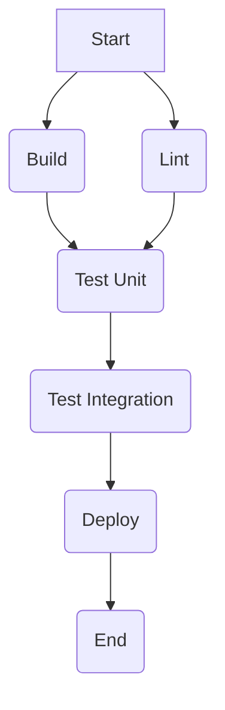

# Chapter 17: Optimizing Workflow Performance and Cost

As your reliance on GitHub Actions grows, so does the importance of ensuring your workflows run efficiently and cost-effectively. Long feedback cycles slow down development, and unchecked usage can lead to unexpected costs. Optimization isn't just about saving money; it's about improving developer productivity and delivering value faster.

This chapter delves into the critical aspects of optimizing your GitHub Actions workflows. We'll explore techniques for identifying performance bottlenecks, implementing effective caching strategies, speeding up builds and tests, making smart choices about runners, and managing the associated costs. By the end of this chapter, you'll have a comprehensive toolkit for making your automation leaner, faster, and more economical.

## A. Identifying Performance Bottlenecks

Before you can optimize, you need to understand where the inefficiencies lie. GitHub Actions provides tools and data to help pinpoint slow-running parts of your workflows.

### 1. Analyzing Workflow Run Durations (Timestamps in Logs)

The most straightforward way to identify slow workflows or jobs is by examining their execution times.

- **Workflow Run Summary:** Navigate to the "Actions" tab in your repository. Each workflow run displays its total duration. Look for workflows that consistently take longer than expected or longer than others.
- **Job Durations:** Click into a specific workflow run. The summary view on the left often shows a visualization of the jobs and their individual durations. This helps you quickly see which jobs contribute most to the total runtime.
- **Step Timestamps:** Within a job's log output, each step is timestamped. GitHub automatically calculates and displays the duration for each step upon its completion. By expanding the logs for a slow job, you can scroll through and identify steps that consume significant time. Look for lines like `##[section]Finishing: Run tests (1m 15s)`.

Pay attention not only to absolute durations but also to relative changes over time. A step that suddenly takes much longer might indicate a regression or an external dependency issue.

### 2. Understanding Job Parallelism

Workflows can consist of multiple jobs. By default, jobs defined at the top level of a workflow file run in parallel, limited only by the available runners and concurrency limits for your account/organization. However, you can define dependencies between jobs using the `needs` keyword, forcing them to run sequentially.



**Diagram Explanation:** This diagram illustrates a common workflow structure. The 'Build' and 'Lint' jobs can run in parallel after the workflow starts. The 'Test Unit' job depends on both 'Build' and 'Lint' completing successfully (`needs: [Build, Lint]`). Subsequent jobs ('Test Integration', 'Deploy') run sequentially. Understanding this flow helps identify if sequential dependencies are creating unnecessary waiting times. If 'Build' takes 5 minutes and 'Lint' takes 1 minute, 'Test Unit' can only start after 5 minutes, even though 'Lint' finished earlier.

Analyzing your workflow's dependency graph (`needs`) is crucial. Are there jobs running sequentially that _could_ run in parallel? Conversely, are too many jobs running in parallel overwhelming your runners or hitting concurrency limits, potentially slowing things down overall?

### 3. Identifying Slow Steps

Once you've identified a slow job using the methods above, drill down into its steps using the log timestamps. Common culprits for slow steps include:

- **Complex Build Processes:** Compiling large codebases, especially without caching.
- **Lengthy Test Suites:** Particularly integration or end-to-end tests.
- **Large Dependency Downloads:** Fetching many or large packages/libraries without caching.
- **Docker Image Builds:** Especially if not leveraging layer caching effectively.
- **Artifact Uploads/Downloads:** Transferring large files between jobs or for storage.
- **External Service Interactions:** Waiting for slow API responses or external processes.
- **Inefficient Scripts:** Custom scripts within `run` steps that perform poorly.

Focus your optimization efforts on the steps consuming the most time within the slowest jobs.

## B. Caching Strategies (`actions/cache` Deep Dive)

One of the most effective ways to speed up workflows is by caching dependencies and build outputs. Reusing files from previous runs avoids redundant downloads or computations. The primary tool for this in GitHub Actions is the `actions/cache` action.

The `actions/cache` action attempts to restore files (identified by a `key`) from a cache. If found, the files are restored to a specified `path`. After the subsequent steps run (e.g., installing dependencies, building), the action checks if the files at `path` have changed. If they have, or if no cache was found initially, it saves the files under the specified `key`.

```yaml
name: CI with Cache

on: [push]

jobs:
  build:
    runs-on: ubuntu-latest
    steps:
      - uses: actions/checkout@v4

      - name: Cache Node modules
        id: cache-node-modules # Give the step an ID to reference its output
        uses: actions/cache@v4
        with:
          path: ~/.npm # The directory to cache
          key: ${{ runner.os }}-npm-${{ hashFiles('**/package-lock.json') }}
          restore-keys: |
            ${{ runner.os }}-npm-

      - name: Install Dependencies
        # Only run install if cache was not restored
        if: steps.cache-node-modules.outputs.cache-hit != 'true'
        run: npm ci

      - name: Build Project
        run: npm run build --if-present

      # Other steps like testing...
```

### 1. Advanced Cache Key Design (Contexts, Hashes)

The effectiveness of `actions/cache` hinges entirely on the `key`.

- **`key` (Primary Key):** This is the unique identifier for the cache. A cache hit occurs only if a cache with this _exact_ key exists. If the steps following the cache restoration modify the contents of the `path`, a new cache entry with this key will be saved at the end of the job (overwriting any existing cache with the same key).
- **`restore-keys` (Optional Fallback):** These are prefixes or alternative keys used to find a cache if no exact match for the `key` is found. The action searches for keys matching these prefixes in the order provided and restores the most recently created match. This is useful for restoring a _partially_ relevant cache (e.g., from a previous commit on the same branch) when the primary key (e.g., based on a lock file) doesn't match exactly.

**Best Practices for Keys:**

1.  **Be Specific:** Include information that determines the validity of the cached content.

    - **Operating System:** `runner.os` is crucial if dependencies differ between OSs.
    - **Dependency Manifest Hash:** Use `hashFiles('**/package-lock.json')`, `hashFiles('**/pom.xml')`, `hashFiles('**/requirements.txt')`, etc. This ensures the cache is invalidated _only_ when dependencies actually change. Hashing multiple files (e.g., `hashFiles('**/pom.xml', '**/settings.xml')`) is supported.
    - **Tool Version (Optional but Recommended):** If feasible, include the version of the tool being used (e.g., Node.js, Java) if different versions might produce incompatible caches. `node-version: ${{ matrix.node-version }}`.
    - **Static Prefix:** Use a prefix like `npm-`, `maven-`, `pip-` to distinguish between different types of caches within the same workflow.

2.  **Use `restore-keys` Wisely:** Provide less specific fallback keys. A common pattern is:

    - `key: ${{ runner.os }}-npm-${{ hashFiles('**/package-lock.json') }}`
    - `restore-keys: |
    ${{ runner.os }}-npm-`
      This attempts an exact match first. If the `package-lock.json` changed but the OS is the same, it might restore the latest cache for that OS, potentially saving _some_ download time even if `npm ci` still needs to run to adjust for the changes.

3.  **Avoid Overly Broad Keys:** Keys that change too frequently (e.g., including `github.sha`) negate the benefit of caching. Keys that _never_ change (e.g., just `runner.os`) can lead to stale caches being used.

**Example: Maven Cache Key**

```yaml
- name: Cache Maven packages
  uses: actions/cache@v4
  with:
    path: ~/.m2/repository
    key: ${{ runner.os }}-maven-${{ hashFiles('**/pom.xml') }}
    restore-keys: |
      ${{ runner.os }}-maven-
```

### 2. Cross-OS Caching Considerations

Caching dependencies across different operating systems (`ubuntu-latest`, `windows-latest`, `macos-latest`) requires care:

- **Binary Incompatibility:** Compiled dependencies are often OS-specific. Caching `node_modules` containing native addons built on Linux won't work correctly on Windows.
- **Path Differences:** Tools might store caches in different locations or use different path separators.
- **Tool Availability:** Specific versions of tools might not be available or behave identically across all OSs.

**Strategies:**

1.  **Include `runner.os` in the Key:** This is the most common and recommended approach. It ensures each OS maintains its separate cache. (See examples above).
2.  **Conditional Caching:** Use job-level `if` conditions or step-level `if` conditions combined with `runner.os` context to define different caching steps or parameters for each OS if necessary.
3.  **Cache Portable Files Only:** If possible, cache only source files or configuration files that are OS-independent, although this is less common for dependency caching.

### 3. Cache Scopes (Branch, PR, Workflow)

GitHub Actions cache is scoped primarily by the `key` within a repository. However, its accessibility is influenced by the context of the workflow run:

- **Branch Scope (Default):** By default, a workflow run can typically only restore caches created within the same branch or the base branch (e.g., `main`). When a cache is saved on a feature branch (`feat/my-feature`), it's primarily available to subsequent runs on that _same_ branch. Runs on `main` won't typically restore a cache saved only on `feat/my-feature`.
- **Pull Request Scope:** Workflows triggered by `pull_request` events can access caches created on the base branch (e.g., `main`) and the head branch (the feature branch). This allows PR checks to benefit from caches generated during development on the feature branch or from recent runs on the base branch (often useful via `restore-keys`).
- **Cross-Workflow Scope:** Caches are generally accessible across different workflows _within the same repository_ as long as the `key` matches and branch scoping rules allow access. A cache saved by a `build.yml` workflow could potentially be restored by a `test.yml` workflow if the keys match and branch access permits.

**Important Note:** Caches created for a specific branch are typically _not_ available to other unrelated branches unless `restore-keys` are used effectively and a suitable cache exists on the base branch.

### 4. Managing Cache Size and Eviction

Understanding cache limits and eviction policies is crucial for maintaining effective caching.

- **Size Limits:**
  - Each individual cache entry has a maximum size limit (currently **10 GB**).
  - Each repository has a total cache size limit across all caches (defaults to **10 GB**, but configurable up to the organization's limit if applicable). Limits can be adjusted in repository or organization settings.
- **Eviction Policy:** When the total repository cache size limit is reached, GitHub removes caches based on a Least Recently Used (LRU) policy. Caches that haven't been accessed (restored or saved) for the longest time are evicted first. Caches also expire automatically after 7 days of inactivity.
- **Branch Deletion:** When a branch is deleted, caches associated specifically with that branch _may_ be removed, although caches accessible via `restore-keys` from other branches might persist.

#### [Troubleshooting Section: Diagnosing ineffective caching]

If your cache isn't providing the expected speedup, consider these common issues:

1.  **Cache Misses (No `cache-hit`):**
    - **Check Keys:** Ensure your `key` and `restore-keys` are defined correctly. Use unique but predictable keys. Add debug output to your workflow to print the exact keys being generated: `echo "Cache key: ${{ runner.os }}-npm-${{ hashFiles('**/package-lock.json') }}"`.
    - **File Changes:** The `hashFiles` output changed because the lock file was modified. This is expected behavior – a new cache _should_ be created.
    - **Scope Issues:** The cache was created on a different branch and isn't accessible (check branch/PR context).
    - **Eviction:** The cache was evicted due to size limits or inactivity (check repository cache usage in settings if possible).
    - **First Run:** The cache simply hasn't been created yet for this specific key.
2.  **Cache Hit, but No Speed Improvement:**

    - **Incorrect Path:** The `path` specified in `actions/cache` doesn't match where your tools actually store/expect the cached data (e.g., caching `~/.npm` but the tool uses `./node_modules`).
    - **Post-Cache Steps Still Run:** Ensure steps like `npm install` are skipped when the cache hits. Use the `outputs` of the cache step:

      ```yaml
      - name: Cache Node modules
        id: cache-node-modules
        uses: actions/cache@v4
        # ... other params

      - name: Install Dependencies
        # Only run if cache was not restored
        if: steps.cache-node-modules.outputs.cache-hit != 'true'
        run: npm ci
      ```

    - **Cache Contents Stale/Incorrect:** The cache was restored, but it contained outdated or incompatible files, causing subsequent steps to fail or redo work. Review your key strategy.

3.  **Cache Save Errors:**
    - **Size Limit Exceeded:** The directory being cached (`path`) exceeds the 10 GB individual cache limit. Exclude unnecessary files (log files, build outputs not needed for caching).
    - **Permissions Issues:** The runner might lack permissions to read files in the cache path.
    - **Concurrent Writes:** Multiple jobs trying to write to the _exact_ same cache key simultaneously (less common with good key design, but possible).

**Debugging Tip:** Enable runner diagnostic logging and step debug logging by setting the secrets `ACTIONS_RUNNER_DEBUG` and `ACTIONS_STEP_DEBUG` to `true` in your repository/organization settings. This provides verbose logs, including details from `actions/cache` about key evaluation and cache hits/misses.

#### [Deep Dive: Multi-level caching strategies]

Multi-level caching leverages both the primary `key` and `restore-keys` to maximize cache hits while ensuring correctness.

- **Level 1: Exact Match (Primary Key):** Use a highly specific key, often including a hash of manifest files (`key: ${{ runner.os }}-npm-${{ hashFiles('**/package-lock.json') }}`). This guarantees that if this key hits, the dependencies are exactly what's needed, and installation can often be skipped entirely.
- **Level 2: Partial Match (Restore Keys):** Use broader `restore-keys` as fallbacks.
  - `restore-keys: |
    ${{ runner.os }}-npm-`
    This key will restore the _most recent_ cache created on the same OS for npm, regardless of the `package-lock.json` hash.
  - **Benefit:** Even if the lock file changed slightly (e.g., updating one minor dependency), restoring the previous cache might mean `npm ci` only needs to download/update a small number of packages instead of everything from scratch.
  - **Trade-off:** You _must_ still run the installation step (e.g., `npm ci`) after a `restore-key` hit, as the restored cache isn't guaranteed to be an exact match. Do _not_ skip installation based on a `restore-key` hit alone.

This strategy balances getting the fastest possible result (exact key hit, skip install) with a good fallback (restore key hit, faster partial install) compared to no cache at all.

## C. Optimizing Build Times

Beyond dependency caching, several techniques can accelerate the build process itself.

### 1. Parallelizing Tasks within a Job (e.g., using `&` in `run` steps)

If a single job involves multiple independent, long-running tasks within a `run` step, you can execute them in parallel using shell background processes (`&`) and `wait`.

**Example: Running Linter and Unit Tests in Parallel**

```yaml
- name: Run Lint and Unit Tests Concurrently
  run: |
    npm run lint &
    npm run test:unit &
    wait # Wait for both background processes to finish
```

**Considerations:**

- **Independence:** Only parallelize tasks that don't depend on each other's immediate output or side effects.
- **Resource Contention:** Running too many CPU or I/O-bound tasks in parallel on a runner with limited resources might slow things down due to contention. Test the impact.
- **Log Output:** Output from parallel processes will be interleaved in the step log, potentially making it harder to read.
- **Error Handling:** The `wait` command will report a non-zero exit code if _any_ of the background jobs fail. Ensure your script handles errors appropriately.

This technique is best suited for a small number of clearly independent tasks within a single OS environment. For more complex parallelization, consider splitting tasks into separate _jobs_.

### 2. Optimizing Docker Builds (Layer Caching, Multi-stage Builds)

Building Docker images within workflows is common but can be slow if not optimized.

- **Leverage Docker Layer Caching:** Docker builds images in layers. If the files or commands associated with a layer haven't changed since the last build, Docker reuses the cached layer instead of re-executing the command.

  - **Order Matters:** Place commands that change infrequently (e.g., installing base OS packages) _before_ commands that change frequently (e.g., `COPY`ing application code).
  - **Minimize `COPY`/`ADD` Scope:** Only copy necessary files. Copying the entire repository (`COPY . .`) early invalidates the cache whenever _any_ file changes. Copy specific directories or files needed for subsequent steps first (e.g., `COPY package*.json ./`, `RUN npm ci`, then `COPY . .`).
  - **Combine `RUN` Commands:** Chain related `RUN` commands using `&&` to reduce the number of layers, although balance this with readability and caching effectiveness.

- **Use Multi-stage Builds:** Define multiple `FROM` instructions in your `Dockerfile`. Use earlier stages for building dependencies or compiling code, and a final, minimal stage to copy _only_ the necessary runtime artifacts from the build stages.
  - **Benefit:** Reduces the final image size significantly and separates build-time dependencies from runtime dependencies, improving security and potentially speeding up subsequent steps that use the image (e.g., deployment, testing).

**Example: Multi-stage Dockerfile for a Node.js App**

```dockerfile
# Stage 1: Build Stage
FROM node:18 AS builder
WORKDIR /app
# Copy only package files first for better caching
COPY package*.json ./
# Install dependencies (including devDependencies)
RUN npm ci
# Copy the rest of the application code
COPY . .
# Build the application (e.g., transpile TypeScript)
RUN npm run build

# Stage 2: Production Stage
FROM node:18-alpine
WORKDIR /app
# Copy only necessary package files
COPY package*.json ./
# Install ONLY production dependencies
RUN npm ci --omit=dev
# Copy built application from the builder stage
COPY --from=builder /app/dist ./dist
# Copy node_modules (already filtered for production)
COPY --from=builder /app/node_modules ./node_modules

EXPOSE 3000
CMD ["node", "dist/server.js"]
```

- **Use BuildKit:** Ensure Docker BuildKit is enabled (often the default now) as it offers improved performance, parallel build processing, and better cache management. You can explicitly enable it via environment variables (`DOCKER_BUILDKIT=1`) or runner configuration.
- **Docker Build Caching in Actions:** Use actions like `docker/build-push-action` which have built-in support for leveraging the GitHub Actions cache or a Docker registry for build cache persistence across workflow runs.

```yaml
- name: Set up Docker Buildx
  uses: docker/setup-buildx-action@v3

- name: Login to Docker Hub (Optional)
  uses: docker/login-action@v3
  with:
    username: ${{ secrets.DOCKERHUB_USERNAME }}
    password: ${{ secrets.DOCKERHUB_TOKEN }}

- name: Build and push with Cache
  uses: docker/build-push-action@v5
  with:
    context: .
    push: true # Set to false if only building
    tags: my-dockerhub-repo/my-app:latest
    cache-from: type=gha # Use GitHub Actions cache
    cache-to: type=gha,mode=max # Write to GitHub Actions cache
```

### 3. Reducing Dependency Download Times

Besides `actions/cache`, consider:

- **Package Manager Configuration:** Some package managers (like `pip`, `gradle`) might have configurations to use specific cache directories or settings that interact well with `actions/cache`.
- **Use Mirrors/Proxies:** If downloading from public repositories is slow from the runner's location, consider configuring your package managers to use regional mirrors or setting up an internal proxy/repository manager (like Nexus, Artifactory) closer to your runners (especially relevant for self-hosted runners).
- **Vendor Dependencies (Use with Caution):** Checking dependencies directly into your repository avoids download time but significantly increases repository size, makes updates harder, and can have licensing implications. Generally discouraged unless absolutely necessary for specific environments.

## D. Optimizing Testing Strategies

Tests, especially integration and end-to-end (E2E) suites, are often major contributors to workflow duration.

### 1. Running Tests in Parallel (Matrix, Test Splitting Tools)

Don't run your entire test suite sequentially in one job if it takes a long time.

- **Use `strategy.matrix`:** Define a matrix to create multiple jobs that run subsets of your tests in parallel. You can split by test type (unit, integration), target platform, or by sharding the tests.

**Example: Sharding Tests with a Matrix**

```yaml
name: Parallel Tests

on: [push]

jobs:
  test:
    runs-on: ubuntu-latest
    strategy:
      fail-fast: false # Allow all jobs to finish even if one fails
      matrix:
        # Create 4 parallel jobs (shards)
        shard: [1, 2, 3, 4]
    steps:
      - uses: actions/checkout@v4
      # Setup environment (Node, Java, Python, etc.)
      - name: Run tests for shard ${{ matrix.shard }}
        # Your test command needs to support sharding
        # Example: Using an environment variable or CLI flag
        run: npm run test -- --shard=${{ matrix.shard }}/${{ strategy.job-total }}
        # Or use a dedicated test splitter tool
```

- **Test Splitting Tools:** For more sophisticated balancing, use tools designed for test splitting:
  - **Knapsack Pro:** A popular commercial tool that dynamically allocates test files across parallel CI nodes based on historical timing data to ensure each job takes roughly the same amount of time.
  - **pytest-split (Python):** Plugin for `pytest` to split tests across nodes.
  - **test-split (Ruby):** Gem for splitting RSpec/Minitest suites.
  - Custom Scripting: You can write scripts to list all test files and divide them based on the matrix variables (`${{ strategy.job-index }}`, `${{ strategy.job-total }}`).

Parallelizing tests significantly reduces the wall-clock time for your test suite to complete.

### 2. Optimizing E2E Test Execution

End-to-end tests interact with a running application and external services, making them inherently slower and sometimes flakier.

- **Parallelize:** Apply the matrix/sharding techniques described above.
- **Minimize Setup/Teardown:** Optimize database seeding, service startup, and cleanup processes. Use containerized services (`services` keyword in job definition or Docker Compose) for faster startup compared to deploying to external environments.
- **Stub/Mock External Services:** Where possible, replace slow or unreliable external dependencies with mocks or stubs during E2E tests to isolate the application under test and speed up execution. Tools like WireMock or language-specific mocking libraries can help.
- **Optimize Test Logic:** Review E2E test code for inefficiencies. Avoid unnecessary waits (`sleep`), use efficient selectors for UI tests, and minimize redundant actions.
- **Run Locally (If Feasible):** For some E2E tests, running the application and its dependencies (e.g., database) as containers directly on the runner might be faster than deploying to a shared staging environment.
- **Selective Test Runs:** Use techniques like filtering tests based on changed code paths (requires sophisticated tooling) or tagging tests (e.g., `smoke`, `full`) and running only specific tags based on the context (e.g., run `smoke` on PRs, `full` nightly).

## E. Efficient Use of Runners

The choice and configuration of runners directly impact performance and cost.

### 1. Choosing the Right Runner Type (Hosted vs. Self-Hosted)

- **GitHub-Hosted Runners:**

  - **Pros:** Convenient (no setup/maintenance), variety of OSs (Linux, Windows, macOS), different sizes available (standard, larger runners), managed by GitHub.
  - **Cons:** Can be more expensive per minute (especially Windows/macOS/Large), limited customization, potential queue times during peak hours, network latency to your resources.
  - **Use When:** Convenience is key, standard environments suffice, need macOS/Windows easily, budget allows, security requirements met by GitHub's environment.

- **Self-Hosted Runners:**
  - **Pros:** Full control over hardware and software environment, potentially lower cost at scale (pay for underlying infrastructure), faster network access to internal resources, enhanced security possibilities (run within your VPC).
  - **Cons:** Requires setup, maintenance, scaling, and security management; need to ensure availability and adequate resources.
  - **Use When:** Need custom hardware/software, strict security/network requirements, high volume of minutes makes it cost-effective, have resources to manage infrastructure.

**Hybrid Approach:** Many organizations use a mix: GitHub-hosted for standard PR checks and Linux builds, and self-hosted for specialized tasks, sensitive deployments, or macOS/Windows builds if cost is a major concern.

### 2. Optimizing Matrix Builds (Avoiding Unnecessary Combinations)

Matrices are powerful but can explode the number of jobs run. If not all combinations in a matrix are necessary or valid, prune them.

- **`matrix.exclude`:** Explicitly define combinations of matrix variables that should _not_ generate a job.

**Example: Excluding Node 14 on Windows**

```yaml
name: Optimized Matrix

on: [push]

jobs:
  test:
    runs-on: ${{ matrix.os }}
    strategy:
      matrix:
        os: [ubuntu-latest, windows-latest]
        node-version: [16, 18, 20]
        # Exclude the combination of windows-latest and node-version 16
        exclude:
          - os: windows-latest
            node-version: 16
    steps:
      - uses: actions/checkout@v4
      - name: Use Node.js ${{ matrix.node-version }}
        uses: actions/setup-node@v4
        with:
          node-version: ${{ matrix.node-version }}
      # ... run tests ...
```

- **`matrix.include`:** Define additional, specific combinations to add to the matrix, often used with more complex properties.
- **Conditional Job Execution (`if`):** Define a job-level `if` condition to skip the entire job based on matrix variables or other contexts.

```yaml
name: Conditional Job in Matrix

on: [push]

jobs:
  test-linux-only-feature:
    # Only run this job if the matrix OS is Linux
    if: matrix.os == 'ubuntu-latest'
    runs-on: ${{ matrix.os }}
    strategy:
      matrix:
        os: [ubuntu-latest, windows-latest]
        # other matrix vars...
    steps:
      # ... steps for the Linux-only feature ...
```

Carefully review your matrices to ensure you're only running the combinations essential for validating your changes.

### 3. Self-Hosted Runner Performance Tuning

If using self-hosted runners, their performance depends on the underlying infrastructure and configuration:

- **Resource Allocation:** Ensure runners have sufficient CPU, RAM, and fast disk I/O (SSD recommended) for the workloads they handle. Monitor resource utilization on the runner machines.
- **Runner Software Updates:** Keep the Actions runner software up-to-date to benefit from performance improvements and bug fixes.
- **Ephemeral Runners:** Configure runners to run only one job and then be replaced (often using container orchestration like Kubernetes with `actions-runner-controller` or custom VM scaling). This ensures a clean environment for every job, preventing issues from leftover state or filled disks, though it adds overhead for runner startup.
- **Network Proximity:** Place runners geographically and logically close to the resources they need to interact with (e.g., artifact repositories, deployment targets, databases).
- **Optimize Host OS:** Tune the underlying operating system for performance where applicable (e.g., filesystem tuning, network settings).
- **Scaling:** Implement auto-scaling for your self-hosted runners to match demand, ensuring jobs don't wait excessively for an available runner while also controlling infrastructure costs.

## F. Cost Management for GitHub Actions

GitHub Actions usage incurs costs based on compute minutes and storage, especially beyond the generous free tiers included with GitHub plans.

### 1. Understanding Billing (Minutes, Storage)

- **Compute Minutes:**

  - You are billed for the time (in minutes) that your jobs run on GitHub-hosted runners.
  - Billing is per-minute, rounded up to the nearest minute for each job.
  - **Cost Multipliers:** Different runner OSs have different costs per minute:
    - Linux: Base rate (1x)
    - Windows: Typically 2x Linux rate
    - macOS: Typically 10x Linux rate
    - Larger Runners (Linux/Windows): Have higher multipliers (e.g., 4-core = 2x, 8-core = 4x, 16-core = 8x, etc., relative to the base OS rate). Check current GitHub pricing for exact multipliers.
  - **Free Minutes:** GitHub Free, Pro, Team, and Enterprise Cloud plans include a certain number of free minutes per month for use on GitHub-hosted runners (amount varies by plan and OS type). Usage beyond these free minutes is billed.
  - **Self-Hosted Runners:** Running jobs on self-hosted runners does _not_ consume GitHub Actions minutes; you pay for the underlying infrastructure costs directly (e.g., your cloud provider bill or hardware costs).

- **Storage:**
  - **Artifacts:** Storing build artifacts (`upload-artifact`/`download-artifact`) consumes GitHub Storage.
  - **Packages:** Storing Docker images or other packages in GitHub Packages consumes GitHub Storage.
  - **Cache:** `actions/cache` usage also consumes storage. While GitHub aims to provide significant free cache storage (scoped per repository, often up to 10GB), excessive usage beyond repository/organization limits _could_ potentially incur costs depending on specific GitHub Enterprise Server policies or future GitHub.com changes, though typically eviction prevents direct billing for cache _storage_ itself on GitHub.com. The primary cost impact of cache is reducing _minutes_, not adding storage cost within normal limits.
  - **Free Storage:** Plans include free GitHub Storage allowances. Usage beyond this is billed.

### 2. Monitoring Usage and Setting Spending Limits

It's crucial to monitor your Actions usage to understand costs and prevent surprises.

- **View Usage:**

  - **Organization:** Go to Organization Settings -> Billing & Plans -> Actions / Storage for Actions and Packages.
  - **Repository:** Go to Repository Settings -> Actions -> General -> Runner Usage / Storage Usage (may require specific permissions).
  - This shows minutes used (broken down by OS) and storage consumed. Analyze which repositories or workflows are consuming the most resources.

- **Set Spending Limits:** To prevent runaway costs, configure spending limits for Actions and Packages.
  - This sets a maximum dollar amount you're willing to spend beyond the free allowances per billing cycle.
  - If the limit is reached, GitHub-hosted runners will stop running new jobs (unless you increase the limit) until the next billing cycle. Self-hosted runners are unaffected.

#### [Configuration Guide: Setting spending limits at repo/org level]

1.  **Organization Level (Recommended):**

    - Navigate to your organization's main page.
    - Click **Settings**.
    - In the left sidebar under "Access", click **Billing and plans**.
    - Scroll down to the "Actions" or "Packages" section.
    - Next to "Spending limit", click **Manage spending limit**.
    - Enter a maximum spending limit in USD (e.g., `100` for $100). Set to `0` to allow _only_ the free tier usage.
    - Click **Update limit**.

2.  **Repository Level (Overrides Organization Limit for that Repo):**
    - Navigate to the specific repository.
    - Click **Settings**.
    - In the left sidebar, click **Actions**, then **General**.
    - Under "Actions permissions" or a similar section related to runners/usage (UI may vary slightly), you might find options to manage runner groups or potentially limits if granular controls are enabled/available for your plan. _However, primary spending limits are typically managed at the organization or user account level._ The most direct way to control cost per repo is often by optimizing its workflows or assigning it to use self-hosted runners. You _can_ sometimes disable Actions entirely for a specific repository in its settings if needed.

> **Note:** Spending limits apply to the total cost incurred from _paid_ usage on GitHub-hosted runners and storage, _after_ free allowances are used.

### 3. Cost Impact of Runner Types (Hosted OS, Large Runners)

As noted in the billing section, the choice of runner OS has a significant cost impact:

- **Linux:** Cheapest option. Use whenever possible.
- **Windows:** 2x cost of Linux. Use only when Windows-specific builds or tests are required.
- **macOS:** 10x cost of Linux. Use only when macOS/iOS builds or tests are essential.
- **Large Runners:** Significantly higher multipliers. Use only for jobs that demonstrably benefit from the extra resources and where the speed improvement justifies the cost. A job that takes 10 minutes on a standard Linux runner (10 minutes billed at 1x) might take 3 minutes on an 8-core Linux runner (3 minutes billed at 4x = 12 minutes equivalent cost). Only use if the 7-minute time saving is critical.

**Strategy:** Always default to standard Linux runners unless a specific OS or more resources are strictly necessary for the job to function correctly or provide a critical, cost-justified speedup.

### 4. Cost Impact of Artifact Storage and Caching

- **Artifacts:** Uploading large or numerous artifacts consumes storage, which is billed beyond free tiers.
  - **Minimize Size:** Only upload necessary files. Compress artifacts before uploading.
  - **Set Retention:** Configure artifact retention periods (Repository/Org Settings -> Actions -> General -> Artifact and log retention). Shorter retention reduces long-term storage consumption. Default is often 90 days.
  - **Avoid Unnecessary Uploads:** Don't upload artifacts if they aren't needed by subsequent jobs or for download.
- **Caching:** While cache storage itself is generally free within generous limits (and excess is evicted), ineffective caching _indirectly_ increases costs by _not_ reducing compute minutes. Effective caching is primarily a minute-saving (cost-saving) strategy. Ensure your cache usage stays within repository/organization limits to avoid potential (though less common) direct storage costs or throttling.

### 5. Strategies for Reducing Billable Minutes

This combines many techniques discussed earlier, focusing explicitly on cost reduction:

1.  **Aggressive Caching:** Implement `actions/cache` for dependencies, build outputs, Docker layers, etc. This is often the single biggest cost saver.
2.  **Choose Cheapest Runner:** Use standard Linux runners whenever feasible. Avoid Windows/macOS/Large runners unless absolutely required.
3.  **Optimize Build/Test Times:** Faster builds and tests directly translate to fewer billable minutes. Apply techniques from sections C and D.
4.  **Parallelize Smartly:** Parallel jobs (using `matrix` or separate `jobs`) finish faster in wall-clock time but consume the _same_ total minutes (or slightly more due to overhead). Parallelize to improve feedback loops, but it doesn't inherently reduce _total_ minutes billed unless it enables more effective caching or resource use.
5.  **Skip Unnecessary Work:**
    - Use `if` conditions at the job or step level to skip execution when not needed (e.g., skip deployment steps on PRs from forks, skip specific tests if unrelated files changed).
    - Use `paths` or `paths-ignore` filters on `on: [push]` or `on: [pull_request]` triggers to prevent workflows from running at all if only irrelevant files (like documentation) were changed.
    ```yaml
    on:
      push:
        branches: [main]
        paths: # Only run if files in these directories change
          - "src/**"
          - "package.json"
          - ".github/workflows/ci.yml"
      pull_request:
        paths:
          - "src/**"
          - "package.json"
          - ".github/workflows/ci.yml"
    ```
6.  **Use Self-Hosted Runners Strategically:** Identify high-minute-consuming jobs (especially those requiring Windows/macOS) that could run on cheaper self-hosted infrastructure.
7.  **Reduce Artifact Usage:** Minimize artifact uploads/downloads and shorten retention periods.
8.  **Consolidate Steps:** While less impactful than caching, sometimes combining multiple small `run` steps into one can slightly reduce overhead.

#### [Practical Example: Analyzing workflow costs and implementing optimizations]

**Scenario:** A team notices their GitHub Actions bill increasing. Their primary workflow builds and tests a Node.js application on Linux, Windows, and macOS for every push to any branch.

**Analysis:**

1.  **Check Usage:** In Org Settings -> Billing, they see high minute consumption, particularly for macOS (due to the 10x multiplier) and Windows (2x multiplier). Storage costs are minimal.
2.  **Examine Workflows:** They review the main `ci.yml` workflow run durations. The macOS and Windows jobs take roughly as long as Linux but cost significantly more.
3.  **Identify Bottlenecks:** Log analysis shows dependency installation (`npm ci`) and E2E tests are the slowest steps in all OSs. Docker builds are also moderately slow.

**Optimizations Implemented:**

1.  **Caching:** Added `actions/cache` for `~/.npm` on each OS, using OS-specific keys (`${{ runner.os }}-npm-${{ hashFiles('**/package-lock.json') }}`).
2.  **Runner Choice:** Realized macOS tests were only strictly needed for releases, not every push. They modified the workflow trigger and added `if` conditions:
    - Changed `on: [push]` to `on: push: branches: [main]` and `on: [pull_request]`.
    - Added `if: github.ref == 'refs/heads/main' || github.event_name == 'pull_request'` to the Linux and Windows jobs.
    - Added `if: github.ref == 'refs/heads/main' && github.event_name == 'push'` to the macOS job (only run macOS tests when pushing directly to `main`).
3.  **Docker Optimization:** Implemented multi-stage builds for their Dockerfile and configured `docker/build-push-action` to use `cache-from: type=gha`.
4.  **Test Parallelization:** Split the E2E test suite into 2 shards using a matrix strategy within each OS job (where applicable).

**Result:**

- Dependency caching significantly reduced `npm ci` time on subsequent runs (estimated 50-80% reduction for that step).
- Running macOS jobs only on `main` drastically cut the most expensive minute consumption (potentially >90% reduction in macOS minutes).
- Docker build times improved due to layer caching and multi-stage builds.
- E2E tests finished faster due to parallelization, reducing job duration.
- Overall billable minutes decreased substantially, particularly the high-cost macOS minutes. The feedback loop for PRs (Linux/Windows) also improved.

#### [Production Note: Balancing performance, features, and cost]

Optimization is rarely about achieving the absolute minimum cost or maximum speed in isolation. It's a balancing act:

- **Developer Productivity:** Faster feedback loops (even if slightly more expensive due to parallelization or larger runners) can save developer time and accelerate feature delivery, which often outweighs marginal Actions costs.
- **Confidence:** Running comprehensive tests on multiple platforms might be expensive but necessary for product quality and release confidence. Skipping tests saves minutes but increases risk.
- **Complexity:** Highly optimized workflows can sometimes become complex and harder to maintain. Strive for clarity alongside efficiency.
- **Budget:** Real-world budget constraints often dictate the acceptable trade-offs between performance and cost.

Continuously monitor performance and cost, understand the value provided by each part of your workflow, and make informed decisions based on your project's specific needs and priorities.

## Conclusion

Optimizing GitHub Actions workflows is an ongoing process that yields significant benefits in speed, efficiency, and cost savings. By systematically identifying bottlenecks using workflow logs, implementing robust caching with `actions/cache`, streamlining build and test processes through parallelization and tool-specific optimizations, making informed choices about runner types, and actively managing costs through monitoring and strategic adjustments, you can ensure your automation serves your development process effectively. Remember that the goal is not just cost reduction but finding the right balance between performance, cost, and the confidence your workflows provide.
