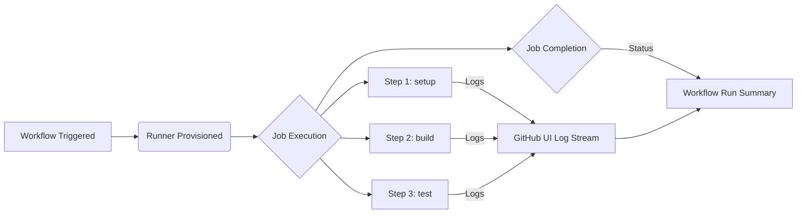
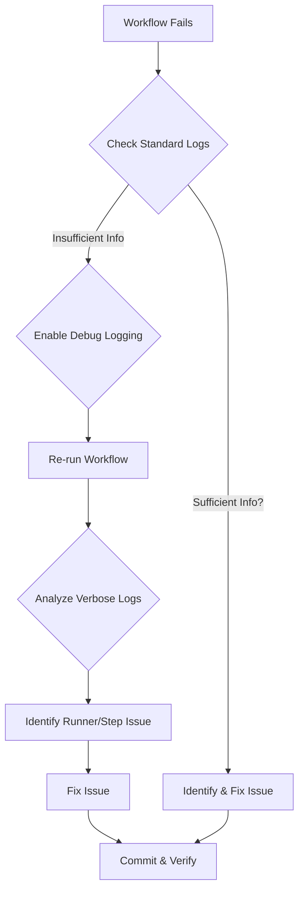

# Chapter 18: Monitoring, Logging, and Debugging Workflows

As workflows become more complex and integral to your development lifecycle, understanding how to monitor their execution, interpret their logs, and efficiently debug failures becomes crucial. Robust monitoring and debugging practices ensure reliability, optimize performance, and minimize downtime. This chapter delves into the tools and techniques provided by GitHub Actions and complementary strategies for keeping your automation pipelines healthy and transparent.

We will explore how to access and interpret logs directly within the GitHub UI, enable verbose debugging modes, implement advanced logging patterns, monitor workflow status programmatically, integrate with external monitoring systems, and apply systematic approaches to troubleshoot and resolve failures.

## A. Real-time Logging in the GitHub UI

The most immediate way to understand what's happening within a workflow run is through the real-time logs available directly in the GitHub web interface. As a workflow executes, output from each step is streamed to the run's log page.

### 1. Navigating Workflow Run Logs

When you navigate to the "Actions" tab in your repository, you'll see a list of workflow runs. Clicking on a specific run takes you to its summary page. From there, clicking on a job in the left-hand sidebar reveals the detailed log output for that job.

The log view is structured hierarchically:

- **Job:** The top level shows the overall job status and duration.
- **Steps:** Each step within the job is listed sequentially. You can expand or collapse individual steps to view their specific output. Common steps like "Set up job," "Complete job," and checkout steps are included automatically.
- **Commands/Output:** Within each expanded step, you'll see the commands executed and their corresponding standard output (`stdout`) and standard error (`stderr`).

### 2. Timestamps and Step Durations

Clarity on timing is essential for identifying bottlenecks or understanding event sequences. GitHub Actions automatically provides:

- **Timestamps:** Each log line is prefixed with a timestamp (usually in UTC), allowing you to correlate events precisely. You can toggle timestamps on or off using the gear icon in the top-right corner of the log view.
- **Step Durations:** The log view displays the time taken for each step to complete next to the step name. This helps pinpoint long-running operations that might warrant optimization (as discussed in Chapter 17). The total job duration is also clearly displayed.

### 3. Searching and Filtering Logs

For complex workflows generating substantial output, finding specific information can be challenging. The GitHub UI offers basic search capabilities:

- **Search Box:** Located at the top-right of the log view, this allows you to search for specific keywords or phrases within the entire log output for the selected job. Matches are highlighted.
- **Filtering (Implicit):** While there isn't explicit filtering by severity (like "show only errors"), you can use the search functionality combined with specific keywords (e.g., "error", "warning", "failed") or unique identifiers from your scripts to narrow down the output. Workflow annotations (covered later in section G) also provide a way to quickly jump to errors and warnings.



**Diagram Explanation:** This diagram illustrates the basic flow of log generation during a job's execution. Each step produces output, which is streamed in real-time to the GitHub UI for monitoring. The final status and logs are consolidated in the workflow run summary.

## B. Enabling Debug Logging

Sometimes, the standard log output isn't sufficient to diagnose a problem. GitHub Actions provides mechanisms to enable significantly more verbose logging, often revealing internal runner operations, action inputs/outputs, and environment details crucial for debugging.

### 1. Setting `ACTIONS_STEP_DEBUG` and `ACTIONS_RUNNER_DEBUG` Secrets/Variables

Two primary mechanisms trigger debug logging:

- **`ACTIONS_STEP_DEBUG`:** Setting this to `true` enables step-level debug messages. This includes detailed information about an action's inputs, outputs, and intermediate execution steps within the action's code itself (if the action implements debug logging). It's useful for debugging issues _within_ a specific action.
- **`ACTIONS_RUNNER_DEBUG`:** Setting this to `true` enables runner diagnostic logging. This provides verbose information about the runner's own operations: setting up the environment, downloading actions, executing steps, evaluating expressions, and cleaning up. This is invaluable for diagnosing issues related to the runner environment, permissions, or workflow syntax/expression evaluation.

You can enable these by setting them as **secrets** or **variables** in your repository or organization settings (**Settings > Secrets and variables > Actions**). Using secrets is common, even though the values (`true`) aren't sensitive, because it provides a centralized way to manage these flags.

**Crucially:** To enable debug logging for a _specific_ run without modifying repository settings, you can use the "**Re-run jobs**" dropdown on a failed or completed workflow run page and select "**Re-run jobs with debug logging**". This temporarily sets both `ACTIONS_STEP_DEBUG` and `ACTIONS_RUNNER_DEBUG` to `true` for that specific re-run attempt.

#### [Practical Example: Enabling debug logs for a problematic workflow run]

Imagine a workflow step is failing mysteriously. You suspect an environment issue or an incorrect input being passed to an action.

1.  Go to the failed workflow run page in the GitHub UI.
2.  Click the "**Re-run jobs**" dropdown button (usually "Re-run failed jobs" or "Re-run all jobs").
3.  Select the option "**Enable debug logging**".
4.  Click the button to start the re-run.

The workflow will now execute with verbose logging enabled. Examine the logs for the failed step; you should see significantly more detail about the runner's actions and the specific step's execution context.

### 2. Interpreting Verbose Debug Output

Debug logs are dense and require careful examination. Key things to look for include:

- **Runner Diagnostics (`##[debug]` prefixed lines from the runner):**
  - Environment variable setup.
  - Working directory changes.
  - Action download/setup details.
  - Expression evaluation results (`Evaluating: ...`, `Result: ...`).
  - Runner toolkit function calls (e.g., `exec`, `toolcache`).
  - Post-job cleanup actions.
- **Step Debugging (`##[debug]` prefixed lines from within an action):**
  - Values of inputs received by the action.
  - Intermediate variables or calculations within the action.
  - API calls made by the action.
  - Values of outputs being set.

#### [Troubleshooting Section: Using debug logs to pinpoint failures]

- **Problem:** An action fails with a cryptic error message.
  - **Debug Log Check:** Look for `##[debug]` lines immediately preceding the error. Check the action's inputs printed in the debug logs – are they what you expect? Is the action trying to access a file that doesn't exist or making an API call with incorrect credentials (check environment variable debug output)?
- **Problem:** A conditional step (`if: ...`) isn't running when expected (or running when not expected).
  - **Debug Log Check:** Search for `Evaluating: <your condition>` in the runner diagnostic logs. The subsequent `Result: <true/false>` line will tell you exactly how the runner interpreted your condition. This often reveals typos or misunderstandings in context availability.
- **Problem:** Authentication to a service (e.g., cloud provider, package registry) fails.
  - **Debug Log Check:** Examine the runner logs for environment variable setup related to authentication tokens or keys. Ensure they are being correctly sourced and are not empty or malformed. _Be cautious about sensitive values potentially appearing in debug logs if not properly masked._ GitHub attempts to mask secrets, but verbose debugging can sometimes expose related information.



**Diagram Explanation:** This flowchart outlines a systematic debugging process leveraging debug logs. When standard logs aren't enough, enabling debug logging provides deeper insights to pinpoint the root cause of runner or step-specific failures.

## C. Advanced Logging Techniques

Beyond the default output and debug modes, you can structure your logs for better readability and automated processing.

### 1. Structured Logging from Scripts/Actions

Instead of printing plain text messages, your custom scripts or actions can output logs in a structured format, typically JSON. This makes logs easier to parse, filter, and ingest into centralized logging systems.

**Example (Bash Script):**

```bash
#!/bin/bash

# Function to log structured JSON messages
log_json() {
  level="$1"
  message="$2"
  timestamp=$(date -u +"%Y-%m-%dT%H:%M:%SZ")
  # Add more context fields as needed (e.g., component, request_id)
  jq -nc \
    --arg level "$level" \
    --arg message "$message" \
    --arg timestamp "$timestamp" \
    '{level: $level, message: $message, timestamp: $timestamp}'
}

# Usage
echo "Starting the process..."
log_json "INFO" "Processing item A"
# ... some processing ...
if [[ $some_error_condition == true ]]; then
  log_json "ERROR" "Failed to process item A due to condition X"
  exit 1
fi
log_json "INFO" "Successfully processed item A"
echo "Process finished."

```

**Benefits:**

- **Machine Readable:** Easily parsed by log aggregation tools.
- **Consistent Format:** Enforces uniformity across different log messages.
- **Rich Context:** Can include arbitrary key-value pairs for detailed context.

### 2. Grouping Log Lines (`::group::`, `::endgroup::`)

For long-running scripts or steps that produce a lot of output, you can use special workflow commands to create collapsible groups in the GitHub Actions log viewer. This significantly improves readability by hiding verbose sections by default.

**Syntax:**

- `::group::<Group Title>`: Starts a collapsible group.
- `::endgroup::`: Ends the current group.

**Example (Workflow Step):**

```yaml
name: Build and Test

on: [push]

jobs:
  build:
    runs-on: ubuntu-latest
    steps:
      - uses: actions/checkout@v4

      - name: Run Build Script with Logging Groups
        run: |
          echo "::group::Installing Dependencies"
          echo "Running apt-get update..."
          # sudo apt-get update > /dev/null # Suppress verbose output if desired
          echo "Installing build tools..."
          # sudo apt-get install -y build-essential > /dev/null
          echo "Dependencies installed."
          echo "::endgroup::"

          echo "::group::Compiling Project"
          echo "Running make..."
          # make
          echo "Compilation complete."
          echo "::endgroup::"

          echo "::group::Running Tests"
          echo "Executing test suite..."
          # make test
          echo "Tests finished."
          echo "::endgroup::"

          echo "Build and test process finished."
```

In the GitHub UI logs, "Installing Dependencies," "Compiling Project," and "Running Tests" will appear as collapsible sections, making the overall log output much cleaner.

## D. Monitoring Workflow Status and History

Keeping an eye on the overall health and performance of your workflows is essential. GitHub provides several ways to monitor their status and review past executions.

### 1. Workflow Status Badges

A simple yet effective way to display the current status (usually of the default branch) of a workflow directly in your repository's `README.md` or any other Markdown/HTML page is by using status badges.

GitHub automatically provides a badge URL for each workflow. You can find the URL snippet by:

1.  Navigating to the "Actions" tab in your repository.
2.  Selecting the workflow you want a badge for from the left sidebar.
3.  Clicking the "..." menu in the top-right corner.
4.  Choosing "Create status badge".
5.  Copying the provided Markdown snippet.

**Example (Markdown):**

```markdown
# My Awesome Project

[](https://github.com/YOUR_USERNAME/YOUR_REPO/actions/workflows/ci.yml)

Welcome to my project...
```

This will render a badge showing whether the `ci.yml` workflow last ran successfully, failed, or is in progress on the default branch. Clicking the badge links directly to the workflow runs page.

### 2. GitHub UI for Workflow Runs History

The "Actions" tab in your repository is the central hub for viewing workflow history. It provides:

- A list of all workflow files detected in your repository.
- A filterable list of all workflow runs, showing their trigger event, commit, actor, status (success, failure, cancelled, in progress, queued), and duration.
- The ability to filter runs by workflow file, event type, status, branch, and actor.
- Links to detailed logs and artifacts for each run.

Regularly reviewing this history helps identify trends, recurring failures, or performance regressions.

### 3. Using the GitHub API to Monitor Workflows Programmatically

For automated monitoring, alerting, or integration with custom dashboards, you can use the GitHub REST API or the GraphQL API to query workflow run status and history. The `gh` CLI (GitHub's official command-line tool) provides a convenient wrapper around the API.

**API Endpoints (REST):**

- `GET /repos/{owner}/{repo}/actions/workflows/{workflow_id}/runs`: List runs for a specific workflow.
- `GET /repos/{owner}/{repo}/actions/runs/{run_id}`: Get details for a specific run.
- `GET /repos/{owner}/{repo}/commits/{ref}/check-runs`: List check runs (which include workflow jobs) for a specific commit SHA, branch, or tag.

#### [Code Snippet: Script to check the status of the latest workflow run on `main`]

This example uses the `gh` CLI to get the status of the most recent run of a specific workflow (`ci.yml`) on the `main` branch.

```bash
#!/bin/bash

REPO="YOUR_ORG/YOUR_REPO" # Replace with your repository
WORKFLOW_FILE="ci.yml"    # Replace with your workflow filename
BRANCH="main"

# Ensure gh is installed and authenticated
if ! command -v gh &> /dev/null; then
    echo "Error: gh CLI not found. Please install it: https://cli.github.com/"
    exit 1
fi

echo "Fetching latest workflow run status for '$WORKFLOW_FILE' on branch '$BRANCH' in repo '$REPO'..."

# Get the ID of the latest run for the specified workflow and branch
LATEST_RUN_ID=$(gh run list --repo "$REPO" --workflow "$WORKFLOW_FILE" --branch "$BRANCH" --limit 1 --json databaseId --jq '.[0].databaseId')

if [[ -z "$LATEST_RUN_ID" || "$LATEST_RUN_ID" == "null" ]]; then
    echo "No workflow runs found for '$WORKFLOW_FILE' on branch '$BRANCH'."
    exit 0
fi

echo "Latest run ID: $LATEST_RUN_ID"

# Get the status and conclusion of the latest run
# Status: queued, in_progress, completed
# Conclusion: success, failure, cancelled, skipped, neutral, timed_out, action_required
RUN_INFO=$(gh run view --repo "$REPO" "$LATEST_RUN_ID" --json status,conclusion,url --jq '.')
STATUS=$(echo "$RUN_INFO" | jq -r '.status')
CONCLUSION=$(echo "$RUN_INFO" | jq -r '.conclusion')
URL=$(echo "$RUN_INFO" | jq -r '.url')

echo "Status: $STATUS"
echo "Conclusion: $CONCLUSION"
echo "URL: $URL"

# Example: Exit with non-zero code if the last completed run failed
if [[ "$STATUS" == "completed" && "$CONCLUSION" != "success" && "$CONCLUSION" != "skipped" && "$CONCLUSION" != "neutral" ]]; then
    echo "Error: Latest completed workflow run did not succeed."
    # exit 1 # Uncomment to make the script fail in CI/automation
fi

exit 0
```

This script can be integrated into other automation, monitoring checks, or notification systems.

## E. Centralized Logging and Monitoring Integration

While the GitHub UI provides essential visibility, organizations often require centralized logging and monitoring solutions to aggregate data from various sources (including GitHub Actions) for unified analysis, alerting, and long-term storage.

### 1. Forwarding Logs to External Systems (Datadog, Splunk, ELK Stack)

Forwarding GitHub Actions logs to systems like Datadog, Splunk, Logz.io, or an ELK (Elasticsearch, Logstash, Kibana) stack allows for:

- **Correlation:** View Actions logs alongside application logs, infrastructure metrics, etc.
- **Advanced Search & Analysis:** Leverage the powerful query languages and visualization tools of these platforms.
- **Long-term Retention:** Store logs beyond GitHub's default retention period (90 days, configurable).
- **Unified Alerting:** Configure alerts based on patterns or errors found in Actions logs.

**Methods:**

- **GitHub-Hosted Runners:** Forwarding logs directly from GitHub-hosted runners is challenging as you don't control the underlying infrastructure. Approaches often involve:
  - Using actions specifically designed to ship logs at the end of a job (e.g., `upload-artifact` to collect logs, then a separate job/workflow to download and forward).
  - Having scripts within steps directly send logs via HTTP endpoints or agents provided by the logging platform (requires careful handling of credentials).
- **Self-Hosted Runners:** You have full control over the runner environment. This offers more robust options:
  - **Install Logging Agents:** Install the agent provided by your logging platform (e.g., Datadog Agent, Splunk Universal Forwarder, Filebeat) directly on the runner machine. Configure the agent to monitor the runner's diagnostic log directory (`_diag` within the runner's work directory) and potentially the specific job log directories (`_work/_logs`).
  - **Docker Sidecar Containers:** If running jobs within containers on self-hosted runners, use a sidecar container running a logging agent to collect logs from the main job container (e.g., via shared volumes or Docker log drivers).
  - **Custom Scripting:** Use scripts within your workflows to explicitly send logs to the external system's API.

#### [Deep Dive: Techniques for log forwarding from self-hosted runners]

Let's consider forwarding logs using Filebeat (part of the ELK stack) on a self-hosted runner machine:

1.  **Install Filebeat:** Install Filebeat on the server hosting the self-hosted runner.
2.  **Configure Filebeat Input:** Modify `filebeat.yml` to monitor the runner's log directories. The exact path depends on your runner installation location.

    ```yaml
    filebeat.inputs:
      - type: log
        enabled: true
        paths:
          # Adjust the path based on your runner installation directory
          - /path/to/actions-runner/_work/_logs/Job_*.log
        json.keys_under_root: true # If logs are structured JSON
        json.overwrite_keys: true
        # Add fields to identify the source
        fields:
          log_source: github_actions_job
        fields_under_root: true

      - type: log
        enabled: true
        paths:
          # Runner diagnostic logs
          - /path/to/actions-runner/_diag/Runner_*.log
          - /path/to/actions-runner/_diag/Worker_*.log
        multiline.pattern: "^[0-9]{4}-[0-9]{2}-[0-9]{2}T" # Example pattern for multiline logs
        multiline.negate: true
        multiline.match: after
        fields:
          log_source: github_actions_runner_diag
        fields_under_root: true
    ```

3.  **Configure Filebeat Output:** Configure Filebeat to send logs to your Logstash instance or directly to Elasticsearch.
    ```yaml
    output.logstash:
      hosts: ["your-logstash-host:5044"]
    # or
    # output.elasticsearch:
    #   hosts: ["your-elasticsearch-host:9200"]
    #   username: "elastic"
    #   password: "changeme"
    ```
4.  **Start Filebeat:** Run the Filebeat service.

Logs generated by jobs and the runner itself will now be collected and forwarded. Similar configurations apply to other agents like Datadog or Splunk agents.

#### [Note: Requires specific implementation details based on target system]

The exact configuration for log forwarding agents (paths, parsing rules, output destinations, authentication) varies significantly depending on the chosen logging platform and your specific infrastructure setup. Always consult the documentation of your logging provider and agent.

### 2. Monitoring Key Metrics (Run Durations, Success/Failure Rates, Queue Times)

Beyond logs, monitoring key performance indicators (KPIs) provides a higher-level view of workflow health and efficiency. Important metrics include:

- **Workflow/Job Durations:** Track average, p95, and maximum run times to identify performance regressions or bottlenecks.
- **Success/Failure Rates:** Monitor the percentage of successful versus failed runs per workflow, branch, or trigger type. Spikes in failure rates indicate problems.
- **Queue Times:** For self-hosted runners, track how long jobs wait in the queue before a runner becomes available. High queue times suggest a need for more runners. For GitHub-hosted runners, this is less directly controllable but can be inferred from the time between workflow trigger and job start.
- **Cost (GitHub-Hosted):** Monitor minutes consumed, especially on larger or specialized runners (Windows, macOS, GPU), to manage costs effectively (as discussed in Chapter 17).
- **Resource Utilization (Self-Hosted):** Monitor CPU, memory, disk I/O, and network usage on self-hosted runner machines to ensure they are adequately provisioned.

These metrics can often be gathered using the GitHub API (as shown in section D.3) and fed into monitoring platforms.

#### [Practical Example: Setting up a Datadog dashboard for Actions monitoring]

While a full implementation is platform-specific, here's a conceptual outline for creating a Datadog dashboard:

1.  **Data Ingestion:**
    - **Logs:** Configure the Datadog Agent on self-hosted runners (or use alternative methods for GitHub-hosted) to forward Actions logs with appropriate tags (e.g., `repo:my-repo`, `workflow:ci`, `job:build`).
    - **Metrics:** Create a custom script (using Python with `requests` or Bash with `gh` and `curl`) that periodically queries the GitHub API for workflow run data (status, duration, timestamps). Send this data to Datadog as custom metrics using DogStatsD or the Datadog API. Tag metrics appropriately (e.g., `workflow_name`, `branch`, `status`).
    - **Events:** Use the GitHub API script to send events to Datadog for significant occurrences like workflow failures or successful deployments.
2.  **Dashboard Widgets:**
    - **Timeseries (Run Durations):** Graph `github.actions.run.duration` (your custom metric) averaged or by percentile, faceted by workflow and branch.
    - **Timeseries (Queue Times):** Graph `github.actions.run.queue_time` (calculated from API timestamps: `job_started_at - job_created_at`), faceted by runner pool (if using self-hosted labels).
    - **Query Value (Success Rate):** Display the percentage of successful runs over a time window using a formula like `sum:github.actions.run.count{status:success} / sum:github.actions.run.count{*} * 100`, faceted by workflow.
    - **Log Stream:** Embed a live tail or filtered view of ingested Actions logs, perhaps filtered for `level:error`.
    - **Event Stream:** Show the stream of custom events sent for failures/deployments.
    - **Top List (Slowest Jobs):** List jobs with the highest average duration.
    - **Top List (Most Frequent Failures):** List workflows or jobs with the highest failure counts.
3.  **Monitors (Alerting):**
    - Create alerts for high failure rates (e.g., >10% failures in the last hour for `main` branch CI).
    - Alert on significant increases in average run duration (anomaly detection).
    - Alert on high queue times for self-hosted runners.
    - Alert on specific error patterns found in logs.

This centralized view provides actionable insights into the performance and reliability of your GitHub Actions workflows.

## F. Debugging Failed Workflows

Despite careful planning, workflows inevitably fail. A systematic approach to debugging is essential to resolve issues quickly.

### 1. Common Causes of Failures

Understanding common failure points helps narrow down the search:

- **Syntax Errors:** Typos or incorrect structure in the `.github/workflows/workflow.yml` file. The workflow parser usually catches these before the run starts, providing error messages on the Actions tab.
- **Script Errors:** Bugs within shell scripts (`run` steps) or custom code executed by the workflow (e.g., non-zero exit codes, unhandled exceptions).
- **Permissions Issues:**
  - `GITHUB_TOKEN` lacking necessary permissions for API calls or package registry access.
  - Incorrect credentials (secrets) for external services (cloud providers, artifact repositories).
  - Filesystem permission errors on the runner, especially with Docker or complex file manipulations.
- **Runner Issues:**
  - **GitHub-Hosted:** Temporary service unavailability, resource limits (memory, disk space) exceeded.
  - **Self-Hosted:** Runner offline, misconfiguration, missing dependencies, insufficient resources (CPU, RAM, disk), network connectivity problems.
- **Action Errors:** Bugs within a third-party or custom action being used.
- **Dependency Failures:** Network issues fetching dependencies, package registry outages, incompatible dependency versions.
- **Environment Mismatches:** Code works locally but fails in the runner environment due to differences in OS, installed tools, or environment variables.
- **Race Conditions/Timing Issues:** Especially in complex workflows with parallel jobs or external interactions.

### 2. Systematic Debugging Approach

Follow these steps when a workflow fails:

1.  **Check the Summary:** Look at the workflow run summary page in the GitHub UI. Which job failed? Which step within that job failed?
2.  **Examine Standard Logs:** Review the logs for the failed step. Look for explicit error messages, non-zero exit codes, or stack traces. Check logs from preceding steps for warnings or unexpected output.
3.  **Analyze the Error Message:** Read the error carefully. Does it indicate a specific command that failed, a file not found, a permission denied, or an API error? Search online for the specific error message if it's unclear.
4.  **Isolate the Problem:**
    - Can you reproduce the error consistently?
    - If multiple jobs failed, is there a common theme?
    - Temporarily simplify the workflow (e.g., comment out steps) to pinpoint the exact failing component.
5.  **Enable Debug Logging:** If standard logs are insufficient, re-run the failed job(s) with debug logging enabled (as described in Section B). Analyze the verbose output for clues about runner operations, environment variables, action inputs/outputs, and condition evaluations.
6.  **Check Inputs/Environment:** Verify that the inputs passed to the failing step/action are correct. Check that required secrets and environment variables are available and have the expected values (use debug logs cautiously here).
7.  **Review Recent Changes:** Did the failure start after a recent change to the workflow file, the codebase, a dependency, or a custom action? Use `git blame` or commit history.
8.  **Consult Action Documentation:** If using a third-party action, check its README or documentation for known issues, required inputs, or troubleshooting tips.
9.  **Test Locally (If Applicable):** Can parts of the failing script or process be tested locally? Tools like `act` (see below) can help, but be aware of environment differences. For script errors, try running the commands directly in a similar environment (e.g., a local Docker container based on the runner image).
10. **Fix and Verify:** Apply a fix based on your findings, commit the change, and observe the next workflow run.

### 3. Re-running Failed Jobs/Workflows

GitHub Actions allows you to easily re-run workflows or specific jobs:

- **Re-run All Jobs:** On the workflow run page, use the "Re-run jobs" dropdown and select "Re-run all jobs". This starts a completely new run with the same trigger event and commit SHA.
- **Re-run Failed Jobs:** A common option is to only re-run the jobs that failed in a previous run. This saves time and resources if other jobs completed successfully and produced necessary artifacts. Select "Re-run failed jobs" from the dropdown.
- **Re-run with Debug Logging:** As mentioned earlier, you can trigger a re-run (all or failed jobs) with debug logging enabled directly from the UI.

Re-running is crucial for verifying fixes or for retrying runs that failed due to transient issues (e.g., temporary network glitches, brief service outages).

### 4. Debugging Locally with Tools like `act` (Limitations Apply)

Tools like `act` ([https://github.com/nektos/act](https://github.com/nektos/act)) attempt to simulate the GitHub Actions runner environment locally using Docker. This allows you to run your workflows on your machine before pushing changes.

**How it works:** `act` reads your `.github/workflows/*.yml` files, determines the required runner image (e.g., `ubuntu-latest`), pulls or builds a corresponding Docker image, and executes the jobs within containers.

**Benefits:**

- Faster feedback loop for syntax errors and basic script logic.
- Test workflow structure without consuming GitHub Actions minutes.
- Can potentially debug script execution issues.

**Limitations (Crucial to Understand):**

- **Environment Differences:** `act` aims to replicate the environment but cannot perfectly match the GitHub-hosted runner infrastructure (networking, installed software nuances, hardware). Failures related to specific runner environment details might not reproduce locally, and workflows passing locally might still fail on GitHub.
- **Secrets:** `act` requires you to provide secrets manually (e.g., via command-line flags or an environment file). It does _not_ have access to your repository's configured secrets.
- **`GITHUB_TOKEN`:** The token provided by `act` has very limited permissions compared to the real one provided by GitHub Actions. API calls relying on specific token permissions will likely fail.
- **Contexts:** Some context information (e.g., `github.event` details) might differ or be unavailable.
- **Service Containers:** Support for service containers can be limited or require manual configuration.
- **Hosted Runner Features:** Features specific to GitHub's infrastructure (e.g., certain network configurations, caching mechanisms beyond `actions/cache`) won't be present.

**Usage:**
Install `act` and run it from the root of your repository:

```bash
# Run all jobs from the default event (push)
act

# Run a specific job
act -j <job_id>

# Run for a specific event
act pull_request

# Provide secrets
act -s MY_SECRET=myvalue
```

Use `act` as a _first-pass validation tool_, particularly for workflow syntax and basic script logic, but always rely on actual runs within GitHub Actions as the definitive test.

#### [Troubleshooting Section: Common error messages and their meanings]

- **`Error: Process completed with exit code 1` (or other non-zero code):** A command in a `run` step failed. Check the lines immediately above this error in the log for the specific command and its output/error message.
- **`Error: Permission denied`:** The runner process lacks the necessary permissions to access a file, execute a script, or perform an operation. Check file permissions (`ls -l`), script execution bits (`chmod +x`), or `GITHUB_TOKEN` permissions. Could also be Docker-related permissions on self-hosted runners.
- **`Error: Input required and not supplied: <input_name>`:** An action requires a specific input (`with: ...`) that was not provided in the workflow file.
- **`Error: Unable to locate executable file: <tool_name>`:** A command or tool expected by a script or action is not installed or not found in the system's `PATH` within the runner environment. Ensure dependencies are installed correctly.
- **`Error: HttpError: Not Found` / `HttpError: Bad credentials` (from API calls):** Often related to the `GITHUB_TOKEN` lacking permissions or an invalid/missing secret for authenticating to an external API. Check token scopes and secret values.
- **`Error: The runner has received a shutdown signal. This can happen when the runner service is stopped or the requested operation is canceled.`:** Could be a manual cancellation, the runner service being stopped (self-hosted), or potentially the job hitting resource limits (though specific limit errors are more common).
- **`Error: No space left on device`:** The runner (GitHub-hosted or self-hosted) ran out of disk space. Clean up artifacts, large files, or Docker images/layers within the job, or increase disk space on self-hosted runners.
- **YAML Syntax Errors:** Usually caught before the run starts, with messages like `Invalid workflow file syntax` pointing to the specific line and issue in the `.github/workflows/your_workflow.yml` file.

## G. Workflow Annotations for Errors and Warnings

Beyond standard log output, you can use special workflow commands to create annotations directly linked to specific files and lines of code within your repository. These annotations appear prominently on the workflow run summary page and in the "Checks" tab of pull requests, making issues highly visible.

### 1. Using `::error::` and `::warning::` workflow commands

Scripts executed within `run` steps can emit specially formatted lines to standard output, which the runner interprets as commands to create annotations.

**Syntax:**

```
::error file=<filename>,line=<line number>,col=<column number>,endLine=<end line number>,endColumn=<end column number>,title=<Error Title>::<Error message>
::warning file=<filename>,line=<line number>,col=<column number>,endLine=<end line number>,endColumn=<end column number>,title=<Warning Title>::<Warning message>
::notice file=<filename>,line=<line number>,col=<column number>,endLine=<end line number>,endColumn=<end column number>,title=<Notice Title>::<Notice message>
```

- `file=`, `line=`, `col=` are required for `error` and `warning` to link the annotation to a specific source code location. `endLine=` and `endColumn=` define a range. `title=` provides an optional title for the annotation.
- If `file`, `line`, etc., are omitted, the annotation appears as a general job annotation rather than being linked to code.
- The message content follows the `::` marker.

**Example (Workflow Step):**

```yaml
- name: Check for TODOs as errors
  run: |
    echo "Checking for TODO comments in source files..."
    # Use grep to find lines with TODO, then format as error annotations
    # Note: This is a simplified example. Real tools are often better.
    grep -nH -E 'TODO' src/*.py | while IFS=: read -r file line content; do
      # Escape message content for the workflow command
      escaped_content=$(echo "$content" | sed 's/%/%25/g; s/\r/%0D/g; s/\n/%0A/g')
      echo "::error file=$file,line=$line,title=TODO Found::$escaped_content"
    done
    # If grep finds any TODOs, it exits 0, but we might want the job to fail
    # To make the job fail if errors were reported:
    if grep -q -E 'TODO' src/*.py; then
       echo "Failing job because TODOs were found."
       exit 1
    fi
    echo "No TODOs found."
```

If `src/app.py` contained ` # TODO: Fix this later` on line 42, this step would generate an error annotation pointing directly to that line in the GitHub UI, making it easy for developers to find and address. The `exit 1` ensures the job fails if any `::error` annotations were generated by this logic.

### 2. Integrating Linters/Tools that Produce Annotations

Manually crafting `::error::` commands is useful for custom checks, but the real power comes from integrating existing linters, static analysis tools, and test runners that can output results in formats GitHub Actions understands or can be easily transformed into annotations.

Many popular tools have dedicated GitHub Actions or support output formats (like Checkstyle XML, SARIF) that can be automatically converted into annotations:

- **Linters (ESLint, Flake8, RuboCop):** Many linters have options to output results in formats compatible with GitHub Actions annotations, either directly or through wrapper actions (e.g., `reviewdog`).
- **Static Analysis (CodeQL, SonarQube):** GitHub's own CodeQL action (`github/codeql-action`) automatically generates detailed annotations for security vulnerabilities and code quality issues. Other tools often have specific Actions for integration.
- **Test Runners (pytest, Jest):** Actions exist to parse test results (e.g., JUnit XML format) and create annotations for failed tests.

**Example (Using reviewdog with Flake8 for Python):**

```yaml
name: Python Lint

on: [pull_request]

jobs:
  lint:
    runs-on: ubuntu-latest
    steps:
      - uses: actions/checkout@v4
      - uses: actions/setup-python@v5
        with:
          python-version: "3.10"
      - name: Install dependencies
        run: pip install flake8
      - name: Run Flake8 with reviewdog
        # Uses reviewdog to automatically convert flake8 output to annotations
        # See: https://github.com/reviewdog/reviewdog#reporters
        env:
          # Ensures annotations are added to the PR check
          REVIEWDOG_GITHUB_API_TOKEN: ${{ secrets.GITHUB_TOKEN }}
        run: |
          flake8 . --format=default \
            | reviewdog -f=flake8 \
                -name="flake8-lint" \
                -reporter="github-pr-check" \
                -level="warning" \
                -fail-on-error="true"
```

In this example, `reviewdog` takes the standard output from `flake8`, parses it, and uses the GitHub API (via the `GITHUB_TOKEN`) to post annotations directly onto the pull request's "Checks" tab, providing inline feedback to the developer.

By leveraging logging, monitoring, debugging techniques, and annotations, you can significantly improve the visibility, reliability, and maintainability of your GitHub Actions workflows, ensuring they remain effective assets in your development process.
