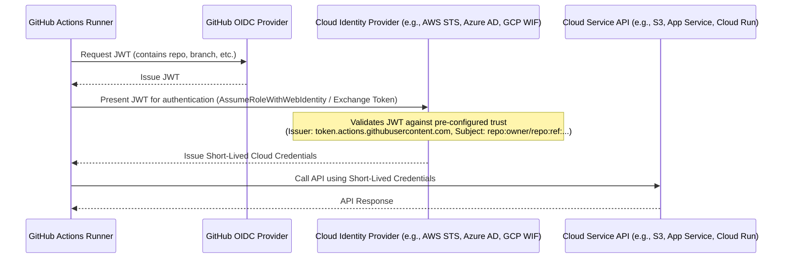

# Chapter 19: Integrating with Cloud Providers (AWS, Azure, GCP)

Modern software development rarely happens in isolation. Applications are built, tested, and ultimately deployed to cloud infrastructure provided by major players like Amazon Web Services (AWS), Microsoft Azure, and Google Cloud Platform (GCP). GitHub Actions provides the automation engine to orchestrate these interactions seamlessly, enabling true end-to-end CI/CD pipelines that bridge your code repository with your cloud environment.

This chapter delves into the patterns and practices for effectively integrating GitHub Actions workflows with these three major cloud providers. We'll explore secure authentication methods, common deployment strategies for various cloud services, techniques for managing cloud resources directly from your workflows, and how to leverage Infrastructure as Code (IaC) principles for robust environment management. Mastering these integrations is key to unlocking the full potential of automated cloud operations driven by your development lifecycle within GitHub.

We will cover:

- Securely authenticating workflows with cloud providers using OpenID Connect (OIDC).
- Specific integration patterns for deploying applications and managing resources on AWS, Azure, and GCP.
- Interacting with cloud-native services like secret managers and deployment tools.
- Implementing Infrastructure as Code workflows using tools like Terraform within GitHub Actions.

By the end of this chapter, you'll understand how to configure GitHub Actions to securely interact with your chosen cloud provider(s), automate deployments, manage resources, and integrate cloud operations into your CI/CD pipelines.

## A. Authentication Best Practices (OIDC Recap)

Connecting your GitHub Actions workflows to your cloud environment requires granting permissions – allowing Actions to create, modify, or delete resources in your cloud account. Handling these credentials securely is paramount. Hardcoding long-lived static access keys (like AWS Access Keys, Azure Service Principal secrets, or GCP Service Account keys) directly into workflows or GitHub Secrets is a significant security risk. If compromised, these keys could grant attackers broad access to your cloud resources.

The modern best practice, strongly recommended by both GitHub and cloud providers, is to use **OpenID Connect (OIDC)**. As likely discussed in earlier chapters (particularly Chapter 13 on Security), OIDC allows your workflows to obtain short-lived access tokens directly from the cloud provider without needing to store long-lived secrets in GitHub.

**How OIDC Works with GitHub Actions and Cloud Providers:**

1.  **Trust Configuration:** You configure a trust relationship between your cloud provider account and GitHub Actions. This typically involves telling the cloud provider to trust identity tokens issued by GitHub (`https://token.actions.githubusercontent.com`) for specific repositories, branches, or environments.
2.  **Token Request:** When a workflow needs cloud access, an official action (e.g., `aws-actions/configure-aws-credentials`, `azure/login`, `google-github-actions/auth`) requests a JSON Web Token (JWT) from the GitHub Actions OIDC provider. This JWT contains claims about the workflow run (repository, branch, commit SHA, triggering event, environment, etc.).
3.  **Token Exchange:** The action sends this JWT to the cloud provider's identity service (e.g., AWS STS, Azure AD, GCP Workload Identity Federation).
4.  **Validation & Temporary Credentials:** The cloud provider validates the JWT against the pre-configured trust relationship and the claims within the token. If valid, it issues short-lived cloud credentials (e.g., temporary AWS keys, an Azure access token, a GCP access token) back to the workflow runner.
5.  **Cloud Interaction:** Subsequent steps in the workflow use these temporary credentials to interact with the cloud provider's APIs (e.g., via the AWS CLI, Azure CLI, gcloud CLI, or SDKs). These credentials automatically expire after a short duration (typically 1 hour).



**Diagram Explanation:** This diagram illustrates the OIDC flow between a GitHub Actions runner, the GitHub OIDC provider, the Cloud Provider's Identity Service, and a Cloud Service API. The key takeaway is the exchange of a GitHub-issued JWT for short-lived cloud credentials, eliminating the need to store static secrets in GitHub.

**Benefits of OIDC:**

- **Enhanced Security:** Eliminates the need for long-lived secrets in GitHub. Credentials expire automatically.
- **Fine-Grained Control:** Trust policies can be scoped to specific repositories, branches, tags, or GitHub Actions environments.
- **Simplified Management:** No need to rotate secrets stored in GitHub.

While the specific setup steps differ slightly between AWS, Azure, and GCP, the underlying principle of establishing trust and exchanging a GitHub JWT for temporary cloud credentials remains the same. We will see specific examples in the following sections.

## B. AWS Integration Patterns

Amazon Web Services (AWS) is a widely used cloud platform offering a vast array of services. GitHub Actions provides robust integration capabilities, primarily through official actions maintained by AWS (`aws-actions`) and the flexibility of using the AWS Command Line Interface (CLI) or SDKs.

### 1. Deploying to EC2, ECS, EKS, Fargate, Lambda, S3

GitHub Actions can automate deployments to virtually any AWS compute or storage service. Common patterns include:

- **Amazon EC2 (Elastic Compute Cloud):**
  - **Direct Deployment:** Using `ssh` or agent-based tools (like AWS Systems Manager Agent) configured on the EC2 instances.
  - **AWS CodeDeploy:** Triggering deployments managed by CodeDeploy using the AWS CLI (`aws deploy create-deployment`) within your workflow. This often involves bundling your application and an `appspec.yml` file.
  - **AMI Baking:** Building Amazon Machine Images (AMIs) using tools like Packer within a workflow and then launching instances from that AMI.
- **Amazon ECS (Elastic Container Service) & AWS Fargate:**
  - Build your Docker image and push it to Amazon ECR (Elastic Container Registry).
  - Use the `aws-actions/amazon-ecs-deploy-task-definition` action to update your ECS service with a new task definition referencing the new image. This works for both EC2-backed ECS clusters and serverless Fargate tasks.
- **Amazon EKS (Elastic Kubernetes Service):**
  - Build and push container images to ECR.
  - Authenticate to the EKS cluster (e.g., using `aws eks update-kubeconfig`).
  - Use `kubectl` commands or Helm charts (via actions like `azure/setup-helm` and standard `helm` commands) to deploy applications to the cluster. Actions like `aws-actions/amazon-eks-deploy` can also assist.
- **AWS Lambda:**
  - Package your function code (and dependencies).
  - Use the AWS CLI (`aws lambda update-function-code`) or dedicated actions like `aws-actions/aws-lambda-deploy` (unofficial but popular) or simply zip and use the CLI's `update-function-code` command. Serverless Framework or AWS SAM CLI can also be invoked from workflows.
- **Amazon S3 (Simple Storage Service):**
  - Ideal for deploying static websites (React, Vue, Angular, HTML/CSS/JS).
  - Use the AWS CLI (`aws s3 sync`) to upload build artifacts to an S3 bucket configured for static website hosting. Optionally, invalidate CloudFront distributions.

### 2. Managing AWS Resources via AWS CLI or CDK/Terraform

Beyond deployments, workflows can manage AWS infrastructure itself.

- **AWS CLI:** The most direct way. Once authenticated (ideally via OIDC using `aws-actions/configure-aws-credentials`), you can run any `aws` command to manage resources (e.g., create SQS queues, modify security groups, manage IAM roles).

  **[Practical Example: Workflow using AWS CLI to sync files to S3]**

  This workflow builds a static website and deploys it to an S3 bucket using OIDC for authentication.

  ```yaml
  # .github/workflows/deploy-s3.yml
  name: Deploy Static Site to AWS S3

  on:
    push:
      branches:
        - main

  permissions:
    id-token: write # Required for requesting the OIDC token
    contents: read # Required for checking out code

  jobs:
    deploy:
      runs-on: ubuntu-latest
      steps:
        - name: Checkout code
          uses: actions/checkout@v4

        - name: Configure AWS Credentials
          uses: aws-actions/configure-aws-credentials@v4
          with:
            role-to-assume: arn:aws:iam::111122223333:role/GitHubActionsS3DeployRole # Replace with your IAM Role ARN
            aws-region: us-east-1 # Replace with your AWS region

        - name: Build static site (example)
          run: |
            npm install
            npm run build
          # Replace with your actual build command

        - name: Deploy static site to S3
          run: |
            aws s3 sync ./dist s3://your-website-bucket-name --delete
          # Replace ./dist with your build output directory
          # Replace your-website-bucket-name with your S3 bucket name

        # Optional: Invalidate CloudFront distribution
        # - name: Invalidate CloudFront Cache
        #   run: |
        #     aws cloudfront create-invalidation --distribution-id YOUR_DISTRIBUTION_ID --paths "/*"
        #   # Replace YOUR_DISTRIBUTION_ID with your CloudFront distribution ID
  ```

  > **Note:** Before running this, you must configure an IAM OIDC identity provider in AWS and create the `GitHubActionsS3DeployRole` IAM role with a trust policy allowing `token.actions.githubusercontent.com` and permissions to write to the specified S3 bucket (e.g., `s3:PutObject`, `s3:ListBucket`, `s3:DeleteObject`).

- **Infrastructure as Code (IaC):** Tools like AWS Cloud Development Kit (CDK) or HashiCorp Terraform allow you to define infrastructure programmatically. Workflows can execute these tools to provision and update resources.

  **[Code Snippet: Using Terraform Cloud/Enterprise integration or running Terraform CLI]**

  This snippet shows basic Terraform steps within a workflow. State management and detailed integration are covered in Section E.

  ```yaml
  # ... (checkout, setup terraform, configure AWS credentials) ...

  - name: Terraform Init
    id: init
    run: terraform init

  - name: Terraform Plan
    id: plan
    run: terraform plan -no-color
    # Add -detailed-exitcode for PR checks if needed

  # Only run apply on the main branch
  - name: Terraform Apply
    if: github.ref == 'refs/heads/main' && github.event_name == 'push'
    run: terraform apply -auto-approve -no-color
  ```

### 3. Interacting with AWS Services (Secrets Manager, Parameter Store, CodeDeploy, etc.)

Workflows often need to interact with other AWS services beyond compute and storage.

- **AWS Secrets Manager & Parameter Store:** Securely retrieve database passwords, API keys, or configuration parameters needed during the workflow (e.g., for build steps or deployment configurations).
- **AWS CodeDeploy:** Trigger and monitor deployments managed by CodeDeploy.
- **Amazon SQS (Simple Queue Service) / SNS (Simple Notification Service):** Send messages to queues or topics as part of a workflow process (e.g., notifying another system of a successful deployment).
- **Amazon ECR (Elastic Container Registry):** Log in, build, tag, and push Docker images using actions like `aws-actions/amazon-ecr-login`.

**[Configuration Guide: Accessing Secrets Manager secrets from Actions]**

1.  **Configure OIDC:** Set up OIDC authentication as described previously (`aws-actions/configure-aws-credentials`).
2.  **Grant Permissions:** Ensure the IAM role assumed by the workflow has permissions to access the specific secret(s) in Secrets Manager (e.g., `secretsmanager:GetSecretValue`).
3.  **Retrieve Secret:** Use the AWS CLI within a workflow step.

    ```yaml
    # ... (previous steps: checkout, configure AWS credentials) ...

    - name: Retrieve Database Password from Secrets Manager
      id: get-secret
      run: |
        SECRET_VALUE=$(aws secretsmanager get-secret-value --secret-id arn:aws:secretsmanager:us-east-1:111122223333:secret:prod/myapp/dbpassword-AbCdEf --query SecretString --output text)
        # Mask the secret value in logs
        echo "::add-mask::$SECRET_VALUE"
        # Make the secret available to subsequent steps
        echo "db_password=$SECRET_VALUE" >> $GITHUB_OUTPUT
      # Replace with your Secret ARN

    - name: Use the Secret (Example)
      run: |
        echo "Using retrieved password (masked in logs): ${{ steps.get-secret.outputs.db_password }}"
        # Example: Use the password in a database migration command
        # ./migrate --db-password "${{ steps.get-secret.outputs.db_password }}"
    ```

## C. Azure Integration Patterns

Microsoft Azure offers a comprehensive suite of cloud services, and GitHub Actions integrates smoothly, often leveraging official actions (`azure/*`) and the Azure CLI.

### 1. Deploying to VMs, AKS, App Service, Azure Functions

GitHub Actions can automate deployments to various Azure compute services:

- **Azure Virtual Machines (VMs):** Similar to EC2, deployments can use `ssh`, agent-based tools (like Azure Pipelines Agent or custom scripts), or Azure Resource Manager (ARM) templates/Bicep for VM configuration updates.
- **Azure Kubernetes Service (AKS):**
  - Build container images and push them to Azure Container Registry (ACR).
  - Authenticate to AKS (e.g., using `azure/aks-set-context`).
  - Deploy using `kubectl` or Helm (e.g., using `azure/k8s-deploy`).
- **Azure App Service:**
  - A popular PaaS offering for web apps.
  - Use the `azure/webapps-deploy` action to deploy code (zip deploy, war deploy) or container images directly to App Service slots.
- **Azure Functions:**
  - Package function code.
  - Use the `azure/functions-action` to deploy the function app package.

### 2. Managing Azure Resources via Azure CLI or Bicep/ARM/Terraform

Workflows can provision and manage Azure infrastructure.

- **Azure CLI:** The primary tool for imperative management. Use the `azure/login` action with OIDC to authenticate, then run any `az` command.

  **[Practical Example: Workflow deploying an App Service using Azure CLI]**

  This workflow logs into Azure using OIDC, builds a simple web app, and deploys it using the Azure CLI's `az webapp deploy` command.

  ```yaml
  # .github/workflows/deploy-appservice.yml
  name: Deploy to Azure App Service

  on:
    push:
      branches:
        - main

  permissions:
    id-token: write # Required for OIDC login
    contents: read # Required for checkout

  env:
    AZURE_APP_NAME: "your-app-service-name" # Replace with your App Service name
    AZURE_RG_NAME: "your-resource-group-name" # Replace with your Resource Group name
    PACKAGE_PATH: "./publish" # Path to the deployment package

  jobs:
    build-and-deploy:
      runs-on: ubuntu-latest
      steps:
        - name: Checkout code
          uses: actions/checkout@v4

        - name: Set up .NET Core (example build)
          uses: actions/setup-dotnet@v3
          with:
            dotnet-version: "6.0.x" # Adjust version as needed

        - name: Build and publish .NET app
          run: |
            dotnet build --configuration Release
            dotnet publish --configuration Release -o ${{ env.PACKAGE_PATH }}

        - name: "Az CLI login using OIDC"
          uses: azure/login@v1
          with:
            client-id: ${{ secrets.AZURE_CLIENT_ID }} # Client ID of the Azure AD Application
            tenant-id: ${{ secrets.AZURE_TENANT_ID }} # Tenant ID of your Azure AD
            subscription-id: ${{ secrets.AZURE_SUBSCRIPTION_ID }} # Azure Subscription ID
            # enable-AzPSSession: true # Uncomment if using Azure PowerShell

        - name: Deploy to Azure App Service
          run: |
            az webapp deploy --resource-group ${{ env.AZURE_RG_NAME }} --name ${{ env.AZURE_APP_NAME }} --src-path ${{ env.PACKAGE_PATH }} --type zip

        # Optional: Logout
        - name: Azure logout
          run: az logout
          if: always() # Ensure logout runs even if previous steps fail
  ```

  > **Note:** This requires setting up an Azure AD Application Registration, configuring federated credentials for GitHub OIDC, and granting the Application's Service Principal permissions (e.g., `Website Contributor`) on the App Service. Store `AZURE_CLIENT_ID`, `AZURE_TENANT_ID`, and `AZURE_SUBSCRIPTION_ID` as GitHub secrets.

- **Infrastructure as Code (IaC):** Use Azure Bicep, ARM templates, or Terraform to define and manage Azure resources declaratively within workflows.

### 3. Interacting with Azure Services (Key Vault, Azure DevOps - for work items, etc.)

Workflows can leverage other Azure services:

- **Azure Key Vault:** Securely retrieve secrets, keys, and certificates needed during the workflow. OIDC is the preferred authentication method.
- **Azure Container Registry (ACR):** Log in (`azure/docker-login`), build, and push container images.
- **Azure DevOps:** While primarily a separate CI/CD platform, workflows can interact with Azure Boards via REST APIs (using `curl` or scripts) to update work item statuses, although this is less common for core infrastructure tasks.

**[Configuration Guide: Accessing Key Vault secrets using OIDC]**

1.  **Configure OIDC:** Set up `azure/login` using OIDC as shown in the App Service example.
2.  **Grant Permissions:** In Azure Key Vault, configure an Access Policy granting the Service Principal (associated with your Azure AD Application) `Get` permissions for secrets.
3.  **Retrieve Secret:** Use the Azure CLI within a workflow step.

    ```yaml
    # ... (previous steps: checkout, azure login) ...

    - name: Retrieve Secret from Azure Key Vault
      id: get-secret
      run: |
        SECRET_VALUE=$(az keyvault secret show --name "YourSecretName" --vault-name "your-key-vault-name" --query value -o tsv)
        # Mask the secret value in logs
        echo "::add-mask::$SECRET_VALUE"
        # Make the secret available to subsequent steps
        echo "my_secret=$SECRET_VALUE" >> $GITHUB_OUTPUT
      # Replace YourSecretName and your-key-vault-name

    - name: Use the Secret (Example)
      run: |
        echo "Using retrieved secret (masked in logs): ${{ steps.get-secret.outputs.my_secret }}"
        # Example: Use the secret in a configuration step
        # ./configure-app --api-key "${{ steps.get-secret.outputs.my_secret }}"
    ```

## D. Google Cloud Platform (GCP) Integration Patterns

Google Cloud Platform (GCP) provides a suite of services well-suited for cloud-native applications. GitHub Actions integrates using official actions (`google-github-actions`) and the `gcloud` CLI. GCP's equivalent of OIDC is called **Workload Identity Federation**.

### 1. Deploying to GCE, GKE, Cloud Run, Cloud Functions

GitHub Actions can automate deployments to key GCP compute services:

- **Google Compute Engine (GCE):** Similar to EC2/Azure VMs, deployments can use `gcloud compute ssh`, configuration management tools (Ansible, Chef, Puppet), or by building custom images using Packer.
- **Google Kubernetes Engine (GKE):**
  - Build container images and push them to Google Artifact Registry (or the older Container Registry).
  - Authenticate to GKE (e.g., using `google-github-actions/get-gke-credentials`).
  - Deploy using `kubectl` or Helm (e.g., using `google-github-actions/deploy-gke`).
- **Cloud Run:**
  - A serverless container platform.
  - Build and push container images to Artifact Registry.
  - Use the `google-github-actions/deploy-cloudrun` action or `gcloud run deploy` command to deploy new revisions.
- **Cloud Functions:**
  - Serverless functions.
  - Package function code.
  - Use the `google-github-actions/deploy-cloud-functions` action or `gcloud functions deploy` command.

### 2. Managing GCP Resources via `gcloud` CLI or Terraform

Workflows can manage GCP resources directly.

- **`gcloud` CLI:** The standard command-line tool for GCP. Use the `google-github-actions/auth` action with Workload Identity Federation to authenticate, then run any `gcloud` command.

  **[Practical Example: Workflow deploying a Cloud Run service]**

  This workflow authenticates using Workload Identity Federation, builds a container image, pushes it to Artifact Registry, and deploys it to Cloud Run.

  ```yaml
  # .github/workflows/deploy-cloudrun.yml
  name: Build and Deploy to Cloud Run

  on:
    push:
      branches:
        - main

  permissions:
    contents: read
    id-token: write # Required for Workload Identity Federation

  env:
    PROJECT_ID: "your-gcp-project-id" # Replace with your GCP Project ID
    REGION: "us-central1" # Replace with your GCP region
    SERVICE_NAME: "my-cloudrun-service" # Replace with your Cloud Run service name
    GAR_LOCATION: "us-central1" # Replace with your Artifact Registry location
    IMAGE_NAME: "my-app-image"

  jobs:
    deploy:
      runs-on: ubuntu-latest
      steps:
        - name: Checkout code
          uses: actions/checkout@v4

        # Authenticate to Google Cloud using Workload Identity Federation
        - id: "auth"
          uses: "google-github-actions/auth@v2"
          with:
            workload_identity_provider: "projects/YOUR_PROJECT_NUMBER/locations/global/workloadIdentityPools/github-pool/providers/github-provider" # Replace with your WIF provider details
            service_account: "github-actions-sa@${{ env.PROJECT_ID }}.iam.gserviceaccount.com" # Replace with your Service Account email

        # Setup gcloud CLI
        - name: Set up Cloud SDK
          uses: google-github-actions/setup-gcloud@v2

        # Configure Docker to use gcloud credential helper
        - name: Configure Docker Credential Helper
          run: gcloud auth configure-docker ${{ env.GAR_LOCATION }}-docker.pkg.dev

        # Build and push Docker image to Google Artifact Registry
        - name: Build and Push Docker Image
          run: |
            docker build -t ${{ env.GAR_LOCATION }}-docker.pkg.dev/${{ env.PROJECT_ID }}/${{ env.IMAGE_NAME }}/${{ env.IMAGE_NAME }}:${{ github.sha }} .
            docker push ${{ env.GAR_LOCATION }}-docker.pkg.dev/${{ env.PROJECT_ID }}/${{ env.IMAGE_NAME }}/${{ env.IMAGE_NAME }}:${{ github.sha }}

        # Deploy to Cloud Run
        - name: Deploy to Cloud Run
          id: deploy
          uses: google-github-actions/deploy-cloudrun@v2
          with:
            service: ${{ env.SERVICE_NAME }}
            region: ${{ env.REGION }}
            image: ${{ env.GAR_LOCATION }}-docker.pkg.dev/${{ env.PROJECT_ID }}/${{ env.IMAGE_NAME }}/${{ env.IMAGE_NAME }}:${{ github.sha }}
            # Optional flags like '--allow-unauthenticated', '--port', etc.

        # Output the deployed service URL
        - name: Show Output
          run: echo ${{ steps.deploy.outputs.url }}
  ```

  > **Note:** This requires setting up Workload Identity Federation in GCP, creating a Workload Identity Pool and Provider linked to your GitHub repository/branch, creating a GCP Service Account, granting it necessary roles (e.g., Cloud Run Admin, Storage Object Admin, Artifact Registry Writer), and allowing the GitHub identity to impersonate the Service Account. The `workload_identity_provider` and `service_account` values need to be updated accordingly.

- **Infrastructure as Code (IaC):** Use Terraform (most common for GCP IaC in Actions) to define and manage GCP resources.

### 3. Interacting with GCP Services (Secret Manager, Cloud Build, Artifact Registry)

Workflows can integrate with various other GCP services:

- **Secret Manager:** Securely retrieve secrets needed during workflow execution.
- **Cloud Build:** Trigger container builds or other build processes managed by Cloud Build using `gcloud builds submit`.
- **Artifact Registry:** Store and manage container images, language packages (Maven, npm), and OS packages. Workflows authenticate (often via `gcloud auth configure-docker`), build, tag, and push artifacts.

**[Configuration Guide: Accessing GCP Secret Manager secrets using OIDC]**

1.  **Configure Workload Identity Federation:** Set up `google-github-actions/auth` as shown in the Cloud Run example.
2.  **Grant Permissions:** Grant the impersonated Service Account the `Secret Manager Secret Accessor` role (`roles/secretmanager.secretAccessor`) on the specific secret(s) or project/folder level.
3.  **Retrieve Secret:** Use the `gcloud` CLI within a workflow step.

    ```yaml
    # ... (previous steps: checkout, auth, setup-gcloud) ...

    - name: Retrieve Secret from GCP Secret Manager
      id: get-secret
      run: |
        SECRET_VALUE=$(gcloud secrets versions access latest --secret="YourSecretName" --project="${{ env.PROJECT_ID }}" --format='get(payload.data)' | base64 --decode)
        # Mask the secret value in logs
        echo "::add-mask::$SECRET_VALUE"
        # Make the secret available to subsequent steps
        echo "my_gcp_secret=$SECRET_VALUE" >> $GITHUB_OUTPUT
      # Replace YourSecretName

    - name: Use the Secret (Example)
      run: |
        echo "Using retrieved GCP secret (masked in logs): ${{ steps.get-secret.outputs.my_gcp_secret }}"
        # Example: Use the secret in an application config file
        # echo "API_KEY=${{ steps.get-secret.outputs.my_gcp_secret }}" >> .env
    ```

## E. Infrastructure as Code (IaC) Workflows

Managing cloud infrastructure manually via CLIs or consoles is error-prone and doesn't scale well. Infrastructure as Code (IaC) treats infrastructure definition and provisioning like software development – using code stored in version control, reviewed, tested, and deployed automatically. GitHub Actions is an ideal platform for automating IaC workflows.

### 1. Integrating Terraform

HashiCorp Terraform is one of the most popular open-source IaC tools, supporting multiple cloud providers.

#### a. `terraform init`, `plan`, `apply` Steps

A typical Terraform workflow in GitHub Actions involves these core steps:

1.  **Checkout:** Get the Terraform configuration files (`.tf`) from the repository.
2.  **Setup Terraform:** Install the desired Terraform version (e.g., using `hashicorp/setup-terraform` action).
3.  **Authenticate to Cloud:** Configure credentials for the target cloud provider (ideally using OIDC actions like `aws-actions/configure-aws-credentials`, `azure/login`, or `google-github-actions/auth`).
4.  **`terraform init`:** Initialize the Terraform working directory, downloading provider plugins and modules.
5.  **`terraform validate`:** Check the syntax and internal consistency of the configuration.
6.  **`terraform plan`:** Create an execution plan, showing what changes Terraform will make to the infrastructure. This is crucial for pull request checks to preview changes before merging.
7.  **`terraform apply`:** Apply the changes described in the plan. This step is typically restricted to run only on merges or pushes to specific branches (e.g., `main`).

```yaml
# .github/workflows/terraform.yml
name: Terraform CI/CD

on:
  push:
    branches:
      - main
  pull_request:

permissions:
  contents: read
  pull-requests: write # Required to comment plan on PRs
  # Add id-token: write if using OIDC for cloud authentication
  # id-token: write

jobs:
  terraform:
    runs-on: ubuntu-latest
    env:
      # Set TF_VAR_ variables or cloud provider env vars if not using OIDC
      # AWS_REGION: "us-west-2"
      TF_VAR_region: "us-west-2" # Example Terraform variable

    steps:
      - name: Checkout code
        uses: actions/checkout@v4

      - name: Setup Terraform
        uses: hashicorp/setup-terraform@v3
        with:
          terraform_version: 1.6.x # Specify desired version
          # terraform_wrapper: true # Optional: Use wrapper for better output handling

      # Add cloud authentication step here (OIDC preferred)
      # - name: Configure AWS Credentials
      #   uses: aws-actions/configure-aws-credentials@v4
      #   with:
      #     role-to-assume: arn:aws:iam::...
      #     aws-region: ${{ env.AWS_REGION }}

      - name: Terraform Init
        id: init
        run: terraform init -backend-config=backend.tfvars # Pass backend config if needed

      - name: Terraform Validate
        id: validate
        run: terraform validate -no-color

      - name: Terraform Plan
        id: plan
        # Only run plan on PRs or pushes to main
        if: github.event_name == 'pull_request' || github.event_name == 'push'
        run: terraform plan -no-color -input=false -out=tfplan
        continue-on-error: true # Allow next step to comment plan even if plan fails

      # Optional: Add Terraform Plan output to PR comments
      - name: Add Plan Comment to PR
        if: github.event_name == 'pull_request'
        uses: actions/github-script@v7
        with:
          github-token: ${{ secrets.GITHUB_TOKEN }}
          script: |
            const { data: comments } = await github.rest.issues.listComments({
              owner: context.repo.owner,
              repo: context.repo.repo,
              issue_number: context.issue.number,
            });
            const botComment = comments.find(comment => comment.user.login === 'github-actions[bot]' && comment.body.includes('Terraform Plan'));

            const output = `#### Terraform Plan \`${{ steps.plan.outcome }}\`

            \`\`\`terraform\n
            ${{ steps.plan.outputs.stdout || steps.plan.outputs.stderr }}
            \`\`\`
            *Pusher: @${{ github.actor }}, Action: \`${{ github.event_name }}\`*`;

            if (botComment) {
              await github.rest.issues.updateComment({
                owner: context.repo.owner,
                repo: context.repo.repo,
                comment_id: botComment.id,
                body: output
              });
            } else {
              await github.rest.issues.createComment({
                owner: context.repo.owner,
                repo: context.repo.repo,
                issue_number: context.issue.number,
                body: output
              });
            }

      # Check plan exit code after potentially commenting
      - name: Check Plan Exit Code
        if: steps.plan.outcome == 'failure'
        run: exit 1

      - name: Terraform Apply
        # Only apply on pushes to the main branch
        if: github.ref == 'refs/heads/main' && github.event_name == 'push' && steps.plan.outcome != 'failure'
        run: terraform apply -auto-approve -input=false tfplan
```

#### b. Managing Terraform State

Terraform maintains a state file (`terraform.tfstate`) to map resources defined in your configuration to real-world resources in the cloud.

- **Problem:** Storing the state file directly in the Git repository is highly discouraged. It often contains sensitive information, makes collaboration difficult (merge conflicts), and doesn't support locking.
- **Solution:** Use **remote backends**. Configure Terraform to store the state file remotely and securely, for example:
  - AWS S3 (with DynamoDB for locking)
  - Azure Blob Storage (with locking)
  - Google Cloud Storage (with locking)
  - Terraform Cloud / Terraform Enterprise
- **Configuration:** Remote backend configuration is typically done in a `.tf` file (e.g., `backend.tf`) or passed during `terraform init` using `-backend-config` flags or files. Ensure the workflow has permissions to access the backend storage and locking mechanism.

#### c. Using Terraform Cloud/Enterprise Integration

Terraform Cloud (TFC) and Terraform Enterprise (TFE) offer enhanced features for managing Terraform at scale, including:

- Secure remote state storage and locking.
- Policy as Code (Sentinel or OPA) for governance.
- A UI for collaboration and visibility.
- Private module registry.
- Cost estimation.

**Integration Methods:**

1.  **API Token:** Store a TFC/TFE API token as a GitHub secret and configure the Terraform CLI to use it via environment variables (`TF_TOKEN_app_terraform_io`). The workflow runs `init`, `plan`, `apply` locally but uses TFC/TFE for the backend.
2.  **TFC Run Trigger:** Configure TFC/TFE workspaces with VCS integration pointing to your GitHub repository. A push/PR to GitHub triggers a run directly within TFC/TFE, leveraging its native execution environment, policies, and state management. The GitHub Actions workflow might only be needed for pre-checks (linting, validation) or post-notifications.
3.  **`hashicorp/tfc-workflows` Action (Deprecated):** Older action, generally superseded by the methods above.

Using TFC/TFE often simplifies workflow setup as state and execution are handled externally.

#### [Case Study: CI/CD for Terraform modules using GitHub Actions]

Imagine a repository dedicated to developing a reusable Terraform module (e.g., for provisioning a standard VPC network). A CI/CD pipeline using GitHub Actions could look like this:

1.  **Trigger:** On pushes to any branch or pull requests targeting `main`.
2.  **Linting & Formatting:** Run `terraform fmt -check` and potentially a tool like `tflint`.
3.  **Validation:** Run `terraform validate`.
4.  **Unit/Integration Tests (Optional but Recommended):** Use tools like Terratest or Kitchen-Terraform to spin up example infrastructure using the module in a temporary cloud environment, run checks (e.g., security group rules, resource tags), and tear it down. This requires cloud credentials.
5.  **`terraform plan` (on PRs):** Run `terraform plan` within an example usage directory inside the repo to preview the module's effect. Comment the plan on the PR.
6.  **Tag Release (on merge to `main`):** If all checks pass on merge, automatically create a Git tag (e.g., `v1.0.1`) to signify a new module version. Consumers can then reference this specific version in their own Terraform configurations.

This ensures the module is well-formatted, valid, potentially tested, and versioned systematically before others consume it.

### 2. Integrating Pulumi, AWS CDK, Azure Bicep, etc.

While Terraform is prevalent, other IaC tools integrate similarly with GitHub Actions:

- **Pulumi:**
  - Install the Pulumi CLI.
  - Authenticate to the cloud provider (OIDC recommended).
  - Log in to the Pulumi service or configure a self-managed backend (e.g., S3, Azure Blob).
  - Run `pulumi preview` (similar to `plan`) and `pulumi up` (similar to `apply`). Pulumi uses standard programming languages (TypeScript, Python, Go, C#).
- **AWS CDK (Cloud Development Kit):**
  - Set up Node.js/Python/Java/etc. environment.
  - Install AWS CDK CLI (`npm install -g aws-cdk`).
  - Authenticate to AWS (OIDC recommended).
  - Run `cdk synth` (to generate CloudFormation templates), `cdk diff` (to preview changes), and `cdk deploy` (to apply changes).
- **Azure Bicep / ARM Templates:**
  - Install Azure CLI.
  - Authenticate to Azure (OIDC recommended).
  - Use `az deployment group validate` (or subscription/tenant level) to check the template.
  - Use `az deployment group what-if` to preview changes.
  - Use `az deployment group create` to apply the Bicep/ARM template.

The core principles remain consistent across these tools: install the CLI, authenticate securely (preferably OIDC), run commands to preview changes (plan/diff/preview/what-if), and run commands to apply changes (apply/up/deploy/create), typically gating the apply step to specific branches like `main`.

## Conclusion

Integrating GitHub Actions with cloud providers like AWS, Azure, and GCP transforms your repository from a simple code store into a powerful control plane for your cloud infrastructure and applications. By leveraging secure authentication methods like OIDC and embracing Infrastructure as Code principles with tools like Terraform, Pulumi, CDK, or Bicep, you can build robust, automated, and auditable CI/CD pipelines.

This chapter demonstrated common patterns for deploying various application types, managing resources via CLIs and IaC tools, and interacting with essential cloud services like secret managers. Secure authentication through OIDC is the cornerstone, eliminating risky static credentials. Automating deployments to services like ECS, AKS, App Service, Cloud Run, and Lambda, coupled with IaC workflows for managing the underlying infrastructure, allows development teams to move faster and more reliably.

As you move forward, remember to tailor these patterns to your specific needs, always prioritize security through OIDC and least-privilege IAM roles, and leverage the official actions provided by GitHub and the cloud vendors to streamline your workflow development. The next chapter will explore extending GitHub Actions further through webhooks, APIs, and GitHub Apps, enabling even more sophisticated automation scenarios.
