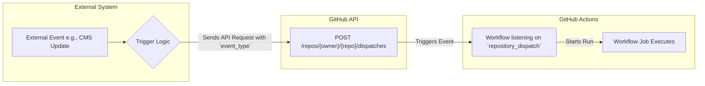
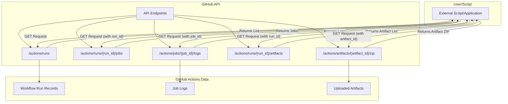

# Chapter 20: Extending GitHub Actions: Webhooks, APIs, and GitHub Apps

While GitHub Actions provides a powerful, event-driven automation platform directly within your repository, its true potential often lies in its ability to interact with the world outside the standard workflow triggers. Whether you need to initiate workflows from external systems, manage runs programmatically, or build sophisticated custom integrations, GitHub provides several mechanisms to extend the reach and capabilities of Actions.

This chapter delves into these extension points: triggering workflows via repository dispatch events, interacting with workflow runs using the GitHub API, leveraging the power of GitHub Apps for advanced automation, and integrating with communication platforms for ChatOps. Understanding these mechanisms unlocks a new level of automation possibilities, allowing you to weave GitHub Actions seamlessly into your broader development and operational ecosystems.

We will explore how to send signals _into_ GitHub Actions from external tools, how to query and control workflow executions _from_ your own scripts or applications, and how to build first-class integrations using GitHub Apps for the tightest coupling and most advanced features.

## A. Triggering Workflows Externally (`repository_dispatch`)

Standard GitHub Actions workflows are triggered by events occurring _within_ GitHub – pushes, pull requests, releases, etc. However, many scenarios require triggering a workflow based on an event happening _outside_ of GitHub, such as:

- A successful deployment in an external system (e.g., a cloud provider deployment tool).
- An update to content in a headless Content Management System (CMS).
- A notification from an external monitoring service.
- Completion of a task in a project management tool.

For these cases, GitHub provides the `repository_dispatch` event. This special event type allows you to trigger a workflow run by sending a POST request to a specific GitHub API endpoint for your repository.

### 1. Sending Dispatch Events via GitHub API

To trigger a `repository_dispatch` event, you need to send an authenticated POST request to the following GitHub API endpoint:

```
POST /repos/{owner}/{repo}/dispatches
```

This request must include an `event_type` in the JSON body. This `event_type` is a custom string you define, which acts as the specific trigger identifier within your workflow file.

**Authentication:** The request must be authenticated using a token with the `repo` scope (or specifically `public_repo` for public repositories, `repo:status` if needed for commit statuses). A Personal Access Token (PAT) or a GitHub App installation token can be used.

**Example using `curl`:**

```bash
# Replace {owner}, {repo}, {event_type_name}, and {your_github_token}
curl -L \
  -X POST \
  -H "Accept: application/vnd.github+json" \
  -H "Authorization: Bearer {your_github_token}" \
  -H "X-GitHub-Api-Version: 2022-11-28" \
  https://api.github.com/repos/{owner}/{repo}/dispatches \
  -d '{"event_type":"{event_type_name}"}'
```

**Workflow Trigger:**

To make a workflow listen for this event, you use the `repository_dispatch` trigger in your workflow YAML file, specifying the `types` you want to react to.

```yaml
# .github/workflows/external-trigger.yml
name: External Trigger Workflow

on:
  repository_dispatch:
    types: [cms_content_updated, external_deployment_done] # Listens for specific event types

jobs:
  handle_dispatch:
    runs-on: ubuntu-latest
    steps:
      - name: Checkout code
        uses: actions/checkout@v4

      - name: Print Event Type
        run: echo "Received event type: ${{ github.event.action }}" # The event_type is available here

      - name: Handle CMS Update
        if: github.event.action == 'cms_content_updated'
        run: |
          echo "Handling CMS content update..."
          # Add steps to rebuild site, clear cache, etc.

      - name: Handle External Deployment
        if: github.event.action == 'external_deployment_done'
        run: |
          echo "Handling external deployment completion..."
          # Add steps to run integration tests, notify stakeholders, etc.
```

In this workflow:

- `on.repository_dispatch.types` specifies which `event_type` values sent via the API will trigger this workflow. If `types` is omitted, the workflow triggers for _any_ `repository_dispatch` event sent to the repository.
- The specific `event_type` that triggered the workflow run is available in the `github.event.action` context variable.



**Diagram Explanation:** This diagram illustrates the flow of triggering a GitHub Actions workflow externally. An event in an external system initiates a process that sends a POST request to the GitHub API's `dispatches` endpoint. This API call triggers the `repository_dispatch` event within the specified GitHub repository, causing any workflow configured to listen for that specific `event_type` to execute.

### 2. Passing Custom Payloads (`client_payload`)

Often, just knowing _that_ an external event occurred isn't enough; you need specific data associated with that event. The `repository_dispatch` API allows you to include a custom JSON payload in your request body using the `client_payload` field.

**API Request with `client_payload`:**

```bash
# Replace {owner}, {repo}, and {your_github_token}
curl -L \
  -X POST \
  -H "Accept: application/vnd.github+json" \
  -H "Authorization: Bearer {your_github_token}" \
  -H "X-GitHub-Api-Version: 2022-11-28" \
  https://api.github.com/repos/{owner}/{repo}/dispatches \
  -d '{
        "event_type":"cms_content_updated",
        "client_payload": {
          "content_id": "article-123",
          "content_type": "blog_post",
          "updated_by": "jane.doe@example.com",
          "needs_rebuild": true
        }
      }'
```

**Accessing `client_payload` in the Workflow:**

The data sent in the `client_payload` object is available within the workflow run via the `github.event.client_payload` context variable.

```yaml
# .github/workflows/external-trigger-payload.yml
name: External Trigger with Payload

on:
  repository_dispatch:
    types: [cms_content_updated]

jobs:
  handle_cms_update:
    runs-on: ubuntu-latest
    steps:
      - name: Checkout code
        uses: actions/checkout@v4

      - name: Process CMS Update Payload
        if: github.event.client_payload.needs_rebuild == true
        run: |
          echo "Received CMS update dispatch."
          echo "Content ID: ${{ github.event.client_payload.content_id }}"
          echo "Content Type: ${{ github.event.client_payload.content_type }}"
          echo "Updated By: ${{ github.event.client_payload.updated_by }}"
          echo "Starting site rebuild..."
          # Add commands here to use the payload data
          # e.g., ./scripts/rebuild_site.sh --content-id ${{ github.event.client_payload.content_id }}
```

#### [Practical Example: Triggering a build from an external CMS update]

Imagine a headless CMS (like Contentful, Strapi, etc.) managing your website's content. When an editor publishes a change, you want to automatically trigger a rebuild and deployment of your static site (e.g., Gatsby, Next.js, Hugo) hosted via GitHub Pages or another service.

1.  **CMS Webhook:** Configure a webhook in your CMS to trigger whenever content is published or updated. This webhook should point to an intermediary service (e.g., an AWS Lambda function, Google Cloud Function, or a small server application) because the CMS webhook might not be able to directly format the GitHub API request correctly or securely store the GitHub token.
2.  **Intermediary Service:** This service receives the webhook from the CMS. It extracts relevant information (like the ID or type of content updated) and constructs the `client_payload`. It then makes the authenticated POST request to the GitHub `repository_dispatch` API endpoint for your site's repository, including the `event_type` (e.g., `cms_content_updated`) and the `client_payload`.
3.  **GitHub Actions Workflow:** A workflow in your site's repository listens for `on: repository_dispatch: types: [cms_content_updated]`. When triggered, it checks out the code, uses the information from `github.event.client_payload` if needed (perhaps to only rebuild specific parts of the site), runs the build command (e.g., `npm run build`), and deploys the resulting artifacts.

This pattern decouples your CMS from your build process, allowing any system capable of making an HTTP request to trigger your GitHub Actions workflows.

### 3. Security Considerations for Dispatch Triggers

Using `repository_dispatch` opens your workflows to external triggers, so security is paramount:

- **Token Security:** The token used to send the dispatch event must be kept secret. Avoid hardcoding it in client-side code or insecure locations. Use secrets management in the triggering application or service.
- **Token Scopes:** Use a token with the minimum required scopes (usually `repo` for private repositories or `public_repo` for public ones). Avoid using tokens with excessive permissions. Consider using fine-grained PATs if possible.
- **Input Validation:** Treat the `client_payload` as untrusted input. Validate and sanitize any data received in the payload within your workflow before using it in commands or scripts to prevent command injection vulnerabilities.
- **Rate Limiting:** Be aware of GitHub API rate limits. If your external system sends too many dispatch events too quickly, requests may be throttled. Implement appropriate logic (e.g., debouncing, queuing) in the triggering system if necessary.
- **Event Type Specificity:** Use specific `event_type` names rather than relying on the default trigger-for-any-dispatch behavior. This limits the potential attack surface if a token is compromised.
- **Consider Alternatives:** If the triggering system is another GitHub repository or workflow, consider using the `workflow_dispatch` (manual trigger) or `workflow_call` (reusable workflow) triggers, which might offer more integrated security features.

## B. Interacting with Workflows via GitHub API

Beyond triggering workflows, the GitHub REST API provides extensive endpoints for programmatically interacting with workflow runs, logs, artifacts, and job statuses. This allows you to build custom dashboards, integrate Actions into deployment pipelines, automate administrative tasks, or create sophisticated monitoring tools.

Key API interaction areas include:

### 1. Listing Workflow Runs

You can retrieve lists of workflow runs for a repository, filtered by various criteria like status (e.g., `completed`, `in_progress`), branch, event, actor (user who triggered the run), or a specific workflow file.

**API Endpoint:**

```
GET /repos/{owner}/{repo}/actions/runs
GET /repos/{owner}/{repo}/actions/workflows/{workflow_id}/runs
```

**Example using `gh` CLI:**

```bash
# List all runs in the current repository
gh run list

# List runs for a specific workflow file, filtering by status and branch
gh run list --workflow="ci.yml" --status="failure" --branch="main"

# List runs triggered by a specific user
gh run list --actor="github-actions[bot]"
```

**Example using `curl`:**

```bash
# Get runs for a specific workflow file (assuming you know its ID, e.g., 1234567)
curl -L \
  -H "Accept: application/vnd.github+json" \
  -H "Authorization: Bearer {your_github_token}" \
  -H "X-GitHub-Api-Version: 2022-11-28" \
  https://api.github.com/repos/{owner}/{repo}/actions/workflows/1234567/runs?status=success
```

### 2. Retrieving Logs and Artifacts

Once you have a specific workflow run ID (`run_id`), you can retrieve detailed information about its jobs, download logs for the entire run or specific jobs, and download artifacts produced during the run.

**API Endpoints:**

- List jobs for a run: `GET /repos/{owner}/{repo}/actions/runs/{run_id}/jobs`
- Download job logs: `GET /repos/{owner}/{repo}/actions/jobs/{job_id}/logs`
- Download run logs: `GET /repos/{owner}/{repo}/actions/runs/{run_id}/logs` (Returns a zip archive)
- List run artifacts: `GET /repos/{owner}/{repo}/actions/runs/{run_id}/artifacts`
- Download an artifact: `GET /repos/{owner}/{repo}/actions/artifacts/{artifact_id}/zip` (Returns a zip archive)

**Example using `gh` CLI:**

```bash
# View logs for the most recent run
gh run view --log

# View logs for a specific run ID
gh run view {run_id} --log

# Download all artifacts from the most recent run to the current directory
gh run download

# Download artifacts from a specific run ID
gh run download {run_id}

# Download a specific artifact by name from the most recent run
gh run download --name "my-built-app"
```



**Diagram Explanation:** This diagram shows how an external script or application interacts with the GitHub API to retrieve information about GitHub Actions. The script sends requests to various API endpoints to list runs, get job details, download logs, list artifacts, and download specific artifact archives. The API retrieves this information from GitHub's stored Actions data.

### 3. Re-running and Cancelling Workflows

You can programmatically re-run workflows (either failed jobs only or the entire workflow) or cancel runs that are currently in progress.

**API Endpoints:**

- Re-run a workflow: `POST /repos/{owner}/{repo}/actions/runs/{run_id}/rerun`
- Re-run failed jobs in a workflow: `POST /repos/{owner}/{repo}/actions/runs/{run_id}/rerun-failed-jobs`
- Cancel a workflow run: `POST /repos/{owner}/{repo}/actions/runs/{run_id}/cancel`

**Example using `gh` CLI:**

```bash
# Re-run the most recent failed run
gh run rerun --failed

# Re-run a specific run ID
gh run rerun {run_id}

# Cancel a specific run ID
gh run cancel {run_id}
```

**Example using `curl`:**

```bash
# Cancel run 987654321
curl -L \
  -X POST \
  -H "Accept: application/vnd.github+json" \
  -H "Authorization: Bearer {your_github_token}" \
  -H "X-GitHub-Api-Version: 2022-11-28" \
  https://api.github.com/repos/{owner}/{repo}/actions/runs/987654321/cancel
```

### 4. Approving/Rejecting Deployment Jobs

Workflows using environments with required reviewers pause execution until an authorized user or team approves the deployment job. The API allows you to manage these pending deployments programmatically.

First, you need to get the list of pending deployments for a run:

**API Endpoint (List Pending Deployments):**

```
GET /repos/{owner}/{repo}/actions/runs/{run_id}/pending_deployments
```

This request returns an array of pending deployment objects, each containing the environment details and a list of users/teams who can approve. Crucially, it includes the `deployment_id` needed for the approval/rejection step.

**API Endpoint (Review Deployment):**

```
POST /repos/{owner}/{repo}/actions/runs/{run_id}/deployment_protection_rule
```

The request body must specify the `environment_name`, the desired `state` (`approved` or `rejected`), and an optional `comment`.

**Example using `curl` (Approve):**

```bash
# Assume run_id=987654321 and environment_name="production"
curl -L \
  -X POST \
  -H "Accept: application/vnd.github+json" \
  -H "Authorization: Bearer {your_github_token}" \
  -H "X-GitHub-Api-Version: 2022-11-28" \
  https://api.github.com/repos/{owner}/{repo}/actions/runs/987654321/deployment_protection_rule \
  -d '{
        "environment_name": "production",
        "state": "approved",
        "comment": "Approved via automated script based on external checks."
      }'
```

This capability is powerful for integrating external approval systems or automated checks into your deployment pipeline. For instance, an external system could perform security scans or compliance checks and, upon success, automatically approve the corresponding GitHub Actions deployment job via the API.

#### [Code Snippet: Script using GitHub API to download artifacts from the latest run]

This example uses the `gh` CLI (which simplifies authentication and API calls) and `jq` (a command-line JSON processor) to find the latest successful workflow run on the `main` branch for a specific workflow file and download its artifacts.

```bash
#!/bin/bash

# Configuration
REPO_OWNER="your-org"
REPO_NAME="your-repo"
WORKFLOW_NAME="build-and-package.yml" # The filename of your workflow
BRANCH_NAME="main"
ARTIFACT_DIR="./downloaded-artifacts"

# Ensure gh and jq are installed
if ! command -v gh &> /dev/null || ! command -v jq &> /dev/null; then
    echo "Error: 'gh' CLI and 'jq' are required. Please install them."
    exit 1
fi

# Ensure logged into gh
gh auth status > /dev/null 2>&1
if [ $? -ne 0 ]; then
    echo "Error: Not logged into GitHub CLI. Please run 'gh auth login'."
    exit 1
fi

echo "Fetching latest successful run for workflow '$WORKFLOW_NAME' on branch '$BRANCH_NAME'..."

# Get the ID of the latest successful run matching the criteria
LATEST_SUCCESSFUL_RUN_ID=$(gh run list \
  --repo "$REPO_OWNER/$REPO_NAME" \
  --workflow "$WORKFLOW_NAME" \
  --branch "$BRANCH_NAME" \
  --status "success" \
  --limit 1 \
  --json databaseId \
  --jq '.[0].databaseId')

if [ -z "$LATEST_SUCCESSFUL_RUN_ID" ] || [ "$LATEST_SUCCESSFUL_RUN_ID" == "null" ]; then
  echo "Error: No successful run found for the specified criteria."
  exit 1
fi

echo "Found latest successful run ID: $LATEST_SUCCESSFUL_RUN_ID"
echo "Downloading artifacts to '$ARTIFACT_DIR'..."

# Create the artifact directory if it doesn't exist
mkdir -p "$ARTIFACT_DIR"

# Download artifacts for that run ID
gh run download \
  --repo "$REPO_OWNER/$REPO_NAME" \
  "$LATEST_SUCCESSFUL_RUN_ID" \
  --dir "$ARTIFACT_DIR"

if [ $? -eq 0 ]; then
  echo "Artifacts downloaded successfully to '$ARTIFACT_DIR'."
else
  echo "Error downloading artifacts."
  exit 1
fi

exit 0
```

**Explanation:**

1.  Sets configuration variables for the repository, workflow file, branch, and download directory.
2.  Checks if `gh` and `jq` are installed and if the user is logged into `gh`.
3.  Uses `gh run list` with filters (`--workflow`, `--branch`, `--status`, `--limit`) and JSON output (`--json`, `--jq`) to extract the `databaseId` of the single most recent successful run matching the criteria.
4.  Checks if a valid run ID was found.
5.  Creates the target directory for artifacts.
6.  Uses `gh run download` with the retrieved `run_id` and the target directory (`--dir`) to download all artifacts from that specific run.
7.  Provides success or error messages.

This script demonstrates how API interactions (simplified by `gh`) can automate common tasks like retrieving build outputs.

## C. GitHub Apps for Advanced Integration

While Personal Access Tokens (PATs) are convenient for simple API scripts or personal use, and OAuth Apps are suitable for user-authorized integrations, **GitHub Apps** are the recommended way to build robust, secure, and scalable integrations with GitHub, especially those interacting heavily with GitHub Actions and repository automation.

### 1. GitHub Apps vs. OAuth Apps vs. PATs

| Feature            | Personal Access Token (PAT)                    | OAuth App                                      | GitHub App                                                             |
| :----------------- | :--------------------------------------------- | :--------------------------------------------- | :--------------------------------------------------------------------- |
| **Identity**       | Acts as a specific user                        | Acts as the user who authorized it             | Acts as its own distinct entity                                        |
| **Permissions**    | Broad scopes, tied to user's permissions       | Broad scopes, granted by user                  | Fine-grained permissions, selected per installation                    |
| **Access Scope**   | Accesses everything the user can               | Accesses resources user authorized             | Accesses only repositories it's installed on                           |
| **Authentication** | Static token                                   | User authorization flow (OAuth2)               | Short-lived installation tokens (via JWT)                              |
| **Rate Limits**    | Tied to the user (lower for unauthenticated)   | Tied to the user                               | Higher rate limits, scales per installation                            |
| **Webhooks**       | N/A (User webhooks exist, but not tied to PAT) | User/Org webhooks                              | Centralized webhook management per App                                 |
| **Best For**       | Personal scripts, simple API tasks             | Third-party services acting on behalf of users | Automated tooling, CI/CD integrations, bots, deep platform integration |
| **Security**       | Higher risk if leaked (broad access)           | User controls authorization                    | Preferred: Granular permissions, short-lived tokens                    |

**Key Advantages of GitHub Apps for Actions Integration:**

- **Granular Permissions:** Request only the specific permissions needed (e.g., `actions:read`, `actions:write`, `checks:write`, `contents:read`).
- **Installation-Based Access:** Only gains access to repositories where it's explicitly installed by an owner/admin.
- **Scalability:** Higher API rate limits.
- **Centralized Management:** Webhooks and permissions managed centrally for the App.
- **Acts Independently:** Operates as its own bot/actor, not impersonating a user.

### 2. Building a GitHub App

Creating a GitHub App involves registering it with GitHub:

1.  **Navigate:** Go to your GitHub Settings -> Developer settings -> GitHub Apps -> New GitHub App.
2.  **Basic Information:** Provide a name, description, and homepage URL.
3.  **Webhook (Optional but Recommended):** Provide a Webhook URL where GitHub will send event notifications (e.g., `pull_request` opened, `check_suite` requested). Set a Webhook secret for security.
4.  **Permissions:** This is crucial. Select the _minimum_ required permissions for your App's functionality. For interacting with Actions, you might need:
    - **Repository Permissions:**
      - `Actions`: Read-only or Read & write (to trigger, cancel, re-run workflows).
      - `Checks`: Read & write (to create custom check runs).
      - `Contents`: Read-only (to access workflow files) or Read & write.
      - `Metadata`: Read-only (usually required).
      - `Pull requests`: Read-only or Read & write (if reacting to PRs).
    - **Organization Permissions:** (If the app needs org-level access).
5.  **Event Subscriptions:** Choose which webhook events your App needs to receive (e.g., `Check suite`, `Check run`, `Pull request`, `Workflow run`, `Workflow job`).
6.  **Installation Options:** Decide whether the App can be installed on user accounts, organization accounts, or both.
7.  **Create:** Register the App.

Once registered, you'll receive an **App ID** and can generate **Private Keys**. The private key is highly sensitive and used to authenticate _as the App itself_.

### 3. Authenticating as a GitHub App (JWT Generation, Installation Tokens)

GitHub Apps use a two-step authentication process:

1.  **Authenticate as the App:**

    - Generate a short-lived (< 10 minutes) **JSON Web Token (JWT)**.
    - This JWT is signed using the App's **Private Key**.
    - The JWT payload includes the **App ID** and expiration time.
    - This JWT proves you are the authentic owner of the GitHub App. Libraries exist in various languages (e.g., Ruby's `jwt`, Node.js's `jsonwebtoken`) to help generate these.

2.  **Request an Installation Access Token:**

    - Using the generated JWT as a Bearer token, make a POST request to the GitHub API endpoint for a specific installation of your App:
      ```
      POST /app/installations/{installation_id}/access_tokens
      ```
      (You typically get the `installation_id` from the webhook payload when your app is installed or receives an event).
    - GitHub verifies the JWT and issues a short-lived (**Installation Access Token**), usually valid for 1 hour.
    - This installation token is scoped to the specific repository/organization where the App was installed and has the permissions granted during installation.

3.  **Use the Installation Token:** Use this installation token as the Bearer token for all subsequent API calls made on behalf of that specific installation (e.g., listing workflow runs, creating check runs, commenting on PRs).

This process ensures that access is temporary and scoped, enhancing security compared to long-lived PATs.

### 4. Use Cases: Advanced Repository Automation, Checks API Integration

GitHub Apps unlock powerful automation scenarios:

- **Custom CI/CD Logic:** Trigger complex deployment sequences based on external events or custom logic, manage deployment approvals via API.
- **Automated Code Quality/Linting:** Run linters or static analysis tools and report results directly as Check Runs on pull requests using the Checks API.
- **Dependency Management Bots:** Scan dependencies, create PRs for updates, and report vulnerability information.
- **Policy Enforcement:** Check repository settings, branch protection rules, or code patterns and automatically create issues or comment on PRs.
- **ChatOps Integration:** Build bots that listen to chat commands and interact with repositories/workflows via the API (as discussed in Section D).
- **Checks API Integration:** This is a primary use case. The Checks API allows Apps to provide detailed feedback on commits, displayed directly in the GitHub UI on pull requests. Apps can create `check runs`, update their status (`queued`, `in_progress`, `completed`), provide detailed output, annotations (highlighting specific lines of code), and mark the check as `success`, `failure`, `neutral`, `cancelled`, `skipped`, or `action_required`.

#### [Deep Dive: Creating a GitHub App to provide custom checks on Pull Requests]

Let's outline how a GitHub App could implement custom linting checks on Pull Requests using the Checks API:

1.  **App Registration:**

    - Register a GitHub App.
    - **Permissions:** Request `Checks: write` and `Pull requests: read`, `Contents: read`.
    - **Webhook Events:** Subscribe to `pull_request` (events: `opened`, `synchronize`) and potentially `check_suite` (event: `rerequested`).
    - Note the App ID and generate a Private Key.

2.  **Webhook Handler Service:**

    - Deploy a service (e.g., serverless function, web server) to receive webhook events at the URL specified during registration.
    - **Verify Webhook Signature:** Always verify the `X-Hub-Signature-256` header using your webhook secret to ensure the request genuinely came from GitHub.
    - **Event Processing:**
      - When a `pull_request` (opened/synchronize) event arrives:
        - Extract the `installation_id`, `repository` details (`owner`, `name`), and the `pull_request.head.sha` (the commit SHA to check).
        - Authenticate as the App (generate JWT, request Installation Token using `installation_id`).
        - Using the Installation Token, call the Checks API to **create a Check Run**:
          ```
          POST /repos/{owner}/{repo}/check-runs
          ```
          Body:
          ```json
          {
            "name": "Custom Linter Check",
            "head_sha": "{commit_sha}",
            "status": "queued"
          }
          ```
        - Optionally, immediately update the status to `in_progress`:
          ```
          PATCH /repos/{owner}/{repo}/check-runs/{check_run_id}
          ```
          Body: `{"status": "in_progress"}`
        - Trigger the actual linting process (e.g., add a job to a queue, run it asynchronously). This process needs access to the repository code (e.g., using the Installation Token to clone or download content).

3.  **Linting Process & Reporting:**

    - The linting process (running ESLint, RuboCop, etc.) executes against the specified commit SHA.
    - Once complete, it gathers the results (success/failure, error messages, line numbers).
    - It authenticates again (or uses the still-valid Installation Token) to **update the Check Run** via the API:
      ```
      PATCH /repos/{owner}/{repo}/check-runs/{check_run_id}
      ```
      Body (Example for failure with annotations):
      ```json
      {
        "status": "completed",
        "conclusion": "failure",
        "output": {
          "title": "Linting Failed",
          "summary": "Found 2 linting errors.",
          "annotations": [
            {
              "path": "src/bad-code.js",
              "start_line": 10,
              "end_line": 10,
              "annotation_level": "failure", // or "warning", "notice"
              "message": "Unexpected console statement."
            },
            {
              "path": "src/another-file.js",
              "start_line": 25,
              "end_line": 25,
              "annotation_level": "failure",
              "message": "Missing semicolon."
            }
          ]
        }
      }
      ```
      Or for success:
      ```json
      {
        "status": "completed",
        "conclusion": "success",
        "output": {
          "title": "Linting Passed",
          "summary": "No linting issues found."
        }
      }
      ```

4.  **GitHub UI:** The results appear directly on the Pull Request's "Checks" tab, providing immediate feedback to the developer, including inline annotations if provided.

#### [Note: Further author detail needed for full GitHub App development guide]

Building, deploying, and maintaining a production-ready GitHub App involves many more considerations beyond this overview, including:

- Securely storing the private key and webhook secret.
- Handling webhook retries and failures.
- Managing state if the checking process is long-running.
- Choosing a hosting platform and language/framework.
- Implementing robust error handling and logging.
- Rate limit handling.

This deep dive provides the conceptual framework and API interactions involved, but a full guide requires dedicated chapters or resources focusing on application development practices.

## D. Integrating with ChatOps (Slack, Microsoft Teams)

ChatOps integrates development tools and operational tasks into communication platforms like Slack or Microsoft Teams. This enhances visibility, collaboration, and responsiveness by bringing automation notifications and controls directly into chat channels. GitHub Actions can be integrated into ChatOps workflows in two main ways: sending notifications _from_ workflows and triggering actions _from_ chat.

### 1. Sending Notifications on Workflow Status

This is the most common ChatOps integration. You can configure your workflows to send messages to chat channels upon completion, success, failure, or specific events within the workflow.

This is typically achieved using pre-built actions from the GitHub Marketplace that handle the communication with the chat platform's API.

#### [Practical Example: Using an action to send Slack notifications on deployment success/failure]

This example uses the popular `slackapi/slack-github-action` to send a status message to a Slack channel after a deployment job.

1.  **Prerequisites:**

    - Create a Slack App for your workspace if you don't have one suitable.
    - Add an Incoming Webhook to your Slack App configuration and select the channel you want to post messages to. Copy the Webhook URL.
    - Add the Slack Webhook URL as an encrypted secret (e.g., `SLACK_WEBHOOK_URL`) in your GitHub repository settings (Settings -> Secrets and variables -> Actions -> New repository secret).

2.  **Workflow Implementation:**

```yaml
# .github/workflows/deploy-notify.yml
name: Deploy and Notify

on:
  push:
    branches:
      - main

jobs:
  deploy:
    runs-on: ubuntu-latest
    steps:
      - name: Checkout code
        uses: actions/checkout@v4

      - name: Set up Node.js
        uses: actions/setup-node@v4
        with:
          node-version: "20"

      - name: Install dependencies
        run: npm ci

      - name: Build application
        run: npm run build

      - name: Deploy to Production (Example Step)
        id: deploy_step # Give the step an ID to reference its outcome
        run: |
          echo "Simulating deployment..."
          # Replace with your actual deployment commands
          # Example: aws s3 sync ./dist s3://your-bucket --delete
          sleep 5 # Simulate work
          # Simulate success/failure (replace with actual check)
          # exit 1 # Uncomment to simulate failure

      - name: Notify Slack on Success
        if: success() # Only run if previous steps succeed
        uses: slackapi/slack-github-action@v1.26.0
        with:
          # Slack channel ID (optional, webhook defaults to its configured channel)
          # channel-id: 'C1234567890'
          payload: |
            {
              "blocks": [
                {
                  "type": "section",
                  "text": {
                    "type": "mrkdwn",
                    "text": "✅ Deployment Succeeded for `${{ github.repository }}` on branch `${{ github.ref_name }}`"
                  }
                },
                {
                  "type": "section",
                  "fields": [
                    { "type": "mrkdwn", "text": "*Triggered by:*\n`${{ github.actor }}`" },
                    { "type": "mrkdwn", "text": "*Commit:*\n<${{ github.server_url }}/${{ github.repository }}/commit/${{ github.sha }}|`${{ format('{0}...', github.sha) }}`>" },
                    { "type": "mrkdwn", "text": "*Workflow Run:*\n<${{ github.server_url }}/${{ github.repository }}/actions/runs/${{ github.run_id }}|View Run>" }
                  ]
                }
              ]
            }
        env:
          SLACK_WEBHOOK_URL: ${{ secrets.SLACK_WEBHOOK_URL }}

      - name: Notify Slack on Failure
        if: failure() # Only run if previous steps failed
        uses: slackapi/slack-github-action@v1.26.0
        with:
          payload: |
            {
              "blocks": [
                {
                  "type": "section",
                  "text": {
                    "type": "mrkdwn",
                    "text": "❌ Deployment Failed for `${{ github.repository }}` on branch `${{ github.ref_name }}`"
                  }
                },
                {
                  "type": "section",
                  "fields": [
                     { "type": "mrkdwn", "text": "*Triggered by:*\n`${{ github.actor }}`" },
                     { "type": "mrkdwn", "text": "*Failed Step:*\nCheck logs for details." }, # You might need more complex logic to find the exact failing step name
                     { "type": "mrkdwn", "text": "*Workflow Run:*\n<${{ github.server_url }}/${{ github.repository }}/actions/runs/${{ github.run_id }}|View Run>" }
                  ]
                }
              ]
            }
        env:
          SLACK_WEBHOOK_URL: ${{ secrets.SLACK_WEBHOOK_URL }}
```

**Explanation:**

- The workflow includes standard build and deployment steps.
- Two separate steps handle Slack notifications: one runs `if: success()` and the other `if: failure()`. This ensures a message is sent regardless of the outcome of the preceding steps (especially the deployment step).
- The `slackapi/slack-github-action` action is used.
- The `payload` input allows defining a rich message structure using Slack's Block Kit JSON format. We include useful context like the repository, branch, triggering actor, commit SHA, and a link to the workflow run.
- The `SLACK_WEBHOOK_URL` secret is passed to the action via the `env` context.

Similar actions exist for Microsoft Teams and other platforms.

### 2. Triggering Actions from Chat (Requires intermediate service/bot)

Triggering a GitHub Actions workflow _directly_ from a chat command (e.g., `/deploy production my-app`) is more complex because chat platforms cannot directly invoke GitHub Actions. This requires an intermediary component:

1.  **Chat Platform Bot/App:** You need a bot or application registered with your chat platform (Slack Bot, Teams Bot).
2.  **Command Parsing:** This bot listens for specific commands (like `/deploy`) in designated channels. It parses the command to extract parameters (e.g., environment="production", service="my-app").
3.  **Intermediate Service:** The bot sends the parsed command information to a backend service (e.g., AWS Lambda, Google Cloud Function, a dedicated server).
4.  **GitHub API Interaction:** This service authenticates to the GitHub API (ideally using a dedicated GitHub App installation token for security and granular permissions). It then uses the GitHub API to trigger the appropriate action:
    - **`repository_dispatch`:** Send a dispatch event with the command parameters in the `client_payload`. A workflow listens for this `repository_dispatch` event. This is often the simplest approach.
    - **`workflow_dispatch`:** If the target workflow uses `on: workflow_dispatch: inputs: {...}`, the service can trigger it via the API, passing the parameters as inputs.
      ```
      POST /repos/{owner}/{repo}/actions/workflows/{workflow_id}/dispatches
      ```
      Body: `{"ref": "main", "inputs": {"environment": "production", "service": "my-app"}}`
    - **Deployment API:** For deployment-specific tasks, the service might interact with GitHub Deployments API endpoints.
5.  **Feedback (Optional):** The service can send a response back to the chat bot, which then posts a confirmation message (e.g., "Deployment workflow triggered for my-app to production. Link: <run_url>") in the chat channel.

**Architecture:**

```
[Chat User] -- Command (`/deploy`) --> [Chat Platform (Slack/Teams)] --> [Chat Bot] --> [Intermediate Service (e.g., Lambda)] -- GitHub API Call (`repository_dispatch` or `workflow_dispatch`) --> [GitHub Actions Workflow]
```

Building this intermediary service and chat bot requires application development effort outside of GitHub Actions itself, but it enables powerful ChatOps workflows where teams can initiate complex automation directly from their communication hub.

---

By mastering repository dispatches, the GitHub API, GitHub Apps, and ChatOps integrations, you transform GitHub Actions from an isolated CI/CD tool into a central hub capable of orchestrating and reacting to events across your entire software development lifecycle and operational landscape. The next chapter will showcase real-world examples, bringing together many of the concepts covered throughout the book into end-to-end case studies.
