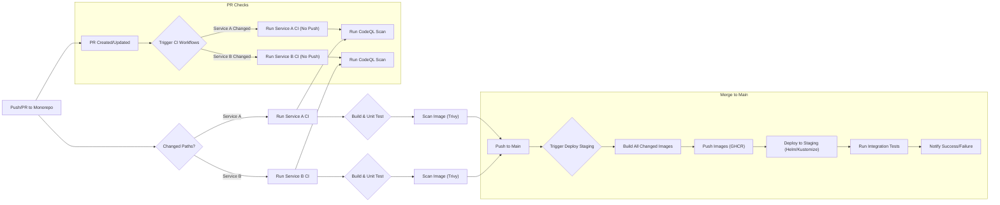
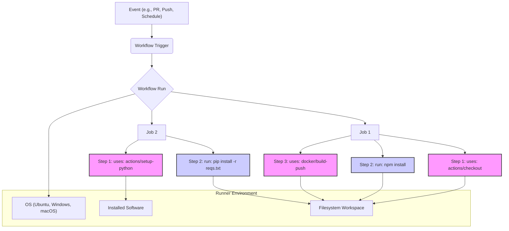

# Chapter 21: Real-World End-to-End Case Studies

Welcome to the final chapter where we synthesize the concepts, patterns, and techniques discussed throughout this book into tangible, end-to-end case studies. Seeing GitHub Actions applied in realistic scenarios helps solidify understanding and provides blueprints you can adapt for your own projects. We'll explore diverse use cases, from complex microservices deployments to open-source project automation, infrastructure management, MLOps, and security-focused pipelines. Each case study highlights specific challenges and how GitHub Actions provides effective solutions.

## A. Case Study 1: CI/CD for a Microservices Application (Kubernetes Target)

Deploying microservices often involves managing multiple independent components, complex dependencies, and consistent environments. GitHub Actions provides the orchestration needed to build, test, and deploy these applications reliably to platforms like Kubernetes.

### A.1. Repository Structure (Monorepo vs. Multi-repo)

The choice between a monorepo (all services in one repository) and a multi-repo (each service in its own repository) significantly impacts the CI/CD strategy.

- **Monorepo:**

  - **Pros:** Atomic commits across services, easier dependency management (within the repo), simplified code sharing, single source of truth for build/deploy logic (potentially).
  - **Cons:** Can become large and slow to clone/build, requires more complex workflow logic to trigger builds only for changed services (using `paths` or `paths-ignore` filters or tools like `nx` or `bazel`), access control can be coarser.
  - **Actions Strategy:** Workflows often use `on.push.paths` or `on.pull_request.paths` to trigger jobs only when specific service directories change. Matrix strategies can be used to build/test multiple services affected by a change.

- **Multi-repo:**
  - **Pros:** Clear ownership boundaries, independent build/deploy lifecycles, smaller repository sizes, fine-grained access control.
  - **Cons:** Cross-service changes require coordinated PRs and deployments, dependency management across repos can be complex (requiring versioning and package management), potential for duplicated workflow logic.
  - **Actions Strategy:** Each repository typically has its own set of workflows tailored to that specific service. Shared logic can be implemented using reusable workflows or custom composite/Docker actions stored in a central repository.

**Decision Factor:** The choice often depends on team size, organizational structure, service coupling, and tooling maturity. For this case study, let's assume a **monorepo** structure to illustrate handling path-based triggers.

```
my-microservices-app/
├── .github/
│   └── workflows/
│       ├── service-a-ci.yml
│       ├── service-b-ci.yml
│       └── deploy-staging.yml
├── services/
│   ├── service-a/
│   │   ├── Dockerfile
│   │   └── src/
│   └── service-b/
│       ├── Dockerfile
│       └── src/
├── infrastructure/
│   └── kubernetes/
│       ├── helm/
│       └── kustomize/
└── README.md
```

### A.2. Build and Test Strategy for Multiple Services

In a monorepo, efficiency is key. We don't want to build and test _all_ services on every commit.

- **Path Filtering:** Use `on.<push|pull_request>.paths` to trigger workflows only when files within a specific service's directory change.
- **Matrix Strategy:** For integration tests or scenarios where multiple services need building, use a matrix strategy to parallelize the build and test process for each service identified as changed. Tools or scripts can be used within a setup job to determine which services were affected by a commit range.
- **Caching:** Implement dependency caching (e.g., `actions/cache` for `npm`, `maven`, `pip`) specific to each service to speed up builds.

**Example: Triggering Service A's CI Workflow**

```yaml
# .github/workflows/service-a-ci.yml
name: Service A CI

on:
  push:
    branches: [main]
    paths:
      - "services/service-a/**"
      - ".github/workflows/service-a-ci.yml" # Trigger if workflow itself changes
  pull_request:
    paths:
      - "services/service-a/**"
      - ".github/workflows/service-a-ci.yml"

jobs:
  build_and_test:
    runs-on: ubuntu-latest
    defaults:
      run:
        working-directory: ./services/service-a # Set working dir for all steps
    steps:
      - name: Checkout code
        uses: actions/checkout@v4

      - name: Set up Node.js (Example)
        uses: actions/setup-node@v4
        with:
          node-version: "18"
          cache: "npm"
          cache-dependency-path: services/service-a/package-lock.json

      - name: Install Dependencies
        run: npm ci

      - name: Run Linters
        run: npm run lint

      - name: Run Unit Tests
        run: npm test
```

### A.3. Docker Image Building and Pushing (GHCR/ECR/etc.)

Once tests pass, the service needs to be containerized.

- **Tools:** Use actions like `docker/setup-qemu-action`, `docker/setup-buildx-action`, `docker/login-action`, and `docker/build-push-action`.
- **Registry Choice:**
  - **GitHub Container Registry (GHCR):** Tightly integrated with GitHub, good permission model linked to repositories/organizations.
  - **Amazon Elastic Container Registry (ECR):** Integrates well with AWS services (EKS, ECS). Requires AWS credentials configuration (e.g., `aws-actions/configure-aws-credentials`).
  - **Azure Container Registry (ACR):** Integrates well with Azure services (AKS). Requires Azure login (e.g., `azure/login`).
  - **Google Artifact Registry (GAR):** Integrates well with GCP services (GKE). Requires GCP authentication (e.g., `google-github-actions/auth`).
- **Tagging Strategy:** Tag images meaningfully, often using the Git SHA, branch name, or Git tag. Use immutable tags for deployments (e.g., `ghcr.io/my-org/service-a:sha-a1b2c3d`). For `main` branch builds, you might also push a `latest` tag.

**Example: Build and Push to GHCR**

```yaml
# (Add to service-a-ci.yml, potentially in a separate job or conditional step)
- name: Log in to GitHub Container Registry
  if: github.event_name == 'push' && github.ref == 'refs/heads/main' # Only push on merge to main
  uses: docker/login-action@v3
  with:
    registry: ghcr.io
    username: ${{ github.repository_owner }}
    password: ${{ secrets.GITHUB_TOKEN }}

- name: Build and push Docker image
  if: github.event_name == 'push' && github.ref == 'refs/heads/main'
  uses: docker/build-push-action@v5
  with:
    context: ./services/service-a # Path to Dockerfile context
    file: ./services/service-a/Dockerfile
    push: true
    tags: |
      ghcr.io/${{ github.repository_owner }}/service-a:${{ github.sha }}
      ghcr.io/${{ github.repository_owner }}/service-a:latest
```

### A.4. Deployment Strategy (Helm/Kustomize, Environment Promotion)

Deploying to Kubernetes typically involves tools like Helm or Kustomize to manage manifests. Environment promotion ensures controlled rollouts.

- **Tools:**
  - **Helm:** Use actions like `azure/setup-helm` and run `helm upgrade --install ...`. Store charts within the repo or use a chart repository. Values files per environment (`values-staging.yaml`, `values-prod.yaml`) are common.
  - **Kustomize:** Use `kubectl apply -k <overlay_directory>`. Overlays for different environments (`kustomize/overlays/staging`, `kustomize/overlays/production`) customize base manifests.
- **Environment Promotion:**
  1.  **Dev/Feature:** Deploy automatically on pushes to feature branches (optional, might use ephemeral environments).
  2.  **Staging:** Deploy automatically on merge to `main` or `develop` branch. Run integration tests against staging.
  3.  **Production:** Trigger deployment manually (using `workflow_dispatch` or deployment environments with required reviewers) or automatically after successful staging validation/delay. Use Git tags to trigger production deployments.
- **Secrets:** Use Kubernetes secrets managed outside the Git repository, injected via tools like Sealed Secrets, HashiCorp Vault injector, or cloud provider secret managers. GitHub Actions secrets should be used for credentials to access the cluster or deployment tools, _not_ for application secrets.

**Example: Conceptual Deployment Workflow Trigger**

```yaml
# .github/workflows/deploy-staging.yml
name: Deploy to Staging

on:
  push:
    branches: [main] # Trigger on merge to main
    paths:
      - "services/**" # Trigger if any service code changes
      - "infrastructure/kubernetes/**" # Trigger if k8s manifests change
      - ".github/workflows/deploy-staging.yml"

jobs:
  deploy:
    runs-on: ubuntu-latest
    environment: staging # Optional: Link to GitHub Environment for protection rules/secrets
    steps:
      - name: Checkout code
        uses: actions/checkout@v4

      - name: Set up Kubectl/Helm/Kustomize
        # (Use relevant setup actions)
        run: echo "Setting up deployment tools..."

      - name: Configure Kubeconfig (using secrets)
        # (Use cloud provider CLI or generic kubeconfig setup)
        run: echo "Configuring cluster access..."
        env:
          KUBE_CONFIG_DATA: ${{ secrets.STAGING_KUBECONFIG }}

      - name: Deploy Service A (using Kustomize example)
        # Determine if service A changed or if infra changed
        # Logic needed here to check changed files if deploying selectively
        run: |
          echo "Deploying Service A to staging..."
          kubectl apply -k infrastructure/kubernetes/kustomize/overlays/staging/service-a --namespace staging

      - name: Deploy Service B (using Helm example)
        run: |
          echo "Deploying Service B to staging..."
          helm upgrade --install service-b infrastructure/kubernetes/helm/service-b \
            --namespace staging \
            -f infrastructure/kubernetes/helm/service-b/values-staging.yaml \
            --set image.tag=${{ github.sha }} # Pass the image tag built earlier

      # ... potentially run smoke tests ...
```

### A.5. Integration Testing Setup

After deploying changes (especially to staging), run integration tests that verify interactions _between_ services.

- **Triggering:** Run as a separate workflow triggered by `workflow_run` after a successful deployment workflow, or as a final job in the deployment workflow.
- **Test Runner:** Use a standard testing framework (e.g., Pytest, Jest, Go test) executed from within a workflow job.
- **Targeting:** Configure the tests to target the staging environment's ingress or service endpoints.
- **Test Data:** Manage test data setup and teardown carefully.

### A.6. Security Scanning Integration (CodeQL, Trivy/Grype)

Integrate security scanning early and often.

- **SAST (Static Application Security Testing):**
  - **CodeQL:** Use `github/codeql-action` to analyze code for vulnerabilities on PRs and pushes. Configure for relevant languages.
- **Container Image Scanning:**
  - **Trivy/Grype:** Use actions like `aquasecurity/trivy-action` or `anchore/grype-action` after building the Docker image but _before_ pushing (or scan after pushing). Fail the build if critical vulnerabilities are found.
- **SCA (Software Composition Analysis):** Scan dependencies (covered more in Case Study E).

**Example: Integrating Trivy Scan**

```yaml
# (Add to service-a-ci.yml, after build, before push)
- name: Scan image for vulnerabilities
  uses: aquasecurity/trivy-action@master # Use specific version in production
  with:
    image-ref: "ghcr.io/${{ github.repository_owner }}/service-a:${{ github.sha }}" # Temporary tag used locally before push
    format: "table"
    exit-code: "1" # Fail workflow if vulnerabilities found
    ignore-unfixed: true
    vuln-type: "os,library"
    severity: "CRITICAL,HIGH"
    # You might need to build the image locally first without pushing
    # Or adjust the step order depending on your exact flow
```

### A.7. Monitoring and Alerting Setup

While full monitoring setup is outside the scope of Actions, workflows can _integrate_ with monitoring systems.

- **Deployment Notifications:** Send notifications to Slack, Teams, etc., on successful or failed deployments using actions like `slackapi/slack-github-action`.
- **Annotation:** Use `kubectl annotate` during deployment to mark deployments with Git SHA or other metadata, aiding correlation in monitoring tools (like Datadog, Grafana).
- **Health Checks:** Include steps in deployment workflows to check application health endpoints after deployment before marking the job successful.



**Diagram Explanation:** This diagram illustrates a potential CI/CD flow for a microservices application in a monorepo. Pull Requests trigger individual service CI pipelines including tests and security scans. Merges to the main branch trigger a deployment workflow that builds necessary images, pushes them to a registry, deploys to a staging environment using Helm/Kustomize, runs integration tests, and sends notifications.

##### [Production Note: Lessons learned from managing microservices CI/CD]

> Managing CI/CD for microservices, especially in a monorepo, requires careful planning. Key lessons include:
>
> - **Invest in Change Detection:** Accurately determining which services _need_ to be rebuilt/redeployed is crucial for performance and stability. Simple `paths` filters are a start, but complex dependencies might require more sophisticated tooling (e.g., `nx affected`, custom scripting).
> - **Standardize Workflow Patterns:** Use reusable workflows or composite actions heavily to avoid duplicating logic (build, scan, deploy steps) across dozens of service workflows.
> - **Environment Parity is Hard but Necessary:** Keep staging as close to production as possible. Use the same deployment tooling (Helm/Kustomize) and configuration strategies.
> - **Observability is Key:** Ensure deployments update monitoring dashboards and alerts are configured. Tracing deployment metadata (Git SHA, workflow run ID) through logs and metrics is invaluable for debugging.
> - **Rollback Strategy:** Define and test your rollback strategy. Can you easily redeploy the previous working version? Automate this if possible.

## B. Case Study 2: Automating Open Source Project Maintenance

GitHub Actions is a powerful ally for maintainers of open-source software (OSS) projects, automating repetitive tasks and ensuring code quality.

### B.1. Linting, Testing, Coverage Reports on PRs

This is the foundation of OSS automation – ensuring contributions meet project standards before merging.

- **Triggers:** `on: [pull_request]` targeting the main development branches.
- **Jobs:**
  - **Linting:** Run linters (ESLint, Flake8, RuboCop, etc.) to enforce code style.
  - **Testing:** Execute the project's test suite (unit, integration). Use a matrix strategy (`strategy.matrix`) to test across different operating systems (`ubuntu-latest`, `windows-latest`, `macos-latest`) and dependency versions (e.g., Node.js, Python versions).
  - **Code Coverage:** Generate coverage reports (e.g., using `pytest-cov`, `nyc`) and upload them as artifacts (`actions/upload-artifact`). Consider using services like Codecov or Coveralls (`codecov/codecov-action`) to display coverage information directly on the PR.

**Practical Example: Basic PR Check Workflow**

```yaml
# .github/workflows/pr-checks.yml
name: PR Checks

on: [pull_request]

jobs:
  test:
    runs-on: ubuntu-latest
    strategy:
      matrix:
        node-version: [16, 18, 20] # Example: Test on multiple Node versions
    steps:
      - uses: actions/checkout@v4
      - name: Use Node.js ${{ matrix.node-version }}
        uses: actions/setup-node@v4
        with:
          node-version: ${{ matrix.node-version }}
          cache: "npm"

      - name: Install dependencies
        run: npm ci

      - name: Run linter
        run: npm run lint

      - name: Run tests
        run: npm test

      # Optional: Add coverage reporting step here
      # - name: Upload coverage report
      #   uses: actions/upload-artifact@v4
      #   with:
      #     name: coverage-report-${{ matrix.node-version }}
      #     path: ./coverage/ # Path to coverage output directory
```

### B.2. Automated Release Process (Changelog Generation, GitHub Releases, Package Publishing)

Manually creating releases, generating changelogs, and publishing packages is tedious and error-prone. Actions can automate this entire process.

- **Trigger:** `on: release: { types: [published] }` or `on: push: { tags: ['v*.*.*'] }`. Using tags is very common.
- **Steps:**
  1.  **Checkout Code:** `actions/checkout@v4` (ensure you fetch tags: `fetch-depth: 0`).
  2.  **Setup Environment:** Install necessary tools (Node.js, Python, Go, etc.).
  3.  **(Optional) Build Project:** Create distributable files if needed.
  4.  **Generate Changelog:** Use tools like `conventional-changelog-cli` or actions like `release-drafter/release-drafter` (often run on PR merges to draft the _next_ release) or `antoinezanardi/read-changelog-action` to extract release notes.
  5.  **Create GitHub Release:** Use `actions/create-release` or `softprops/action-gh-release` to create a formal GitHub Release, attaching build artifacts and changelog notes. If triggering on `release: [published]`, this step might be skipped or used to _update_ the release.
  6.  **Publish Package:** Use appropriate commands/actions to publish to package managers (npm, PyPI, RubyGems, Maven Central, Docker Hub/GHCR). Requires secrets for authentication tokens.



**Diagram Explanation:** This diagram shows the core components involved in a GitHub Actions workflow run. An event triggers the workflow, which initiates a run containing one or more jobs. Each job runs on a runner (with a specific OS and software) and executes a series of steps. Steps can be `uses` (referencing an action) or `run` (executing shell commands), interacting with the runner's filesystem and environment.

### B.3. Issue/PR Triage and Labeling Automation

Help manage the influx of issues and PRs.

- **Labeling:**
  - `actions/labeler`: Automatically adds labels based on changed file paths (e.g., label `bug` if files in `src/core/` change, label `documentation` if `.md` files change). Configure in `.github/labeler.yml`.
  - Label based on content: Use actions that parse issue/PR bodies for keywords.
- **Triage:**
  - `actions/stale`: Mark old, inactive issues/PRs as stale and close them after a grace period. Highly configurable.
  - Assign issues based on labels or paths (requires more complex actions or GitHub Apps).

**Example: Stale Bot Configuration**

```yaml
# .github/workflows/stale.yml
name: Mark stale issues and pull requests

on:
  schedule:
    - cron: "30 1 * * *" # Run daily at 1:30 AM UTC

jobs:
  stale:
    runs-on: ubuntu-latest
    permissions:
      issues: write
      pull-requests: write
    steps:
      - uses: actions/stale@v9
        with:
          repo-token: ${{ secrets.GITHUB_TOKEN }}
          stale-issue-message: "This issue is stale because it has been open 60 days with no activity. Remove stale label or comment or this will be closed in 7 days."
          stale-pr-message: "This PR is stale because it has been open 30 days with no activity. Remove stale label or comment or this will be closed in 7 days."
          days-before-stale: 60 # Issues
          days-before-pr-stale: 30 # PRs
          days-before-close: 7
          stale-issue-label: "stale"
          stale-pr-label: "stale"
          # exempt-issue-labels: 'pinned,security' # Optional: labels to ignore
```

### B.4. Welcoming New Contributors

Make first-time contributors feel welcome and guide them.

- **Action:** Use actions like `actions/first-interaction` to post a welcoming comment on a contributor's first issue, PR, or comment.
- **Content:** Customize the message to thank them, point to contribution guidelines, codes of conduct, and relevant documentation.

**Example: First Interaction Workflow**

```yaml
# .github/workflows/welcome.yml
name: Welcome New Contributors

on:
  pull_request_target: # Use pull_request_target for permissions on first PRs
    types: [opened]
  issues:
    types: [opened]

permissions:
  pull-requests: write
  issues: write

jobs:
  welcome:
    runs-on: ubuntu-latest
    steps:
      - uses: actions/first-interaction@v1
        with:
          repo-token: ${{ secrets.GITHUB_TOKEN }}
          issue-message: |
            👋 Welcome and thanks for opening your first issue here!
            Be sure to follow the issue template and check out our contributing guidelines.
          pr-message: |
            👋 Welcome and thanks for opening your first pull request! 🎉
            Please ensure your PR follows our contribution guidelines and includes tests. A maintainer will review it shortly.
```

### B.5. Dependabot Configuration

Keep dependencies up-to-date automatically. While configured via `.github/dependabot.yml` and not strictly a workflow _file_, Dependabot integrates tightly with Actions (PRs trigger CI checks).

- **Configuration (`.github/dependabot.yml`):**
  - Define package ecosystems (`npm`, `pip`, `maven`, `gomod`, `github-actions`, etc.).
  - Specify the directory for manifests (`package.json`, `requirements.txt`).
  - Set the update schedule (`daily`, `weekly`, `monthly`).
  - Assign reviewers or labels automatically.
  - Configure versioning strategies (e.g., ignore patch releases).

**Example: `dependabot.yml`**

```yaml
# .github/dependabot.yml
version: 2
updates:
  # Maintain dependencies for npm
  - package-ecosystem: "npm"
    directory: "/" # Location of package manifests
    schedule:
      interval: "daily"
    labels:
      - "dependencies"
      - "javascript"
    reviewers:
      - "octocat" # Assign a reviewer

  # Maintain dependencies for GitHub Actions
  - package-ecosystem: "github-actions"
    directory: "/"
    schedule:
      interval: "weekly"
    labels:
      - "dependencies"
      - "github_actions"
```

##### [Code Snippet: Workflow for automated npm package publishing on release tag]

```yaml
# .github/workflows/publish-npm.yml
name: Publish Node.js Package to npmjs

on:
  push:
    tags:
      - "v*.*.*" # Trigger on version tags like v1.0.0

jobs:
  build-and-publish:
    runs-on: ubuntu-latest
    permissions:
      contents: read # Needed to check out the code
      id-token: write # Needed for OIDC publishing (recommended)
    steps:
      - name: Checkout code
        uses: actions/checkout@v4
        with:
          fetch-depth: 0 # Fetch all history for version determination if needed

      - name: Set up Node.js
        uses: actions/setup-node@v4
        with:
          node-version: "18" # Use the Node version required by your project
          registry-url: "https://registry.npmjs.org" # Point to the npm registry
          cache: "npm"

      - name: Install dependencies
        run: npm ci

      - name: Build package (if necessary)
        run: npm run build --if-present # Run build script if it exists

      # Option 1: Publish using Node.js native OIDC token (Recommended)
      # Requires configuring "Trusted Publishers" in your npm package settings
      - name: Publish package to npmjs (OIDC)
        run: npm publish --provenance --access public

      # Option 2: Publish using NPM_TOKEN secret (Less Secure)
      # - name: Publish package to npmjs (Token)
      #   run: npm publish --access public
      #   env:
      #     NODE_AUTH_TOKEN: ${{ secrets.NPM_TOKEN }} # Store your npm token as a secret
```

> **Note:** Using OIDC (`--provenance`) is the modern, more secure way to publish to npm from Actions, as it avoids storing long-lived tokens as secrets. It requires initial setup on the npmjs website under your package settings to trust GitHub Actions OIDC.

## C. Case Study 3: Infrastructure as Code (IaC) Pipeline with Terraform/Pulumi

Managing infrastructure using code (Terraform, Pulumi, CloudFormation, Bicep) benefits greatly from CI/CD automation provided by GitHub Actions. This ensures infrastructure changes are tested, reviewed, and applied consistently.

### C.1. Branching Strategy for Infrastructure Changes (e.g., Gitflow)

A structured branching strategy is crucial for managing infrastructure changes safely.

- **Gitflow Adaptation:**
  - `main`: Represents the state of production infrastructure. Merges here trigger production deployments (often with manual approval).
  - `develop`: Represents the state of staging/development infrastructure. Merges here trigger staging deployments.
  - `feature/<name>`: Branched from `develop` for new infrastructure components or significant changes. PRs target `develop`.
  - `hotfix/<name>`: Branched from `main` for urgent production fixes. PRs target both `main` and `develop`.
- **Simpler Trunk-Based:**
  - `main`: Represents the desired state. All changes go through PRs targeting `main`.
  - Use deployment environments (e.g., `staging`, `production`) with protection rules (required reviews, wait timers) to control promotion. PRs trigger plans against staging, merges trigger applies to staging, manual approval triggers applies to production.

For this case study, let's assume a **Trunk-Based** model with environment protection.

### C.2. Automated Planning on PRs

Before merging any infrastructure change, preview its impact.

- **Trigger:** `on: [pull_request]` targeting the `main` branch.
- **Tools:** Terraform (`terraform plan`), Pulumi (`pulumi preview`).
- **Steps:**
  1.  Checkout code.
  2.  Set up Terraform/Pulumi CLI (`hashicorp/setup-terraform`, `pulumi/actions`).
  3.  Configure cloud credentials (e.g., `aws-actions/configure-aws-credentials`, `azure/login`, `google-github-actions/auth`). Use OIDC for short-lived credentials if possible.
  4.  Run `terraform init` or `pulumi login`.
  5.  Run `terraform plan -out=tfplan` or `pulumi preview`.
  6.  **(Optional but Recommended)** Add plan output to the PR comment for review. Actions like `github-actions-iac/terraform-plan-comment` or custom scripts can achieve this. Format the output clearly (e.g., within collapsible sections).
  7.  **(Optional)** Upload the plan file (`tfplan`) as an artifact for potential use in the apply step (ensures the applied plan matches the reviewed plan).

**Example: Terraform Plan on PR**

```yaml
# .github/workflows/terraform-plan.yml
name: Terraform Plan

on:
  pull_request:
    paths:
      - "infrastructure/**" # Only run if IaC files change
      - ".github/workflows/terraform-plan.yml"

permissions:
  id-token: write # Required for OIDC
  contents: read
  pull-requests: write # Required for adding plan comments

jobs:
  plan:
    runs-on: ubuntu-latest
    defaults:
      run:
        working-directory: ./infrastructure # Assuming Terraform code is here
    steps:
      - name: Checkout code
        uses: actions/checkout@v4

      - name: Configure AWS Credentials (OIDC)
        uses: aws-actions/configure-aws-credentials@v4
        with:
          role-to-assume: arn:aws:iam::111122223333:role/GitHubActionsTerraformRole # Replace with your OIDC role ARN
          aws-region: us-east-1

      - name: Setup Terraform
        uses: hashicorp/setup-terraform@v3
        with:
          terraform_version: 1.6.0 # Pin version

      - name: Terraform Init
        id: init
        run: terraform init

      - name: Terraform Validate
        id: validate
        run: terraform validate -no-color

      - name: Terraform Plan
        id: plan
        run: terraform plan -no-color -out=tfplan
        continue-on-error: true # Allow plan formatting even if plan fails initially

      - name: Upload Plan Artifact
        uses: actions/upload-artifact@v4
        with:
          name: tfplan
          path: infrastructure/tfplan

      # Example using a dedicated action for PR comments
      - name: Update PR comment with Terraform Plan
        uses: actions/github-script@v7
        if: github.event_name == 'pull_request'
        env:
          PLAN: "terraform\n${{ steps.plan.outputs.stdout }}"
        with:
          github-token: ${{ secrets.GITHUB_TOKEN }}
          script: |
            const output = `#### Terraform Format and Style 🖌\`${{ steps.fmt.outcome }}\`
            #### Terraform Initialization ⚙️\`${{ steps.init.outcome }}\`
            #### Terraform Validation 🤖\`${{ steps.validate.outcome }}\`
            <details><summary>Validation Output</summary>

            \`\`\`\n
            ${{ steps.validate.outputs.stdout }}
            \`\`\`

            </details>
            #### Terraform Plan 📖\`${{ steps.plan.outcome }}\`

            <details><summary>Show Plan</summary>

            \`\`\`${process.env.PLAN}\`\`\`

            </details>

            *Pushed by: @${{ github.actor }}, Action: \`${{ github.event_name }}\`*`;

            const issue_number = context.issue.number;
            const repo_owner = context.repo.owner;
            const repo_repo = context.repo.repo;

            // Find existing bot comment
            const comments = await github.rest.issues.listComments({
              owner: repo_owner,
              repo: repo_repo,
              issue_number: issue_number,
            });
            const botComment = comments.data.find(comment =>
              comment.user.login === 'github-actions[bot]' && comment.body.includes('Terraform Plan')
            );

            // Update existing comment or create a new one
            if (botComment) {
              await github.rest.issues.updateComment({
                owner: repo_owner,
                repo: repo_repo,
                comment_id: botComment.id,
                body: output
              });
            } else {
              await github.rest.issues.createComment({
                owner: repo_owner,
                repo: repo_repo,
                issue_number: issue_number,
                body: output
              });
            }
```

### C.3. Manual Approval Gate for Production Apply

Applying infrastructure changes directly to production automatically is risky. Use GitHub Environments with protection rules.

- **Environment Setup:** Create a "production" environment in your repository settings (Settings -> Environments).
- **Protection Rules:** Configure the environment to require approval from specific users or teams. You can also add wait timers.
- **Workflow:** Create a separate workflow triggered on pushes to `main` (or manually via `workflow_dispatch`). This workflow targets the "production" environment.

**Example: Terraform Apply Workflow with Manual Approval**

```yaml
# .github/workflows/terraform-apply.yml
name: Terraform Apply

on:
  push:
    branches: [main] # Trigger on merge to main
    paths:
      - "infrastructure/**"
      - ".github/workflows/terraform-apply.yml"
  workflow_dispatch: # Allow manual trigger

permissions:
  id-token: write # Required for OIDC
  contents: read

jobs:
  apply:
    runs-on: ubuntu-latest
    environment:
      name: production # Target the protected environment
      url: https://my-app-prod.example.com # Optional: Link to the deployed env
    defaults:
      run:
        working-directory: ./infrastructure
    steps:
      - name: Checkout code
        uses: actions/checkout@v4

      - name: Configure AWS Credentials (OIDC)
        uses: aws-actions/configure-aws-credentials@v4
        with:
          role-to-assume: arn:aws:iam::111122223333:role/GitHubActionsTerraformRole # Use appropriate role for apply
          aws-region: us-east-1

      - name: Setup Terraform
        uses: hashicorp/setup-terraform@v3
        with:
          terraform_version: 1.6.0

      # Optional: Download and use the plan from the PR workflow
      # - name: Download Plan Artifact
      #   uses: actions/download-artifact@v4
      #   with:
      #     name: tfplan # Must match the upload name
      #     path: infrastructure/

      - name: Terraform Init
        run: terraform init

      # If using downloaded plan:
      # - name: Terraform Apply from Plan
      #   run: terraform apply -auto-approve tfplan
      # If not using downloaded plan (re-plans implicitly):
      - name: Terraform Apply
        run: terraform apply -auto-approve -no-color
```

When this workflow runs, it will pause before executing the `apply` job, waiting for an authorized user to approve it via the GitHub UI.

### C.4. State Management Strategy

Terraform and Pulumi rely on state files to track resources. Managing this state correctly is critical.

- **Remote Backends:** **Never** commit state files directly to Git. Use remote backends:
  - **Terraform:** S3 (with DynamoDB for locking), Azure Blob Storage, Google Cloud Storage, Terraform Cloud/Enterprise. Configure in the `backend` block of your Terraform code.
  - **Pulumi:** Pulumi Service (default, managed), S3, Azure Blob, Google Cloud Storage. Configure via `pulumi login <backend_url>`.
- **Consistency:** Ensure all workflow runs (plan, apply) use the _same_ configured backend. The `terraform init` or `pulumi login` step handles this.
- **Locking:** Use backends that support state locking (most cloud storage backends when configured correctly, Terraform Cloud, Pulumi Service) to prevent concurrent runs from corrupting the state. Actions workflows automatically run one at a time per branch by default, but explicit locking adds safety.

### C.5. Policy as Code Integration (e.g., Open Policy Agent)

Enforce organizational standards, security best practices, and cost controls on infrastructure changes _before_ they are applied.

- **Tools:**
  - **Open Policy Agent (OPA) with Conftest:** Write policies in Rego language to test Terraform/Pulumi plan JSON output or the IaC code itself.
  - **Checkov:** Static analysis tool for IaC (Terraform, CloudFormation, etc.) focusing on security misconfigurations.
  - **Terrascan:** Detects security vulnerabilities and compliance violations.
  - **Cloud Provider Tools:** Sentinel (Terraform Cloud/Enterprise), AWS Config Rules, Azure Policy, Google Cloud Security Command Center.
- **Integration:** Add a step in the `terraform-plan.yml` workflow (after `terraform plan`) to run the policy check.
  1.  Generate plan output in JSON format (`terraform show -json tfplan > plan.json` or `pulumi preview --json > preview.json`).
  2.  Run the policy tool against the JSON output (e.g., `conftest test plan.json`).
  3.  Fail the workflow if policies are violated.

**Example: Adding Conftest Check**

```yaml
# (Add to terraform-plan.yml job, after 'Terraform Plan' step)

- name: Generate Plan JSON
  id: plan-json
  run: terraform show -json tfplan > plan.json
  # Ensure tfplan was created successfully before this step

- name: Download Conftest
  run: |
    wget https://github.com/open-policy-agent/conftest/releases/download/v0.XX.Y/conftest_0.XX.Y_Linux_x86_64.tar.gz
    tar xzf conftest_*.tar.gz
    sudo mv conftest /usr/local/bin/
  # Replace 0.XX.Y with the desired Conftest version

- name: Run Conftest Policy Checks
  run: conftest test plan.json -p path/to/your/rego/policies
  # Fail the job if policies fail
```

##### [Deep Dive: Implementing drift detection for IaC]

> Infrastructure drift occurs when the actual state of your cloud resources diverges from the state defined in your IaC code. This can happen due to manual changes, automated processes outside of IaC, or resource modifications made by cloud provider services. Detecting drift is crucial for maintaining consistency and security.
>
> **How to Implement with GitHub Actions:**
>
> 1.  **Scheduled Workflow:** Create a workflow that runs on a schedule (e.g., daily).
>
>     ```yaml
>     # .github/workflows/terraform-drift-check.yml
>     name: Terraform Drift Detection
>
>     on:
>       schedule:
>         - cron: "0 6 * * *" # Run daily at 6 AM UTC
>       workflow_dispatch: # Allow manual trigger
>
>     permissions:
>       id-token: write # Required for OIDC
>       contents: read
>       issues: write # Optional: for creating issues on drift
>
>     jobs:
>       drift_check:
>         runs-on: ubuntu-latest
>         defaults:
>           run:
>             working-directory: ./infrastructure
>         steps:
>           - name: Checkout code
>             uses: actions/checkout@v4
>
>           - name: Configure AWS Credentials (OIDC)
>             uses: aws-actions/configure-aws-credentials@v4
>             with:
>               role-to-assume: arn:aws:iam::111122223333:role/GitHubActionsTerraformRole # Read-only role might suffice
>               aws-region: us-east-1
>
>           - name: Setup Terraform
>             uses: hashicorp/setup-terraform@v3
>             with:
>               terraform_version: 1.6.0
>
>           - name: Terraform Init
>             run: terraform init
>
>           - name: Terraform Plan for Drift Detection
>             id: plan
>             run: terraform plan -detailed-exitcode -no-color
>             continue-on-error: true # Important: Plan will exit with 2 if drift is detected
>
>           - name: Check Plan Exit Code
>             run: |
>               echo "Terraform Plan Exit Code: ${{ steps.plan.exit-code }}"
>               if [[ "${{ steps.plan.exit-code }}" == "1" ]]; then
>                 echo "::error::Terraform Plan failed!"
>                 exit 1
>               elif [[ "${{ steps.plan.exit-code }}" == "2" ]]; then
>                 echo "::warning::Infrastructure drift detected!"
>                 # Add logic here to notify or create an issue
>                 # Example: Create GitHub Issue (requires more scripting)
>                 # gh issue create --title "Infrastructure Drift Detected (`date`)" --body "Drift detected by scheduled workflow. Review plan output in Actions run." --label "drift"
>                 # exit 1 # Optionally fail the workflow on drift
>               else
>                 echo "No drift detected."
>               fi
>     ```
>
> 2.  **`terraform plan -detailed-exitcode`:** This command is key. It exits with:
>     - `0`: Success, no changes (no drift).
>     - `1`: Error.
>     - `2`: Success, but changes are proposed (drift detected).
> 3.  **Handle Exit Code:** The workflow checks the exit code of the plan step.
> 4.  **Notification/Action:** If the exit code is `2`, trigger a notification (Slack, Teams), create a GitHub issue, or even attempt an automated remediation (with extreme caution). Failing the workflow run (`exit 1`) makes drift visible in Actions UI.
>
> **Considerations:**
>
> - **Permissions:** The role used for drift detection ideally only needs read-only access to cloud resources.
> - **Noise:** Some drift might be expected or benign. Fine-tune notifications or use `ignore_changes` in Terraform if necessary.
> - **Frequency:** Balance the need for timely detection with cost (API calls) and noise. Daily or weekly checks are common starting points.
> - **Pulumi:** Use `pulumi refresh` followed by `pulumi preview`. `pulumi preview` exits with 0 if no changes are pending, non-zero otherwise. You'd check the output/exit code similarly.

## D. Case Study 4: Machine Learning Operations (MLOps) Pipeline

MLOps applies DevOps principles to machine learning workflows. GitHub Actions can orchestrate the steps involved in training, evaluating, versioning, and deploying ML models.

### D.1. Data Validation and Preparation Steps

Ensuring data quality is paramount in ML.

- **Trigger:** Can be scheduled, triggered by changes in data storage (e.g., S3 event triggering a webhook), or manually.
- **Tools:** Great Expectations, Pandera, custom scripts.
- **Steps:**
  1.  Checkout code (containing validation logic/scripts).
  2.  Access data (download from S3, GCS, DB query). Requires credentials.
  3.  Run data validation checks (e.g., `great_expectations checkpoint run my_checkpoint`).
  4.  Fail the workflow if validation fails critical expectations.
  5.  Perform data preparation/feature engineering (e.g., run Python/R scripts).
  6.  Upload processed data/features to a designated location (e.g., versioned S3 path) or pass path as output to the next job.

### D.2. Model Training (Potentially on Self-Hosted GPU Runners)

The core training process.

- **Trigger:** Often follows successful data validation/preparation, or triggered manually/on code changes.
- **Compute:**
  - **GitHub-Hosted Runners:** Suitable for smaller datasets/models or CPU-intensive tasks.
  - **Self-Hosted Runners:** Necessary for GPU acceleration (common in deep learning) or for access to specific hardware/VPCs. Set up runners on machines with GPUs (cloud VMs, on-prem) and label them (e.g., `gpu`). Use the `runs-on: [self-hosted, gpu]` label in the workflow job.
- **Steps:**
  1.  Checkout training code.
  2.  Set up environment (Python, R, CUDA drivers if self-hosted GPU).
  3.  Download processed data.
  4.  Run the training script (e.g., `python train.py --data_path ... --output_path ...`).
  5.  Log metrics during training (using MLflow, Weights & Biases, TensorBoard). Actions can potentially install and configure these logging clients.
  6.  Save the trained model file(s) and potentially evaluation metrics.
  7.  Upload model files and metrics as artifacts.

**Example Snippet: Targeting GPU Runner**

```yaml
jobs:
  train_model:
    # Ensure you have self-hosted runners registered with the 'gpu' label
    runs-on: [self-hosted, gpu]
    container: # Optional: Run in a Docker container with CUDA toolkit pre-installed
      image: nvidia/cuda:11.8.0-cudnn8-runtime-ubuntu20.04
    steps:
      - name: Checkout code
        uses: actions/checkout@v4

      - name: Set up Python
        uses: actions/setup-python@v5
        with:
          python-version: "3.9"

      - name: Install Dependencies (inside container or on runner)
        run: pip install -r requirements.txt

      - name: Download Processed Data
        # (Use aws s3 cp, gsutil cp, etc.)
        run: echo "Downloading data..."

      - name: Run Training Script
        run: python train.py --params config.yaml

      - name: Upload Model Artifact
        uses: actions/upload-artifact@v4
        with:
          name: trained-model
          path: ./outputs/model.pkl # Path to your saved model
```

### D.3. Model Versioning and Registration

Track trained models systematically.

- **Tools:** MLflow Tracking Server, DVC (Data Version Control), custom artifact naming/tagging conventions, cloud provider ML services (SageMaker Model Registry, Vertex AI Model Registry, Azure ML Model Registry).
- **Integration:**
  - **MLflow:** Configure the training script to log the model to an MLflow Tracking Server using `mlflow.log_model()`. The server handles versioning.
  - **DVC:** Use `dvc add model.pkl` and `dvc push` within the workflow to version the model file using DVC's Git integration and remote storage.
  - **Artifacts + Tags:** Upload the model artifact with a specific name (e.g., `model-${{ github.sha }}.pkl`). Use Git tags (`v1.0.0-model`) to mark commits associated with specific model versions.
  - **Cloud Registries:** Use cloud provider CLIs/SDKs within the workflow to register the uploaded model artifact (e.g., `aws sagemaker create-model`, `az ml model create`).

### D.4. Automated Model Deployment (e.g., Sagemaker, Kubeflow)

Deploy the validated and versioned model for inference.

- **Trigger:** Successful model training/registration, manual trigger (`workflow_dispatch`), Git tag push.
- **Targets:** AWS SageMaker endpoints, Google Vertex AI endpoints, Azure ML endpoints, Kubeflow/KServe on Kubernetes, custom API service.
- **Steps:**
  1.  Checkout deployment configuration/code.
  2.  Retrieve the specific model version to deploy (from registry, artifact store, DVC).
  3.  Configure cloud credentials.
  4.  Use cloud provider CLIs/SDKs or `kubectl`/`kustomize` to create/update the deployment endpoint, pointing it to the new model version.
  5.  Perform smoke tests against the new endpoint.
  6.  (Optional) Implement canary or blue/green deployment strategies.

### D.5. Continuous Training Triggers

Retrain models automatically when needed.

- **Triggers:**
  - **Schedule:** `on: schedule: { cron: '0 0 * * 0' }` (e.g., weekly retraining).
  - **Data Changes:** More complex. Requires external monitoring of data sources (e.g., S3 event notifications -> trigger repository dispatch -> trigger workflow).
  - **Model Performance Degradation:** Requires external monitoring of deployed model predictions -> trigger repository dispatch if metrics fall below threshold.
  - **Code Changes:** `on: push: { paths: ['src/training/**'] }`.

##### [Note: Further author detail needed for MLOps specifics]

> The specifics of implementing a full MLOps pipeline can vary significantly based on the chosen tools (MLflow, Kubeflow, DVC, cloud provider services), model types, data scale, and team practices. This case study provides a high-level framework using GitHub Actions for orchestration. Detailed implementation would require deeper dives into configuring specific MLOps tools, managing GPU environments, advanced data versioning strategies, and robust model monitoring setups, which are beyond the scope of this introductory Actions chapter but build upon the principles shown here.

## E. Case Study 5: Security-Focused DevSecOps Pipeline

Integrating security seamlessly into the development lifecycle (DevSecOps) is critical. GitHub Actions is ideal for automating various security checks throughout the CI/CD process.

### E.1. Integrating SAST (CodeQL), DAST, IAST Tools

Find vulnerabilities at different stages.

- **SAST (Static Application Security Testing):** Analyzes source code without executing it.
  - **Tool:** GitHub CodeQL (`github/codeql-action`).
  - **Integration:** Run on `pull_request` and `push` to main branches. Configure languages. Results appear in the "Security" tab and potentially on the PR.
  - **Other Tools:** SonarQube/SonarCloud (`sonarsource/sonarqube-scan-action`), Checkmarx, Snyk Code. Often run similarly on PRs/pushes.
- **DAST (Dynamic Application Security Testing):** Tests the _running_ application from the outside.
  - **Tools:** OWASP ZAP (` zaproxy/action-baseline` or `zaproxy/action-full-scan`), Burp Suite.
  - **Integration:** Run against a deployed instance (e.g., staging environment) after deployment. Requires the application to be running and accessible. Can be a separate workflow triggered by `workflow_run` after deployment.
- **IAST (Interactive Application Security Testing):** Uses instrumentation within the running application during functional tests.
  - **Tools:** Requires agents from vendors like Contrast Security, Checkmarx, Veracode.
  - **Integration:** Instrument the application build or runtime environment, then run existing functional/integration tests. The IAST agent reports findings during the test execution. Setup is tool-specific.

**Example: Adding CodeQL**

```yaml
# .github/workflows/security-scans.yml
name: Security Scans

on:
  push:
    branches: [main]
  pull_request:
    branches: [main]
  schedule:
    - cron: "20 7 * * 1" # Weekly full scan

jobs:
  codeql:
    runs-on: ubuntu-latest
    permissions:
      security-events: write # Required to upload results to Security tab
      actions: read # Required for checkout
      contents: read # Required for checkout
    steps:
      - name: Checkout repository
        uses: actions/checkout@v4

      # Initializes the CodeQL tools for scanning.
      - name: Initialize CodeQL
        uses: github/codeql-action/init@v3
        with:
          languages: javascript,python # Specify languages to analyze

      # Autobuild attempts to build any compiled languages (C/C++, C#, Go, Java).
      # If this step fails, change it to your custom build steps here.
      - name: Autobuild
        uses: github/codeql-action/autobuild@v3

      - name: Perform CodeQL Analysis
        uses: github/codeql-action/analyze@v3
```

### E.2. Software Composition Analysis (SCA) with Dependency Check/Snyk

Find known vulnerabilities in open-source dependencies.

- **Tools:** OWASP Dependency-Check (`dependency-check-action`), Snyk (`snyk/actions/python`, `snyk/actions/node`, etc.), Dependabot Alerts (built into GitHub), Trivy (can scan dependencies too).
- **Integration:** Run after installing dependencies in the CI workflow (on PRs and pushes). Fail the build if high/critical severity vulnerabilities are found in direct or transitive dependencies.

**Example: Using Snyk Action (Node.js)**

```yaml
# (Add to a CI workflow after 'npm ci')
- name: Install Snyk CLI
  run: npm install -g snyk

- name: Run Snyk to check for vulnerabilities
  run: snyk test --severity-threshold=high --fail-on=all # Fail on all issues above threshold
  env:
    SNYK_TOKEN: ${{ secrets.SNYK_TOKEN }} # Store Snyk API token as secret
```

### E.3. Container Image Scanning

Scan Docker images for OS and application library vulnerabilities.

- **Tools:** Trivy (`aquasecurity/trivy-action`), Grype (`anchore/grype-action`), Clair, Snyk Container, cloud provider scanners (ECR Scan, ACR Defender, Google Container Scanning).
- **Integration:** Run _after_ the `docker build` step but _before_ the `docker push` step. Fail the workflow if critical vulnerabilities are found. Can also be configured in the registry to scan on push.

**(See Example in Case Study A.6)**

### E.4. Secret Scanning Integration

Prevent secrets (API keys, passwords, tokens) from being committed to Git.

- **Tools:**
  - **GitHub Secret Scanning:** Built-in feature for public repos (automatic) and available for private repos with GitHub Advanced Security (GHAS). Scans Git history on push.
  - **GitGuardian:** (`gitguardian/ggshield-action`).
  - **TruffleHog:** (`trufflesecurity/trufflehog`).
- **Integration:** Run as a pre-commit hook locally (ideal) and/or as a check on PRs/pushes within GitHub Actions. Fail the build immediately if secrets are detected.

**Example: Using GitGuardian Shield Action**

```yaml
# (Add to a security or main CI workflow)
jobs:
  scan_secrets:
    runs-on: ubuntu-latest
    steps:
      - name: Checkout code
        uses: actions/checkout@v4
        with:
          fetch-depth: 0 # Required to scan entire history

      - name: Run GitGuardian ggshield
        uses: GitGuardian/ggshield-action@v1 # Use specific version
        env:
          GITHUB_PUSH_BEFORE_SHA: ${{ github.event.before }}
          GITHUB_PUSH_BASE_SHA: ${{ github.event.base_ref }}
          GITHUB_PULL_BASE_SHA: ${{ github.event.pull_request.base.sha }}
          GITHUB_DEFAULT_BRANCH: ${{ github.event.repository.default_branch }}
          GITGUARDIAN_API_KEY: ${{ secrets.GITGUARDIAN_API_KEY }}
```

### E.5. Compliance Checks

Ensure infrastructure and code adhere to compliance frameworks (CIS, NIST, SOC2, etc.).

- **Tools:**
  - **Policy as Code (OPA/Conftest, Checkov, Terrascan):** As covered in Case Study C, apply policies related to compliance requirements (e.g., "S3 buckets must have encryption enabled").
  - **Cloud Provider Tools:** AWS Config, Azure Policy, Google Cloud Security Command Center often have built-in compliance packs. Actions can trigger checks or report status.
  - **Specialized Tools:** Some tools focus specifically on mapping controls to compliance frameworks.
- **Integration:** Integrate checks into IaC pipelines (for infrastructure compliance) and potentially application CI pipelines (e.g., checking logging configurations). Generate reports as artifacts.

##### [Production Note: Building a robust DevSecOps culture around Actions]

> Implementing DevSecOps tools within GitHub Actions is only part of the solution. Building a culture that embraces security is paramount:
>
> - **Shift Left:** Integrate security checks as early as possible (PRs, local hooks) to catch issues before they reach main branches or production.
> - **Developer Enablement:** Treat security findings like build failures or test failures – make them easy for developers to understand and fix within their normal workflow (e.g., clear reports in PRs, links to remediation advice). Avoid overwhelming them with low-priority findings.
> - **False Positive Management:** Tune security tools to minimize false positives. Provide clear processes for developers to mark findings as false positives or acceptable risks (with justification and approval).
> - **Automation is Key:** Automate SAST, SCA, image scanning, and secret scanning. Manual security reviews don't scale and are prone to error.
> - **Feedback Loops:** Ensure findings from DAST, pen-testing, or production incidents feed back into improving SAST rules, SCA policies, and developer training.
> - **Shared Responsibility:** Security is not just the security team's job. Foster a culture where developers, operations, and security collaborate and share ownership of secure development practices, facilitated by tools like GitHub Actions.
> - **Start Small, Iterate:** Don't try to boil the ocean. Implement one or two key security checks first (e.g., CodeQL, SCA), get developer buy-in, and gradually add more as the team matures.

---

These case studies demonstrate the versatility and power of GitHub Actions in automating complex, real-world workflows across different domains. By combining built-in features, community actions, and custom scripting, you can build robust, efficient, and secure CI/CD and automation pipelines tailored to your specific needs. Remember to leverage concepts like reusable workflows, environments, secrets management, and security best practices discussed throughout this book to build maintainable and reliable automation.
