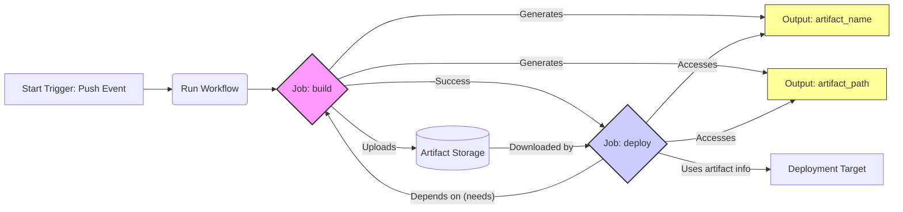

# Chapter 3: Contexts, Expressions, and Secrets Management

Welcome to Chapter 3! In the previous chapter, we dissected the fundamental structure of a GitHub Actions workflow file. Now, we delve deeper into the dynamic aspects that make workflows truly powerful: **Contexts**, **Expressions**, and **Secrets Management**.

Understanding these concepts is crucial for creating flexible, adaptable, and secure automation. Contexts provide access to runtime information, expressions allow you to manipulate this information and control workflow logic, and secrets management ensures sensitive data like API keys and passwords are handled securely. We will also explore Variables as a way to manage non-sensitive configuration data.

By the end of this chapter, you'll be able to:

- Access information about the workflow run, event payload, runner environment, and more using contexts.
- Write powerful expressions to dynamically set values and control execution flow.
- Securely manage sensitive credentials using GitHub Secrets.
- Utilize Variables for configuration and non-sensitive data management.
- Understand the differences and appropriate use cases for Secrets versus Variables.

Let's begin by exploring the world of contexts.

## A. Understanding Contexts

Contexts are collections of variables that provide access to information about the workflow run, the event that triggered it, the runner environment, and more. They are accessible using the expression syntax `${{ <context>.<property> }}`. Think of them as structured data objects available within your workflow execution environment. GitHub Actions provides several built-in contexts, each serving a specific purpose.

### 1. The `github` Context (Event Payload, Repository Info, etc.)

The `github` context is perhaps the most frequently used. It contains a wealth of information about the event that triggered the workflow, the repository, the commit, and the workflow itself.

- **`github.event`**: Contains the full webhook event payload. The structure of this object depends entirely on the event that triggered the workflow (e.g., `push`, `pull_request`, `workflow_dispatch`). For a `push` event, it includes details about the commits pushed, the pusher, and the repository. For a `pull_request` event, it includes details about the PR number, title, author, base and head branches, etc.
- **`github.repository`**: The owner and name of the repository (e.g., `octocat/Hello-World`).
- **`github.repository_owner`**: The owner of the repository (e.g., `octocat`).
- **`github.sha`**: The commit SHA that triggered the workflow.
- **`github.ref`**: The branch or tag ref that triggered the workflow (e.g., `refs/heads/main`, `refs/tags/v1.0`).
- **`github.workflow`**: The name of the workflow.
- **`github.run_id`**: A unique ID for the current workflow run.
- **`github.run_number`**: A unique number for each run of a specific workflow in a repository.
- **`github.actor`**: The username of the user who initiated the workflow run.
- **`github.token`**: A temporary GitHub App installation access token (the `GITHUB_TOKEN`) automatically generated for each job. It has permissions scoped to the repository containing the workflow. _Note: This is distinct from secrets you define._
- **`github.server_url`**: The URL of the GitHub server (e.g., `https://github.com`).
- **`github.api_url`**: The URL of the GitHub API (e.g., `https://api.github.com`).
- **`github.graphql_url`**: The URL of the GitHub GraphQL API (e.g., `https://api.github.com/graphql`).

**Example Usage:**

```yaml
name: Context Demo - github

on: push

jobs:
  show_github_context:
    runs-on: ubuntu-latest
    steps:
      - name: Print GitHub Context Info
        run: |
          echo "Event Name: ${{ github.event_name }}"
          echo "Repository: ${{ github.repository }}"
          echo "Commit SHA: ${{ github.sha }}"
          echo "Ref: ${{ github.ref }}"
          echo "Triggering Actor: ${{ github.actor }}"
          echo "Workflow Name: ${{ github.workflow }}"
          echo "Run ID: ${{ github.run_id }}"
          # Accessing event-specific data (for push event)
          echo "Commit Message (first commit): ${{ github.event.commits[0].message }}"
```

### 2. The `env` Context (Environment Variables)

The `env` context provides access to environment variables set within the workflow, job, or step level. You can define custom environment variables and access them using this context. It also includes default environment variables set by the runner.

- **Defining Variables:** You can define environment variables at the workflow, job, or step level using the `env:` key.
- **Accessing Variables:** Use `${{ env.VARIABLE_NAME }}`.

**Example Usage:**

```yaml
name: Context Demo - env

on: push

env:
  WORKFLOW_LEVEL_VAR: "Available to all jobs"

jobs:
  job1:
    runs-on: ubuntu-latest
    env:
      JOB_LEVEL_VAR: "Available only in job1"
    steps:
      - name: Access env context
        env:
          STEP_LEVEL_VAR: "Available only in this step"
        run: |
          echo "Workflow Var: ${{ env.WORKFLOW_LEVEL_VAR }}"
          echo "Job Var: ${{ env.JOB_LEVEL_VAR }}"
          echo "Step Var: ${{ env.STEP_LEVEL_VAR }}"
          # Accessing default env vars (Note: Also directly accessible in scripts)
          echo "Home Directory: ${{ env.HOME }}"
          echo "GitHub Workspace: ${{ env.GITHUB_WORKSPACE }}"
```

### 3. The `job` Context (Job Status, Runner Info)

The `job` context contains information about the currently executing job. Its primary use is to access the job's status.

- **`job.status`**: The status of the job (`success`, `failure`, `cancelled`, or `skipped`). This is particularly useful in steps that need to run conditionally based on the outcome of previous steps within the same job (e.g., cleanup steps that run even if the job failed). _Note: This is typically used in `if` conditions for steps that run at the end of a job._
- **`job.container.id`**: The ID of the container if the job runs in a container.
- **`job.services.<service_id>.id`**: The ID of a service container.
- **`job.services.<service_id>.ports.<port>`**: The mapped port of a service container.

**Example Usage:**

```yaml
name: Context Demo - job

on: push

jobs:
  build:
    runs-on: ubuntu-latest
    steps:
      - name: Simulate Build Step
        id: build_step
        run: |
          echo "Running build..."
          # Simulate failure for demonstration
          # exit 1

      - name: Post-Build Cleanup (Always Runs)
        # This step runs regardless of the success/failure of previous steps
        if: always()
        run: |
          echo "Running cleanup..."
          echo "Job status was: ${{ job.status }}"

      - name: Notify on Failure
        # This step only runs if a previous step in the job failed
        if: failure()
        run: |
          echo "Build failed! Job status: ${{ job.status }}"
```

### 4. The `steps` Context (Step Outputs and Outcomes)

The `steps` context allows you to access the outputs and outcomes (`success`, `failure`, `cancelled`, `skipped`) of previous steps _within the same job_. This is essential for passing data between steps.

- **Setting Outputs:** A step can define outputs using a specific syntax in its run command: `echo "::set-output name=<output_name>::<value>"`. The step must also have an `id`.
- **Accessing Outputs:** Use `${{ steps.<step_id>.outputs.<output_name> }}`.
- **Accessing Outcomes:** Use `${{ steps.<step_id>.outcome }}` (similar to `job.status` but for a specific step).

**Example Usage:**

```yaml
name: Context Demo - steps

on: push

jobs:
  process_data:
    runs-on: ubuntu-latest
    steps:
      - name: Generate Data
        id: generate
        run: |
          GENERATED_VALUE="data-$(date +%s)"
          echo "Generated value: $GENERATED_VALUE"
          echo "::set-output name=my_output::$GENERATED_VALUE"

      - name: Use Generated Data
        id: consume
        run: |
          echo "Received data from previous step: ${{ steps.generate.outputs.my_output }}"
          # Check outcome of the generate step
          echo "Outcome of generate step: ${{ steps.generate.outcome }}"
```

### 5. The `runner` Context (Runner OS, Temp Directory)

The `runner` context provides information about the runner executing the job.

- **`runner.os`**: The operating system of the runner (e.g., `Linux`, `Windows`, `macOS`). Useful for writing OS-specific steps.
- **`runner.arch`**: The architecture of the runner (e.g., `X86`, `X64`, `ARM`, `ARM64`).
- **`runner.temp`**: The path to a temporary directory on the runner that is unique to each job run and cleaned up afterwards.
- **`runner.tool_cache`**: The path to the directory containing pre-installed tools.
- **`runner.name`**: The name of the runner (useful for self-hosted runners).
- **`runner.workspace`**: The workspace directory path (same as `GITHUB_WORKSPACE`).

**Example Usage:**

```yaml
name: Context Demo - runner

on: push

jobs:
  show_runner_info:
    runs-on: ${{ matrix.os }} # Example using matrix strategy
    strategy:
      matrix:
        os: [ubuntu-latest, windows-latest, macos-latest]
    steps:
      - name: Display Runner Info
        run: |
          echo "Running on OS: ${{ runner.os }}"
          echo "Runner Architecture: ${{ runner.arch }}"
          echo "Temporary Directory: ${{ runner.temp }}"
          echo "Tool Cache: ${{ runner.tool_cache }}"
          # Conditional execution based on OS
          if [ "${{ runner.os }}" == "Linux" ]; then
            echo "This is Linux!"
          elif [ "${{ runner.os }}" == "Windows" ]; then
            echo "This is Windows!"
          elif [ "${{ runner.os }}" == "macOS" ]; then
            echo "This is macOS!"
          fi
        shell: bash # Ensure bash is used for consistent scripting across OSes where possible
```

### 6. The `secrets` Context (Accessing Secrets)

The `secrets` context provides access to secrets configured for the repository, organization, or environment. Secrets are encrypted environment variables intended for sensitive information like API keys, passwords, or tokens.

- **Accessing Secrets:** Use `${{ secrets.SECRET_NAME }}`.
- **Security:** Secrets are automatically masked in logs (replaced with `***`), but care must still be taken not to inadvertently expose them (e.g., by printing them character by character or embedding them in URLs that get logged).

**Example Usage (Conceptual - Requires `MY_API_KEY` secret to be configured):**

```yaml
name: Context Demo - secrets

on: push

jobs:
  deploy:
    runs-on: ubuntu-latest
    steps:
      - name: Deploy Application
        # This assumes an action or script that needs an API key
        run: echo "Deploying with key: ${{ secrets.MY_API_KEY }}" # In a real script, pass this securely
        # A better way: Pass as environment variable to a script/action
      - name: Use Secret in Environment Variable
        env:
          API_TOKEN: ${{ secrets.MY_API_KEY }}
        run: |
          echo "Calling deployment script..."
          # ./deploy-script.sh # This script can now use $API_TOKEN
          # Be cautious: Even setting it as an env var might be logged by subprocesses
          # Best practice: Pass directly to commands that accept secrets via stdin or specific flags if possible.
          echo "Token starts with: ${API_TOKEN:0:4}..." # Example of safe(r) logging
```

_We will cover Secrets Management in detail in Section C._

### 7. The `strategy` Context (Matrix Build Variables)

When using a matrix strategy (`jobs.<job_id>.strategy.matrix`) to run a job multiple times with different configurations, the `strategy` context provides information about the specific matrix execution currently running.

- **`strategy.job-index`**: The index of the current job in the matrix (0-based).
- **`strategy.job-total`**: The total number of jobs in the matrix.
- **`strategy.fail-fast`**: The value of the `fail-fast` property for the matrix.

**Example Usage:**

```yaml
name: Context Demo - strategy

on: push

jobs:
  matrix-job:
    runs-on: ubuntu-latest
    strategy:
      matrix:
        node: [14, 16, 18]
        os: [ubuntu-latest, windows-latest]
      fail-fast: false # Default is true
    steps:
      - name: Show Matrix Info
        run: |
          echo "Matrix OS: ${{ matrix.os }}"
          echo "Matrix Node: ${{ matrix.node }}"
          echo "Job Index: ${{ strategy.job-index }}"
          echo "Total Jobs: ${{ strategy.job-total }}"
          echo "Fail Fast: ${{ strategy.fail-fast }}"
```

### 8. The `matrix` Context (Matrix Build Variables - legacy)

Similar to the `strategy` context, the `matrix` context provides access to the specific matrix configuration values defined in `jobs.<job_id>.strategy.matrix`. For each variable defined in the matrix (e.g., `node`, `os` in the example above), you can access its current value using `${{ matrix.<variable_name> }}`.

While `strategy` provides metadata _about_ the matrix run, `matrix` provides the _values_ for the current run. You often use both together.

**Example Usage (Combined with `strategy` example above):**

The `matrix-job` example under the `strategy` context already demonstrates using `${{ matrix.os }}` and `${{ matrix.node }}`. This is the standard way to access the specific variable combination for the current matrix job instance.

> **Note:** While both `strategy` and `matrix` contexts relate to matrix builds, `matrix` directly accesses the _values_ you defined (like `matrix.node`), whereas `strategy` provides _metadata_ about the matrix execution itself (like `strategy.job-index`).

### 9. The `needs` Context (Outputs from Dependent Jobs)

When you define job dependencies using `jobs.<job_id>.needs`, the `needs` context allows a job to access the `outputs` of all the jobs it depends on. This is crucial for passing information _between_ jobs.

- **Defining Job Outputs:** A job can define outputs using the `jobs.<job_id>.outputs` map. Values assigned here typically come from step outputs within that job.
- **Accessing Job Outputs:** Use `${{ needs.<job_id>.outputs.<output_name> }}` in the dependent job.

#### [Practical Example: Passing build artifacts information between jobs using `needs`]

Imagine a scenario where a `build` job creates an artifact (e.g., a compiled binary or a Docker image tag) and a subsequent `deploy` job needs the name or tag of that artifact.

```yaml
name: Inter-Job Communication with Needs and Outputs

on:
  push:
    branches: [main]

jobs:
  build:
    runs-on: ubuntu-latest
    outputs:
      # Define an output named 'build_artifact_name' for this job
      build_artifact_name: ${{ steps.set_artifact_name.outputs.artifact_name }}
      build_artifact_path: ${{ steps.set_artifact_name.outputs.artifact_path }}
    steps:
      - name: Checkout code
        uses: actions/checkout@v3

      - name: Simulate Build and Set Artifact Name
        id: set_artifact_name
        run: |
          # Simulate creating a build artifact
          BUILD_ID="build-${{ github.run_number }}-${{ github.sha }}"
          ARTIFACT_FILENAME="${BUILD_ID}.tar.gz"
          echo "Creating dummy artifact: $ARTIFACT_FILENAME"
          touch $ARTIFACT_FILENAME
          # Set the output values for the job
          echo "::set-output name=artifact_name::$ARTIFACT_FILENAME"
          echo "::set-output name=artifact_path::./$ARTIFACT_FILENAME"

      - name: Upload Artifact (Optional but common)
        uses: actions/upload-artifact@v3
        with:
          name: my-build-artifact
          path: ${{ steps.set_artifact_name.outputs.artifact_path }}

  deploy:
    runs-on: ubuntu-latest
    needs: build # This job depends on the 'build' job
    environment: production # Example: Deploying to a specific environment
    steps:
      - name: Download Artifact (If uploaded)
        uses: actions/download-artifact@v3
        with:
          name: my-build-artifact
          # Path where artifact will be downloaded, defaults to current dir

      - name: Deploy Using Artifact Info
        run: |
          echo "Deploying artifact..."
          # Access the output from the 'build' job via the 'needs' context
          echo "Artifact Name from build job: ${{ needs.build.outputs.build_artifact_name }}"
          echo "Artifact Path from build job: ${{ needs.build.outputs.build_artifact_path }}"
          # In a real scenario, use this information in your deployment script/command
          # e.g., scp ${{ needs.build.outputs.build_artifact_path }} user@server:/deploy/path/
          ls -l ${{ needs.build.outputs.build_artifact_name }} # Verify downloaded artifact exists
```

In this example:

1.  The `build` job runs, simulates creating an artifact, and uses `::set-output` in the `set_artifact_name` step to capture the filename and path.
2.  The `build` job defines `outputs` at the job level, mapping them to the step outputs.
3.  The `deploy` job declares `needs: build`, making it wait for `build` to complete successfully.
4.  The `deploy` job accesses the artifact name and path using `${{ needs.build.outputs.build_artifact_name }}` and `${{ needs.build.outputs.build_artifact_path }}`.



- **Diagram Explanation:** This diagram illustrates the flow of the example workflow. The `build` job (pink) produces outputs (`artifact_name`, `artifact_path` - yellow) and potentially uploads an artifact. The `deploy` job (blue) depends on (`needs`) the `build` job and accesses its outputs via the `needs` context to perform the deployment.

Contexts provide the raw data; expressions are the tools we use to work with that data.

## B. Mastering GitHub Actions Expressions

Expressions allow you to dynamically control your workflows. You can use them to evaluate conditions, access context information, manipulate strings, and perform calculations. They provide the logic that makes workflows adaptable and intelligent.

### 1. Expression Syntax (`${{ <expression> }}`)

Expressions are embedded within workflow files using the `${{ }}` syntax. Anything inside the curly braces is evaluated by GitHub Actions before the step or configuration value is processed.

- **Literals:** Strings, numbers, booleans (e.g., `'Hello'`, `123`, `true`). String literals must be enclosed in single quotes.
- **Context Access:** Accessing context properties (e.g., `${{ github.event_name }}`, `${{ steps.my_step.outputs.data }}`).
- **Functions:** Calling built-in functions (e.g., `${{ contains(github.ref, 'release') }}`).
- **Operators:** Using comparison and logical operators (e.g., `${{ github.event_name == 'push' && github.ref == 'refs/heads/main' }}`).

**Where Expressions Can Be Used:**

- `if` conditionals for jobs and steps.
- Setting environment variables (`env:`).
- Defining inputs for actions (`with:`).
- Matrix strategy configurations.
- Defining job/step names.
- And many other places where dynamic values are needed.

**Example:**

```yaml
steps:
  - name: Greet User ${{ github.actor }}
    run: echo "Hello, ${{ github.actor }}!"
    if: ${{ github.event_name == 'workflow_dispatch' }} # Only run if manually triggered
```

### 2. Operators (Comparison, Logical, etc.)

Expressions support a range of operators similar to those found in many programming languages:

- **Comparison:**
  - `==` (equals)
  - `!=` (not equals)
  - `<` (less than)
  - `>` (greater than)
  - `<=` (less than or equals)
  - `>=` (greater than or equals)
- **Logical:**
  - `&&` (AND)
  - `||` (OR)
  - `!` (NOT)
- **Grouping:**
  - `()` (parentheses for grouping expressions)

**Example:**

```yaml
steps:
  - name: Run on main branch push or any tag push
    if: ${{ (github.event_name == 'push' && github.ref == 'refs/heads/main') || startsWith(github.ref, 'refs/tags/') }}
    run: echo "This runs for pushes to main or any tag."

  - name: Check PR title
    # Note: Need to escape single quotes within the expression's single quotes
    if: ${{ github.event_name == 'pull_request' && !contains(github.event.pull_request.title, '[WIP]') }}
    run: echo "PR title does not contain [WIP]."
```

### 3. Built-in Functions (`contains`, `startsWith`, `endsWith`, `format`, `join`, `toJSON`, `fromJSON`, etc.)

GitHub Actions provides a rich library of built-in functions to manipulate data within expressions.

#### [Deep Dive: Exploring the full function library with examples]

Here's a look at some of the most commonly used functions:

- **`contains( search, item )`**: Checks if `search` (string, array, or object) contains `item`.

  - `contains('Hello World', 'llo')` -> `true`
  - `contains(github.event.pull_request.labels.*.name, 'bug')` -> `true` if the PR has a 'bug' label.
  - `${{ contains(needs.*.result, 'failure') }}` -> `true` if any needed job failed.

- **`startsWith( searchString, searchValue )`**: Checks if `searchString` starts with `searchValue`.

  - `startsWith('refs/heads/main', 'refs/heads/')` -> `true`
  - `${{ startsWith(github.ref, 'refs/tags/v') }}` -> `true` for tags like `v1.0`, `v2.1-beta`.

- **`endsWith( searchString, searchValue )`**: Checks if `searchString` ends with `searchValue`.

  - `endsWith('my-feature-branch', 'branch')` -> `true`
  - `${{ endsWith(github.repository, 'actions-sandbox') }}` -> `true` if the repo name ends with `actions-sandbox`.

- **`format( formatString, ...args )`**: Replaces placeholders (`{0}`, `{1}`, etc.) in `formatString` with provided arguments. Similar to `printf` or string interpolation.

  - `format('Hello {0}, you triggered event {1}', github.actor, github.event_name)` -> `'Hello octocat, you triggered event push'`
  - `${{ format('Deploying version {0} to {1}', steps.get_version.outputs.version, inputs.environment) }}`

- **`join( array, optionalSeparator )`**: Joins elements of an `array` into a string. The default separator is `,`.

  - `join( ['a', 'b', 'c'], ' | ' )` -> `'a | b | c'`
  - `${{ join(matrix.features, ', ') }}` -> `'feature1, feature2'` if `matrix.features` is `['feature1', 'feature2']`.

- **`toJSON( value )`**: Returns a pretty-print JSON representation of `value`. Useful for debugging or passing complex data.

  - `toJSON(github.event)` -> Outputs the entire event payload as a formatted JSON string.
  - Useful in run steps: `run: echo '${{ toJSON(steps.parse_data.outputs) }}'`

- **`fromJSON( value )`**: Parses a JSON string `value` into an object or array. Useful when a step outputs JSON.

  - If `steps.get_config.outputs.json_config` is `'{"version": "1.2", "enabled": true}'`:
    - `${{ fromJSON(steps.get_config.outputs.json_config).version }}` -> `'1.2'`
    - `${{ fromJSON(steps.get_config.outputs.json_config).enabled }}` -> `true`

- **Status Check Functions:**

  - `success()`: Returns `true` if all previous steps in the job succeeded. Equivalent to `!failure() && !cancelled()`. Often used in `if` conditions.
  - `failure()`: Returns `true` if any previous step in the job failed.
  - `cancelled()`: Returns `true` if the workflow or job was cancelled.
  - `always()`: Always returns `true`. Useful for cleanup steps that must run regardless of outcome.

- **`hashFiles( pathPattern, ... )`**: Calculates a SHA256 hash of a set of files matching the provided path patterns. Extremely useful for caching dependencies, as the cache key changes only when the specified files change.
  - `${{ hashFiles('**/package-lock.json', '**/yarn.lock') }}` -> Generates a hash based on lock files in the repository. Used commonly with `actions/cache`.

#### [Code Snippet: Complex conditional logic using expressions and functions]

```yaml
name: Complex Condition Example

on:
  pull_request:
    types: [opened, synchronize, reopened]
  push:
    branches:
      - main
      - "release/**"

jobs:
  conditional_job:
    runs-on: ubuntu-latest
    # This job runs ONLY IF:
    # 1. It's a pull request targeting 'main' AND does NOT have the 'skip-ci' label
    # OR
    # 2. It's a push to the 'main' branch
    # OR
    # 3. It's a push to a branch starting with 'release/'
    if: |
      (
        github.event_name == 'pull_request' &&
        github.base_ref == 'main' &&
        !contains(github.event.pull_request.labels.*.name, 'skip-ci')
      ) ||
      (
        github.event_name == 'push' &&
        github.ref == 'refs/heads/main'
      ) ||
      (
        github.event_name == 'push' &&
        startsWith(github.ref, 'refs/heads/release/')
      )
    steps:
      - name: Checkout Code
        uses: actions/checkout@v3

      - name: Run Main Build Logic
        run: echo "Running main build logic for ref ${{ github.ref }} on event ${{ github.event_name }}"

      - name: Special Step for Release Branches
        # This step runs ONLY IF the main job condition was met AND it's a push to a release branch
        if: github.event_name == 'push' && startsWith(github.ref, 'refs/heads/release/')
        run: |
          echo "Performing special release branch actions..."
          # Extract release version from branch name (example)
          RELEASE_BRANCH="${{ github.ref }}" # e.g., refs/heads/release/v1.2.3
          VERSION=$(echo "$RELEASE_BRANCH" | sed 's#refs/heads/release/##')
          echo "Detected release version: $VERSION"

      - name: Notify on Failure (Job Level)
        if: failure() # Uses the job status check function
        run: echo "Job failed!"
```

This example demonstrates combining logical operators (`&&`, `||`), comparison operators (`==`), context access (`github.event_name`, `github.ref`, `github.base_ref`, `github.event.pull_request.labels.*.name`), and built-in functions (`contains`, `startsWith`, `failure`) to create precise execution conditions.

### 4. Type Casting and Handling

GitHub Actions generally attempts to coerce types automatically within expressions (e.g., comparing a number from context with a literal number). However, be mindful of types, especially when dealing with JSON or outputs from scripts.

- **Strings:** Enclose in single quotes (`'my string'`).
- **Numbers:** Use directly (`123`, `3.14`).
- **Booleans:** `true`, `false`.
- **Null:** `null`.
- **Arrays/Objects:** Often accessed via contexts or created using `fromJSON`.

If a step output is intended to be a number or boolean, ensure the script outputs it without quotes or use `fromJSON` if it outputs JSON.

**Example:**

```yaml
steps:
  - name: Set numeric output
    id: step1
    run: echo "::set-output name=count::5"

  - name: Set boolean output (as string)
    id: step2
    run: echo "::set-output name=is_enabled::true" # This is a string 'true'

  - name: Use outputs
    run: |
      # ${{ steps.step1.outputs.count }} is likely treated as a number here
      if [ ${{ steps.step1.outputs.count }} -gt 3 ]; then echo "Count > 3"; fi

      # ${{ steps.step2.outputs.is_enabled }} is the string 'true'
      # Direct comparison works:
      if [ "${{ steps.step2.outputs.is_enabled }}" == "true" ]; then echo "Is enabled (string compare)"; fi

      # Using fromJSON if the output was JSON: '{"enabled": true}'
      # Assume step3 outputted JSON: echo "::set-output name=config::{\"enabled\": true}"
      # if: ${{ fromJSON(steps.step3.outputs.config).enabled }}
```

### 5. Using Expressions in `if` Conditions, Inputs (`with`), `env`, etc.

Expressions are the glue that connects contexts and workflow logic.

- **`if` Conditions:** Control whether a job or step runs. The expression must evaluate to `true` for the job/step to execute.
  ```yaml
  jobs:
    my_job:
      if: ${{ github.repository == 'octocat/Spoon-Knife' }}
      runs-on: ubuntu-latest
      steps:
        - name: Run only on tags
          if: ${{ startsWith(github.ref, 'refs/tags/') }}
          run: echo "This is a tag release!"
  ```
- **Inputs (`with`)**: Dynamically set inputs for actions based on context or previous steps.

  ```yaml
  steps:
    - name: Get Version
      id: get_version
      run: echo "::set-output name=version::1.2.3" # Example version

    - name: Use Version in Action Input
      uses: some-action/deploy@v1
      with:
        tag: ${{ steps.get_version.outputs.version }}
        environment: ${{ github.ref == 'refs/heads/main' && 'production' || 'staging' }} # Ternary-like logic
  ```

- **Environment Variables (`env`)**: Define environment variables dynamically.

  ```yaml
  env:
    NODE_ENV: ${{ github.ref == 'refs/heads/main' && 'production' || 'development' }}
    API_ENDPOINT: ${{ inputs.target_env == 'prod' && 'https://api.prod.com' || 'https://api.staging.com' }} # Assuming workflow_dispatch input 'target_env'

  steps:
    - name: Show Env
      run: |
        echo "Node Env: $NODE_ENV"
        echo "API Endpoint: $API_ENDPOINT"
  ```

#### [Troubleshooting Section: Common pitfalls and debugging expression syntax]

- **Syntax Errors:** The most common issue. Check for:
  - Missing `${{` or `}}`.
  - Mismatched parentheses `()`.
  - Incorrect quoting (use single quotes `'...'` for strings inside expressions). Double quotes `"` are part of the YAML syntax itself. Escape internal single quotes with another single quote: `format('It''s a {0}', 'test')`.
  - Invalid operators or function names.
- **Incorrect Context Property:** Using `github.commit_sha` instead of `github.sha`, or accessing event properties that don't exist for the triggering event (e.g., accessing `github.event.pull_request` during a `push` event will result in empty values or errors).
  - **Debug Tip:** Use `toJSON` to print context objects: `run: echo '${{ toJSON(github) }}'` or `run: echo '${{ toJSON(steps) }}'`.
- **Type Mismatches:** Trying to use string functions on numbers, or vice-versa, without proper handling. Comparing a number with a string representation (e.g., `5 == '5'`) usually works due to coercion, but be mindful.
- **Evaluation Timing:** Expressions are evaluated _before_ a step runs or a job starts. You cannot use an expression to dynamically generate _part_ of a YAML key name itself (like `step_${{ matrix.os }}_name`).
- **YAML Parsing Issues:** Ensure the expression syntax doesn't conflict with YAML special characters. Using multi-line block scalars (`|` or `>`) for complex `if` conditions often improves readability and avoids quoting issues.
- **Case Sensitivity:** Context properties and function names are generally case-insensitive (e.g., `github.event_name` is the same as `github.EVENT_NAME`), but string comparisons _are_ case-sensitive unless using functions specifically designed otherwise. Secrets names _are_ case-sensitive.
- **Dereferencing Null/Empty:** Accessing a property on a null or non-existent object (e.g., `github.event.pull_request.user.login` when the event is not a `pull_request`) will typically result in an empty string rather than an error, which can mask issues. Use checks like `if: github.event.pull_request` before accessing nested properties.

```mermaid
graph TD
    A[Start Expression Evaluation: `${{ <expr> }}`] --> B{Parse Expression};
    B -- Syntax OK --> C{Identify Contexts/Literals/Functions/Operators};
    B -- Syntax Error --> Z[Fail Workflow/Step];
    C --> D{Fetch Context Data (e.g., `github`, `steps`)};
    D --> E{Execute Functions (e.g., `contains`, `format`)};
    E --> F{Apply Operators (e.g., `==`, `&&`)};
    F --> G{Determine Final Value};
    G --> H[Use Value (e.g., in `if`, `with`, `env`)];
    D -- Context Not Found/Invalid Property --> G(Result: Empty String or Error);
    E -- Function Error --> Z;

    style Z fill:#fbb,stroke:#f00,stroke-width:2px;
```

- **Diagram Explanation:** This flowchart outlines the process GitHub Actions follows when evaluating an expression. It starts with parsing, identifies components, fetches necessary data from contexts, executes functions and operators, and finally determines the result used by the workflow. Errors can occur at various stages, particularly syntax parsing or function execution.

## C. Secrets Management: Fundamentals

Workflow automation often requires interacting with protected resources: deploying to cloud providers, publishing packages, updating issues, etc. These interactions usually need sensitive credentials like API keys, tokens, or passwords. Hardcoding these into workflow files is a major security risk. GitHub Actions provides **Secrets** as a secure way to store and use this sensitive information.

### 1. What are Secrets? Why are they needed?

- **Secrets:** Encrypted environment variables created in a repository, organization, or environment. GitHub encrypts secrets before they reach the runner and attempts to automatically redact them from logs.
- **Why Needed:**
  - **Security:** Prevents hardcoding sensitive data directly in code or workflow files, which could be exposed in version control history or logs.
  - **Access Control:** Secrets can be scoped (repository, environment, organization) to limit exposure.
  - **Centralized Management:** Easier to update or rotate credentials in one place rather than searching through multiple files.

### 2. Repository Secrets

These secrets are defined at the repository level and are available to actions running within that repository's workflows.

#### [Configuration Guide: Creating and managing repository secrets via UI and API]

- **Via UI:**

  1.  Navigate to your repository on GitHub.
  2.  Click **Settings**.
  3.  In the left sidebar, under "Security", click **Secrets and variables**, then **Actions**.
  4.  Click the **Secrets** tab.
  5.  Click **New repository secret**.
  6.  Enter a **Name** for your secret (e.g., `NPM_TOKEN`, `AWS_ACCESS_KEY_ID`). Names are case-sensitive and cannot start with `GITHUB_`.
  7.  Enter the **Value** of the secret.
  8.  Click **Add secret**.

  - **Updating:** Click the secret name to update its value.
  - **Deleting:** Click the "Remove" button next to the secret.

- **Via GitHub CLI:**

  ```bash
  # Set a secret
  gh secret set MY_SECRET_NAME --body "my-secret-value" --repo owner/repo

  # List secrets
  gh secret list --repo owner/repo

  # Delete a secret
  gh secret remove MY_SECRET_NAME --repo owner/repo
  ```

- **Via GitHub API:**
  - Use the REST API endpoints for Repository Secrets (`/repos/{owner}/{repo}/actions/secrets`). You'll typically need a Personal Access Token (PAT) with appropriate permissions (`repo`) to manage secrets programmatically.
  - Endpoints exist for listing secrets (public keys needed for encryption), creating/updating secrets (values must be encrypted using the public key), and deleting secrets.

### 3. Environment Secrets

These secrets are specifically tied to **Deployment Environments**. Environments (e.g., `production`, `staging`, `dev`) provide rules (like required reviewers) and allow for environment-specific secrets and variables. A job must explicitly target an environment to access its secrets.

#### a. Defining Secrets for Specific Deployment Environments

1.  Navigate to your repository **Settings**.
2.  In the left sidebar, click **Environments**.
3.  Click **New environment** or select an existing one.
4.  Configure any protection rules (optional).
5.  Scroll down to the **Environment secrets** section.
6.  Click **Add secret** and provide a name and value, similar to repository secrets.

#### [Production Note: Using environment secrets for stage-specific credentials]

> Environment secrets are the **recommended** way to manage credentials for different deployment stages (dev, staging, production). This ensures that a workflow deploying to `staging` only has access to staging credentials, and a workflow deploying to `production` (which might have stricter protection rules) only has access to production credentials, even if they use the same secret _name_ (e.g., `AWS_ACCESS_KEY_ID`).

**Example:**

```yaml
jobs:
  deploy_staging:
    runs-on: ubuntu-latest
    environment: staging # Targets the 'staging' environment
    steps:
      - name: Deploy to Staging
        env:
          API_KEY: ${{ secrets.API_KEY }} # Accesses the API_KEY defined for the 'staging' environment
        run: ./deploy-script.sh --env staging --key $API_KEY

  deploy_production:
    runs-on: ubuntu-latest
    environment: production # Targets the 'production' environment
    steps:
      - name: Deploy to Production
        env:
          API_KEY: ${{ secrets.API_KEY }} # Accesses the API_KEY defined for the 'production' environment
        run: ./deploy-script.sh --env production --key $API_KEY
```

_If `API_KEY` is defined at both the repository and environment level, the environment-specific secret takes precedence for jobs targeting that environment._

### 4. Organization Secrets

These secrets are defined at the organization level and can be made available to multiple repositories within that organization. This is ideal for secrets used across many projects (e.g., a company-wide artifact repository token, a cloud provider service account key).

#### a. Sharing Secrets Across Multiple Repositories

When creating an organization secret, you define an access policy determining which repositories can use it.

#### b. Access Control Policies for Organization Secrets

You can grant access to:

- **All repositories:** The secret is available to workflows in all current and future repositories within the organization.
- **Private repositories:** Available only to private (and internal) repositories.
- **Selected repositories:** You manually choose which specific repositories can access the secret. This provides the most granular control.

#### [Configuration Guide: Setting up organization secrets and access policies]

1.  Navigate to your organization's main page on GitHub.
2.  Click **Settings**.
3.  In the left sidebar, under "Security", click **Secrets and variables**, then **Actions**.
4.  Click the **Secrets** tab.
5.  Click **New organization secret**.
6.  Enter a **Name** and **Value**.
7.  Choose the **Repository access** policy (All, Private, or Selected). If "Selected", choose the repositories.
8.  Click **Add secret**.

- **Managing Access:** You can modify the access policy for an existing organization secret at any time.

### 5. Using Secrets in Workflows (`secrets.SECRET_NAME`)

Accessing secrets within a workflow job is straightforward using the `secrets` context:

```yaml
${{ secrets.YOUR_SECRET_NAME }}
```

Secrets should ideally be passed directly to actions or tools that need them, often via environment variables or command-line arguments.

#### [Code Snippet: Passing a secret token to a deployment script]

```yaml
name: Deploy with Secret Token

on:
  push:
    branches: [main]

jobs:
  deploy:
    runs-on: ubuntu-latest
    environment: production # Assuming PRODUCTION_DEPLOY_KEY is an environment secret
    steps:
      - name: Checkout code
        uses: actions/checkout@v3

      - name: Setup Deployment Tool
        # ... steps to install kubectl, aws cli, azure cli, etc.

      - name: Execute Deployment
        env:
          # Pass the secret as an environment variable to the script
          DEPLOY_TOKEN: ${{ secrets.PRODUCTION_DEPLOY_KEY }}
        run: |
          echo "Starting deployment..."
          # ./deploy.sh expects the token in the DEPLOY_TOKEN env var
          ./deploy.sh --target=prod
          echo "Deployment finished."

      # Alternative: Pass directly to a command if supported
      # - name: Publish Package
      #   run: npm publish --token ${{ secrets.NPM_TOKEN }}
```

**Important:** Remember that secret names are case-sensitive. `${{ secrets.my_secret }}` is different from `${{ secrets.MY_SECRET }}`.

### 6. Security Best Practices for Secrets

While GitHub Actions provides secure storage and automatic log masking, vigilance is essential.

#### a. Least Privilege Principle

- Grant secrets only the minimum permissions required. Use fine-grained tokens (like GitHub App tokens or cloud provider tokens with specific roles) instead of highly privileged user PATs or root keys whenever possible.
- Scope secrets appropriately: Use environment secrets for stage-specific credentials, repository secrets for repo-specific needs, and organization secrets only when necessary, restricting access to selected repositories if possible.

#### b. Avoiding Secret Exposure in Logs (Automatic Masking Limitations)

- GitHub Actions automatically masks exact matches of secret values found in logs, replacing them with `***`.
- **Limitations:**
  - **Transformation:** If you transform a secret (e.g., Base64 encode it, extract parts of it, embed it in a URL), the transformed value might _not_ be masked.
  - **Structured Data:** Secrets embedded within structured data like JSON or XML might not be fully masked if the structure is complex.
  - **Runner-Level Exposure:** While masked in GitHub UI logs, the secret _is_ available in plain text to the code running on the runner. Malicious or compromised action code could potentially exfiltrate secrets. Use trusted actions (official, verified creator, or audited community actions). Pin actions to specific commit SHAs for better security (`uses: actions/checkout@<commit_sha>`).
- **Mitigation:**
  - Avoid printing secrets to standard output/error.
  - Pass secrets directly to tools/SDKs via environment variables or secure inputs, rather than constructing command lines with secrets embedded.
  - Be cautious with commands that might log their inputs (e.g., `curl`, `docker login`). Use options to read credentials from environment variables or files where possible.

#### [Production Note: Strategies for secret rotation and management]

> Regularly rotating secrets (changing their values) limits the window of opportunity for attackers if a secret is compromised.
>
> - **Frequency:** Define a rotation policy based on sensitivity (e.g., every 90 days for critical production keys, longer for less sensitive ones).
> - **Automation:** Use infrastructure-as-code tools (Terraform, Pulumi) or custom scripts interacting with the GitHub API and your secret provider (e.g., cloud KMS, HashiCorp Vault) to automate secret rotation.
> - **Auditing:** Regularly audit who has access to manage secrets and review secret usage.

#### [Deep Dive: Understanding potential leakage vectors and mitigation]

- **Malicious Actions:** Untrusted third-party actions could contain code to steal secrets passed to them or available in the environment.
  - **Mitigation:** Vet actions carefully. Prefer official (`actions/`, `github/`), verified creator actions, or actions you've audited. Pin action versions to specific commit SHAs (`@<sha>`) instead of branches (`@main`) or tags (`@v1`) to prevent unexpected/malicious code injection. Use OpenSSF Scorecards to assess action security.
- **Log Exposure:** Accidentally printing secrets or parts of secrets.
  - **Mitigation:** Code defensively. Never `echo` secrets. Be aware of tools that might log sensitive input. Use `add-mask` command in scripts (`echo "::add-mask::<value_to_mask>"`) to explicitly tell the runner to mask specific strings in logs _in addition_ to secrets.
- **Insecure Command Construction:** Building command strings with secrets embedded.
  - **Mitigation:** Pass secrets via environment variables (`env:` context) or use command features that read from stdin or files (e.g., `docker login --password-stdin`).
- **Compromised Runner:** If a self-hosted runner is compromised, secrets used in jobs running on it could be exposed.
  - **Mitigation:** Secure self-hosted runners diligently (network isolation, minimal privileges, regular patching, monitoring). Prefer GitHub-hosted runners where possible for critical workflows if managing self-hosted runner security is a concern.
- **Pull Request Forks:** By default, secrets are _not_ passed to workflows triggered by `pull_request` events from forks to prevent exposure. You can enable this via `workflow_run` or specific events like `pull_request_target` (use with extreme caution).

## D. Variables in GitHub Actions

While Secrets are for sensitive data, GitHub Actions also provides **Variables** for storing non-sensitive configuration data. Variables follow a similar scoping model to secrets (repository, environment, organization) but are stored as plain text.

### 1. Repository, Environment, and Organization Variables

Like secrets, variables can be defined at three levels:

- **Repository Variables:** Available to all workflows in the repository. Configured under `Settings > Secrets and variables > Actions > Variables`.
- **Environment Variables:** Available only to jobs targeting a specific deployment environment. Configured under `Settings > Environments > [Environment Name] > Environment variables`.
- **Organization Variables:** Available to selected repositories within the organization. Configured under `Organization Settings > Secrets and variables > Actions > Variables`.

Precedence rules apply similarly to secrets: Environment variables override Repository and Organization variables with the same name. Repository variables override Organization variables with the same name.

### 2. Differences between Secrets and Variables

| Feature           | Secrets                                    | Variables                                |
| :---------------- | :----------------------------------------- | :--------------------------------------- |
| **Sensitivity**   | High (API Keys, Passwords, Tokens)         | Low (Configuration, Flags, IDs)          |
| **Storage**       | Encrypted                                  | Plain text                               |
| **Log Masking**   | Automatic attempt to mask (`***`)          | **Not masked** in logs                   |
| **Accessibility** | Via `secrets` context (`${{ secrets.X }}`) | Via `vars` context (`${{ vars.X }}`)     |
| **Use Case**      | Securely storing sensitive credentials     | Storing non-sensitive configuration data |

**Key Takeaway:** Use **Secrets** for anything that would cause harm if exposed. Use **Variables** for configuration data that is safe to be visible in logs and workflow definitions (though still managed centrally).

### 3. Use Cases for Variables (Configuration, Flags, Non-sensitive data)

- **Server URLs:** Storing different API endpoints for `dev`, `staging`, `prod` environments.
- **Build Flags:** Enabling/disabling certain build features (e.g., `ENABLE_BETA_FEATURES: true`).
- **Configuration Values:** Setting application configuration like theme names, default regions, non-sensitive user IDs for testing.
- **Resource Names:** Defining naming conventions or identifiers for cloud resources.
- **Version Numbers:** Storing non-critical version numbers used during builds (though often these come from code/tags).

#### [Configuration Guide: Setting up and using variables]

Setting up variables via the UI, GitHub CLI (`gh variable set/list/delete`), or API (`/repos/{owner}/{repo}/actions/variables`, `/orgs/{org}/actions/variables`, etc.) is almost identical to managing secrets, just using the "Variables" tab/section instead of "Secrets".

**Using Variables in Workflows:** Access variables using the `vars` context:

```yaml
${{ vars.YOUR_VARIABLE_NAME }}
```

#### [Practical Example: Using variables to control build configurations]

Imagine you want to use different server endpoints and enable debug logging based on the environment.

**Setup:**

1.  **Repository Variable:**
    - `APP_NAME`: `MyAwesomeApp`
2.  **Environment: `staging`**
    - `SERVER_ENDPOINT`: `https://staging.api.example.com`
    - `DEBUG_MODE`: `true`
3.  **Environment: `production`**
    - `SERVER_ENDPOINT`: `https://api.example.com`
    - `DEBUG_MODE`: `false`

**Workflow:**

```yaml
name: Build with Variables

on:
  push:
    branches: [main, develop]

jobs:
  build_staging:
    if: github.ref == 'refs/heads/develop'
    runs-on: ubuntu-latest
    environment: staging # Use staging environment variables
    steps:
      - name: Build for Staging
        env:
          # Access variables using the 'vars' context
          API_URL: ${{ vars.SERVER_ENDPOINT }}
          ENABLE_DEBUG: ${{ vars.DEBUG_MODE }}
          # Repository variable is also available
          APPLICATION_NAME: ${{ vars.APP_NAME }}
        run: |
          echo "Building $APPLICATION_NAME for staging..."
          echo "Using API Endpoint: $API_URL"
          if [ "$ENABLE_DEBUG" == "true" ]; then
            echo "Debug mode is ON"
            # ./build-script.sh --debug
          else
            echo "Debug mode is OFF"
            # ./build-script.sh
          fi

  build_production:
    if: github.ref == 'refs/heads/main'
    runs-on: ubuntu-latest
    environment: production # Use production environment variables
    steps:
      - name: Build for Production
        env:
          API_URL: ${{ vars.SERVER_ENDPOINT }}
          ENABLE_DEBUG: ${{ vars.DEBUG_MODE }}
          APPLICATION_NAME: ${{ vars.APP_NAME }}
        run: |
          echo "Building $APPLICATION_NAME for production..."
          echo "Using API Endpoint: $API_URL"
          if [ "$ENABLE_DEBUG" == "true" ]; then
            echo "Debug mode is ON"
            # ./build-script.sh --debug
          else
            echo "Debug mode is OFF"
            # ./build-script.sh
          fi
```

In this example, the `SERVER_ENDPOINT` and `DEBUG_MODE` variables are dynamically sourced based on the job's target environment, while the `APP_NAME` comes from the repository level. This allows centralized configuration management without exposing sensitive data or hardcoding values in the workflow.

---

This chapter equipped you with the knowledge to access runtime data using contexts, manipulate it and control logic using expressions, and manage sensitive and non-sensitive configuration data securely using secrets and variables. These are fundamental building blocks for creating robust, dynamic, and secure GitHub Actions workflows.

In the next chapter, "Chapter 4: Working with Actions: Finding, Using, and Managing," we will explore how to leverage the vast ecosystem of pre-built actions to perform common tasks efficiently and how to manage action versions effectively.
