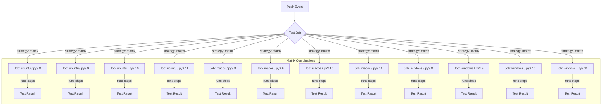
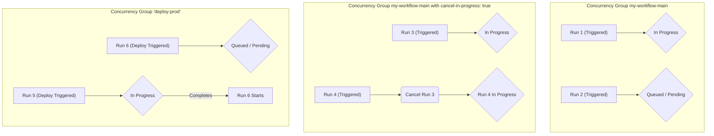

# Chapter 7: Advanced Workflow Techniques

Having mastered the fundamentals of workflow syntax, events, contexts, and basic job execution in the preceding chapters, we now venture into more sophisticated techniques. These advanced capabilities allow you to build more efficient, scalable, maintainable, and powerful automation pipelines with GitHub Actions.

This chapter delves into strategies for running jobs across multiple configurations, controlling concurrent workflow executions, reusing workflow logic, sharing data between jobs, interacting directly with the GitHub API, and handling large files effectively. Mastering these techniques will significantly elevate your ability to automate complex development processes.

## A. Matrix Strategies (`strategy: matrix`)

Often, you need to run the same set of steps under slightly different conditions – testing across various operating systems, language runtime versions, or build configurations. Manually duplicating jobs for each variation is inefficient and error-prone. GitHub Actions provides a powerful solution: **Matrix Strategies**.

A matrix strategy allows you to define a set of variables and their possible values. GitHub Actions then automatically creates a job instance for _each possible combination_ of these variables, running the job's steps within that specific context.

### 1. Running Jobs Across Multiple Configurations (OS, Runtimes, Parameters)

The most common use case for matrices is testing software compatibility across different environments. You can define dimensions for operating systems (`runs-on`), language versions (e.g., Node.js, Python, Go), or any custom parameter relevant to your build or test process.

**[Code Snippet: Testing across multiple Python versions and operating systems]**

```yaml
name: Python Matrix Test

on: [push]

jobs:
  test:
    runs-on: ${{ matrix.os }} # Use the matrix variable for the runner OS
    strategy:
      matrix:
        os: [ubuntu-latest, macos-latest, windows-latest]
        python-version: ["3.8", "3.9", "3.10", "3.11"]
      # Optional: Don't stop other jobs if one fails (default is true)
      # fail-fast: false

    steps:
      - name: Checkout code
        uses: actions/checkout@v4

      - name: Set up Python ${{ matrix.python-version }} # Use matrix variable in step name/config
        uses: actions/setup-python@v4
        with:
          python-version: ${{ matrix.python-version }}

      - name: Install dependencies
        run: |
          python -m pip install --upgrade pip
          pip install -r requirements.txt

      - name: Run tests
        run: |
          # Your test command here, e.g., pytest
          echo "Running tests on ${{ matrix.os }} with Python ${{ matrix.python-version }}"
          # Replace with actual test execution command
```

In this example:

- The `strategy.matrix` block defines two dimensions: `os` and `python-version`.
- GitHub Actions will generate 3 (OS) \* 4 (Python versions) = 12 individual job instances.
- Each job instance will have access to the specific `matrix.os` and `matrix.python-version` values for its configuration.
- These values are accessed using the `${{ matrix.<variable_name> }}` expression syntax within the job definition (e.g., `runs-on`) and its steps.



**Diagram Explanation:** This diagram illustrates how a single job definition with a matrix strategy expands into multiple parallel job instances, each representing a unique combination of the defined matrix variables (Operating System and Python Version in this case).

### 2. Including and Excluding Specific Matrix Combinations

Sometimes, not all combinations generated by the matrix are valid or necessary. You might want to:

- **Exclude:** Prevent specific combinations from running (e.g., a particular library doesn't support an older Python version on Windows).
- **Include:** Add specific, additional combinations that don't fit the standard matrix pattern, potentially with extra variables.

This is achieved using `matrix.exclude` and `matrix.include`.

```yaml
name: Matrix Include Exclude

on: [push]

jobs:
  test:
    runs-on: ${{ matrix.os }}
    strategy:
      matrix:
        os: [ubuntu-latest, windows-latest]
        node-version: [16, 18, 20]
        experimental: [false] # Base variable

        # Exclude specific combinations
        exclude:
          - os: windows-latest
            node-version: 16 # Don't test Node 16 on Windows

        # Include additional, specific combinations
        include:
          - os: ubuntu-latest
            node-version: 20
            experimental: true # Add an experimental flag only for this combo
          - os: ubuntu-latest
            node-version: 21 # Add a Node version not in the original list
            experimental: false

    steps:
    - name: Checkout code
      uses: actions/checkout@v4

    - name: Set up Node.js ${{ matrix.node-version }}
      uses: actions/setup-node@v4
      with:
        node-version: ${{ matrix.node-version }}

    - name: Run Test (Experimental: ${{ matrix.experimental }})
      run: |
        echo "Running on ${{ matrix.os }} with Node ${{ matrix.node-version }}"
        if [[ "${{ matrix.experimental }}" == "true" ]]; then
          echo "Running experimental tests..."
          # npm run test:experimental
        else
          echo "Running standard tests..."
          # npm test
        fi
```

In this example:

- The base matrix would generate 2 \* 3 = 6 combinations.
- The `exclude` entry removes the `windows-latest / node-version: 16` combination.
- The `include` entries add two specific combinations:
  - An `ubuntu-latest / node-version: 20` combination _with_ an additional `experimental: true` variable.
  - An `ubuntu-latest / node-version: 21` combination (Node 21 wasn't in the original list).

### 3. Handling Failures within a Matrix (`fail-fast`)

By default, if any job within a matrix fails, GitHub Actions immediately cancels all other in-progress and pending jobs in that matrix. This is controlled by the `fail-fast: true` setting (the default).

You might want to allow all combinations to complete, regardless of individual failures, to get a complete picture of compatibility issues. To achieve this, set `fail-fast: false`.

```yaml
name: Matrix Fail Fast Demo

on: [push]

jobs:
  test:
    runs-on: ${{ matrix.os }}
    strategy:
      # Allow all jobs to finish even if one fails
      fail-fast: false
      matrix:
        os: [ubuntu-latest, windows-latest]
        config: [A, B, C] # Imagine these are different test configs

    steps:
      - name: Simulate Test for Config ${{ matrix.config }} on ${{ matrix.os }}
        run: |
          echo "Running test config ${{ matrix.config }} on ${{ matrix.os }}"
          # Simulate a failure for a specific combination
          if [[ "${{ matrix.os }}" == "ubuntu-latest" && "${{ matrix.config }}" == "B" ]]; then
            echo "Simulating failure..."
            exit 1
          fi
          echo "Test passed."
```

With `fail-fast: false`, even though the `ubuntu-latest / config: B` job will fail, all other 5 jobs in the matrix will still attempt to run to completion. The overall workflow run will still be marked as failed if any matrix job fails.

### 4. Using Matrix Variables in Steps

As seen in previous examples, you access the variables defined in your matrix within the job's steps using the `${{ matrix.<variable_name> }}` syntax. This allows you to tailor commands, configurations, step names, and conditional logic based on the specific combination being executed.

**[Practical Example: Building binaries for different architectures using a matrix]**

Imagine you need to build a Go application for Linux and macOS, targeting both `amd64` and `arm64` architectures.

```yaml
name: Build Go Binaries

on:
  push:
    branches: [main]
  pull_request:
    branches: [main]

jobs:
  build:
    strategy:
      matrix:
        go-version: ["1.20"] # Specify Go version if needed
        os: [ubuntu-latest, macos-latest]
        arch: [amd64, arm64]
        # Exclude combinations that don't make sense or aren't supported
        exclude:
          - os: macos-latest
            arch: arm64 # Example: Assume M1 runners handle this differently or it's built elsewhere

    runs-on: ${{ matrix.os }}

    steps:
      - name: Checkout code
        uses: actions/checkout@v4

      - name: Set up Go ${{ matrix.go-version }}
        uses: actions/setup-go@v4
        with:
          go-version: ${{ matrix.go-version }}

      - name: Build Binary for ${{ matrix.os }} (${{ matrix.arch }})
        # Use matrix variables to set environment variables for the go build command
        env:
          GOOS: ${{ matrix.os == 'ubuntu-latest' && 'linux' || matrix.os == 'macos-latest' && 'darwin' }}
          GOARCH: ${{ matrix.arch }}
        run: |
          BINARY_NAME="my-app-${GOOS}-${GOARCH}"
          echo "Building $BINARY_NAME..."
          go build -v -o $BINARY_NAME ./... # Adjust your build command as needed
          echo "Build complete: $BINARY_NAME"

      # Optional: Upload artifact (consider naming based on matrix)
      - name: Upload Binary Artifact
        uses: actions/upload-artifact@v3
        with:
          name: my-app-${{ matrix.os }}-${{ matrix.arch }}
          path: my-app-${{ matrix.os == 'ubuntu-latest' && 'linux' || matrix.os == 'macos-latest' && 'darwin' }}-${{ matrix.arch }}
```

In this example:

- The matrix defines `os` and `arch`.
- An `exclude` rule prevents building `arm64` on `macos-latest` (perhaps handled by native M1 runners separately).
- Inside the "Build Binary" step:
  - Environment variables `GOOS` and `GOARCH` are dynamically set based on `matrix.os` and `matrix.arch` using conditional expressions.
  - The output binary name incorporates these dynamic values.
- The artifact upload step also uses matrix variables to create uniquely named artifacts for each combination.

## B. Concurrency Control (`concurrency`)

When workflows trigger frequently (e.g., on every push to a busy branch or pull request), you might run into situations where multiple instances of the _same_ workflow run concurrently. This can be problematic, especially for deployment workflows, where simultaneous deployments to the same environment can cause race conditions, inconsistent states, or resource contention.

GitHub Actions provides the `concurrency` key to manage how workflow runs are handled when multiple triggers occur for the same context.

### 1. Limiting Concurrent Workflow Runs for Branches/PRs/Environments

The `concurrency` key defines a "concurrency group". GitHub Actions ensures that only one workflow run within the same concurrency group is `in progress` at any time. If a new workflow run is triggered for a group that already has a run `in progress`, the behavior depends on the `cancel-in-progress` setting.

The group name is typically constructed using context variables to define its scope. Common patterns include:

- **Per Branch/PR:** `group: ${{ github.workflow }}-${{ github.ref }}` (Ensures only one run per workflow per branch/PR).
- **Per Pull Request:** `group: ${{ github.workflow }}-pr-${{ github.event.number }}` (Ensures only one run per workflow per specific PR number).
- **Per Environment (for deployments):** `group: deploy-${{ github.ref_name }}-${{ inputs.environment || 'production' }}` (Ensures only one deployment to a specific environment/branch combo at a time).

```yaml
name: CI Pipeline with Concurrency Control

on:
  push:
    branches: [main, develop]
  pull_request:
    types: [opened, synchronize, reopened]

# Limit concurrency per workflow and branch/PR ref
concurrency:
  group: ${{ github.workflow }}-${{ github.ref }}
  cancel-in-progress: false # Default: let the previous run finish

jobs:
  build:
    runs-on: ubuntu-latest
    steps:
      - run: echo "Building..."
      - run: sleep 30 # Simulate work

  test:
    runs-on: ubuntu-latest
    needs: build
    steps:
      - run: echo "Testing..."
      - run: sleep 30 # Simulate work
```

In this example, if you push twice quickly to the `develop` branch, the second push's workflow run will be queued (`pending`) until the first run completes because they share the same concurrency group (`CI Pipeline with Concurrency Control-refs/heads/develop`).

### 2. Cancelling In-Progress Runs (`cancel-in-progress: true`)

Often, especially for CI workflows triggered by pushes or PR updates, you only care about the _latest_ state. If a new run is triggered while an older one for the same concurrency group is still running, it's often desirable to cancel the older run and start the new one immediately.

This is achieved by setting `cancel-in-progress: true` within the `concurrency` block.

```yaml
name: CI Pipeline with Cancellation

on:
  push:
    branches: [main, develop]
  pull_request:
    types: [opened, synchronize, reopened]

concurrency:
  # Use workflow name and PR number (if PR) or branch name (if push)
  group: ${{ github.workflow }}-${{ github.event.pull_request.number || github.ref_name }}
  # Cancel any previous run in this group when a new one starts
  cancel-in-progress: true

jobs:
  lint:
    runs-on: ubuntu-latest
    steps:
      - run: echo "Linting..."
      - run: sleep 20
  build:
    runs-on: ubuntu-latest
    needs: lint
    steps:
      - run: echo "Building..."
      - run: sleep 40
```

If you push to `develop`, the workflow starts. If you immediately push again _before_ the first run finishes, the first run will be cancelled, and the second run will start. This saves runner minutes and provides faster feedback on the latest code.



**Diagram Explanation:** This diagram shows two scenarios for concurrency control. The top shows the default behavior where a new run (Run 2) waits for the current run (Run 1) in the same group to finish. The middle shows `cancel-in-progress: true`, where a new run (Run 4) cancels the ongoing run (Run 3) and starts immediately. The bottom illustrates a typical deployment scenario where queuing prevents simultaneous deployments (Run 6 waits for Run 5).

#### [Production Note: Using concurrency groups to prevent race conditions in deployments]

Concurrency control is _critical_ for deployment workflows. Deploying multiple versions of your application to the same environment simultaneously can lead to unpredictable states, downtime, or failed deployments. Define a concurrency group specific to the deployment target (e.g., combining the workflow name and the environment name or branch being deployed). Typically, for deployments, you want `cancel-in-progress: false` (the default) to ensure a deployment fully completes before another can start, preventing intermediate, potentially broken states.

#### [Code Snippet: Defining a concurrency group for production deployments]

```yaml
name: Deploy to Production

on:
  push:
    branches:
      - main # Trigger deployment only on pushes to main

jobs:
  deploy:
    runs-on: ubuntu-latest
    environment: production # Link to a GitHub Environment (optional but recommended)

    # Ensure only one production deployment runs at a time.
    # Do NOT cancel in-progress deployments.
    concurrency:
      group: deploy-production # Simple group name for the single prod environment
      cancel-in-progress: false

    steps:
      - name: Checkout code
        uses: actions/checkout@v4

      # Add steps for building, testing (if not done earlier)

      - name: Deploy to Production Environment
        # Replace with your actual deployment commands/actions
        run: |
          echo "Deploying version ${{ github.sha }} to production..."
          # ./deploy-script.sh --environment production
          sleep 60 # Simulate deployment time
          echo "Deployment complete."
```

This configuration guarantees that if two pushes happen to `main` in quick succession, the second deployment job will wait until the first one finishes successfully (or fails).

## C. Reusing Workflows

As your automation grows, you'll often find yourself repeating the same sequences of steps across multiple workflows (e.g., setting up a specific runtime, running linters, building code, running a common test suite). Copying and pasting this logic is inefficient and makes maintenance difficult. GitHub Actions offers two primary mechanisms for reusing workflow logic: **Reusable Workflows** and **Composite Actions**. We'll focus on Reusable Workflows here, as Composite Actions are covered in detail in Part III.

### 1. Reusable Workflows (`workflow_call`)

Reusable workflows allow you to define an entire workflow that can be called and executed by other workflows, much like calling a function in a programming language. This promotes DRY (Don't Repeat Yourself) principles, improves maintainability, and allows for standardization of common processes.

#### a. Defining a Reusable Workflow (Inputs, Secrets Inheritance)

A reusable workflow looks very similar to a standard workflow, but with a crucial difference in its `on` trigger: it uses `workflow_call` instead of typical events like `push` or `pull_request`.

Key features when defining a reusable workflow:

- **`on: workflow_call:`**: Specifies that this workflow is designed to be called by others.
- **`inputs:`**: (Optional) Defines typed input parameters that the calling workflow must or can provide. These are accessed within the reusable workflow using the `inputs` context: `${{ inputs.<input_name> }}`.
- **`secrets:`**: (Optional) Defines secrets that the calling workflow must provide. Use `secrets: inherit` to allow the reusable workflow to access all secrets available to the caller (use with caution). Secrets are accessed using the `secrets` context: `${{ secrets.<secret_name> }}`.

**Example Reusable Workflow Definition (`.github/workflows/reusable-build.yml`):**

```yaml
name: Reusable Build Process

# Define trigger for being called by other workflows
on:
  workflow_call:
    # Define inputs the caller can/must provide
    inputs:
      node-version:
        description: "Node.js version to use"
        required: true
        type: string
      run-lint:
        description: "Whether to run the linting step"
        required: false
        type: boolean
        default: true # Default value if not provided by caller
    # Define secrets the caller must provide
    secrets:
      NPM_TOKEN:
        description: "Token for accessing private npm packages"
        required: true

jobs:
  build:
    runs-on: ubuntu-latest
    steps:
      - name: Checkout code
        uses: actions/checkout@v4

      - name: Set up Node.js ${{ inputs.node-version }}
        uses: actions/setup-node@v4
        with:
          node-version: ${{ inputs.node-version }}
          # Use the secret passed from the caller
          token: ${{ secrets.NPM_TOKEN }}
          registry-url: "https://registry.npmjs.org" # Example usage

      - name: Install dependencies
        run: npm ci
        # Use the secret in environment if needed by npm ci/install
        env:
          NODE_AUTH_TOKEN: ${{ secrets.NPM_TOKEN }}

      - name: Run Lint
        # Conditionally run step based on input
        if: ${{ inputs.run-lint == true }}
        run: npm run lint

      - name: Run Build
        run: npm run build
```

#### b. Calling a Reusable Workflow from Another Workflow

To use a reusable workflow, a "caller" workflow specifies the reusable workflow in a job's `uses:` clause. The path follows the format `{owner}/{repo}/.github/workflows/{filename}@{ref}`, where `{ref}` can be a branch, tag, or commit SHA.

#### c. Passing Inputs and Secrets (`inputs:`, `secrets:`)

When calling a reusable workflow, you provide values for the defined `inputs` using the `with:` key and values for the defined `secrets` using the `secrets:` key.

**Example Caller Workflow (`.github/workflows/main-ci.yml`):**

```yaml
name: Main CI Pipeline

on: [push]

jobs:
  call-reusable-build:
    # Call the reusable workflow
    uses: your-org/your-repo/.github/workflows/reusable-build.yml@main # Use path@ref
    # Provide values for the inputs defined in the reusable workflow
    with:
      node-version: "18"
      run-lint: true # Explicitly set, could rely on default
    # Pass the required secrets
    secrets:
      NPM_TOKEN: ${{ secrets.NPM_TOKEN_FOR_CI }} # Map caller secret to reusable workflow secret name
```

In this caller workflow:

- The `call-reusable-build` job uses the `reusable-build.yml` workflow from the specified repository and ref (`main` branch).
- It provides `node-version: '18'` and `run-lint: true` via the `with:` block, corresponding to the `inputs:` defined in the reusable workflow.
- It passes the secret `NPM_TOKEN_FOR_CI` (which must be defined in the caller repository's settings) as the `NPM_TOKEN` expected by the reusable workflow via the `secrets:` block.

#### [Practical Example: Creating a reusable build-and-test workflow]

Let's refine the previous example into a more complete build-and-test reusable workflow.

**Reusable Workflow (`.github/workflows/reusable-node-ci.yml`):**

```yaml
name: Reusable Node CI

on:
  workflow_call:
    inputs:
      node-version:
        description: "Node.js version"
        required: false
        type: string
        default: "18"
      working-directory:
        description: "Directory to run commands in"
        required: false
        type: string
        default: "."
    outputs:
      artifact-name: # Define an output
        description: "Name of the build artifact produced"
        value: ${{ jobs.build-test.outputs.artifact-id }}

jobs:
  build-test:
    runs-on: ubuntu-latest
    defaults:
      run:
        working-directory: ${{ inputs.working-directory }} # Use input for working dir
    outputs: # Define job output
      artifact-id: build-${{ github.run_id }} # Example output value
    steps:
      - name: Checkout code
        uses: actions/checkout@v4

      - name: Set up Node.js ${{ inputs.node-version }}
        uses: actions/setup-node@v4
        with:
          node-version: ${{ inputs.node-version }}
          cache: "npm" # Enable npm caching
          cache-dependency-path: "${{ inputs.working-directory }}/package-lock.json"

      - name: Install dependencies
        run: npm ci

      - name: Run Lint
        run: npm run lint

      - name: Run Tests
        run: npm test

      - name: Build Application (if applicable)
        run: |
          # Example: Assume build creates files in 'dist' folder
          # npm run build
          echo "Simulating build..."
          mkdir dist
          echo "Build output for run ${{ github.run_id }}" > dist/build-info.txt

      - name: Upload Build Artifact
        uses: actions/upload-artifact@v3
        with:
          name: build-${{ github.run_id }} # Use run ID for unique name
          path: ${{ inputs.working-directory }}/dist/
```

**Caller Workflow (`.github/workflows/app-ci.yml`):**

```yaml
name: Application CI

on: [push]

jobs:
  run-standard-ci:
    uses: my-org/shared-workflows/.github/workflows/reusable-node-ci.yml@v1.0 # Use a tag/version
    with:
      node-version: "20"
      working-directory: "./app" # Specify subdirectory if needed

  # Example of using the output from the reusable workflow
  deploy-preview:
    needs: run-standard-ci
    runs-on: ubuntu-latest
    if: github.ref != 'refs/heads/main' # Only deploy previews for non-main branches
    steps:
      - name: Download Build Artifact
        uses: actions/download-artifact@v3
        with:
          # Access the output from the 'run-standard-ci' job (which called the reusable workflow)
          name: ${{ needs.run-standard-ci.outputs.artifact-name }}
          path: ./deployment-package

      - name: Deploy to Preview Environment
        run: |
          echo "Deploying artifact ${{ needs.run-standard-ci.outputs.artifact-name }}..."
          ls -l ./deployment-package
          # Add actual deployment commands here
```

This example demonstrates:

- A reusable workflow with defaults and an output.
- A caller workflow using a specific version (`@v1.0`) of the reusable workflow.
- Passing inputs like `node-version` and `working-directory`.
- A subsequent job (`deploy-preview`) that depends on the reusable workflow call and uses its `outputs`.

#### [Deep Dive: Sharing reusable workflows within an organization or publicly]

- **Internal (Same Repository):** Call using a relative path: `uses: ./.github/workflows/reusable-workflow.yml`.
- **Internal (Organization):** Store reusable workflows in a dedicated repository (e.g., `my-org/shared-workflows`). Ensure the repository settings allow access from other repositories within the organization (Settings -> Actions -> General -> Access). Call using the full path: `uses: my-org/shared-workflows/.github/workflows/reusable-workflow.yml@main`.
- **Public:** If the repository containing the reusable workflow is public, any other public (and private if allowed by organization settings) repository can call it using the full path: `uses: public-org/public-repo/.github/workflows/reusable-workflow.yml@v1.2`.

#### [Production Note: Versioning and managing reusable workflows]

Treat reusable workflows like shared libraries. Use semantic versioning (tags like `v1.0`, `v1.1`, `v2.0`) to reference them in caller workflows (`uses: ...@v1.0`). This prevents breaking changes in the reusable workflow from unexpectedly affecting callers. Update callers deliberately when a new major version is released or when specific improvements are needed. Avoid using branch names like `main` for critical production callers, as changes pushed to that branch will immediately affect them.

### 2. Composite Actions (Alternative for Reusing Steps - Covered in Part III)

While reusable workflows allow sharing entire workflows, **Composite Actions** provide a way to bundle multiple workflow _steps_ into a single custom action. This is ideal for encapsulating shorter, reusable sequences of commands or scripts that don't constitute a full workflow job. We will explore Composite Actions in detail in Chapter 11.

## D. Job Outputs and Inter-Job Data Sharing

Workflows often consist of multiple jobs that depend on each other (using the `needs` keyword). A common requirement is for one job to produce some data (like a generated version number, a build artifact identifier, or test results summary) that a subsequent job needs to consume.

GitHub Actions facilitates this through **Job Outputs**.

### 1. Defining Job Outputs (`outputs:`)

A job can define outputs using the `jobs.<job_id>.outputs` map. Within the job's steps, you set the value of an output using a specific runner command syntax: `echo "{output_name}={value}" >> $GITHUB_OUTPUT`.

```yaml
name: Job Outputs Demo

on: [push]

jobs:
  generate-data:
    runs-on: ubuntu-latest
    # Define the outputs this job will produce
    outputs:
      generated-version: ${{ steps.set-version.outputs.version }}
      build-id: ${{ steps.set-build-id.outputs.bid }}

    steps:
      - name: Generate Version Number
        id: set-version # Give the step an ID to reference its outputs
        run: |
          VERSION="1.2.${{ github.run_number }}"
          echo "Generated version: $VERSION"
          # Set the output named 'version'
          echo "version=$VERSION" >> $GITHUB_OUTPUT

      - name: Generate Build ID
        id: set-build-id
        run: |
          BUILD_ID="build-${{ github.run_id }}-${{ github.sha }}"
          echo "Generated build ID: $BUILD_ID"
          # Set the output named 'bid'
          echo "bid=$BUILD_ID" >> $GITHUB_OUTPUT

      - name: Another Step
        run: echo "This step doesn't set outputs."
```

Key points:

- The `jobs.<job_id>.outputs` section declares the names of the outputs (`generated-version`, `build-id`).
- The value assigned to each output in this section typically references a step's output using `${{ steps.<step_id>.outputs.<output_name> }}`.
- Within a step (`id: set-version`), the command `echo "version=..." >> $GITHUB_OUTPUT` makes the value available as `steps.set-version.outputs.version`. The `{output_name}` used in the `echo` command (`version`) must match the name used in the `${{ steps... }}` expression.

### 2. Accessing Job Outputs Using `needs` Context (`needs.<job_id>.outputs.<output_name>`)

A job that depends on another job (via `needs`) can access the outputs of the dependency job using the `needs` context. The syntax is `${{ needs.<dependency_job_id>.outputs.<output_name> }}`.

```yaml
name: Job Outputs Demo

on: [push]

jobs:
  generate-data:
    # ... (definition from previous example) ...
    runs-on: ubuntu-latest
    outputs:
      generated-version: ${{ steps.set-version.outputs.version }}
      build-id: ${{ steps.set-build-id.outputs.bid }}
    steps:
      - name: Generate Version Number
        id: set-version
        run: echo "version=1.2.${{ github.run_number }}" >> $GITHUB_OUTPUT
      - name: Generate Build ID
        id: set-build-id
        run: echo "bid=build-${{ github.run_id }}" >> $GITHUB_OUTPUT

  consume-data:
    runs-on: ubuntu-latest
    # This job needs 'generate-data' to complete first
    needs: generate-data
    steps:
      - name: Use Generated Data
        run: |
          echo "Consuming data from the 'generate-data' job:"
          # Access the outputs using the 'needs' context
          echo "Version: ${{ needs.generate-data.outputs.generated-version }}"
          echo "Build ID: ${{ needs.generate-data.outputs.build-id }}"

      - name: Another Step Using Output
        # Outputs can be used in various places, like environment variables
        env:
          APP_VERSION: ${{ needs.generate-data.outputs.generated-version }}
        run: |
          echo "Deploying version $APP_VERSION"
          # ./deploy-script.sh --version $APP_VERSION
```

Here, the `consume-data` job:

- Specifies `needs: generate-data`.
- Accesses the outputs defined in `generate-data` using `${{ needs.generate-data.outputs.generated-version }}` and `${{ needs.generate-data.outputs.build-id }}`.

#### [Practical Example: Passing a generated version number from one job to another]

This pattern is extremely common. One job might calculate a semantic version based on commit history or tags, and subsequent jobs (build, tag, deploy) need to use that exact version string.

**Job 1: Calculate Version**

```yaml
# ... (within a workflow) ...
jobs:
  calculate-version:
    runs-on: ubuntu-latest
    outputs:
      semver: ${{ steps.gitversion.outputs.semver }}
    steps:
      - name: Checkout code
        uses: actions/checkout@v4
        with:
          fetch-depth: 0 # Required for version calculation tools like GitVersion

      - name: Install GitVersion
        uses: gittools/actions/gitversion/setup@v0.10.2
        with:
          versionSpec: '5.x'

      - name: Determine Version
        id: gitversion # Give the step an ID
        uses: gittools/actions/gitversion/execute@v0.10.2

      # The GitVersion action automatically sets outputs like 'semVer'
      # We just need to map it to the job output 'semver' above.
      - name: Display Version
        run: echo "Determined Version: ${{ steps.gitversion.outputs.semVer }}"
```

**Job 2: Build using Version**

```yaml
# ... (within the same workflow) ...
build:
  runs-on: ubuntu-latest
  needs: calculate-version # Depends on the previous job
  steps:
    - name: Checkout code
      uses: actions/checkout@v4

    - name: Build Project with Version
      run: |
        VERSION=${{ needs.calculate-version.outputs.semver }}
        echo "Building project version $VERSION..."
        # Use the version in your build command
        # Example: dotnet build --configuration Release /p:Version=$VERSION
        echo "Build complete for $VERSION"

    # Potentially tag commit, create release, etc. using the version
    - name: Create Git Tag (Example)
      if: github.ref == 'refs/heads/main' # Only tag on main branch merges
      env:
        TAG_NAME: v${{ needs.calculate-version.outputs.semver }}
      run: |
        echo "Creating git tag $TAG_NAME"
        # git tag $TAG_NAME
        # git push origin $TAG_NAME
```

This example uses the popular `GitVersion` tool (as an action) to calculate a semantic version. The `calculate-version` job outputs this version, and the `build` job consumes it via the `needs` context to incorporate it into the build process and potentially create a Git tag.

## E. Working with the GitHub API in Workflows

While actions abstract many common tasks, sometimes you need to interact directly with the GitHub API to perform more specific or complex operations within your workflow. This could involve managing issues, pull requests, repository settings, releases, comments, labels, and more.

GitHub Actions provides a built-in, automatically authenticated token (`secrets.GITHUB_TOKEN`) that grants permissions (scoped to the repository) to interact with the API.

### 1. Using `actions/github-script`

The `actions/github-script` action provides a convenient way to run short JavaScript snippets directly within your workflow steps. It comes pre-configured with an authenticated Octokit client (`github`), making API calls straightforward.

**[Code Snippet: Adding a comment to a PR using `github-script`]**

This example adds a comment to the pull request that triggered the workflow.

```yaml
name: PR Commenter

on: [pull_request]

jobs:
  comment:
    runs-on: ubuntu-latest
    steps:
      - name: Add PR Comment
        uses: actions/github-script@v6
        with:
          # GITHUB_TOKEN is automatically used for authentication
          github-token: ${{ secrets.GITHUB_TOKEN }}
          script: |
            // Get the PR number from the event payload
            const issue_number = context.issue.number;
            // Get the repository owner and repo name from the context
            const owner = context.repo.owner;
            const repo = context.repo.repo;

            // Construct the comment body
            const body = `Hello from the workflow! 👋 This comment was added automatically for PR #${issue_number}.`;

            // Use the pre-authenticated Octokit client ('github')
            await github.rest.issues.createComment({
              owner,
              repo,
              issue_number,
              body
            });

            console.log(`Comment added to PR #${issue_number}`);
```

In this script:

- `actions/github-script` is used.
- `github-token` is explicitly passed, though often it can infer it.
- The `script:` block contains JavaScript code.
- `context` provides access to event and workflow run information (like `context.issue.number`, `context.repo.owner`, `context.repo.repo`).
- `github.rest.issues.createComment` is the Octokit method for creating an issue/PR comment.

### 2. Using `curl` or other tools with `GITHUB_TOKEN`

For simpler API calls or if you prefer not to use JavaScript, you can use standard command-line tools like `curl` along with the `GITHUB_TOKEN`. You need to pass the token in the `Authorization` header.

```yaml
name: API Call with Curl

on: [push]

jobs:
  label-issue: # Example: Label issue 1 with 'needs-review'
    runs-on: ubuntu-latest
    steps:
      - name: Add Label to Issue #1
        env:
          GH_TOKEN: ${{ secrets.GITHUB_TOKEN }}
          OWNER: ${{ github.repository_owner }}
          REPO: ${{ github.event.repository.name }}
          ISSUE_NUMBER: 1 # Hardcoded for example, could come from event/input
        run: |
          curl --request POST \
          --url "https://api.github.com/repos/${OWNER}/${REPO}/issues/${ISSUE_NUMBER}/labels" \
          --header "Authorization: Bearer ${GH_TOKEN}" \
          --header "Accept: application/vnd.github.v3+json" \
          --data '{"labels":["needs-review"]}' \
          --fail # Exit with error if curl fails
```

This approach requires constructing the API endpoint URL and request body manually. It's often more verbose than `github-script` for complex interactions but works well for straightforward GET or POST requests.

### 3. Automating Repository Management, Issue Labeling, etc.

The GitHub API opens up vast possibilities for automation:

- **Labeling:** Automatically add labels to issues or PRs based on content, changed files, or status.
- **Assignments:** Assign issues or PRs to users or teams.
- **Milestones:** Add issues/PRs to milestones.
- **Branch Protection:** Modify branch protection rules (requires higher privileges, potentially a PAT or GitHub App).
- **Releases:** Create or update GitHub Releases automatically after a successful build/deployment.
- **Repository Dispatch:** Trigger `repository_dispatch` events in other repositories.

#### [Practical Example: Automatically labeling PRs based on changed files]

This example uses `github-script` to check which files were changed in a PR and adds a specific label if documentation files were modified.

```yaml
name: Label PR based on Files

on: [pull_request]

jobs:
  labeler:
    runs-on: ubuntu-latest
    permissions:
      # Need permission to write PR labels
      pull-requests: write
      # Need permission to read contents (for listing files)
      contents: read
    steps:
      - name: Check for Documentation Changes and Label PR
        uses: actions/github-script@v6
        with:
          github-token: ${{ secrets.GITHUB_TOKEN }}
          script: |
            const prNumber = context.issue.number;
            const owner = context.repo.owner;
            const repo = context.repo.repo;
            const docLabel = 'documentation'; // The label to add

            // Get list of files changed in the PR
            const response = await github.rest.pulls.listFiles({
              owner,
              repo,
              pull_number: prNumber,
              per_page: 100 // Adjust if needed
            });

            const changedFiles = response.data.map(file => file.filename);
            console.log("Files changed:", changedFiles);

            // Check if any changed file is in the 'docs/' directory or is a markdown file
            const hasDocChanges = changedFiles.some(file =>
              file.startsWith('docs/') || file.endsWith('.md')
            );

            if (hasDocChanges) {
              console.log(`Detected documentation changes in PR #${prNumber}. Adding label '${docLabel}'.`);
              await github.rest.issues.addLabels({
                owner,
                repo,
                issue_number: prNumber,
                labels: [docLabel]
              });
            } else {
              console.log(`No documentation changes detected in PR #${prNumber}.`);
            }
```

This workflow:

1.  Triggers on `pull_request`.
2.  Requests necessary `permissions` (`pull-requests: write`, `contents: read`).
3.  Uses `github-script` to call the `pulls.listFiles` API endpoint.
4.  Checks if any file path starts with `docs/` or ends with `.md`.
5.  If documentation changes are found, it calls `issues.addLabels` to add the `documentation` label to the PR.

## F. Handling Large Files and Artifacts

Workflow artifacts (`actions/upload-artifact`, `actions/download-artifact`) are excellent for passing build outputs, test reports, and other relatively small files between jobs or for downloading after a run. However, they have limitations when dealing with very large files or datasets.

### 1. Limitations of Standard Artifacts

- **Size Limits:** Individual artifact uploads have size limits (varying by plan, but typically around 500MB per file and a few GB per total artifact upload). Workflow artifact storage also counts towards your overall GitHub Packages/Actions storage quota.
- **Retention:** Artifacts are typically retained for a set period (e.g., 90 days by default, configurable) and then automatically deleted. They are not meant for long-term storage.
- **Performance:** Uploading and downloading multi-gigabyte artifacts can significantly increase workflow execution time and cost (runner minutes, data transfer).
- **Storage Costs:** Storing large artifacts consumes your GitHub storage quota, potentially incurring costs if you exceed the free tier.

### 2. Strategies for Large Files (External Storage, Git LFS considerations)

When standard artifacts are insufficient, consider these alternative strategies:

- **External Cloud Storage:**

  - **Services:** Use services like Amazon S3, Azure Blob Storage, or Google Cloud Storage.
  - **Process:** Have a job build the large file/dataset, then use the respective cloud provider's CLI or SDK (or dedicated GitHub Actions like `aws-actions/configure-aws-credentials` and `aws s3 cp`) to upload the file directly to a bucket. Subsequent jobs or external processes can then download the file directly from that storage.
  - **Benefits:** Scalable, often more cost-effective for large volumes, allows for long-term storage and fine-grained access control.
  - **Considerations:** Requires setting up cloud credentials (e.g., as secrets in GitHub Actions), managing bucket policies, and potentially handling cleanup.

- **Self-Hosted Cache Servers:**

  - For organizations with significant internal infrastructure, using self-hosted cache solutions (like Nexus, Artifactory, or even custom HTTP servers on the internal network accessible by self-hosted runners) can be effective.
  - **Benefits:** Potentially faster access for self-hosted runners on the same network, avoids external cloud costs (but incurs internal infrastructure costs).
  - **Considerations:** Requires managing the cache server infrastructure, network accessibility, and authentication.

- **Git Large File Storage (LFS):**

  - **Purpose:** Git LFS is designed to handle large binary files _within your Git repository_ by replacing them with text pointers while storing the actual file content elsewhere (often tied to your Git hosting provider's LFS service).
  - **Workflow Integration:** When you `actions/checkout`, you can configure it to automatically download LFS files (`lfs: true`).
  - **Benefits:** Integrates directly with Git, version control for large files.
  - **Considerations:**
    - Primarily for versioning large assets _that belong in the repository_, not typically for transient build outputs.
    - Incurs Git LFS storage and bandwidth costs (separate from Actions/Packages storage).
    - Checking out repositories with many large LFS files can be slow in CI.
    - Not suitable for intermediate build artifacts that change frequently and don't need permanent versioning in Git.

- **Chunking/Splitting:**
  - If possible, split large outputs into smaller chunks before uploading them as standard artifacts. This can help stay within individual file size limits but might not significantly reduce overall storage or transfer time.

#### [Production Note: Cost and performance implications of large artifacts]

Always evaluate the trade-offs when handling large files:

- **Standard Artifacts:** Convenient but potentially slow and costly (storage/transfer) for very large files. Subject to retention limits.
- **External Storage:** More scalable and often cheaper for storage, but adds complexity (credential management, cleanup) and potential data transfer costs from the cloud provider. Offers long-term storage options.
- **Git LFS:** Good for versioned assets within Git, but has its own cost structure and can slow down checkouts. Not ideal for transient build outputs.

Choose the strategy that best balances cost, performance, storage duration requirements, and operational complexity for your specific use case. Monitor your GitHub Actions and storage usage regularly.

---

By leveraging matrix strategies, concurrency controls, reusable workflows, job outputs, API interactions, and appropriate large file handling techniques, you can build sophisticated, robust, and efficient automation pipelines tailored to complex development and operational needs. The next part of this book will shift focus to creating your own custom actions, further extending the power of GitHub Actions.
