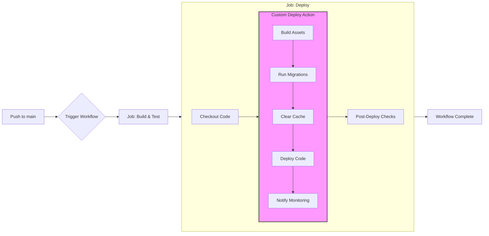
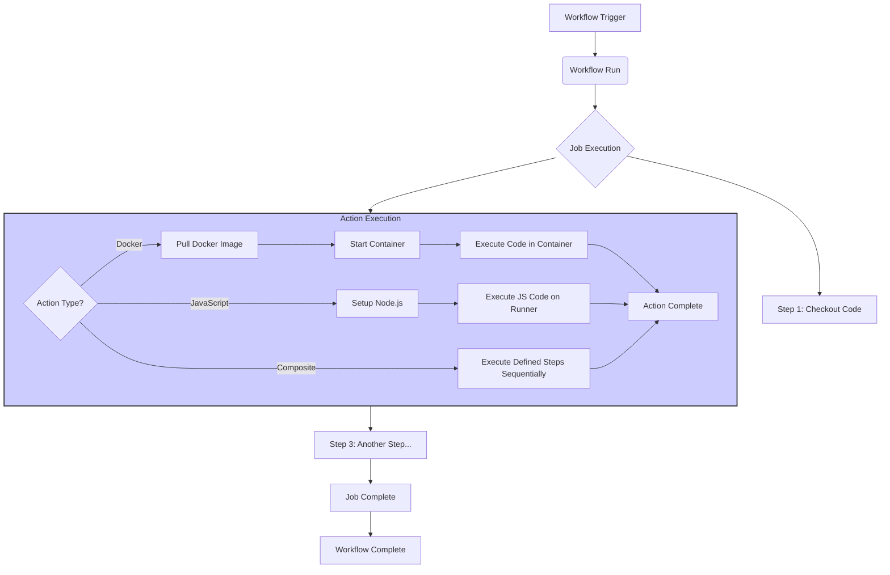

# Chapter 8: Introduction to Custom Action Development

Welcome to Part III of our journey into GitHub Actions! While the previous chapters focused on _using_ existing workflows and actions, this part shifts our focus to _creating_ them. The GitHub Marketplace offers a vast array of pre-built actions, but often, you'll encounter scenarios where existing actions don't quite fit your specific needs, require integrating proprietary systems, or involve complex logic you wish to reuse. This is where custom action development becomes an invaluable skill.

This chapter serves as your gateway into building your own GitHub Actions. We'll explore the fundamental motivations for creating custom actions, dissect the different types you can build, delve into the essential `action.yml` metadata file that defines your action, and guide you through setting up a productive development environment. By the end of this chapter, you'll understand the core concepts and be ready to dive into the specifics of building JavaScript, Docker, and Composite actions in the subsequent chapters.

## A. Why Create Custom Actions?

Before diving into the "how," let's understand the "why." While leveraging community actions is often the quickest way to get started, building custom actions offers significant advantages in various situations:

### 1. Encapsulating Complex Logic

Workflows can sometimes become lengthy and intricate, especially when dealing with multi-step processes, conditional logic, or interactions with specialized tools. Custom actions allow you to bundle this complexity into a single, reusable unit.

- **Maintainability:** Instead of repeating complex sequences of `run` steps across multiple workflows or jobs, you encapsulate the logic within an action. If the logic needs updating, you only need to modify the action's code, not every workflow that uses it.
- **Readability:** Workflows become cleaner and easier to understand when complex operations are abstracted away into well-named actions. A step like `uses: ./my-org/actions/deploy-app@v1` is much more descriptive than ten lines of intricate shell commands.
- **Testability:** You can develop and test the action's logic in isolation, ensuring its correctness before integrating it into larger workflows.

Consider a deployment process involving several steps: building assets, running database migrations, clearing caches, and notifying a monitoring service. This entire sequence can be encapsulated within a single custom action.



> **Diagram Explanation:** This Mermaid diagram illustrates a simplified CI/CD pipeline. The "Deploy" job utilizes a custom action (highlighted) which internally encapsulates multiple complex steps (Build Assets, Run Migrations, etc.), simplifying the overall workflow definition.

### 2. Sharing Automation Across Repositories/Teams

Organizations often have common tasks that need to be performed across multiple projects or teams. Examples include:

- Enforcing specific linting rules.
- Building and publishing internal libraries.
- Deploying applications using standardized company procedures.
- Scanning code with proprietary security tools.

Custom actions provide a standardized and versioned way to share this automation logic.

- **Consistency:** Ensures that common tasks are performed identically across different repositories, reducing configuration drift and potential errors.
- **Efficiency:** Avoids redundant effort by allowing teams to reuse established automation patterns instead of reinventing the wheel.
- **Centralized Updates:** Updates to the shared logic are made in the action's repository and can be easily adopted by consuming workflows by updating the action version reference.

You can store these actions in a central repository within your GitHub organization (e.g., `my-org/actions`) and reference them directly in workflows across other repositories (e.g., `uses: my-org/actions/my-custom-linter@v1.2.0`).

### 3. Integrating Proprietary Tools or APIs

The GitHub Marketplace might not have actions for every tool or service your organization uses, especially for:

- Internal, custom-built tools.
- Legacy systems with specific APIs.
- Niche third-party services without official GitHub Actions integrations.

Custom actions bridge this gap. You can write code within an action (using JavaScript or a Docker container) to interact with these tools or APIs directly. This allows you to seamlessly integrate your unique internal ecosystem into your GitHub Actions workflows. For instance, you could create an action to:

- Trigger a build on an internal Jenkins server.
- Update records in a custom CRM system.
- Fetch configuration from a proprietary secrets management solution.

### 4. Contributing to the Community

If you've developed a useful piece of automation that solves a common problem, packaging it as a custom action allows you to share it with the wider GitHub community.

- **Giving Back:** Contribute to the open-source ecosystem by making your tools available to others.
- **Building Reputation:** Publishing high-quality actions can establish you or your organization as experts in a particular domain.
- **Collaboration:** Others can use, provide feedback on, and even contribute improvements to your action.

Publishing to the GitHub Marketplace makes your action discoverable and easily usable by anyone on GitHub.

## B. Types of Custom Actions

GitHub Actions supports three distinct types of custom actions, each suited for different scenarios and technical requirements:

### 1. Docker Container Actions

- **Concept:** Packages your action's code, dependencies, and environment within a Docker container image. The workflow runner pulls this image and executes code within a container based on it.
- **Use Cases:**
  - Ideal when your action requires specific dependencies, tools, or operating system configurations not readily available on the standard GitHub-hosted runners (e.g., specific versions of compilers, libraries, or system utilities).
  - Provides maximum environment consistency, as the action always runs within the defined container image, regardless of the runner's underlying OS or installed software.
  - Suitable for actions written in languages other than JavaScript or when you need precise control over the execution environment.
- **How it Works:** You provide a `Dockerfile` to build the image. The `action.yml` specifies `using: 'docker'` and points to either the `Dockerfile` in the action's repository or a pre-built image hosted on a registry like Docker Hub or GitHub Container Registry (GHCR).

### 2. JavaScript Actions

- **Concept:** Executes Node.js code directly on the runner machine. Dependencies are typically checked into the action's repository (in a `node_modules` directory) or bundled into a single file.
- **Use Cases:**
  - Generally faster to execute than Docker actions because there's no need to download a container image or start a container.
  - Simpler to develop if you're already familiar with Node.js and JavaScript/TypeScript.
  - Well-suited for actions that primarily interact with the GitHub Actions toolkit libraries (`@actions/core`, `@actions/github`, `@actions/exec`, etc.) or make API calls.
- **How it Works:** The `action.yml` specifies `using: 'node<version>'` (e.g., `node16`, `node20`) and points to the main JavaScript file (e.g., `main: 'dist/index.js'`) that contains the action's entry point. GitHub Actions provides a runner environment with the specified Node.js version pre-installed.



> **Diagram Explanation:** This diagram shows the high-level flow of a GitHub Actions workflow run. When a step involves running an action (highlighted box), the runner determines the action type (Docker, JavaScript, or Composite) and executes it accordingly, either by running code in a container, directly via Node.js, or by executing a sequence of defined steps.

### 3. Composite Actions

- **Concept:** Allows you to group multiple workflow steps together into a single reusable action _without_ writing custom code (like JavaScript) or building a Docker image. It essentially creates a reusable template of workflow steps.
- **Use Cases:**
  - Ideal for combining existing actions or `run` script steps into a logical unit.
  - Simplifying repetitive sequences of steps within or across workflows.
  - Creating higher-level abstractions without the overhead of Docker or Node.js development.
- **How it Works:** The `action.yml` specifies `using: 'composite'` and defines a sequence of `steps` directly within the metadata file. These steps are executed sequentially on the runner when the composite action is invoked. Composite actions can use other actions (Docker, JS, or even other Composite actions) within their steps.

**Choosing the Right Type:**

- **Need specific tools/environment control?** Use **Docker**.
- **Comfortable with Node.js and need speed/simplicity for API interactions?** Use **JavaScript**.
- **Want to reuse existing workflow steps without custom code?** Use **Composite**.

The following chapters will delve into the specific development processes for each of these types.

## C. Anatomy of an Action (`action.yml` / `action.yaml`)

Every custom action, regardless of its type (Docker, JavaScript, or Composite), requires a metadata file named `action.yml` (or `action.yaml`) in the root directory of its repository. This YAML file defines the action's properties, inputs, outputs, and how it should be executed. It's the blueprint that GitHub Actions uses to understand and run your action.

Let's break down the key sections of the `action.yml` file:

### 1. Metadata: `name`, `description`, `author`

These fields provide basic identifying information about your action.

- **`name`**: (Required) The name of your action. This is displayed in the GitHub Actions UI and logs. Choose a clear and concise name.
- **`description`**: (Required) A short description of what the action does. This is also shown in the UI and is crucial for users (including your future self) to understand the action's purpose.
- **`author`**: (Optional) The author of the action. Can be an individual's name, username, or organization.

```yaml
# action.yml (Metadata Example)
name: "My Greeting Action"
description: "Greets a specified person and records the time."
author: "Your Name or Org"
```

### 2. Defining Inputs (`inputs:`)

Inputs allow users of your action to pass data into it, making the action configurable and reusable in different contexts. The `inputs` section defines the parameters your action accepts.

- **`inputs.<input_id>`**: Each key under `inputs:` is a unique identifier for an input parameter. Users will reference this ID when providing values in their workflow (e.g., `with: { <input_id>: 'value' }`).

#### a. `description`, `required`, `default`

Each input ID maps to an object containing metadata about that input:

- **`description`**: (Required) A string describing the input parameter and its purpose. Crucial for usability.
- **`required`**: (Optional) A boolean (`true` or `false`). If `true`, the workflow using the action _must_ provide a value for this input. Defaults to `false`.
- **`default`**: (Optional) A string providing a default value to use if the input is not explicitly provided in the workflow. If an input is `required: true`, it cannot have a `default`. If `required: false` and no `default` is provided, the action code will receive an empty string if the input isn't supplied.

```yaml
# action.yml (Inputs Example)
inputs:
  who-to-greet: # Input ID
    description: "The name of the person to greet."
    required: true
  greeting-prefix:
    description: "Optional prefix for the greeting message."
    required: false
    default: "Hello"
```

### 3. Defining Outputs (`outputs:`)

Outputs allow your action to pass data back to the workflow that called it. Subsequent steps in the same job can use the outputs of your action.

- **`outputs.<output_id>`**: Each key under `outputs:` is a unique identifier for an output value. Users will reference this ID to access the output in their workflow (e.g., `steps.<action_step_id>.outputs.<output_id>`).

#### a. `description`, `value` (setting outputs from action code)

Each output ID maps to an object containing metadata about that output:

- **`description`**: (Required) A string describing the output value and what it represents.
- **`value`**: This property is defined within the `action.yml` _only_ for **Composite actions**. For Docker and JavaScript actions, the `value` is set dynamically _from within the action's code_ during execution. The `action.yml` merely declares the _existence_ and _description_ of the output for Docker/JS actions.

**Setting Outputs from Action Code:**

- **JavaScript Actions:** Use the `@actions/core` toolkit function: `core.setOutput('output_id', 'value');`.
- **Docker Actions:** Write specially formatted strings to standard output: `echo "::set-output name=<output_id>::<value>"`.
- **Composite Actions:** The `value` is defined directly in the `action.yml` using standard workflow expression syntax, typically referencing outputs from the composite action's internal steps: `value: ${{ steps.<internal_step_id>.outputs.<some_output> }}`.

```yaml
# action.yml (Outputs Example)
outputs:
  greeting-result: # Output ID
    description: "The full greeting message generated by the action."
  time: # Another Output ID
    description: "The time the greeting was generated (UTC)."
    # Note: The 'value' for these outputs will be set by the action's code
    # (JavaScript or Docker) or defined explicitly for Composite actions.
```

### 4. Defining the Action's Execution (`runs:`)

This is the most critical section, defining _how_ the action code is executed. It specifies which type of action it is (Docker, JavaScript, or Composite) and provides the necessary details for the runner to execute it.

#### a. `using: 'docker'`, `image`, `args`, `entrypoint`

For Docker container actions:

- **`using: 'docker'`**: Specifies this is a Docker action.
- **`image`**: (Required) Specifies the Docker image to use. This can be:
  - `'Dockerfile'`: Tells the runner to build an image from a `Dockerfile` located in the action's repository root.
  - `'docker://<hub-user>/<repo-name>:<tag>'`: Pulls a public image from Docker Hub.
  - `'docker://ghcr.io/<owner>/<repo-name>:<tag>'`: Pulls an image from GitHub Container Registry.
- **`entrypoint`**: (Optional) Overrides the Docker image's `ENTRYPOINT`.
- **`args`**: (Optional) An array of strings that are passed as arguments (`CMD`) to the container. Input values can be passed here using `${{ inputs.<input_id> }}` syntax.

```yaml
# action.yml (Docker Runs Example)
runs:
  using: "docker"
  image: "Dockerfile" # Build from local Dockerfile
  args:
    - "--name"
    - ${{ inputs.who-to-greet }}
    - "--prefix"
    - ${{ inputs.greeting-prefix }}
```

#### b. `using: 'node<version>'`, `main`

For JavaScript actions:

- **`using: 'node<version>'`**: Specifies this is a JavaScript action and indicates the required major Node.js version (e.g., `node16`, `node20`). The runner will use a pre-installed Node.js version matching this major version.
- **`main`**: (Required) The path to the main JavaScript file that contains the action's code, relative to the action's root directory. This file is typically the output of a build process (e.g., using `ncc` to bundle code and dependencies). Example: `dist/index.js`.

```yaml
# action.yml (JavaScript Runs Example)
runs:
  using: "node20"
  main: "dist/index.js" # Path to the bundled JS file
```

#### c. `using: 'composite'`, `steps`

For Composite actions:

- **`using: 'composite'`**: Specifies this is a Composite action.
- **`steps`**: (Required) An array of workflow step objects, identical in syntax to steps defined within a regular workflow job. These steps are executed sequentially when the composite action runs. They can include `name`, `uses`, `run`, `with`, `env`, `id`, etc. Inputs to the composite action can be accessed within these steps using the `${{ inputs.<input_id> }}` syntax. Outputs are defined in the main `outputs:` section, referencing outputs from the internal steps.

```yaml
# action.yml (Composite Runs Example)
runs:
  using: "composite"
  steps:
    - name: Print Greeting
      run: echo "${{ inputs.greeting-prefix }}, ${{ inputs.who-to-greet }}!"
      shell: bash
    - name: Set Time Output
      id: time-step # Give step an ID to reference its outputs
      run: echo "time=$(date -u +'%Y-%m-%dT%H:%M:%SZ')" >> $GITHUB_OUTPUT
      shell: bash
# Outputs section for this composite action would reference time-step:
# outputs:
#   time:
#     description: 'The time the greeting was generated (UTC).'
#     value: ${{ steps.time-step.outputs.time }}
```

### 5. Branding (`branding:`)

This optional section allows you to customize how your action appears in the GitHub Marketplace and the workflow visual editor.

- **`icon`**: (Optional) The name of a Feather icon to represent the action. See the Feather icon set for available names (e.g., `'zap'`, `'package'`, `'upload-cloud'`).
- **`color`**: (Optional) A background color for the icon. Valid values are: `white`, `yellow`, `blue`, `green`, `orange`, `red`, `purple`, or `gray-dark`.

```yaml
# action.yml (Branding Example)
branding:
  icon: "mic" # Feather icon name
  color: "purple"
```

**Putting it all together - A Complete `action.yml` Example (Conceptual JavaScript Action):**

```yaml
# ./action.yml
name: "Hello World Greeter"
description: "Greets someone and outputs the time."
author: "OctoCat"

inputs:
  who-to-greet:
    description: "Who to greet"
    required: true
    default: "World"

outputs:
  time: # id of output
    description: "The time we greeted you"

runs:
  using: "node20"
  main: "dist/index.js" # Assumes you have a build step creating this file

branding:
  icon: "message-square"
  color: "blue"
```

This `action.yml` defines a JavaScript action named "Hello World Greeter". It takes one input (`who-to-greet`), produces one output (`time`), runs using Node.js 20 by executing `dist/index.js`, and has custom branding.

## D. Setting up Your Action Development Environment

Developing custom actions involves writing code (for JS/Docker) or YAML (for Composite), defining metadata, and testing. A well-structured environment makes this process smoother.

### 1. Recommended Directory Structure

While not strictly enforced by GitHub Actions itself, adopting a conventional directory structure makes your action repository easier to understand, maintain, and contribute to.

**Common Structure for JavaScript/Docker Actions:**

```
my-action-repo/
├── .github/
│   └── workflows/
│       └── test.yml       # Workflow to test the action itself
├── .gitignore             # Standard git ignore file
├── action.yml             # Action metadata file (REQUIRED)
├── src/                   # Source code directory (for JS/TS)
│   └── main.js            # Or main.ts if using TypeScript
├── dist/                  # Distribution directory (for bundled JS code)
│   └── index.js           # Often the target for 'main' in action.yml
├── Dockerfile             # Required only for Docker actions
├── package.json           # Node.js dependencies (for JS actions)
├── package-lock.json      # Lock file for Node.js dependencies
├── README.md              # Documentation for your action
└── ...                    # Other files (scripts, tests, etc.)
```

**Common Structure for Composite Actions:**

```
my-composite-action-repo/
├── .github/
│   └── workflows/
│       └── test.yml       # Workflow to test the action
├── .gitignore
├── action.yml             # Action metadata file (REQUIRED)
├── README.md              # Documentation for your action
└── ...                    # Any scripts or files used by 'run' steps
```

**Key Elements:**

- **`action.yml`:** Always at the root.
- **`.github/workflows/`:** Contains workflows _for testing the action itself_. This allows you to run your action within a real GitHub Actions environment whenever you push changes to the action's repository.
- **`README.md`:** Essential documentation explaining what the action does, its inputs/outputs, usage examples, and any setup required. Treat this as the user manual for your action.
- **`src/` & `dist/` (JS):** Separating source code from the distributable, bundled code (often created using tools like `@vercel/ncc`) is a common practice. The `main` property in `action.yml` usually points to a file in `dist/`.
- **`Dockerfile` (Docker):** Placed at the root if the `image` property in `action.yml` is set to `'Dockerfile'`.

### 2. Version Control Best Practices for Actions

Since actions are reusable components, proper versioning is crucial for consumers to manage updates reliably.

- **Semantic Versioning (SemVer):** Strongly recommended. Use `MAJOR.MINOR.PATCH` (e.g., `v1.0.0`, `v1.2.1`, `v2.0.0`).
  - `MAJOR` version change for incompatible API changes.
  - `MINOR` version change for adding functionality in a backward-compatible manner.
  - `PATCH` version change for backward-compatible bug fixes.
- **Git Tags:** Use Git tags to mark specific releases (e.g., `git tag v1.0.0`). Push these tags to GitHub (`git push origin v1.0.0`). Workflows should reference these immutable tags (e.g., `uses: my-org/my-action@v1.0.0`) rather than branches.
- **Release Branches (Optional but Recommended):** Maintain major version release branches (e.g., `v1`, `v2`). Users can point to these branches (`uses: my-org/my-action@v1`) to automatically get the latest compatible updates within that major version. Update the major branch tag (e.g., `v1`) to point to the latest `v1.x.x` release tag whenever you publish a new minor or patch release.
- **`main` Branch:** Use the `main` (or `master`) branch for active development. Avoid having users reference the `main` branch directly in production workflows, as it represents unreleased, potentially unstable code.
- **Clear Commit Messages:** Write descriptive commit messages explaining the changes made.
- **Changelog:** Maintain a `CHANGELOG.md` file summarizing changes in each release.

### 3. Local Testing Considerations (e.g., `act` - Limitations)

Testing your action directly within GitHub Actions (using a workflow in the `.github/workflows` directory of the action's repository) is the most accurate way to ensure it works correctly in the target environment. However, waiting for a workflow run for every small change can slow down development.

Local testing tools can provide faster feedback loops. The most popular tool is [`act`](https://github.com/nektos/act).

**Using `act`:**

`act` attempts to simulate the GitHub Actions runner environment locally using Docker. You can run it within your action's repository to trigger workflows defined in `.github/workflows/`.

**Example `act` Command:**

```bash
# In the root of your action repository
# Trigger the default event (usually 'push') defined in your test workflow
act

# Trigger a specific event
act pull_request

# Trigger a specific job within a workflow
act -j test-action # Assuming a job with id 'test-action' exists
```

`act` will read your workflow files, pull necessary Docker images (including one to simulate the runner environment and potentially your action's image if it's a Docker action), and execute the steps.

#### [Troubleshooting Section: Challenges in local action testing]

While `act` is incredibly useful, it's crucial to understand its limitations and potential discrepancies compared to the real GitHub Actions environment:

- **Environment Differences:** `act` uses Docker images to _mimic_ the runner environment (Ubuntu, macOS, Windows). These images might not perfectly replicate the exact set of tools, libraries, versions, file system structure, or network configuration of the official GitHub-hosted runners. Subtle differences can lead to behavior changes.
- **Secrets Handling:** `act` requires you to provide secrets manually (e.g., via command-line flags `-s MY_SECRET=value` or an environment file). It doesn't have access to your repository's or organization's configured secrets. Be cautious about exposing real secrets locally.
- **GitHub Context (`github`):** `act` provides a mock `github` context, but it might not contain all the nuanced information present in a real workflow run triggered by a specific event (like a pull request comment or a release). Fields related to the triggering actor, event payload details, or specific API endpoints might differ or be missing.
- **Runner Tools Cache:** GitHub runners have pre-cached tools (like specific SDK versions). `act` typically downloads these on demand, which can affect initial run times locally.
- **Networking:** Network access from the `act` container might differ from the GitHub runner environment, potentially affecting interactions with external services or APIs. Firewalls or local network configurations can interfere.
- **Docker-in-Docker:** If your action _itself_ needs to interact with Docker (e.g., build images), running it via `act` (which already uses Docker) can sometimes lead to Docker-in-Docker complexities or require specific `act` configurations.
- **Platform Specificity:** Accurately testing actions designed for specific runners (like macOS or Windows) can be challenging if your local machine runs a different OS, although `act` attempts to mitigate this with corresponding Docker images.

**Recommendation:** Use `act` for rapid, iterative development and basic validation. However, **always perform final testing by running the action within a real GitHub Actions workflow** triggered on GitHub before releasing a new version. The workflow defined in `.github/workflows/test.yml` within your action's repository is the ideal place for this comprehensive testing.

---

This chapter has laid the groundwork for custom action development. You now understand _why_ you might build them, the different _types_ available, the crucial role of the `action.yml` metadata file, and how to set up your development environment, including the nuances of local testing. Armed with this foundational knowledge, you are ready to explore the specific techniques for building each type of action in the chapters that follow. Next, we'll dive deep into crafting powerful and efficient JavaScript actions.
