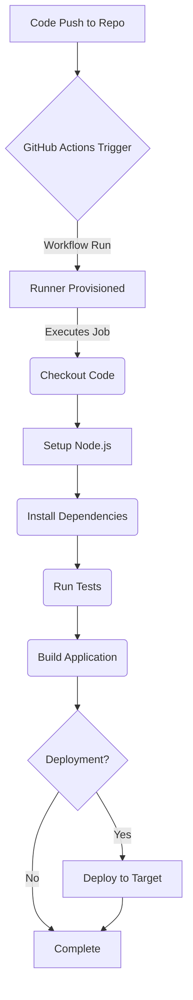

# Chapter 9: Developing JavaScript Actions

In the previous chapter, we explored the fundamental concepts behind creating custom actions. Now, we dive deep into one of the most popular and efficient methods: developing actions using JavaScript and Node.js. JavaScript actions are executed directly by the runner environment using Node.js, offering fast startup times and leveraging the vast npm ecosystem. They are an excellent choice if you or your team are already comfortable with Node.js development.

This chapter will guide you through the entire lifecycle of creating a JavaScript action, from setting up your project and utilizing the essential Actions Toolkit packages to packaging, testing, and adhering to best practices. By the end, you'll be equipped to build robust and efficient JavaScript actions to automate your workflows.

## A. Prerequisites: Node.js Fundamentals

Before embarking on JavaScript action development, a foundational understanding of Node.js is essential. GitHub Actions runners come pre-installed with specific versions of Node.js (currently Node.js 16 and Node.js 20 are common, but always check the [runner software documentation](https://docs.github.com/en/actions/using-github-hosted-runners/about-github-hosted-runners#supported-software) for the latest versions). Your JavaScript action code will execute within this Node.js environment.

Therefore, you should be comfortable with:

- **Core JavaScript:** Modern JavaScript syntax (ES6/ES2015 and later) is recommended for cleaner and more efficient code. Concepts like `async`/`await`, Promises, modules (`require` or ES modules), and basic data structures are crucial.
- **Node.js Runtime:** Understanding the Node.js event loop, built-in modules (like `fs` for file system, `path` for path manipulation), and how Node.js executes scripts.
- **npm or Yarn:** Proficiency in using a Node.js package manager (npm comes bundled with Node.js, Yarn is a popular alternative) for initializing projects, managing dependencies (`package.json`), and running scripts.

While deep Node.js expertise isn't mandatory for simple actions, a solid grasp of these fundamentals will significantly smooth the development process, especially when dealing with asynchronous operations, dependencies, and file system interactions.



**Diagram Explanation:** This diagram illustrates a typical Continuous Integration/Continuous Deployment (CI/CD) pipeline, often orchestrated using GitHub Actions. Developing custom actions, including JavaScript actions, allows you to create reusable components (like custom testing, building, or deployment steps) within such pipelines.

## B. Setting up the Project

Every custom action should reside in its own dedicated repository. This promotes modularity, versioning, and discoverability. To begin developing a JavaScript action, you first need to initialize a standard Node.js project.

#### 1. `npm init` or `yarn init`

Navigate to your action's repository directory in your terminal and initialize a new Node.js project. This creates a `package.json` file, which tracks your project's metadata, dependencies, and scripts.

Using npm:

```bash
# Navigate to your action's directory
cd path/to/your-js-action

# Initialize the project, accepting defaults
npm init -y
```

Using Yarn:

```bash
# Navigate to your action's directory
cd path/to/your-js-action

# Initialize the project, accepting defaults
yarn init -y
```

The `-y` flag automatically accepts the default settings. You can omit it to customize the project details interactively. Your `package.json` will look something like this initially:

```json
{
  "name": "your-js-action",
  "version": "1.0.0",
  "description": "",
  "main": "index.js",
  "scripts": {
    "test": "echo \"Error: no test specified\" && exit 1"
  },
  "keywords": [],
  "author": "",
  "license": "ISC"
}
```

You should edit this file later to add a more meaningful description, keywords relevant to your action, and specify the author and license (MIT is common for Actions). The `"main"` field typically points to your action's entry point script (commonly `index.js`).

#### 2. Essential Dependencies (`@actions/core`, `@actions/github`, `@actions/exec`, `@actions/io`, `@actions/tool-cache`)

GitHub provides a suite of npm packages, collectively known as the **Actions Toolkit**, specifically designed to facilitate interaction with the runner environment, workflow commands, and the GitHub API. These packages abstract away many complexities, allowing you to focus on your action's logic.

Install the core toolkit packages as dependencies:

Using npm:

```bash
npm install @actions/core @actions/github @actions/exec @actions/io @actions/tool-cache
```

Using Yarn:

```bash
yarn add @actions/core @actions/github @actions/exec @actions/io @actions/tool-cache
```

Let's break down the purpose of each key package:

- **`@actions/core`**: The foundation. Provides functions for accessing inputs, setting outputs, logging messages (info, warning, error, debug), setting the action's status (success/failure), exporting environment variables, masking secrets in logs, and manipulating the system path.
- **`@actions/github`**: Enables interaction with the GitHub API. It provides an authenticated Octokit client instance (using the workflow's `GITHUB_TOKEN` or a provided token) and access to the workflow run's context (event payload, repository details, etc.).
- **`@actions/exec`**: Allows your action to execute command-line tools and scripts reliably. It handles capturing output (stdout, stderr) and exit codes.
- **`@actions/io`**: Offers robust, cross-platform utilities for common file system operations like creating directories, copying, moving, and deleting files/folders.
- **`@actions/tool-cache`**: Provides functions for downloading, caching, and finding tools (like specific versions of CLI tools or SDKs) within the runner environment. This helps speed up workflows by avoiding repeated downloads.

```mermaid
graph LR
    subgraph Runner Environment
        A[Node.js Runtime]
        B[Workflow Commands]
        C[Environment Variables]
        D[File System]
    end

    subgraph Action Code (index.js)
        E[@actions/core]
        F[@actions/github]
        G[@actions/exec]
        H[@actions/io]
        I[@actions/tool-cache]
    end

    J[GitHub API]
    K[External Tools/Scripts]
    L[Cached Tools]

    E --> B; E -- Reads --> C; E -- Writes --> B;
    F -- Uses --> J; F -- Reads --> C;
    G -- Executes --> K; G -- Interacts --> D;
    H -- Manipulates --> D;
    I -- Manages --> L; I -- Interacts --> D;

    A -- Executes --> Action Code;
```

**Diagram Explanation:** This diagram shows how the core `@actions/*` toolkit packages act as intermediaries between your JavaScript action code and the underlying runner environment features (Node.js, workflow commands, environment variables, file system) as well as external resources like the GitHub API, external tools, and the tool cache.

With the project initialized and essential dependencies installed, you're ready to start writing the action's logic using the toolkit. Remember to also create an `action.yml` metadata file (as covered in Chapter 8) to define your action's inputs, outputs, and execution logic (`runs: using: 'node16', main: 'index.js'`).

## C. Core Action Toolkit (`@actions/core`)

The `@actions/core` package is indispensable for building JavaScript actions. It provides the fundamental functions needed to interact with the GitHub Actions runner environment, manage inputs/outputs, log information, and control the action's execution status.

Let's explore its key functions:

#### 1. Reading Inputs (`core.getInput()`)

Actions receive data through inputs defined in the `action.yml` file. The `core.getInput()` function retrieves the value of a specific input. Input names are case-insensitive.

```javascript
const core = require("@actions/core");

try {
  // Get the value of the 'user-name' input
  // Inputs are always strings.
  const userName = core.getInput("user-name", { required: true });
  const greeting = core.getInput("greeting"); // Optional input

  core.info(`Received user name: ${userName}`);
  if (greeting) {
    core.info(`Received greeting: ${greeting}`);
  }

  // ... rest of your action logic
} catch (error) {
  core.setFailed(error.message);
}
```

- The first argument is the input name (matching the name in `action.yml`).
- The optional second argument is an options object. `required: true` will cause the action to fail automatically if the input is not provided in the workflow file.

#### 2. Setting Outputs (`core.setOutput()`)

Actions can produce outputs that subsequent steps in the same job can use. `core.setOutput()` defines an output parameter.

```javascript
const core = require("@actions/core");

try {
  const time = new Date().toTimeString();
  core.setOutput("current-time", time);

  const processedValue = "some-result-123";
  core.setOutput("result-id", processedValue);

  core.info(`Set output 'current-time' to ${time}`);
  core.info(`Set output 'result-id' to ${processedValue}`);
} catch (error) {
  core.setFailed(error.message);
}
```

In a workflow, another step could access these like `${{ steps.YOUR_STEP_ID.outputs.current-time }}`.

#### 3. Logging Messages (`core.info`, `core.warning`, `core.error`, `core.debug`)

Effective logging is crucial for debugging and monitoring workflows. `@actions/core` provides several logging functions:

- `core.info(message)`: Logs standard informational messages. Visible by default.
- `core.warning(message)`: Logs a warning message. These are typically highlighted in the UI and may include file/line annotations if formatted correctly (`core.warning('Something is deprecated', { title: 'Deprecation Warning', file: 'src/old-code.js', startLine: 10 })`).
- `core.error(message)`: Logs an error message. Similar highlighting and annotation capabilities as warnings. **Note:** Logging an error does _not_ automatically fail the action; use `core.setFailed()` for that.
- `core.debug(message)`: Logs detailed debugging messages. These are hidden by default and only appear if repository secrets `ACTIONS_STEP_DEBUG` or `ACTIONS_RUNNER_DEBUG` are set to `true`.

```javascript
const core = require("@actions/core");

core.info("Starting the action...");
core.debug("This is a detailed debug message."); // Only shown if debug logging is enabled

const configValue = process.env.SOME_CONFIG || "default";
if (configValue === "default") {
  core.warning("Configuration not set, using default value.");
}

try {
  // Simulate an operation that might fail
  throw new Error("Simulated operation failed!");
} catch (error) {
  core.error(`Caught an error: ${error.message}`);
  // Decide if this error should fail the step
  // core.setFailed(error.message);
}

core.info("Action finished.");
```

#### 4. Setting Failed Status (`core.setFailed()`)

To explicitly mark the action step as failed, use `core.setFailed()`. This function logs the provided message as an error and sets the step's status to failure, which typically stops the entire workflow run unless `continue-on-error: true` is set for the step.

```javascript
const core = require("@actions/core");

try {
  const requiredInput = core.getInput("required-data", { required: true });
  // If getInput fails due to required: true, it throws, caught below.

  if (!requiredInput.startsWith("expected-prefix")) {
    // Custom validation failed
    throw new Error(
      `Input 'required-data' must start with 'expected-prefix'. Received: ${requiredInput}`
    );
  }

  core.info("Input validation passed.");
  // ... proceed
} catch (error) {
  // Catch errors (from getInput or custom throws) and fail the action
  core.setFailed(`Action failed: ${error.message}`);
}
```

It's common practice to wrap your main action logic in a `try...catch` block and call `core.setFailed()` within the `catch` block.

#### 5. Exporting Variables (`core.exportVariable()`)

Sometimes, you need to set an environment variable that subsequent steps _within the same job_ can access directly (as opposed to outputs, which require the `steps` context). `core.exportVariable()` achieves this.

```javascript
const core = require("@actions/core");

try {
  const dynamicPath = "/opt/my-tool/bin";
  core.exportVariable("TOOL_BIN_PATH", dynamicPath);
  core.info(`Exported environment variable TOOL_BIN_PATH=${dynamicPath}`);

  // This variable will be available as process.env.TOOL_BIN_PATH
  // or $TOOL_BIN_PATH in subsequent steps of the same job.
} catch (error) {
  core.setFailed(error.message);
}
```

**Note:** Exported variables are only available to subsequent steps in the _same job_. Outputs are generally preferred for passing data between steps, while exported variables are useful for modifying the environment for subsequent `run` scripts or actions within that job.

#### 6. Masking Secrets (`core.setSecret()`)

If your action handles sensitive data (like tokens, passwords, keys) that might accidentally get logged, use `core.setSecret()` to register the value with the runner. The runner will then attempt to mask (replace with `***`) any occurrences of that exact string in the logs.

```javascript
const core = require("@actions/core");

try {
  const apiToken = core.getInput("api-token", { required: true });

  // Register the token value to be masked in logs
  core.setSecret(apiToken);

  core.info("Attempting to connect to API...");
  // If apiToken were accidentally logged below, it would be masked.
  // e.g., core.debug(`Using token: ${apiToken}`); // Output: Using token: ***

  // Use the token (e.g., in an API call header)
  // ...
} catch (error) {
  core.setFailed(error.message);
}
```

Masking is best-effort and works on exact string matches. It's still crucial to avoid intentionally logging secrets.

#### 7. Managing File Paths (`core.addPath()`)

If your action installs or locates a command-line tool, you might need to add its directory to the system `PATH` environment variable so that subsequent steps can execute the tool directly without specifying the full path. `core.addPath()` prepends a directory to the `PATH` for the remainder of the current job.

```javascript
const core = require("@actions/core");
const path = require("path");

try {
  // Assume a tool was downloaded or built into './my-cli-tool/bin'
  const toolBinPath = path.resolve("./my-cli-tool/bin");

  core.info(`Adding ${toolBinPath} to PATH`);
  core.addPath(toolBinPath);

  // Now, subsequent steps in this job can run commands from that directory, e.g.:
  // - run: my-cli-tool --version
} catch (error) {
  core.setFailed(error.message);
}
```

##### [Code Snippet: Basic JavaScript action reading input and setting output]

Let's combine some of these concepts into a simple action.

**`action.yml`:**

```yaml
name: "Greeting Action"
description: "Greets someone and sets the time"
author: "Your Name"
inputs:
  who-to-greet:
    description: "Who to greet"
    required: true
    default: "World"
outputs:
  time: # id of output
    description: "The time the greeting was generated"
runs:
  using: "node20" # Or 'node16'
  main: "dist/index.js" # Pointing to the compiled output (see Section G)
```

**`index.js` (Source file before packaging):**

```javascript
const core = require("@actions/core");

async function run() {
  try {
    // 1. Get input
    const whoToGreet = core.getInput("who-to-greet", { required: true });
    core.info(`Input 'who-to-greet': ${whoToGreet}`);

    // 2. Perform action logic
    const greeting = `Hello, ${whoToGreet}!`;
    core.info(greeting);

    // 3. Set output
    const time = new Date().toISOString();
    core.setOutput("time", time);
    core.info(`Set output 'time': ${time}`);

    // 4. Example logging
    core.debug("Debug message: Action completed successfully."); // Hidden by default
  } catch (error) {
    // 5. Handle errors and fail the action
    core.setFailed(`Action failed with error: ${error.message}`);
  }
}

// Run the main function
run();
```

This example demonstrates the basic flow: read inputs, perform logic, log information, set outputs, and handle potential errors using `@actions/core`.

## D. Interacting with the GitHub API (`@actions/github`)

Many actions need to interact with GitHub itself – perhaps to comment on pull requests, add labels, fetch repository information, or trigger other workflows. The `@actions/github` package provides a convenient way to do this using the GitHub REST API.

#### 1. Authenticating with `GITHUB_TOKEN`

Workflows automatically generate a unique `GITHUB_TOKEN` secret for each run. This token has permissions scoped to the repository where the workflow is running. By default, `@actions/github` uses this token for authentication.

The permissions granted to `GITHUB_TOKEN` depend on the context (e.g., push, pull request) and can be customized in the workflow file using the `permissions` key. For security, it's best practice to grant only the minimum required permissions.

```yaml
name: API Interaction Workflow
on: [push]

# Grant read access to contents and write access to pull requests
permissions:
  contents: read
  pull-requests: write

jobs:
  label-pr:
    runs-on: ubuntu-latest
    steps:
      - name: Checkout code
        uses: actions/checkout@v4

      - name: Label PR (if applicable)
        uses: ./path/to/your-js-api-action # Assuming your action is in the repo
        with:
          label-name: "needs-review"
          # GITHUB_TOKEN is automatically available to the action
```

In some cases, the default `GITHUB_TOKEN` might not have sufficient permissions (e.g., interacting with other repositories, accessing organization settings). For these scenarios, you might need to create a Personal Access Token (PAT) or use a GitHub App installation token and pass it as an input to your action. However, always prefer `GITHUB_TOKEN` when possible due to its automatic scoping and rotation.

#### 2. Using Octokit for API Calls

The `@actions/github` package exposes an authenticated instance of Octokit, GitHub's official REST API client for JavaScript. It also provides access to the workflow's context (event payload, repository info, etc.).

```javascript
const core = require("@actions/core");
const github = require("@actions/github");

async function run() {
  try {
    // Get the GITHUB_TOKEN
    const token = core.getInput("github-token", { required: true }); // Best practice: pass token as input

    // Create an authenticated Octokit client
    const octokit = github.getOctokit(token);

    // Access the workflow context
    const context = github.context;

    // Example: Log repository owner and name
    core.info(
      `Running in repository: ${context.repo.owner}/${context.repo.repo}`
    );
    core.info(`Triggered by event: ${context.eventName}`);
    core.info(`Workflow SHA: ${context.sha}`);

    // You can now use 'octokit' to make API calls
    // Example: List repository issues (requires 'issues: read' permission)
    // const { data: issues } = await octokit.rest.issues.listForRepo({
    //   owner: context.repo.owner,
    //   repo: context.repo.repo,
    //   state: 'open',
    // });
    // core.info(`Found ${issues.length} open issues.`);
  } catch (error) {
    core.setFailed(error.message);
  }
}

run();
```

**Key Points:**

- **`github.getOctokit(token)`**: Returns an authenticated Octokit instance. It's recommended to explicitly pass the token via an input (`core.getInput('github-token')`) rather than relying solely on `process.env.GITHUB_TOKEN` for clarity and testability. The workflow would then pass it: `with: github-token: ${{ secrets.GITHUB_TOKEN }}`.
- **`github.context`**: An object containing valuable information about the workflow run, such as:
  - `payload`: The full webhook event payload that triggered the workflow.
  - `eventName`: The name of the event (e.g., `push`, `pull_request`).
  - `sha`: The commit SHA associated with the run.
  - `ref`: The branch or tag ref.
  - `workflow`: The name of the workflow.
  - `action`: The ID of the action.
  - `actor`: The username of the user who initiated the run.
  - `repo`: An object with `owner` and `repo` names.
  - `issue`: An object with `owner`, `repo`, and `number` (available for issue/PR related events).
  - `serverUrl`, `apiUrl`, `graphqlUrl`: URLs for the GitHub instance.

##### [Practical Example: JavaScript action to fetch PR details and add a label]

Let's create an action that adds a specific label to the pull request that triggered the workflow.

**`action.yml`:**

```yaml
name: "Label Pull Request"
description: "Adds a label to the current pull request"
author: "Your Name"
inputs:
  label-name:
    description: "The name of the label to add"
    required: true
  github-token:
    description: "GitHub token for API calls"
    required: true
    default: ${{ github.token }} # Sensible default, but still requires passing in workflow
runs:
  using: "node20"
  main: "dist/index.js"
```

**`index.js` (Source file):**

```javascript
const core = require("@actions/core");
const github = require("@actions/github");

async function run() {
  try {
    const token = core.getInput("github-token", { required: true });
    const labelName = core.getInput("label-name", { required: true });

    const octokit = github.getOctokit(token);
    const context = github.context;

    // Check if the event is a pull request
    if (
      context.eventName !== "pull_request" &&
      context.eventName !== "pull_request_target"
    ) {
      core.info(
        "This action is designed to run on pull_request events. Skipping."
      );
      return; // Exit gracefully if not a PR event
    }

    // Get the pull request number from the context
    const prNumber = context.payload.pull_request?.number;

    if (!prNumber) {
      throw new Error("Could not get pull request number from context.");
    }

    core.info(`Adding label "${labelName}" to PR #${prNumber}...`);

    // Use Octokit to add the label
    // Requires 'pull-requests: write' permission for GITHUB_TOKEN
    await octokit.rest.issues.addLabels({
      owner: context.repo.owner,
      repo: context.repo.repo,
      issue_number: prNumber, // Note: PRs are treated as issues for labeling
      labels: [labelName],
    });

    core.info(`Successfully added label "${labelName}" to PR #${prNumber}.`);
  } catch (error) {
    // Handle potential errors, like label already existing or permission issues
    core.error(`Error adding label: ${error.message}`);
    if (error.status) {
      core.error(`GitHub API Error Status: ${error.status}`);
    }
    core.setFailed(`Failed to add label: ${error.message}`);
  }
}

run();
```

**Workflow Usage (`.github/workflows/pr-labeler.yml`):**

```yaml
name: Label New PRs
on:
  pull_request:
    types: [opened]

permissions:
  contents: read # Needed for checkout
  pull-requests: write # Needed by the action to add labels

jobs:
  label:
    runs-on: ubuntu-latest
    steps:
      - name: Checkout code
        uses: actions/checkout@v4

      - name: Add 'needs-triage' label
        uses: ./path/to/your-label-action # Use the path to your action within the repo
        with:
          label-name: "needs-triage"
          github-token: ${{ secrets.GITHUB_TOKEN }}
```

This example demonstrates obtaining context, making an authenticated API call using Octokit, and handling potential errors specific to API interactions.

## E. Executing Commands (`@actions/exec`)

Actions often need to run external command-line tools or scripts as part of their logic (e.g., running a linter, compiler, test suite, or deployment script). The `@actions/exec` package provides a reliable way to execute these commands, capture their output, and handle their exit codes.

#### 1. Running External Tools and Scripts

The primary function is `exec.exec()`. It executes a command and waits for it to complete.

```javascript
const core = require("@actions/core");
const exec = require("@actions/exec");
const path = require("path");

async function run() {
  try {
    const scriptPath = core.getInput("script-path", { required: true });
    const workingDirectory = core.getInput("working-directory") || "."; // Optional working dir

    core.info(
      `Executing script: ${scriptPath} in directory ${workingDirectory}`
    );

    // Example: Execute a shell script
    // Assumes the script is executable (chmod +x)
    const exitCode = await exec.exec("bash", [scriptPath], {
      cwd: workingDirectory, // Set the current working directory for the command
      // other options...
    });

    core.info(`Script finished with exit code ${exitCode}.`); // exec.exec returns the exit code

    // Example: Running npm install
    core.info("Running npm install...");
    await exec.exec("npm", ["install"], { cwd: "./my-package" });
    core.info("npm install completed.");
  } catch (error) {
    // exec.exec throws an error if the command returns a non-zero exit code (by default)
    core.setFailed(`Command execution failed: ${error.message}`);
  }
}

run();
```

- The first argument is the command or tool to execute (e.g., `bash`, `npm`, `git`).
- The second argument is an array of strings representing the arguments to pass to the command.
- The third argument (optional) is an options object. Common options include:
  - `cwd`: The working directory for the command.
  - `env`: An object of environment variables to set for the command execution.
  - `silent`: If `true`, suppresses stdout/stderr output to the live log (default `false`).
  - `ignoreReturnCode`: If `true`, `exec.exec` will not throw an error for non-zero exit codes (default `false`).
  - `listeners`: Functions to capture stdout and stderr (see below).

#### 2. Capturing Output and Handling Exit Codes

By default, `exec.exec` streams the command's stdout and stderr directly to the workflow log. If you need to capture the output for processing within your action, you can use the `listeners` option.

```javascript
const core = require("@actions/core");
const exec = require("@actions/exec");

async function run() {
  try {
    let commandOutput = "";
    let commandError = "";

    const options = {
      listeners: {
        stdout: (data) => {
          commandOutput += data.toString();
        },
        stderr: (data) => {
          commandError += data.toString();
        },
      },
      ignoreReturnCode: true, // Prevent throwing on non-zero exit, handle manually
      silent: true, // Optional: prevent live streaming if capturing all output
    };

    core.info("Executing command and capturing output...");
    // Example: Get current git branch name
    const exitCode = await exec.exec(
      "git",
      ["rev-parse", "--abbrev-ref", "HEAD"],
      options
    );

    if (exitCode !== 0) {
      core.error(`Command failed with exit code ${exitCode}`);
      core.error(`Stderr: ${commandError.trim()}`);
      core.setFailed(`Git command failed. Stderr: ${commandError.trim()}`);
      return;
    }

    const branchName = commandOutput.trim();
    core.info(`Detected branch: ${branchName}`);
    core.setOutput("branch-name", branchName);

    // Handle potential errors logged to stderr even with exit code 0
    if (commandError) {
      core.warning(`Command produced stderr output: ${commandError.trim()}`);
    }
  } catch (error) {
    // Catch errors not related to exit code (e.g., command not found)
    core.setFailed(`Action failed: ${error.message}`);
  }
}

run();
```

- **Exit Codes:** By default, a non-zero exit code from the executed command causes `exec.exec` to throw an error, which usually fails the action step (unless caught). Setting `ignoreReturnCode: true` prevents this, allowing you to inspect the returned `exitCode` and decide how to proceed.
- **Output Capture:** The `listeners.stdout` and `listeners.stderr` functions receive Buffer objects. Use `.toString()` to convert them to strings. Remember that output might arrive in chunks, so append (`+=`) the data.
- **`exec.getExecOutput()`**: As a simpler alternative for capturing output, you can use `exec.getExecOutput(command, args?, options?)`. It returns a promise that resolves to an object `{ exitCode, stdout, stderr }`. This is often more convenient than setting up listeners manually.

##### [Code Snippet: Executing a shell command and capturing its output]

Using `exec.getExecOutput` for simplicity:

```javascript
const core = require("@actions/core");
const exec = require("@actions/exec");

async function run() {
  try {
    core.info("Running `ls -l` and capturing output...");

    const options = {
      cwd: ".", // Specify working directory if needed
      silent: false, // Show live output in logs as well
    };

    // Use getExecOutput to capture stdout, stderr, and exit code
    const { exitCode, stdout, stderr } = await exec.getExecOutput(
      "ls",
      ["-l"],
      options
    );

    if (exitCode !== 0) {
      core.error(`Command failed with exit code ${exitCode}`);
      core.error(`Stderr: ${stderr.trim()}`);
      // Optionally fail the action
      // core.setFailed(`'ls -l' failed: ${stderr.trim()}`);
    } else {
      core.info(`Command succeeded! Exit code: ${exitCode}`);
      core.info("Output (stdout):");
      // Log captured output using core.info or core.debug
      core.info(stdout.trim());

      if (stderr) {
        core.warning(`Command produced stderr output:\n${stderr.trim()}`);
      }

      // You can now process the 'stdout' variable
      const lines = stdout.trim().split("\n").length;
      core.info(`Found ${lines} lines in output.`);
      core.setOutput("line-count", lines);
    }
  } catch (error) {
    core.setFailed(`Action failed during command execution: ${error.message}`);
  }
}

run();
```

This snippet demonstrates running `ls -l`, capturing its output using the convenient `getExecOutput`, checking the exit code, logging the captured output, and setting an action output based on the result.

## F. File System Operations (`@actions/io`)

Actions frequently need to interact with the file system on the runner – creating directories for temporary files or build artifacts, moving build outputs to a specific location, copying configuration files, or cleaning up temporary data. While Node.js's built-in `fs` module can be used, the `@actions/io` package provides higher-level, cross-platform utilities that are often more convenient and robust, especially for common tasks like recursive operations.

It ensures that operations behave consistently across different runner operating systems (Linux, macOS, Windows).

#### 1. Creating Directories (`io.mkdirP`)

The `io.mkdirP()` function creates a directory, including any necessary parent directories (similar to `mkdir -p` on Linux/macOS).

```javascript
const core = require("@actions/core");
const io = require("@actions/io");
const path = require("path");

async function run() {
  try {
    const buildDir = path.join(process.cwd(), "build", "output");
    core.info(`Ensuring directory exists: ${buildDir}`);

    // Create the directory and any parent directories if they don't exist
    await io.mkdirP(buildDir);

    core.info(`Directory ${buildDir} created or already exists.`);

    // Now safe to write files into buildDir
    // e.g., fs.writeFileSync(path.join(buildDir, 'artifact.txt'), 'content');
  } catch (error) {
    core.setFailed(`Failed to create directory: ${error.message}`);
  }
}

run();
```

#### 2. Moving/Copying Files (`io.mv`, `io.cp`)

- `io.mv(source, dest, options?)`: Moves a file or directory.
- `io.cp(source, dest, options?)`: Copies a file or directory.

```javascript
const core = require("@actions/core");
const io = require("@actions/io");
const path = require("path");

async function run() {
  try {
    const sourceFile = path.join(process.cwd(), "src", "config.json");
    const tempDir = path.join(process.cwd(), "temp-staging");
    const finalDest = path.join(process.cwd(), "deployment-package");

    await io.mkdirP(tempDir);
    await io.mkdirP(finalDest);

    // Copy config.json into the temp directory
    core.info(`Copying ${sourceFile} to ${tempDir}`);
    await io.cp(sourceFile, tempDir);
    core.info("File copied.");

    // Assume some build process happened in tempDir...

    // Move the entire tempDir content to the final destination
    // Note: Moving a directory might behave differently across platforms
    // Often safer to move specific files or use cp then rmRF
    core.info(`Moving contents from ${tempDir} to ${finalDest}`);
    // Let's copy recursively instead of move for broader compatibility example
    await io.cp(tempDir, finalDest, { recursive: true, force: true }); // Overwrite if exists
    core.info("Contents copied recursively.");

    // Example: Move a specific file
    const artifactFile = path.join(finalDest, "app.zip"); // Assume this exists now
    const archiveDir = path.join(process.cwd(), "archive");
    await io.mkdirP(archiveDir);
    if (require("fs").existsSync(artifactFile)) {
      // Check existence before moving
      core.info(`Moving ${artifactFile} to ${archiveDir}`);
      await io.mv(artifactFile, archiveDir);
      core.info("Artifact moved.");
    }
  } catch (error) {
    core.setFailed(`File operation failed: ${error.message}`);
  } finally {
    // Clean up temp directory (see next section)
    const tempDir = path.join(process.cwd(), "temp-staging");
    core.info(`Cleaning up ${tempDir}`);
    await io.rmRF(tempDir);
  }
}

run();
```

Key options for `io.cp`:

- `recursive: true`: Required for copying directories.
- `force: true`: Overwrite destination if it already exists. Default is `false`.

#### 3. Deleting Files/Directories (`io.rmRF`)

The `io.rmRF()` function forcibly and recursively removes files or directories (similar to `rm -rf`). Use this with caution!

```javascript
const core = require("@actions/core");
const io = require("@actions/io");
const path = require("path");

async function run() {
  const tempDir = path.join(process.cwd(), "temp-data");
  const cacheFile = path.join(process.cwd(), ".cachefile");

  try {
    // Assume tempDir and cacheFile were created earlier
    await io.mkdirP(tempDir);
    require("fs").writeFileSync(cacheFile, "dummy data");
    require("fs").writeFileSync(path.join(tempDir, "file1.tmp"), "temp");

    core.info(`Attempting to remove directory: ${tempDir}`);
    await io.rmRF(tempDir); // Removes the directory and its contents
    core.info(`Directory ${tempDir} removed.`);

    core.info(`Attempting to remove file: ${cacheFile}`);
    await io.rmRF(cacheFile); // Also works for single files
    core.info(`File ${cacheFile} removed.`);

    // Trying to remove something that doesn't exist won't throw an error
    core.info(`Attempting to remove non-existent path...`);
    await io.rmRF("/path/does/not/exist");
    core.info(`Removal of non-existent path completed without error.`);
  } catch (error) {
    // Errors might occur due to permissions, etc.
    core.setFailed(`Failed to remove path: ${error.message}`);
  }
}

run();
```

`io.rmRF` is particularly useful for cleaning up temporary files or directories created during the action's execution, often placed in a `finally` block to ensure cleanup happens even if errors occur.

## G. Building and Packaging JavaScript Actions

When you write a JavaScript action, especially one with dependencies (`node_modules`), you need a way to package it so that the GitHub Actions runner can execute it efficiently without needing to run `npm install` during the workflow. The standard and recommended approach is to compile your action code and all its necessary dependencies into a single JavaScript file.

#### 1. Using `ncc` to Compile into a Single File

The tool recommended by GitHub for this purpose is `@vercel/ncc`. `ncc` takes your entry point JavaScript file (e.g., `index.js`), analyzes its dependencies (`require` statements), and bundles everything – your code and the code from `node_modules` that you actually use – into one single `.js` file. It intelligently excludes unused code paths within dependencies, resulting in a potentially smaller bundle.

##### [Configuration Guide: Setting up `ncc` build process]

1.  **Install `ncc` as a Development Dependency:**
    You only need `ncc` during development/build time, not during the action's runtime.

    Using npm:

    ```bash
    npm install -D @vercel/ncc
    # or
    yarn add -D @vercel/ncc
    ```

2.  **Add a Build Script to `package.json`:**
    Add a script to your `package.json`'s `"scripts"` section to invoke `ncc`.

    ```json
    {
      "name": "your-js-action",
      "version": "1.0.0",
      "description": "My awesome JS action",
      "main": "index.js", // Your source entry point
      "scripts": {
        "build": "ncc build index.js -o dist --source-map --license licenses.txt",
        "test": "echo \"Error: no test specified\" && exit 1"
        // Add other scripts like 'lint', 'package', etc. as needed
      },
      "dependencies": {
        "@actions/core": "^1.10.0",
        "@actions/github": "^6.0.0"
        // ... other runtime dependencies
      },
      "devDependencies": {
        "@vercel/ncc": "^0.38.0" // Or latest version
        // ... other dev dependencies like linters, testing frameworks
      }
      // ... rest of package.json
    }
    ```

    - `ncc build index.js`: Tells `ncc` to start bundling from `index.js`.
    - `-o dist`: Specifies the output directory for the bundled file(s). `dist` is the conventional name. `ncc` will create `dist/index.js`.
    - `--source-map`: (Optional but recommended) Generates a source map file (`dist/index.js.map`). This helps in debugging as error stack traces will point to your original source code lines instead of the bundled code lines.
    - `--license licenses.txt`: (Optional but recommended) Creates a `licenses.txt` file in the output directory containing the licenses for all bundled dependencies. This is important for compliance.

3.  **Run the Build Script:**
    Execute the script to generate the packaged file.

    ```bash
    npm run build
    # or
    yarn build
    ```

    This will create the `dist` directory containing `index.js` (the bundle), potentially `index.js.map`, and `licenses.txt`.

4.  **Update `action.yml`:**
    Ensure the `runs.main` property in your `action.yml` points to the bundled file within the `dist` directory.

    ```yaml
    name: "Your JS Action"
    # ... description, inputs, outputs ...
    runs:
      using: "node20" # Or node16
      main: "dist/index.js" # <--- Point to the bundled file
    ```

#### 2. Checking in the `dist` Directory

This is a crucial step that often confuses newcomers. Unlike typical web development where build artifacts are often ignored by Git, for JavaScript actions, you **must check the `dist` directory (containing the bundled `index.js`, source map, and licenses file) into your Git repository.**

**Why?** When someone uses your action in their workflow (e.g., `uses: your-org/your-js-action@v1`), GitHub Actions checks out the specified version (`v1`) of your repository directly onto the runner. The runner then executes the file specified in `action.yml`'s `runs.main` field (`dist/index.js`). It does _not_ run `npm install` or `npm run build` for the action. The action must be ready-to-run as checked out.

Therefore, your typical workflow is:

1.  Write/modify your action code (e.g., in `index.js`, `src/`).
2.  Run `npm run build` (or `yarn build`) to regenerate the `dist` directory.
3.  Commit _both_ your source code changes _and_ the updated `dist` directory.
4.  Push the changes and tag a new release if necessary.

#### 3. Node Modules (`node_modules`) Handling

Since `ncc` bundles all necessary code from your dependencies into `dist/index.js`, you **should not** check the `node_modules` directory into your Git repository.

Ensure your `.gitignore` file includes `node_modules`:

**.gitignore:**

```
# Dependencies
node_modules

# Build artifacts (optional, if you only want 'dist' checked in)
# /build
# /out

# Logs
npm-debug.log*
yarn-debug.log*
yarn-error.log*

# Misc
.DS_Store
licenses.txt # Often generated outside dist, ignore top-level one if build places it in dist
```

By using `ncc` and checking in the `dist` directory, you create a self-contained, efficient JavaScript action that users can easily consume.

## H. Testing JavaScript Actions

Like any piece of software, custom GitHub Actions require thorough testing to ensure they function correctly, handle edge cases gracefully, and remain reliable as they evolve. Testing JavaScript actions involves a combination of standard unit testing practices and integration testing within the context of an actual workflow.

#### 1. Unit Testing with Frameworks (Jest, Mocha)

Unit tests focus on verifying individual functions or modules of your action's code in isolation. This is where you test your core logic, utility functions, and how your code interacts with mocked versions of the Actions Toolkit packages.

**Setup:**

1.  **Choose a Testing Framework:** Jest and Mocha (often paired with an assertion library like Chai) are popular choices in the Node.js ecosystem. Install your chosen framework as a dev dependency:
    ```bash
    npm install -D jest
    # or
    yarn add -D jest
    # or for Mocha/Chai
    # npm install -D mocha chai
    # yarn add -D mocha chai
    ```
2.  **Configure Test Script:** Add a test script to your `package.json`:
    ```json
    "scripts": {
      "build": "ncc build index.js -o dist ...",
      "test": "jest", // Or "mocha"
      // ...
    }
    ```
3.  **Write Test Files:** Create test files (e.g., `index.test.js` or files in a `__tests__` directory for Jest, or a `test/` directory for Mocha).

**Mocking and Environment:**

- **Mocking `@actions/*`:** Your unit tests don't run in a real Actions environment. You'll need to mock the functions from `@actions/core`, `@actions/github`, etc., to simulate their behavior and verify that your code calls them correctly. Jest provides built-in mocking capabilities (`jest.mock`, `jest.fn`). For Mocha, libraries like `sinon` are often used.
- **Simulating Inputs:** Use environment variables to simulate inputs passed to `core.getInput()`. The toolkit reads inputs from `INPUT_` prefixed environment variables (e.g., `INPUT_WHO-TO-GREET` for an input named `who-to-greet`). Set these using `process.env` in your test setup.
- **Simulating Context:** For actions using `@actions/github`, you might need to mock `github.context` or parts of the Octokit client.

**Example (Conceptual with Jest):**

**`index.js` (Simplified):**

```javascript
const core = require("@actions/core");

function run() {
  try {
    const name = core.getInput("name", { required: true });
    if (name === "error") {
      throw new Error("Invalid name");
    }
    const message = `Hello ${name}`;
    core.setOutput("message", message);
    core.info(message);
  } catch (error) {
    core.setFailed(error.message);
  }
}

module.exports = run; // Export for testing
```

**`index.test.js` (Jest):**

```javascript
const run = require("./index"); // Import the function/module to test
const core = require("@actions/core");

// Mock the entire @actions/core module
jest.mock("@actions/core");

describe("Greeting Action Tests", () => {
  beforeEach(() => {
    // Reset mocks before each test
    jest.clearAllMocks();

    // Setup default environment variables for inputs
    process.env["INPUT_NAME"] = "TestUser";
  });

  test("should set output message for valid input", () => {
    run(); // Execute the action's main logic

    // Assertions
    expect(core.setOutput).toHaveBeenCalledTimes(1);
    expect(core.setOutput).toHaveBeenCalledWith("message", "Hello TestUser");
    expect(core.info).toHaveBeenCalledWith("Hello TestUser");
    expect(core.setFailed).not.toHaveBeenCalled();
  });

  test("should fail if name input is missing", () => {
    // Simulate missing required input (getInput will throw)
    core.getInput.mockImplementation((name, options) => {
      if (name === "name" && options.required) {
        throw new Error("Input required and not supplied: name");
      }
      return ""; // Default return for other potential inputs
    });

    run();

    expect(core.setFailed).toHaveBeenCalledTimes(1);
    expect(core.setFailed).toHaveBeenCalledWith(
      "Input required and not supplied: name"
    );
    expect(core.setOutput).not.toHaveBeenCalled();
  });

  test("should fail for specific error input", () => {
    process.env["INPUT_NAME"] = "error"; // Trigger specific error path
    // Ensure getInput returns the value set in env
    core.getInput.mockImplementation(
      (name) => process.env[`INPUT_${name.toUpperCase()}`]
    );

    run();

    expect(core.setFailed).toHaveBeenCalledTimes(1);
    expect(core.setFailed).toHaveBeenCalledWith("Invalid name");
    expect(core.setOutput).not.toHaveBeenCalled();
  });
});
```

#### 2. Integration Testing within a Workflow Context

While unit tests verify individual parts, integration tests ensure your action works correctly _within the GitHub Actions environment_. This involves creating a workflow file in your action's repository that actually _uses_ the action.

**Setup:**

1.  **Create a Test Workflow:** Add a workflow file, for example, `.github/workflows/test.yml`.
2.  **Trigger:** Trigger this workflow on events relevant for testing, like `push` to specific branches or `pull_request`.
3.  **Use the Local Action:** In the workflow, use your action with `uses: ./` to refer to the action code in the current repository checkout.
4.  **Test Scenarios:** Design workflow steps that:
    - Provide different inputs to your action.
    - Check the outputs set by your action using `steps.<id>.outputs.<name>`.
    - Verify side effects (e.g., check if a file was created, if a command run by the action succeeded, if a PR label was added).
    - Test both success and expected failure conditions (using `continue-on-error` if needed to check failure messages).

**Example (`.github/workflows/test.yml`):**

```yaml
name: Test Local Action

on:
  push:
    branches: [main]
  pull_request:
    branches: [main]

jobs:
  test-action:
    runs-on: ubuntu-latest
    steps:
      - name: Checkout code
        uses: actions/checkout@v4

      # Build the action (important!) - assumes you have build script in package.json
      - name: Setup Node.js
        uses: actions/setup-node@v4
        with:
          node-version: "20"
          cache: "npm" # Or yarn
      - name: Install dependencies and Build Action
        run: |
          npm ci
          npm run build

      # --- Test Case 1: Basic Greeting ---
      - name: Run Greeting Action (Basic)
        id: greet_basic
        uses: ./ # Use the action in the current repo
        with:
          who-to-greet: "Integration Test"

      - name: Verify Basic Output
        run: |
          echo "Action output time: ${{ steps.greet_basic.outputs.time }}"
          if [[ -z "${{ steps.greet_basic.outputs.time }}" ]]; then
            echo "Error: Time output was not set!"
            exit 1
          fi

      # --- Test Case 2: Default Greeting ---
      - name: Run Greeting Action (Default)
        id: greet_default
        uses: ./ # Assumes 'World' is the default in action.yml

      - name: Verify Default Output
        run: |
          echo "Action output time: ${{ steps.greet_default.outputs.time }}"
          # Add checks if needed

      # --- Test Case 3: Test API Interaction (if applicable) ---
      # Example for the Label PR action (requires PR context)
      # - name: Run Label PR Action
      #   if: github.event_name == 'pull_request' # Only run on PRs
      #   uses: ./path/to/label-action # Adjust path if needed
      #   with:
      #     label-name: 'test-label'
      #     github-token: ${{ secrets.GITHUB_TOKEN }}

      # - name: Check if label was added (Requires separate script/action)
      #   if: github.event_name == 'pull_request'
      #   run: |
      #     # Script to use GitHub API to verify label exists on PR
      #     # This can be complex, sometimes manual verification is easier initially
      #     echo "Verification step needs implementation"

      # --- Test Case 4: Expected Failure (Example) ---
      # - name: Run Action with Invalid Input (Expect Failure)
      #   id: invalid_run
      #   uses: ./
      #   with:
      #     # Provide input known to cause failure based on action logic
      #     some-invalid-input: 'bad-value'
      #   continue-on-error: true # Allow workflow to continue even if this step fails

      # - name: Verify Failure
      #   if: steps.invalid_run.outcome == 'failure'
      #   run: echo "Action correctly failed as expected."
      # - name: Check Failure Condition
      #   if: steps.invalid_run.outcome != 'failure'
      #   run: |
      #     echo "Error: Action did not fail as expected!"
      #     exit 1
```

Combining unit tests for logic details and integration tests for real-world execution provides comprehensive coverage for your JavaScript action.

## I. Best Practices for JavaScript Actions

Developing functional JavaScript actions is just the first step. Adhering to best practices ensures your actions are robust, secure, performant, maintainable, and provide a good experience for users.

#### 1. Error Handling and Reporting

- **Use `try...catch`:** Wrap your main action logic and potentially risky operations (API calls, file I/O, command execution) in `try...catch` blocks.
- **Fail Clearly with `core.setFailed()`:** When an unrecoverable error occurs, call `core.setFailed()` with a clear, concise, and informative error message. Explain _what_ went wrong and, if possible, _why_ or _how to fix it_.
- **Log Contextual Information:** Use `core.error()` or `core.warning()` to log additional details before failing, which can help users debug problems in their workflows. Include relevant variable values or state (but mask secrets!).
- **Validate Inputs:** Don't trust inputs blindly. Validate required inputs (`required: true` in `action.yml` helps), check formats, and handle unexpected values gracefully. Fail early if inputs are invalid.
- **Handle API Errors:** When using `@actions/github`, specifically catch potential API errors (e.g., rate limits, permission issues, not found errors) and provide specific feedback. Check `error.status` for HTTP status codes.
- **Handle `exec` Errors:** Check exit codes when using `@actions/exec`, especially if `ignoreReturnCode: true`. Log `stderr` content, as it often contains crucial error details.

#### 2. Performance Considerations

- **Minimize Dependencies:** Only include dependencies your action truly needs. Fewer dependencies mean a smaller `ncc` bundle size and potentially faster cold starts.
- **Use `ncc`:** Always package your action using `ncc`. This significantly speeds up execution compared to actions that require `npm install` at runtime.
- **Leverage Caching:** If your action downloads tools or dependencies, use `@actions/tool-cache` or `@actions/cache` (within the user's workflow) to avoid redundant downloads across runs.
- **Be Mindful of API Rate Limits:** If your action makes many GitHub API calls, be aware of rate limits (`GITHUB_TOKEN` has limits per repository). Optimize by fetching data in batches, using conditional requests, or caching results where appropriate. Inform users if your action is API-intensive.
- **Asynchronous Operations:** Use `async`/`await` effectively to handle asynchronous operations (I/O, API calls, `exec`) without blocking the Node.js event loop unnecessarily.

#### 3. Security Best Practices

- **Never Hardcode Secrets:** Do not embed tokens, passwords, or keys directly in your action's code. Require users to pass them in as inputs, typically sourced from repository or organization secrets (`${{ secrets.MY_SECRET }}`).
- **Mask Secrets:** If your action handles sensitive input values, use `core.setSecret()` to request the runner mask them in logs.
- **Validate and Sanitize Inputs:** Be especially careful with inputs used in command execution (`@actions/exec`) or file paths (`@actions/io`). Improper handling could lead to command injection or path traversal vulnerabilities if malicious inputs are crafted. Avoid constructing scripts directly from inputs; pass inputs as arguments to commands instead.
- **`GITHUB_TOKEN` Permissions:** Be aware of the permissions granted to `GITHUB_TOKEN`. In your action's documentation (`README.md`), clearly state the minimum `permissions` required in the user's workflow for your action to function correctly. Request least privilege.
- **Dependency Management:** Keep your action's dependencies (`package.json`) up-to-date. Regularly run `npm audit` or `yarn audit` to identify and fix known vulnerabilities in your dependency tree. Use tools like Dependabot to automate dependency updates for your action's repository.
- **Third-Party Actions:** Be cautious when _using_ third-party actions within your action's test workflows or if your action dynamically calls others. Pin actions to specific commit SHAs for maximum security, rather than relying on mutable tags like `@main` or `@v1`.
- **Code Review:** Apply standard code review practices to your action's development process.

By following these best practices, you can build JavaScript actions that are not only powerful and flexible but also secure, reliable, and efficient additions to the GitHub Actions ecosystem.
